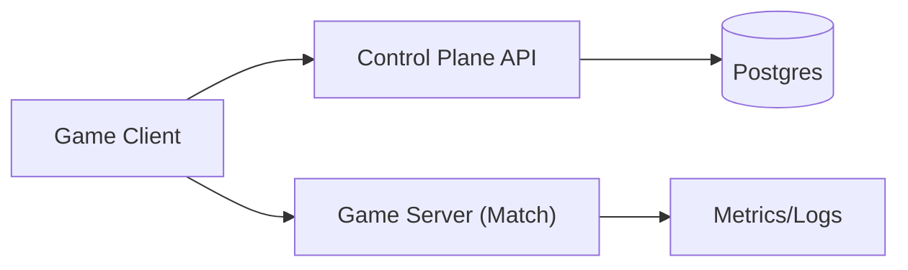

```markdown
---
title: "Multiplayer Game Backend"
category: "Real-Time & Media"
difficulty: "Hard"
tags: [multiplayer, udp, realtime, lag-compensation, authoritative-server, matchmaking]
---

## Overview

This system runs fast-action multiplayer matches over UDP with an authoritative server. The server is the single source of truth for state and outcomes; clients feel responsive through prediction and reconciliation. Real-time sync and player assignment stay separate:

- **Data plane (UDP)**: per-match authoritative game server.
- **Control plane (HTTPS)**: matchmaking + server assignment + token minting.

UDP is used for what it’s good at: drop stale state, never block on loss, keep the timeline server-owned.

## What Makes This Hard

Packets arrive late, out of order, or not at all, yet players expect instant feedback and fair results. If inputs are applied “when received,” low-latency players win; if the client decides hits, cheating is easy.

The hard problem is reconciling a responsive client with an authoritative timeline under loss/jitter, and doing matchmaking without a science project.

## Requirements

### Functional Requirements
- **Authoritative simulation**: server decides positions, collisions, damage, scoring.
- **Client responsiveness**: local prediction for movement/actions; server reconciliation without visible “rubber-banding” in normal network conditions.
- **Lag compensation for hitscan/projectiles**: evaluate attacks against the world as it was when the client fired, within a bounded window.
- **UDP transport**: handle loss, reordering, MTU constraints, NAT keepalives.
- **Matchmaking**: region-aware, skill-aware, party support, fast assignment of a game server endpoint.
- **Cheat resistance**: reject impossible inputs, enforce server-side cooldowns/physics, rate-limit abuse.

### Scale Targets
- **100k CCU**, average match size **10 players** ⇒ ~**10k concurrent matches**.
- **Tick rate 60 Hz** server simulation for shooter-like feel; **20 Hz snapshot send** (bandwidth-friendly) with interpolation.
- **Bandwidth** (typical): **20–40 kbps down / 5–15 kbps up per client** (snapshots dominate downlink; inputs dominate uplink).
- **Latency budget**: target **<80 ms RTT** within region; design remains playable up to ~**150 ms** with lag compensation and interpolation.

These numbers force strict per-tick CPU budgets, efficient snapshots, and simple control-plane throughput.

## Key Design Decisions

- **Decision 1: Dedicated authoritative server per match**
  - Chose: one process (or pod) simulates exactly one match shard.
  - Rejected: P2P, lockstep deterministic sim across clients.
  - Why: authoritative servers simplify cheating, debugging, and fairness; per-match isolation keeps blast radius small and makes autoscaling straightforward.

- **Decision 2: UDP + minimal reliability layer (not “TCP over UDP”)**
  - Chose: unreliable snapshots + reliable input/critical events via a proven UDP networking library (or one small, well-tested ack/resend pattern).
  - Rejected: TCP, or making every game packet reliable/ordered.
  - Why: head-of-line blocking destroys real-time feel; most state becomes stale quickly and should be dropped, not retried.

- **Decision 3: Server-side rewind for lag compensation with bounded history**
  - Chose: store last N ticks of hit-relevant state; rewind to client fire-time for validation.
  - Rejected: trusting client-reported hits, or only “favor the shooter” without rewind.
  - Why: rewind preserves fairness while keeping the server authoritative; bounding history caps memory/CPU and limits “shooting around corners.”

## Architecture



### Components

- **Game Client**
  - Justification: hides latency with prediction/reconciliation; sends intent, not outcomes.
  - Sends inputs (move/fire) with `clientTick` + sequence; renders self with prediction and others with interpolation.

- **Control Plane API (Matchmaking + Assignment)**
  - Justification: one place for auth, queueing, idempotency, and auditing; separate from the tick loop.
  - Accepts queue tickets, forms matches, reserves a server slot, and returns `(serverEndpoint, joinToken)`.
  - Uses Postgres for queueing (`tickets` table) and idempotency (`ticketId`, `assignmentId`) so retries cannot double-match players.

- **Game Server (Match)**
  - Justification: only place that can enforce fairness and cheat resistance at 60 Hz.
  - Fixed-tick authoritative simulation; validates inputs; produces snapshots/deltas; runs bounded rewind for hit validation.

- **Postgres**
  - Justification: one durable truth for players/MMR/bans/parties plus simple matchmaking queues and assignments.
  - Stores player/profile state; stores queue tickets and match assignments with idempotency keys.

- **Metrics/Logs**
  - Justification: without it, “netcode bug” vs “bad Wi‑Fi” is indistinguishable.
  - Records: tick time, packet loss, RTT, retransmits, rewind usage, join failures; sampled per-match detail with dumps on anomalies.

## Deep Dive: Lag Compensation + State Sync Over UDP

The design treats time as a first-class API. The server runs at a fixed tick rate (e.g., 60 Hz) and labels every authoritative state with a monotonically increasing `serverTick`. Each client maintains an estimate of `serverTickNow` via periodic time-sync messages (server sends `(serverTick, sendTime)`; client replies with echo; server estimates RTT and skew). This is not for perfect clock sync—it's to map “when the player fired” onto a server tick with bounded error.

### Transport: minimal reliability that preserves real-time behavior
Use one UDP socket per client and one of:

- a proven library (ENet, GameNetworkingSockets), or
- one compact header with `connId`, `seq`, `ack`, `ackBits`, `clientTick`, `serverTick`.

Rules:
- **Inputs**: reliable, small, resent until acked (idempotent by `clientInputSeq`).
- **Snapshots**: unreliable; newest wins. Never resend old snapshots.
- **Critical events** (round start, weapon swap): reliable, ordered within that channel only.

This avoids the classic mistake: “reliable everything,” which turns packet loss into visible latency spikes.

### Packet authentication (no mystery traffic)
The control plane issues a short-lived `joinToken` that includes `matchId`, `serverEndpoint`, `connId`, `expiresAt`, and a per-connection key seed, signed by an HMAC. After a cookie/challenge step (cheap spoofing/NAT sanity), every UDP packet carries a small MAC over `(header + payload)` keyed by the per-connection key. The game server drops unauthenticated packets without work.

### Snapshot model: predict locally, correct softly
- Clients send inputs at 60 Hz (or higher if cheap), each tagged with `clientTick` and `inputSeq`.
- Server simulates inputs on tick boundaries, produces a snapshot at 20 Hz:
  - For each entity: position/velocity/anim state, plus a small “authority checksum” for debugging desyncs.
  - Delta-compress snapshots against the last acknowledged snapshot per client.
- Client renders remote players via interpolation between the last two snapshots; renders self via prediction.
- When a snapshot arrives with authoritative state for the player:
  - If error < threshold: blend over a few frames.
  - If error large: snap (rare; indicates packet loss or cheat/bug).

### Lag compensation: server rewind with bounded state
For hitscan (and many projectile validations), the server keeps a circular buffer of **hit-relevant history** for the last `W` ms (e.g., 200 ms):
- For each tick: store positions and collision capsules (not full world state) for all players, plus map-relevant transforms if needed.
- Memory is bounded: `players * ticksInWindow * capsuleBytes`.

When the server receives a `Fire` input:
1. Compute the intended evaluation tick:
   - `evalTick = clamp(clientReportedServerTick, serverTickNow - maxRewindTicks, serverTickNow)`
   - `clientReportedServerTick` is derived from the client’s time-sync estimate at fire time, sent with the input.
2. Rewind collision queries to `evalTick` using the history buffer.
3. Validate:
   - Reject if fire rate/cooldown invalid, view angle change exceeds limits, or weapon state mismatched.
4. Apply damage to the **current** authoritative timeline (now), but based on the rewind hit result.
5. Emit a reliable combat event to victims/attacker (with `serverTickNow`).

This is the core fairness mechanism: high-ping players can still land shots they legitimately fired, but only within a strict rewind window. It also prevents the “peekers advantage becomes cheating” failure mode by bounding and auditing rewind usage.

### Cheat resistance that matters (without paranoia)
- **Input sanity**: max acceleration/turn rate, server-owned stamina/cooldowns/ammo.
- **Fire validation**: ray origin must be near server-known muzzle position; reject shots through solid geometry in rewind space.
- **Rate limits**: per-conn packet rate, per-action rate, disconnect on sustained abuse.
- **No client authority**: the client suggests intent; the server decides outcomes.

## Trade-offs

| Optimized For | Sacrificed |
|--------------|------------|
| Low perceived latency | Perfect determinism across clients |
| Fairness under jitter/loss | Absolute “what you see is what you hit” for very high ping |
| Few moving parts (one control service + Postgres) | Control plane stops when Postgres is down |
| Cheat resistance | Slightly higher server CPU/memory (rewind buffers) |
| Direct client→server UDP endpoints | Less centralized ingress filtering/routing |

## Failure Modes

- **Postgres down**
  - What happens: parties/matchmaking/new assignments fail; running matches continue.
  - Detect: DB health checks, error rate on control APIs, growing result retry queues on game servers.
  - Recover: control plane returns 503 and stops issuing tokens; game servers buffer and retry result writes with idempotency keys; once DB returns, retries drain.

- **Loss/jitter spike in a region**
  - What happens: rubber-banding, missed events, desync complaints.
  - Detect: rising `packetLoss`, `snapshotGap`, `retransmitRate`, client RTT variance.
  - Recover: increase snapshot redundancy (send smaller snapshots more often), lower remote interpolation delay cap, degrade cosmetics first; if severe, end match gracefully with result integrity.

- **Game server overload (tick misses)**
  - What happens: server tick time > 16.6ms (60 Hz), causing “everyone lags.”
  - Detect: `tickDurationP95`, missed tick counter, GC/alloc spikes, CPU steal.
  - Recover: shed non-critical work (reduce snapshot frequency, disable expensive hit effects), enforce entity/ability caps; if persistent, drain the instance and avoid allocating new matches to that host.

- **Assigned server is dead / unreachable**
  - What happens: client gets an endpoint that times out on UDP connect.
  - Detect: join failure rate spikes by `serverId`/AZ, stale heartbeats.
  - Recover: control plane only assigns servers with fresh heartbeats; clients retry assignment using the same `ticketId` so they cannot be double-matched.

## What We Removed

- **Redis matchmaking queue**
  - Matchmaking queues live in Postgres tables using `FOR UPDATE SKIP LOCKED` and coarse buckets (region/mode/skill/party size).

- **Separate server allocator**
  - Allocation is part of the control plane: pick a server with a fresh heartbeat, reserve capacity in one DB transaction, mint a token.

- **UDP edge session routing**
  - Clients connect directly to the assigned game server endpoint; tokens carry the server identity and packets are MAC’d.

- **Always-on per-match telemetry firehose**
  - Per-match detail is sampled and buffered; full dumps happen only on anomalies.

## Operational Notes

- Keep UDP packets under safe MTU (~1200 bytes) to avoid fragmentation; fragmentation turns mild loss into catastrophic loss.
- Require a token-based handshake before accepting sustained traffic (cheap DDoS defense and NAT validation).
- Watch “rewind utilization” metrics; a sudden shift usually indicates time-sync bugs or exploit attempts.
- Treat tick stability as a first-class SLO; most “netcode issues” are actually server frame overruns.
- Keep a small in-memory “flight recorder” per match (recent inputs + critical events) and dump it when desync/rewind utilization spikes.
```
