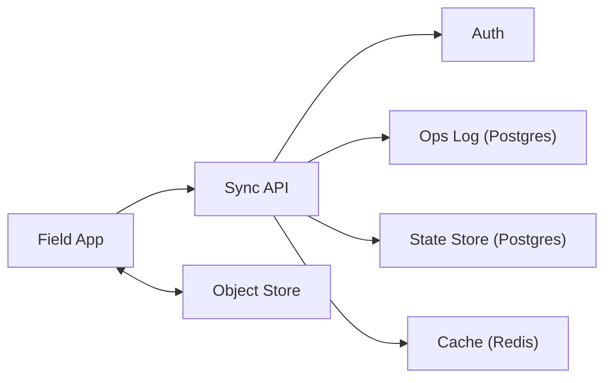

```markdown
---
title: "Offline-First Application Sync"
category: "Strategic Problems"
difficulty: "Hard"
tags: ["offline-first", "sync", "conflict-resolution", "event-log", "postgres"]
---

## Overview

This system is the sync protocol for a field-operations app where devices go offline for days, accumulate edits, and later reconnect to merge with edits from other devices. The elegant core is to treat **every client change as an idempotent operation** and to make the server the **single sequencer** for ordering those operations—while still allowing clients to work fully offline.

The key insight: you don’t “sync databases”; you sync **intent + causality**. Clients send operations annotated with the **base revision they edited**, and the server resolves them using a **deterministic 3‑way merge** (base/server/client). Most conflicts become automatic field-level merges; the remainder become explicit conflict objects that a human can resolve without corrupting data.

## What Makes This Hard

Naive implementations try “last write wins” with timestamps. That silently destroys data because clocks drift, edits are multi-field, and offline edits arrive late. The real trap is thinking conflicts are rare; at field-ops scale, concurrent edits are normal (multiple devices, supervisors editing the same job, bulk status updates), and “just prompt the user” collapses under operational reality.

The other hard part is performance over long outages: if you rely on replaying an unbounded log, a device offline for 10 days returns and your sync endpoint melts. The design needs a log for incremental sync *and* a compaction strategy that keeps merges correct.

## Requirements

### Functional Requirements
- Support offline edits for **7+ days** with no network.
- Merge on reconnect across **multiple devices per user** and **multiple users per workspace**.
- Deterministic resolution for mergeable fields; explicit conflicts for non-mergeable edits.
- Idempotent sync: retries never duplicate updates.
- Attachments (photos, PDFs) sync independently from metadata edits.

### Scale Targets
- 50k field agents, 10k daily active, 2k concurrently syncing at shift changes.
- Per device: 5k–50k entities cached; 200–2k edits/day; bursts of 1k ops on reconnect.
- Server: sustain 5k ops/sec ingest during bursts; return incremental deltas in <2s p95 for typical reconnects.
- Offline for days implies backlog sizes in the hundreds of thousands of ops across a workspace; compaction is mandatory.

## Key Design Decisions

- **Chosen: operation-based sync with server sequencing**
  - Rejected: timestamp-based LWW and “sync full records”
  - Why: ops are idempotent, compressible, and mergeable; server sequencing gives a single, auditable history.

- **Chosen: 3-way merge using base revision**
  - Rejected: always prompting users on version mismatch
  - Why: most conflicts are field-disjoint; 3-way merge auto-resolves safely and deterministically.

- **Chosen: Postgres as the system of record (ops + materialized state)**
  - Rejected: Kafka-first architectures and custom CRDT stores
  - Why: Postgres gives transactions, constraints, and queryability for field ops; the hard part is merge logic, not distributed storage.

## Architecture



### Components

- **Field App**
  - Stores a local replica (SQLite) and an outbound op queue; never blocks UX on network.
- **Sync API**
  - Validates ops, deduplicates, assigns server sequence, runs merge, emits deltas.
- **Auth**
  - Enforces workspace membership and per-entity ACL; sync never trusts client claims.
- **Ops Log (Postgres)**
  - Append-only table of accepted ops with a global `seq` per workspace for incremental sync cursors.
- **State Store (Postgres)**
  - Materialized “current state” tables (often `jsonb` for flexible forms + typed columns for indexing).
- **Cache (Redis)**
  - Speeds up hot reads (latest workspace `seq`, entity headers) and reduces DB roundtrips during bursts.
- **Object Store**
  - Direct upload/download for attachments with signed URLs; metadata references are synced via ops.

## Deep Dive: Deterministic Conflict Resolution (3-Way Merge)

### Data model

Every entity row has:
- `entity_id` (client-generated ULID/UUID; supports offline creation)
- `rev` (integer, server-controlled, increments on accepted change)
- `data` (`jsonb`, canonical current document)
- `updated_at` (server time for observability, never for correctness)

Every client operation includes:
- `op_id` (UUID, idempotency key)
- `entity_id`
- `base_rev` (the `rev` the client edited against)
- `patch` (JSON Patch or domain patch, e.g., `{set: {status: "done"}}`)
- `actor_id`, `device_id`

Server keeps short revision history for merge:
- `entity_history(entity_id, rev, data_snapshot_or_reverse_patch, created_at)`
- Retain last N revisions or last M days (e.g., 50 revs or 14 days), enough to cover “offline for days”.

### Apply algorithm (server-side)

1. **Deduplicate** by `(workspace_id, op_id)`. If seen, return prior result.
2. **Load current** `(rev_current, data_current)`.
3. If `base_rev == rev_current`: apply patch, bump `rev`, write op + state in one transaction.
4. If `base_rev < rev_current`: run **3-way merge**:
   - Reconstruct `data_base` at `base_rev` from `entity_history`.
   - Compute `data_client` by applying the patch to `data_base`.
   - Merge `(data_base, data_current, data_client)` field-by-field using explicit rules:
     - **Scalar fields**: if only one side changed from base, take that; if both changed, conflict.
     - **Sets/tags**: treat as add/remove operations (commutative); merge without conflict.
     - **Checklists**: items are entities (stable IDs), so reordering and completion merge cleanly.
     - **Notes/comments**: append-only list, merge by ID.
   - If merge produces conflicts, persist a `conflict` record:
     - Stores `base_rev`, `server_rev`, `client_candidate`, and a minimal conflict payload for UI.
     - Entity state still advances with non-conflicting fields applied (prevents “all-or-nothing” paralysis).
5. If `base_rev` is missing from history (too old): fall back to **safe mode**:
   - Reject with `409 NEEDS_RESYNC` and return a fresh snapshot for that entity (or workspace chunk), forcing the client to rebase and resend a new op.
   - This is rare if retention covers expected offline duration; when it happens, it fails loudly instead of corrupting data.

### Why this works

- Correctness doesn’t depend on clocks.
- Conflicts are explicit artifacts, not silent overwrites.
- Most real-world edits are disjoint: status vs. assignee vs. timestamps vs. checklist; 3-way merge turns “conflict” into “merge”.

## Trade-offs

| Optimized For | Sacrificed |
|--------------|------------|
| Deterministic merges and auditability | Some write amplification (ops + history + state) |
| Simple client logic (queue ops, apply deltas) | Server complexity in merge + history retention |
| Fast incremental sync via `seq` cursors | Periodic compaction work |
| Minimal data loss risk | Occasional hard rejects requiring rebase |

## Failure Modes

- **Duplicate sends / retry storms**
  - What happens: clients retry the same ops after timeouts.
  - Detect: high rate of repeated `op_id` hits.
  - Recover: idempotency by `op_id`; return prior ack + deltas without reapplying.

- **Thundering herd at reconnect (shift start)**
  - What happens: 2k devices sync within minutes; DB hot spots on popular entities.
  - Detect: elevated sync latency, lock waits on entity rows.
  - Recover: workspace-level rate limiting, batch op ingestion per device, and row-level merge done in short transactions; cache latest entity headers to reduce reads.

- **History too short for 3-way merge**
  - What happens: device offline longer than retention; `base_rev` not reconstructable.
  - Detect: `409 NEEDS_RESYNC` rate.
  - Recover: serve snapshot for affected entities/workspace chunk; client rebases and resubmits ops, preserving intent instead of overwriting.

## What I'd Do Differently At...

- **10x scale:**
  - Partition ops and state by `workspace_id` (hash partitions), add read replicas for sync reads, and move heavy conflict UIs to async resolution workflows.

- **100x scale:**
  - Split “ops ingest” from “materialization”: accept ops into an append-only log and materialize state asynchronously (still deterministic), with per-workspace sequencers to keep merges correct under higher concurrency.

## Operational Notes

- Monitor: `sync_lag_seq` per device, conflict rate by entity type, history-miss (`NEEDS_RESYNC`) rate, and p95 time in merge.
- Keep merge rules versioned; changing merge semantics without versioning creates non-reproducible history.
- Treat attachments as separate reliability domain: metadata ops reference immutable object keys; upload failures never block saving the work item itself.
```