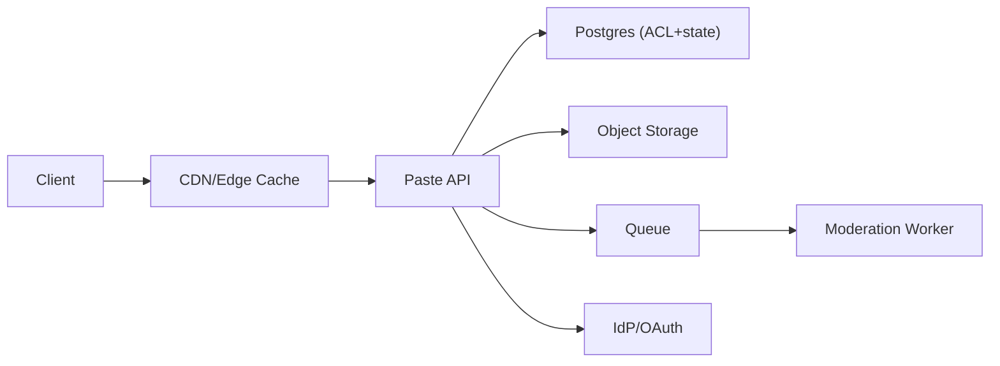

```markdown
---
title: "Pastebin Service"
category: "IoT & Edge"
difficulty: "Medium"
tags: ["storage", "acl", "cdn", "abuse-handling", "syntax-highlighting", "postgres", "object-storage"]
---

## Overview

This system stores and serves text “pastes” (often logs/configs/snippets), with fine-grained access control, a pleasant viewing experience (syntax highlighting), and a credible abuse-report/takedown loop. The elegant idea is to **separate “bytes” from “policy”**: store paste content as immutable blobs in object storage, and keep all access control, state, and lifecycle decisions in a strongly consistent database.

The second key insight is that reads dominate, but **authorization breaks caching** unless you’re deliberate. We make *public/unlisted* pastes cacheable at the edge, while *private/ACL-gated* pastes go through an authenticated API path that is intentionally uncacheable. This keeps the happy-path cheap without leaking private content.

## What Makes This Hard

Naive implementations get trapped by a subtle triangle: **ACLs, caching, and shareability**. If you cache aggressively you risk serving private content to the wrong user; if you authorize on every request you lose the simplicity and cost profile that makes paste services work.

The other trap is abuse handling. “Report abuse” is easy to add and hard to operate: you need fast quarantine, auditability, and protections against re-uploads—without turning the write path into a moderation bottleneck.

## Requirements

### Functional Requirements
- Create paste with: `content`, `language hint`, `visibility` (`public | unlisted | private`), optional TTL.
- ACLs: owner + explicit allow-list of users/teams for `private` pastes.
- Share links:
  - `unlisted`: capability URL (secret token) grants read access.
  - `private`: requires authentication + ACL match (no “magic link” by default; safer operationally).
- View paste with syntax highlighting; raw view for copy/download.
- Abuse reports: user can report a paste; system can quarantine/remove; reporters get an outcome signal.
- “Removed/quarantined” pastes must stop serving quickly (minutes, not hours), including from caches.

### Scale Targets
- **Reads:** 20k RPS peak (public pastes shared widely; IoT fleets can burst during incidents).
- **Writes:** 500 RPS peak (incident spikes; CI systems; device log uploads).
- **Data:** 100M pastes, median 4 KB, p99 200 KB; storage dominated by long tail.
- **Latency:** p50 < 50 ms cached public reads; p95 < 250 ms authenticated reads (region-local).

Why these numbers matter: they force an architecture where **object storage is the source of truth for bytes**, edge caching absorbs read hotspots, and Postgres stays focused on small, index-friendly metadata and authorization checks.

## Key Design Decisions

- **Decision 1: Object storage for content, Postgres for metadata/ACL**
  - Chose: S3-compatible object storage (immutable blobs) + Postgres (paste records, ACL rows, report state machine).
  - Rejected: “Just put everything in Postgres” (costly I/O, poor cacheability at scale) and “NoSQL for everything” (harder ACL queries + consistency).
  - Why: blobs scale cheaply and cache well; Postgres gives *correct* authorization and moderation state with simple, debuggable queries.

- **Decision 2: Two read paths to keep caching safe**
  - Chose: public/unlisted served via CDN with cache keys that are safe; private served via authenticated API with `Cache-Control: no-store`.
  - Rejected: “Authorize at edge for everything” (complex, brittle policy logic at the perimeter) and “Disable caching” (unnecessary cost).
  - Why: the simplest way to avoid leaks is to ensure only **capability-safe** URLs get cached.

- **Decision 3: Moderation is asynchronous, but quarantine is fast**
  - Chose: reports enqueue moderation work; API can flip paste state to `quarantined` immediately; removals propagate via short TTLs + purge.
  - Rejected: synchronous moderation on write (turns paste creation into an ops-dependent workflow).
  - Why: keeps the core product fast while still allowing rapid abuse containment.

## Architecture



### Components

- **CDN/Edge Cache**: Serves `public` and `unlisted` paste views cheaply; enforces basic rate limits/WAF rules; supports purge on takedown.
- **Paste API**: Single entry point for create/read/report; owns authorization logic; issues share tokens; sets cache headers correctly.
- **Postgres (ACL+state)**: Source of truth for paste metadata (`visibility`, `state`, `owner`, TTL), ACL rows, abuse reports, and audit events.
- **Object Storage**: Stores immutable paste content addressed by `content_id` (and optionally compressed); enables cheap durability and high read throughput.
- **Queue**: Buffers abuse triage and offline work (render precomputes, hash-based reupload checks at scale).
- **Moderation Worker**: Consumes reports, runs heuristics, applies state transitions (`active -> quarantined -> removed/restored`), triggers CDN purges.
- **IdP/OAuth**: Authentication for private pastes and reporter accounts; keep it standard (OIDC).

## Deep Dive: Cacheable Reads Without Leaking Private Pastes

The hardest part is making reads cheap *and* correct. The rule is: **only cache responses whose authorization is fully determined by the URL itself** (capability-based) or by being public. Everything else is “user-contextual” and must not be cached.

**Paste identifiers and capability URLs**
- Each paste has a stable `paste_id` (opaque, non-sequential, e.g., ULID).
- For `unlisted` pastes, generate a random `share_token` (128-bit+). The read URL becomes `/p/{paste_id}?t={share_token}`.
- Authorization for unlisted is: “token matches and paste is not removed.” No user context required → safe to cache with the token in the cache key.

**Cache headers and keying**
- Public/unlisted HTML view:
  - `Cache-Control: public, max-age=60, s-maxage=300` (short client, longer edge).
  - `Vary` is avoided; instead, cache key includes `t` for unlisted.
- Private/ACL view:
  - `Cache-Control: no-store` (prevents shared caches and browser back/forward surprises).
  - Always requires `Authorization` and a Postgres ACL check.

**State changes (takedowns) must beat caching**
- Paste has a `state`: `active | quarantined | removed`.
- On transition to `quarantined/removed`, the moderation worker:
  1. Updates Postgres (source of truth).
  2. Purges CDN paths for that paste (best-effort).
  3. Relies on short edge TTL as a backstop.
- Reads for public/unlisted still consult Postgres for `state` cheaply (a small indexed lookup). That single DB read is the “price” we pay to make takedowns reliable.

This design teaches a non-obvious lesson: **you can keep edge caching and still do strong safety controls if the only “dynamic” check is a tiny state gate**, not full authorization logic.

## Trade-offs

| Optimized For | Sacrificed |
|--------------|------------|
| Safe caching for public/unlisted | Slightly more complex URL/token model |
| Correct ACL semantics (strong consistency) | Extra DB hop for some reads |
| Fast create/read UX | Asynchronous moderation outcomes |
| Operational simplicity (boring stack) | Less “edge-native” policy sophistication |

## Failure Modes

- **Postgres degraded/unavailable**
  - Effect: private reads fail; public/unlisted reads may also fail if state gate can’t be checked.
  - Detect: elevated 5xx on API, DB connection saturation, replica lag.
  - Recover: read replicas for state gating; aggressive connection pooling; fail closed for private, and for public/unlisted either fail closed (safer) or serve cached for a short grace window if you accept risk.

- **CDN serves removed paste (cache residue)**
  - Effect: policy breach; reputational risk.
  - Detect: synthetic checks on known removed IDs; audit logs that compare `state` vs edge hits (sampled).
  - Recover: purge automation + short TTLs; keep “removed” response small and cacheable so it quickly overwrites stale objects.

- **Moderation queue backlog**
  - Effect: reports take longer; abuse persists.
  - Detect: queue depth age, SLA alerts.
  - Recover: auto-scale workers; introduce “quarantine threshold” heuristics on the API (e.g., multiple reports from trusted users triggers immediate quarantine).

## What I'd Do Differently At...

- **10x scale:** Move the `state gate` lookup to a small, strongly consistent cache (e.g., Redis with write-through from Postgres) to protect Postgres during viral pastes; keep Postgres as the authority.
- **100x scale:** Multi-region active-active reads for public/unlisted with regional Postgres + async replication becomes painful; I’d split: a globally distributed KV for `paste state + share token hash`, keep Postgres for accounts/ACLs, and accept that private/ACL reads remain region-pinned.

## Operational Notes

- Treat `share_token` like a password: store only a hash (e.g., `HMAC(token)`), never log it, and redact query strings in access logs by default.
- Add content hashing (`sha256`) on write to enable fast “known-bad” reupload blocking without inspecting every byte synchronously.
- Keep paste content immutable; edits create a new version (new blob) to simplify caching, auditing, and abuse forensics.
- Run with short CDN TTLs + purge; correctness comes from the Postgres state gate, not from “hoping caches behave.”
```