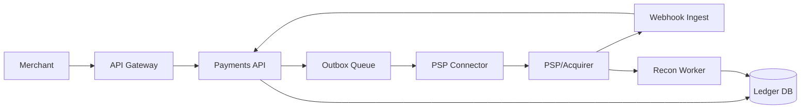

```markdown
---
title: "Payment Processing Gateway"
category: "Commerce & Fintech"
difficulty: "Hard"
tags: ["payments", "ledger", "reconciliation", "idempotency", "chargebacks", "pci-dss", "double-entry"]
---

## Overview

This system is a payment gateway that accepts merchant payment intents, talks to external PSPs/acquirers, and maintains a **financially correct internal ledger** that survives retries, partial failures, chargebacks, and delayed settlement. The key insight is to separate **money truth** (an append-only double-entry ledger) from **money movement** (best-effort integration with PSPs) and connect them with a small number of well-defined state machines.

Most payment platforms fail by treating the PSP response as the “source of truth.” That works until timeouts, duplicate webhooks, partial captures, fee adjustments, and disputes arrive days later. This design instead makes the ledger the only durable truth, and treats PSPs as external facts that must be reconciled and, when needed, corrected via compensating ledger entries.

## What Makes This Hard

Naive implementations optimize for the happy path: “authorize → capture → done.” The trap is that **timeouts and retries** create ambiguous outcomes (“did the PSP capture or not?”), while webhooks are duplicated and reordered. If you “just retry,” you eventually double-charge or double-credit.

The second trap is **settlement reality**: settlement amounts differ from authorizations due to partial captures, interchange/PSP fees, FX, and chargebacks. If you don’t model this as an evolving ledger with adjustments, you end up with brittle ad-hoc fixes and reconciliation that’s impossible to trust.

## Requirements

### Functional Requirements
- Create payment intents and execute `authorize`, `capture`, `refund`, `void`.
- Provide **idempotency** for all mutating APIs (merchant retries) and for PSP calls (PSP retries/timeouts).
- Maintain an **append-only double-entry ledger**; no in-place balance mutation.
- Support **chargebacks/disputes**: ingest dispute events, manage evidence, apply provisional and final ledger impacts.
- Perform **ledger reconciliation** against PSP settlement reports and event streams; detect and resolve drift.
- Enforce **PCI-DSS constraints**: minimize card-data scope, strong isolation for any PCI systems, auditability.

### Scale Targets
- **Peak 2,000 rps** payment operations (authorize/capture/refund), **p95 < 300ms** added latency (PSP time excluded).
- **100M ledger postings/year** (including fees, adjustments, disputes) → drives append-only storage, partitioning, and query patterns.
- **Reconciliation**: daily settlement files totaling **1–10M rows/day** with a 2-hour completion SLO → drives bulk ingestion + matching strategy.
- **Availability**: 99.99% for API accept + durable recording; downstream execution can be async during PSP issues.

## Key Design Decisions

- **Chose:** Internal **double-entry ledger in Postgres** as the only source of truth  
  **Rejected:** “Balances table + statuses” as primary record  
  **Why:** You can’t make disputes, fees, FX, partials, and corrections auditable without an append-only model.

- **Chose:** **Outbox-driven execution** to PSP + **inbox-deduped webhooks**  
  **Rejected:** Synchronous “call PSP then write DB”  
  **Why:** The hard failures happen between those two steps; outbox/inbox makes outcomes durable and replayable.

- **Chose:** **PCI scope minimization** via PSP tokenization/hosted fields + isolated vault for rare PAN needs  
  **Rejected:** Storing PAN (even encrypted) in core services  
  **Why:** PCI operational burden dominates engineering time; reduce scope to keep the system buildable and operable.

## Architecture



### Components

- **API Gateway**: AuthN/Z, rate limits, request signing; protects the payment surface area.
- **Payments API**: Owns payment state machine, idempotency, and creation of ledger postings; never “assumes” PSP outcomes.
- **Ledger DB (Postgres)**: Append-only double-entry postings + immutable journal; provides audit trails and deterministic balances.
- **Outbox Queue**: Executes PSP-side actions asynchronously from durable intent; absorbs PSP slowness without losing correctness.
- **PSP Connector**: Encapsulates PSP quirks, maps internal commands to PSP APIs, and enforces PSP idempotency keys.
- **Webhook Ingest**: Verifies signatures, dedupes, orders per-payment when possible, and translates external facts into internal events.
- **Recon Worker**: Ingests settlement reports, matches to internal references, posts fees/adjustments, and produces drift alerts.

## Deep Dive: Idempotency + “Exactly-Once” Money Semantics

The core goal is: **a merchant can retry any call**, the PSP can duplicate callbacks, and we still produce **one** logical financial outcome in our ledger.

**1) Two identifiers, two idempotency layers**
- **Merchant idempotency key**: `(merchant_id, idempotency_key, operation)` with a uniqueness constraint. Store a hash of the request payload + the final response pointer. If the same key is reused with a different payload, return `409` (prevents “key reuse” bugs).
- **PSP idempotency key**: derived from our immutable `payment_attempt_id` (not from merchant input). This ensures PSP retries and our retries converge to one PSP-side operation.

**2) Durable intent before side effects (outbox)**
- The Payments API writes, in one DB transaction:
  - `payment_attempt` state = `REQUESTED_AUTH` (or capture/refund command)
  - an **outbox row** describing the PSP call to make
  - initial ledger postings only for *internal* holds/reserves if needed (optional), but not “settled money”
- A worker publishes outbox rows to the queue and marks them sent. If anything crashes, replay is safe because the outbox row is immutable and the PSP idempotency key is stable.

**3) Treat timeouts as “unknown,” not “failed”**
- If the PSP call times out, we do **not** flip to “failed.” We move to `PENDING_EXTERNAL` and wait for:
  - webhook confirmation, or
  - explicit PSP query by reference, or
  - reconciliation discovery from settlement files
This avoids the worst bug in payments: retrying after a timeout and double-charging.

**4) Inbox-deduped webhooks become facts**
- Webhooks are ingested into an **inbox table** keyed by `(psp_event_id)` with a uniqueness constraint.
- Processing is idempotent: each PSP fact transitions the payment attempt state machine forward only if it is a valid next step (rejects reordering and duplicates).
- Ledger postings are created only on validated state transitions (e.g., `AUTHORIZED`, `CAPTURED`, `REFUNDED`, `CHARGEBACKED`) and always as balanced entries.

**5) Ledger model that absorbs reality**
Use accounts like:
- `CustomerFunds (PSP clearing)`, `MerchantPayable`, `GatewayFeesRevenue`, `PSPFeesExpense`, `ChargebackReserve`, `DisputeLoss`
When settlement arrives with fees/FX, reconciliation posts **adjustments** rather than mutating prior entries. This preserves auditability and makes drift explainable.

## Trade-offs

| Optimized For | Sacrificed |
|--------------|------------|
| Financial correctness and auditability | Simplicity of “single status field” |
| Safe retries and replayability | More state-machine complexity |
| Reduced PCI footprint | Less control over raw card data flows |
| Operational debuggability (outbox/inbox) | Slightly higher end-to-end latency in some paths |

## Failure Modes

- **PSP timeout during capture (unknown outcome)**
  - Happens: client sees timeout; naive retry would double-capture.
  - Detect: attempt stuck in `PENDING_EXTERNAL` beyond SLO.
  - Recover: query PSP by idempotency key/reference; accept webhook; if discovered later in settlement, reconcile and notify merchant.

- **Webhook storm / duplication / reordering**
  - Happens: PSP retries events; delivery out of order.
  - Detect: inbox dedupe metrics, “invalid transition” counters.
  - Recover: inbox uniqueness drops duplicates; state machine ignores/records out-of-order facts and reprocesses when prerequisites arrive.

- **Reconciliation drift (ledger ≠ settlement)**
  - Happens: missing events, fee schedule changes, FX rounding, partial captures, or a bug.
  - Detect: daily drift report by merchant/currency; unmatched settlement rows; unexplained variance thresholds.
  - Recover: post compensating entries with explicit reason codes; open incident when variance crosses policy; block payouts for affected merchant if needed.

## What I'd Do Differently At...

- **10x scale:** Partition ledger tables by month + merchant, move reconciliation ingestion to bulk COPY pipelines, add read replicas for reporting.
- **100x scale:** Split ledger into a dedicated ledger service with append-only log + derived balance projections; adopt a streaming backbone (Kafka/Pulsar) for event fan-out; formalize a reconciliation “truth pipeline” with warehouse-backed analytics.

## Operational Notes

- The on-call “golden rule”: **never retry an external money movement after a timeout without checking** (webhook/PSP query/recon).
- Monitor: outbox lag, inbox dedupe rate, pending-external aging, reconciliation backlog, drift variance by merchant/currency.
- PCI: keep Payments API out of PCI scope via tokenization; isolate any vault/HSM usage, strict network segmentation, immutable audit logs, and regular key rotation with tested rollback.
- Runbooks should include: “stuck pending external,” “replay outbox safely,” “reprocess webhooks from inbox,” and “post a compensating ledger entry with reason code.”
```