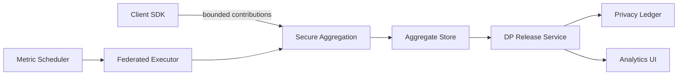

```markdown
---
title: "Privacy-Preserving Analytics"
category: "Strategic Problems"
difficulty: "Hard"
tags: ["differential-privacy", "federated-analytics", "secure-aggregation", "privacy-budget", "governance"]
---

## Overview

This system computes product analytics (counts, rates, histograms) without ever collecting raw user-level data on the server. The key insight is to **productize analytics into a small set of query templates** (DAU, funnels, retention, top-N, histograms) and run them via **federated execution + secure aggregation**, then apply **central differential privacy (DP)** to the aggregated result. You get the operational simplicity of “normal analytics dashboards” while keeping the server blind to individual contributions.

Most teams fail by treating privacy as a bolt-on (“we’ll add DP later”) while keeping an ad-hoc query surface. The elegant version constrains the surface area: every metric is a predefined computation with explicit contribution bounds, cohort thresholds, and a privacy cost. Analysts don’t query data; they request *metrics*.

## What Makes This Hard

The trap is **composition**: even if each query is “private,” repeated slicing (country × app version × device model × day × campaign) turns into a reconstruction attack. The hardest engineering problem isn’t adding Laplace noise—it’s **governing what can be asked**, enforcing **contribution bounds**, and maintaining a **privacy budget ledger** that survives retries, backfills, and “one-off” analyst requests.

The second hard problem is **secure aggregation under real-world client behavior** (dropouts, skewed connectivity, adversarial clients). Secure aggregation protocols look clean on paper; production reality is all about cohort sizing, time windows, and making partial failures boring.

## Requirements

### Functional Requirements
- Compute standard aggregates: event counts, unique users, rates (conversion/retention), histograms (e.g., session length buckets), top-K categories from a bounded vocabulary.
- No server access to raw per-user data; server storage contains only encrypted shares and DP-sanitized aggregates.
- Enforce per-metric **contribution bounds** (e.g., max events per user per day) and **minimum cohort sizes** before releasing results.
- Support scheduled jobs (hourly/daily), backfills, and metric versioning without “double spending” privacy budget.
- Provide auditable lineage: metric definition → cohort parameters → privacy cost → released value.

### Scale Targets
- 5M DAU, 50M MAU.
- 100 core metrics, each computed daily; ~20 computed hourly.
- Each client sends at most 1 analytics report/day (bounded payload, ~1–5KB).
- Secure aggregation cohorts: target 10,000 devices per metric per window; hard floor 1,000 (below that, no release).
- End-to-end freshness: daily metrics within 2 hours of day close; hourly within 20 minutes.

Why these numbers matter: secure aggregation needs large cohorts to hide individuals, and DP needs enough signal-to-noise. If your product can’t regularly form 1k+ cohorts per slice, you must reduce dimensionality or accept “no data” rather than leak.

## Key Design Decisions

- **We chose: Federated computation + secure aggregation, then central DP on the aggregate**
  - **Rejected:** collecting raw events then “restricting access”
  - **Rejected:** pure local DP for everything
  - **Why:** secure aggregation prevents the server from seeing individual values; central DP provides consistent, tunable privacy/utility across metrics. Pure local DP is simple but typically too noisy for product analytics at realistic scales.

- **We chose: Metric templates (no ad-hoc SQL), with explicit contribution bounding**
  - **Rejected:** “DP query layer” over a general warehouse
  - **Why:** ad-hoc query surfaces destroy privacy budgets through composition and dimension explosion. Templates make privacy enforceable and operations predictable.

- **We chose: A privacy budget ledger as a first-class service**
  - **Rejected:** embedding privacy logic inside each job
  - **Why:** privacy needs global invariants (no double releases, consistent accounting across backfills). Centralizing it prevents accidental leakage during operational churn.

## Architecture



### Components

- **Client SDK**
  - Computes metric-specific contributions locally (e.g., “sessions today capped at 20”).
  - Enforces contribution bounds before anything leaves the device.
  - Produces a compact, versioned report for a given metric/window.

- **Federated Executor**
  - Orchestrates which clients participate in which metric/window (cohorts).
  - Handles retries, rollouts, and metric version upgrades without changing privacy semantics.

- **Secure Aggregation**
  - Implements a production-secure aggregation protocol (e.g., Bonawitz-style SecAgg) so the server only learns sums over a cohort.
  - Enforces cohort thresholds and dropout tolerance; emits only aggregated plaintext (never per-client plaintext).

- **Aggregate Store**
  - Stores per-(metric, window, cohort) aggregates plus metadata (counts, dropout rate, schema version).
  - This is not user data; it’s pre-DP intermediate state with strict access controls.

- **DP Release Service**
  - Applies central DP mechanisms (Laplace/Gaussian + post-processing) to aggregates.
  - Performs release gating: minimum cohort size, allowed dimensions, sensitivity derived from metric definition.

- **Privacy Ledger**
  - The system’s “bank”: tracks privacy spending by metric, slice, and time range.
  - Guarantees idempotency: a backfill or retry cannot mint a second release “for free.”

- **Analytics UI**
  - Reads only DP-sanitized released metrics.
  - Exposes confidence intervals/expected error so teams don’t overreact to noise.

## Deep Dive: Privacy Budget + Metric Governance (The Real Hard Part)

A privacy-preserving system fails the moment it allows “just one more breakdown.” The only robust approach is to make privacy an invariant enforced by design, not policy.

**1) Define metrics as contracts, not queries.**  
Each metric template specifies:
- Contribution bounds (per user per window): e.g., `max_sessions_per_user_per_day = 20`
- Sensitivity: derived from the bound and aggregation type (sum/count/histogram)
- Allowed dimensions: a fixed whitelist with capped cardinality (e.g., country, app_version_major)
- Release cadence and retention (how long we keep intermediate aggregates)

This turns privacy from “best effort” into compile-time-like constraints.

**2) Treat every release as a spend with deterministic identity.**  
A release is keyed by `(metric_id, metric_version, window_start, window_end, dimension_values_hash)`. The DP Release Service requests a spend from the Privacy Ledger; the ledger returns either:
- **Approved** with a privacy cost grant (ε, δ), or
- **Denied** (budget exhausted / disallowed slice / cohort too small / already released)

This prevents accidental double releases during retries, and blocks “creative” slicing that would otherwise leak.

**3) Use a simple, explicit accountant and stick to it.**  
Pick one DP accounting model and operationalize it. A practical choice:
- Per-metric per-day budget ε (and δ for Gaussian), with strict caps for slices.
- Composition handled by the ledger; no hidden spending.
- If a team needs more accuracy, they negotiate budget explicitly, which forces trade-offs.

**4) Make dimension explosion physically impossible.**  
Even with DP, too many slices create correlated leakage and useless noisy charts. Enforce:
- Maximum number of slices per metric per window (e.g., 200).
- Minimum cohort size per slice (e.g., 1,000).
- Bounded vocabularies for categorical metrics (top-K computed via a DP-friendly approach over a fixed dictionary, not arbitrary strings).

The non-obvious lesson: **privacy is mostly governance and determinism**. The math is the easy part.

## Trade-offs

| Optimized For | Sacrificed |
|--------------|------------|
| Strong privacy guarantees (no raw server data) | Ad-hoc analyst flexibility |
| Operational simplicity via templates | “One-off” exploratory queries |
| Predictable accuracy via bounded sensitivity | Fine-grained segmentation |
| Boring, auditable releases | Maximum metric velocity |

## Failure Modes

- **Cohorts too small (or too many slices)**
  - **What happens:** releases are denied; dashboards show gaps.
  - **Detect:** cohort-size and slice-count monitors; denial-rate SLOs.
  - **Recover:** reduce dimensionality, widen time windows, or increase participation rate (SDK prompts, scheduling changes). Do not lower thresholds.

- **Client dropout breaks secure aggregation**
  - **What happens:** jobs stall or aggregates fail to decrypt.
  - **Detect:** dropout rate, time-to-completion, and “incomplete cohort” alarms.
  - **Recover:** increase cohort over-recruitment, extend collection window, and use a protocol configuration with dropout resilience; fail closed (no aggregate) rather than partial release.

- **Privacy budget exhaustion / accidental overspend attempts**
  - **What happens:** releases denied; teams attempt workarounds.
  - **Detect:** budget burn-down dashboards and alerting on repeated denied attempts.
  - **Recover:** raise budget only via a reviewable change (metric contract update), or reduce cadence/slices; never bypass the ledger.

## What I'd Do Differently At...

- **10x scale:** Move aggregation and storage to a more partitioned pipeline (sharded executors per region), and precompute common cohorts to reduce orchestration overhead; privacy model stays the same.
- **100x scale:** Rearchitect cohort selection and scheduling to be globally optimized (minimize overlap between cohorts to reduce correlated composition), and introduce formal privacy loss distribution tracking for large metric catalogs.

## Operational Notes

- The on-call “kill switch” is the DP Release Service: if anything looks wrong, stop releases; secure aggregation can continue collecting aggregates safely.
- Backfills are the easiest way to leak: every backfill must mint releases through the same deterministic identity and ledger path.
- Keep a tight rotation policy for secure aggregation keys and signing keys; treat any key anomaly as a release freeze event.
- Monitor three health signals together: cohort size, dropout rate, and expected DP error. A “successful” release with terrible error is operationally a silent failure.
```