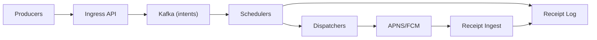

```markdown
---
title: "Push Notification Broker"
category: "Real-Time & Media"
difficulty: "Hard"
tags: ["push", "real-time", "rate-limiting", "prioritization", "kafka", "apns", "fcm"]
---

## Overview

This system is a high-throughput push notification broker: it accepts notification intents from many producers, enforces prioritization and rate limits, fans out to push providers (APNS/FCM/web-push), and emits delivery receipts.

The key insight is to treat “send a push” as a **scheduled, quota-governed dispatch problem**, not a simple HTTP relay. The elegant design separates (1) durable intake, (2) deterministic scheduling under multiple constraints, and (3) provider dispatch—so spikes, hot tenants, and provider slowdowns become queueing and scheduling problems with explicit policies instead of cascading failures.

The hardest part is not “Kafka + workers”; it’s making prioritization and rate limiting **predictable under load** without global locks, while keeping receipts accurate enough to be trusted.

## What Makes This Hard

Naive implementations trap teams in two places:

1. **Priority inversion under backpressure.** When providers slow down, a single FIFO queue makes “critical” notifications wait behind “bulk” traffic. Teams add ad-hoc bypasses that silently break quotas and fairness.

2. **Rate limiting that lies.** Centralized counters melt at millions/sec; decentralized counters drift and allow quota bypass during failover. If limits aren’t enforceable at the point of dispatch, they’re just dashboards.

3. **Receipts are not a single truth.** “Accepted by broker”, “accepted by provider”, and “delivered to device” are different events with different reliability. If you don’t model that explicitly, you either over-promise or drown in edge cases.

## Requirements

### Functional Requirements
- Accept notifications with `tenant`, `audience` (device token(s) or topic), `priority` (e.g., `critical|high|normal|bulk`), `ttl`, and `idempotency_key`.
- Enforce rate limits:
  - per-tenant (contractual quota)
  - per-campaign/job (blast control)
  - per-destination/provider constraints (APNS/FCM limits, connection caps)
- Prioritize traffic so `critical` is protected under overload while preserving tenant fairness.
- Provide delivery receipts with clear semantics: `ENQUEUED`, `DISPATCHED`, `PROVIDER_ACCEPTED`, `DELIVERED` (when available), `FAILED` (reasoned).
- Survive provider outages without dropping critical traffic; degrade bulk first.

### Scale Targets
- Ingest: **2M notifications/sec sustained**, **10M/sec burst for 60s** (marketing spikes + retries).
- Payload: avg **700B**, p99 **2KB** (headers + small bodies; large payloads are rejected).
- Fanout: assume **1.2 destinations/notification** average (single token dominant; some multi-token).
- Latency SLO (broker → provider dispatch):
  - `critical`: p99 **200ms**
  - `normal`: p99 **2s**
  - `bulk`: “best effort”, bounded by TTL
- Receipts: **99.9% emitted** for broker and provider-acceptance states within **30s**.

These numbers force a design where the hot path is append-only + partition-local scheduling; anything that needs cross-partition coordination will fail first.

## Key Design Decisions

- **We chose:** Kafka as the durable intake + state transition log (partitioned by routing key).
  - **We rejected:** direct in-memory queues as the source of truth.
  - **Why:** durable ordering + replay gives us controlled recovery and consistent receipts; partitions are the unit of scale and isolation.

- **We chose:** Deterministic routing to a “Scheduler/Dispatcher” shard that owns quota enforcement for a keyspace.
  - **We rejected:** centralized rate-limit service for every dispatch.
  - **Why:** quota checks must be on the dispatch path; making them local avoids a global bottleneck and makes behavior stable under overload.

- **We chose:** Priority as separate queues with **weighted fair scheduling** (WFS) per shard, with strict protection for `critical`.
  - **We rejected:** single queue with “priority field” and hope.
  - **Why:** separate queues make starvation and protection explicit; WFS prevents one tenant’s bulk from consuming the shard.

## Architecture



### Components

- **Ingress API**
  - Validates payload, enforces auth, normalizes priority/TTL, assigns `notification_id`, and writes a single intent record.
  - Earns its place by keeping the hot path “append-only”; no synchronous provider calls here.

- **Kafka (intents)**
  - Stores notification intents partitioned by a routing key (e.g., `hash(tenant_id, destination_hash)`).
  - Enables replay-based recovery and deterministic sharding for quota ownership.

- **Schedulers**
  - Consume intents, place them into per-priority local queues, apply TTL, and decide *when* a notification may be dispatched under quotas.
  - Own the hard policy logic; everything else stays boring.

- **Dispatchers**
  - Maintain provider connections, translate payload formats, batch where providers support it, and execute sends.
  - Report outcomes (accepted/rejected/transient errors) as events.

- **APNS/FCM**
  - External systems with their own throttles, error codes, and semantics; treated as unreliable dependencies.

- **Receipt Ingest**
  - Handles provider callbacks/feedback (where available) and normalizes them into receipt events.

- **Receipt Log**
  - Append-only stream of receipt events; downstream consumers build queryable state (e.g., “latest status per notification_id”) without coupling the hot path.

## Deep Dive: Scheduling Under Priority + Quotas (The Hardest Part)

The scheduler shard is the unit of correctness. Each shard owns a slice of traffic by routing key, which means it can enforce limits without a global lock. The routing choice matters: partition by `(tenant_id, destination_hash)` so a single tenant’s traffic spreads across shards (parallelism), while quota accounting remains attributable to tenant and stable per shard.

**Priority handling** is implemented as four independent queues per shard (`critical/high/normal/bulk`). Dispatch uses a two-layer policy:
1. **Protection:** reserve capacity for `critical` (e.g., always attempt to dispatch `critical` first up to a configured ceiling tied to provider health). This prevents priority inversion during provider slowdowns.
2. **Weighted Fair Scheduling:** for non-critical, schedule with weights across priorities *and* tenants. Practically, the shard maintains per-tenant subqueues per priority and uses deficit round robin (DRR) with weights. This avoids a single “bulk” tenant consuming the shard even if they are within quota, preserving latency for smaller tenants.

**Rate limiting** is enforced at dispatch time using token buckets:
- **Per-tenant bucket:** contractual QPS + burst.
- **Per-provider bucket:** connection/throughput caps derived from live health.
- **Per-campaign bucket (optional but common):** blast control keyed by `campaign_id`.

To keep this scalable, buckets are **owned by the shard** and stored in memory for speed, with periodic checkpointing to a fast KV store for warm restart. Accuracy comes from ownership: only one shard decrements a given bucket key. If you need strict per-tenant global limits, you don’t centralize checks; you **allocate tenant quota across shards** (static or dynamic) so enforcement remains local and sum-bounded.

Backpressure is explicit: when provider health drops, the per-provider bucket shrinks, which slows dispatch and grows queues. Because queues are priority-separated and TTL-aware, the system drops or expires `bulk` first, instead of randomly failing everything.

## Trade-offs

| Optimized For | Sacrificed |
|--------------|------------|
| Predictable priority under overload | Some idle capacity when reserving for `critical` |
| Enforceable quotas at high QPS | More complex sharding and routing design |
| Replayable recovery + auditable receipts | Higher end-to-end complexity vs a simple relay |
| Tenant fairness | Maximum throughput for a single tenant |

## Failure Modes

1. **Provider throttling/outage (APNS/FCM slows or rejects)**
   - **What happens:** dispatcher errors rise; per-provider bucket contracts; queues grow.
   - **Detect:** provider error codes + increased RTT + queue age per priority.
   - **Recover:** automatically shed `bulk` (expire by TTL), keep `critical` protected, and retry transient failures with capped exponential backoff; page when `critical` queue age breaches SLO.

2. **Hot tenant / blast storm**
   - **What happens:** a tenant floods ingress and would starve others if not controlled.
   - **Detect:** per-tenant queue depth + token-bucket depletion rate.
   - **Recover:** per-tenant bucket clamps dispatch; ingress can optionally return 429 for non-critical once backlog crosses a tenant threshold (fail fast, predictable).

3. **Shard loss / consumer restart**
   - **What happens:** in-memory queues/buckets are lost; risk of duplicates or quota drift.
   - **Detect:** consumer group rebalance + shard heartbeat missing.
   - **Recover:** replay intents from Kafka; rely on idempotency at dispatch (provider-side dedupe where supported + broker-side `notification_id` de-dup window) and checkpointed buckets to avoid quota spikes after restart.

## What I'd Do Differently At...

- **10x scale:** split Kafka topics by priority (or at least by `critical` vs rest) to isolate tail latency, and run physically separate dispatcher pools per provider to isolate noisy neighbors.
- **100x scale:** move from single-region active to multi-region active/active with regional schedulers and regional provider dispatch; receipts become eventually consistent with region-local status and a global “best known” view built from streams.

## Operational Notes

- The on-call’s primary dashboard is **queue age by priority**, not just throughput; age predicts SLO misses.
- Provider health should directly drive capacity (token bucket size), otherwise you oscillate between overload and recovery.
- Rebalances are dangerous: keep partitions stable, scale by adding shards gradually, and treat consumer lag as a first-class alert.
- Receipts must be documented as a state machine; “DELIVERED” is provider-dependent and often unavailable—don’t conflate it with “PROVIDER_ACCEPTED”.
```