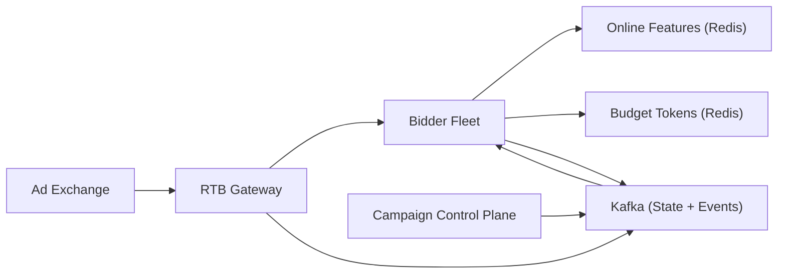

```markdown
---
title: "Real-Time Ad Serving"
category: "AI/ML Infrastructure"
difficulty: "Hard"
tags: ["rtb", "ad-serving", "bidding", "targeting", "budget-pacing", "openrtb", "feature-store", "redis", "kafka", "postgres", "ml-scoring"]
---

## Overview

This system is a real-time bidding (RTB) engine that answers OpenRTB bid requests in <100ms while enforcing targeting constraints and budgets. The job is “pick the best ad you’re allowed to show right now” under severe latency, massive concurrency, and constantly changing campaign state.

The bidder stays **constant-time** by moving work out of the request path: campaigns are compiled into **coarse shard candidate pools** so the bidder scores tens of ads, not millions. Budgets are enforced with **short-lived token balances** in Redis so the bidder can reserve spend in a single atomic operation without global locks. Everything else is boring: Postgres for campaign truth, Kafka for state + events, and a control-plane worker that reconciles and paces.

## What Makes This Hard

Naive implementations trip on two traps:

1) **Doing targeting + ranking at request time.** With millions of campaigns, large candidate sets blow tail latency.

2) **Doing strongly consistent budgets on the hot path.** Centralized counters bottleneck. The real requirement is deterministic behavior with bounded error under partial failure.

## Requirements

### Functional Requirements
- Ingest and apply campaign configuration: targeting predicates, creatives, bid strategy, and pacing policy.
- Respond to OpenRTB bid requests with a bid/no-bid decision and selected creative within strict deadlines.
- Enforce budget constraints (daily + group caps) and pacing (smooth spend curve).
- Provide explainability for “no-bid” (filtered, out of budget, timed out, degraded dependency).
- Produce an auditable event stream (bids, wins, impressions, clicks) for billing and model training.

### Scale Targets
- **Traffic:** 150k QPS average, 500k QPS peak per region (exchanges fan out; peaks correlate with major events).
- **Latency:** exchange timeout **100ms**; internal budget **p99 ≤ 60ms** end-to-end, with hard step budgets (features 10ms, scoring 10ms, budget 5ms).
- **Campaigns:** 1–5M active; **10–100k updates/min** during dayparting and optimizer changes (config propagation matters as much as request QPS).
- **Event volume:** wins/impressions are lower than bid requests but still **10–50k events/sec**; correctness matters for billing and pacing feedback loops.

## Key Design Decisions

- **Precompute shard candidate pools; score only top-K online**
  - Rejected: request-time filtering over the full campaign set
  - Why: the bidder must be O(1) in “number of active campaigns.” Candidate pools keyed by coarse shards (geo × device × publisher × language × user segments) let us keep online work bounded and predictable.

- **Budget enforcement via short-lived token balances in Redis**
  - Rejected: synchronous “budget service check” per request
  - Why: the bidder does one atomic Redis operation to reserve spend; coordination happens at controller cadence, not per request.

- **Separate control plane (campaign compilation + pacing) from data plane (bidder)**
  - Rejected: embedding compilation/pacing logic into the bidder
  - Why: it keeps the bidder simple and horizontally scalable, and it makes configuration changes safer (validated, staged, and reversible).

- **Use Kafka for campaign-state distribution**
  - Rejected: bespoke “snapshot/delta publish” system
  - Why: a compacted topic is replayable, versioned by key, and is already needed for events.

- **Make token reserve/settle a single atomic primitive**
  - Rejected: multi-step idempotency (`SETNX` then `DECRBY`) and ad-hoc crash handling
  - Why: one Redis Lua script eliminates double-spend on retries and keeps the hot path deterministic.

- **Hot path never blocks on Kafka**
  - Rejected: synchronous “write events before responding”
  - Why: the exchange timeout is the product; event durability is enforced via bounded buffering + fail-closed policy.

## Architecture



### Components

- **RTB Gateway**
  - Terminates TLS, enforces deadlines, normalizes OpenRTB variants, and routes to bidders.
  - Hosts callback endpoints (win/impression/click notices) and emits them to Kafka.

- **Bidder Fleet (stateless, hot caches)**
  - Time-budgeted pipeline: shard lookup → feature fetch → score top-K → reserve budget → respond.
  - Keeps an in-memory view of compiled shard pools + models from Kafka’s compacted state topic; rejects invalid updates and keeps last-known-good.

- **Campaign Control Plane**
  - Source of truth for campaigns (Postgres), compiler for targeting predicates, builder for shard candidate pools, and pacing controller.
  - Publishes compiled state to Kafka (compacted), consumes events from Kafka for billing, reconciliation, and pacing feedback.

- **Online Features (Redis)**
  - Stores low-latency user/context features needed for scoring (segments, recency, aggregates) with TTLs and explicit fallbacks.

- **Budget Tokens (Redis)**
  - Stores short-lived token balances per `(campaign, region)` minted by the pacing controller.
  - Provides two Lua-backed primitives: `reserve(bid_id, amount, ttl)` and `settle(bid_id, clearing_price)` (idempotent).

- **Kafka (State + Events)**
  - State: compacted topics for compiled shard pools, models, and allow/deny lists (replayable bidder warmup + rollback).
  - Events: append-only topics for bids/wins/impressions/clicks (auditable input for billing + training).

## Deep Dive: Budget Pacing With <100ms Latency (Without Global Locks)

Budget pacing has two conflicting goals: spend must follow a target curve, but the bidder must decide in a few milliseconds. The trick is to treat budgets as a **token minting + reservation** problem, not a global counter.

**1) Mint tokens per time-slice (controller cadence)**
Each campaign gets a target spend rate `r(t)` from remaining budget, time left, and optimizer signals. The controller mints small slices (seconds) into Redis balances keyed by `(campaign, region)`.

Why this works: the bidder does a single atomic Redis call to reserve spend; there is no centralized per-impression budget service.

**2) Allocate tokens to regions**
Allocating budgets per region bounds error: the worst-case overspend is limited to the region allocation plus one mint slice.

**3) Reserve on bid; settle on win (Lua, idempotent)**
At bid time, the bidder reserves `bid_price` from the token balance with a single Lua script keyed by `bid_id` (TTL covers delayed win notices). On win, the gateway settles using the clearing price: it marks the `bid_id` settled and refunds `bid_price - clearing_price` if needed.

Idempotency key: `bid_id` (constructed from `exchange_id + auction_id + imp_id`). The spend amount comes from the win notice’s clearing price; reconciliation treats Kafka as the source of truth for billing.

**4) Deterministic degradation**
If tokens are unavailable/slow, the bidder fails closed for budgeted campaigns (no-bid). If features are slow, it uses a minimal feature set and a smaller K; if it can’t finish in budget, it no-bids instead of timing out the exchange.

## Trade-offs

| Optimized For | Sacrificed |
|--------------|------------|
| Predictable p99 latency | Some revenue loss from conservative no-bid under partial failures |
| Bounded budget error | Some underdelivery from reservation TTLs and conservative pacing |
| Simple bidder hot path | More work in control plane (compile + reconcile + mint) |

## Failure Modes

- **Redis (tokens) slow/unavailable**
  - What happens: reserve timeouts; bidder tail latency rises; `no_bid_reason=budget_unavailable` spikes; revenue in the region drops sharply for budgeted campaigns.
  - Detect: Redis p99, bidder stage histograms, reserve timeout counters.
  - Recover: strict budget-timeout (single-digit ms), fail closed on tokens, reduce K, and fix hotspots (key distribution, sharding).

- **Redis (features) slow/unavailable**
  - What happens: feature fetch stalls; bidder uses minimal feature set; win rate may drop.
  - Detect: feature p99, fallback counters, model score latency.
  - Recover: reduce K, tighten per-stage timeouts, and keep feature sets bounded with TTLs.

- **Pacing controller bug mints too many/few tokens**
  - What happens: overspend (too many) or underdelivery (too few) across many campaigns.
  - Detect: spend-vs-plan divergence, sudden step changes in token balances, canary controller metrics compared to baseline.
  - Recover: canary minting, hard caps in Redis, and automatic rollback when spend anomalies cross thresholds.

- **Bad compiled state (empty/invalid candidate pools)**
  - What happens: `no_bid_reason=filtered` spikes; bidders reject the update and keep last-known-good.
  - Detect: bidder-side sanity checks (schema/version, min pool sizes) + canary shard metrics.
  - Recover: control plane rollback (publish previous version), and block promotion until validation passes.

- **Kafka unavailable**
  - What happens: bid requests still must complete; event publishing lags; audit/billing risk rises.
  - Detect: producer error rate, buffer depth, end-to-end lag to control plane.
  - Recover: bidders buffer events in memory (bounded); if the buffer fills, they fail closed (no-bid) rather than serve unlogged traffic.

- **Duplicate/out-of-order win notices and price mismatches**
  - What happens: double settlement or wrong spend.
  - Detect: settle idempotency hits, negative refund attempts, clearing-price anomalies by exchange.
  - Recover: settle is idempotent by `bid_id`; the clearing price comes from the win notice; reconciliation recomputes spend from Kafka events and flags discrepancies.

## What We Removed

- Separate “stream reconciler” service (reconciliation runs as a control-plane worker consuming Kafka).
- Bespoke snapshot/delta distribution to bidders (compiled state ships via Kafka compacted topics).
- Multi-step budget writes (`SETNX` then `DECRBY`) and “hope it’s fine” retries (single Lua primitive for reserve/settle).
- Any strong-consistency budget service on the hot path (Redis tokens + reconciliation only).
- Bid-time “soft reservations” beyond a simple TTL-based reserve (keeps budget enforcement predictable).

## Operational Notes

- Tail latency is a product feature: every stage needs a hard budget and a fast-fail path; “try a little longer” becomes “miss the auction.”
- Track `no_bid_reason` as a first-class metric; it is the fastest way to distinguish “market is cold” from “system is degraded.”
- Treat compiled state as code: validate, canary, and rollback automatically; bidders must be able to reject bad state and keep serving.
- Kafka is the audit trail: billing, training, and pacing correction derive from events, not bidder caches.
```
