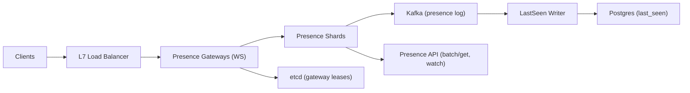

```markdown
---
title: "Real-Time Presence Service"
category: "Real-Time & Media"
difficulty: "Hard"
tags: ["presence", "realtime", "websocket", "last-seen", "etcd", "kafka", "postgres"]
---

## Overview

This system tracks **Online** and **Last Seen** for millions of concurrent users without turning presence into a write-heavy data pipeline. The key idea is to treat **a live server-side connection as the source of truth**, and to write only on **state transitions** (connect, disconnect, “last session ended”)—not on periodic heartbeats.

The elegant trick that keeps write amplification low is **failure-aware ownership**: gateways own user sessions in memory, and a small, fixed-rate **gateway heartbeat** (not per-user) is used to detect abrupt gateway death. When a gateway disappears, we mark *all users owned by that gateway* offline by replaying in-memory ownership state in the presence shard—no per-user TTL refresh loop required.

Everything else is deliberately boring: WebSockets for connectivity, sharded in-memory presence state for speed, Kafka as an audit/event log, Postgres as the durable store for `last_seen`.

## What Makes This Hard

Naive designs “just store a TTL per user” in Redis and refresh it every N seconds. At 10M concurrent users, even a 30s refresh interval becomes a steady write firehose, and it gets worse with multiple devices, flappy networks, and backgrounded mobile apps.

The deeper trap is **unclean disconnects**: processes crash, networks partition, load balancers reset flows. If you don’t solve this carefully, you either (a) spam writes to be safe, or (b) leave users “online forever.” The hard part is accurate offline detection *without* per-user heartbeats to a central store.

## Requirements

### Functional Requirements
- **Online status** with seconds-level freshness.
- **Last Seen** reflects the time a user last transitioned from “online on at least one device” to “offline on all devices.”
- **Multi-device**: user is online if any session is active.
- **Privacy/visibility**: online/last-seen access is filtered by relationship and user settings.
- **Real-time updates** for active views (chat list / conversation), plus efficient batch lookup.

### Scale Targets
- **Concurrent connections:** 10M active WebSockets.
- **Presence transition rate:** assume 30-minute average session → ~5.5k connects/s and ~5.5k disconnects/s globally; plan for **50k/s bursts** (deploys, network events).
- **Lookup fanout:** typical client requests presence for 50–500 users on open; hot paths require **single-digit ms** server time.
- **Write amplification target:** writes scale with **session transitions + gateway heartbeats**, not with “online users × refresh interval.”

## Key Design Decisions

- **Decision 1: Connection-derived presence (no per-user TTL refresh)**
  - Chose: gateway-held session truth + transition events.
  - Rejected: Redis-per-user TTL refreshed by heartbeat.
  - Why: per-user TTL refresh makes write load proportional to concurrency; transitions make it proportional to churn.

- **Decision 2: Gateway heartbeats to detect unclean disconnects**
  - Chose: etcd lease per gateway + presence shards tracking gateway ownership.
  - Rejected: “Assume disconnect events are reliable” and “client pings update central store.”
  - Why: gateways die; clients disappear; leases give a clean failure signal at O(gateways) write rate.

- **Decision 3: Durable `last_seen` via buffered writes**
  - Chose: write `last_seen` only when the user goes fully offline; batch/compact in a writer.
  - Rejected: write on every activity/heartbeat.
  - Why: `last_seen` is a *historical boundary*, not a telemetry stream.

## Architecture



### Components

- **Presence Gateways (WS)**
  - Holds active sessions in memory (user_id, device_id, connection_id).
  - Emits only **connect/disconnect** events to presence shards.
  - Maintains a single **gateway lease** in etcd to prove liveness.

- **etcd (gateway leases)**
  - Stores `lease(gateway_id)` with a short TTL (e.g., 15s) refreshed at a fixed cadence (e.g., 5s).
  - Presence shards watch lease expirations to detect gateway death.

- **Presence Shards**
  - Sharded by `user_id` (consistent hashing).
  - Maintains in-memory state: active session count, per-session metadata, current “online” boolean, and `last_seen` cache.
  - Maintains in-memory reverse index `gateway_id -> set(user_id, session_id)` to support fast “gateway died” cleanup.
  - Publishes an ordered presence event stream to Kafka for durability/audit and downstream consumers.

- **Kafka (presence log)**
  - Topic partitioned by `user_id` for ordering of a user’s transitions.
  - Used to rebuild shard state after restart and to feed the `last_seen` writer.

- **LastSeen Writer**
  - Consumes presence events and updates Postgres only on **online→offline** transitions (when session count reaches zero).
  - Batches writes and de-duplicates flaps (e.g., collapse multiple transitions inside 2s).

- **Postgres (`last_seen`)**
  - Durable source for `last_seen_at` (and optional privacy flags / policy references).
  - Read path is usually served from shard cache; Postgres is the durability layer, not the hot path.

- **Presence API**
  - `BatchGetPresence(user_ids[])` for snapshots (chat list).
  - `WatchPresence(user_ids[])` for real-time updates for currently visible sets (conversation list / open chats).

## Deep Dive: Offline Detection Without Write Amplification

The core is ensuring “online” stays correct even when gateways fail, without per-user TTL refresh.

**1) Session ownership and transitions**
- On WebSocket connect, the gateway authenticates the user, assigns a `session_id` (monotonic per gateway: timestamp+counter), and sends `Connect(user_id, session_id, gateway_id, device_id)` to the user’s presence shard.
- The shard increments `active_sessions[user_id]` and records `(session_id -> gateway_id)`; if the count goes 0→1, it emits `UserOnline(user_id, epoch)`.

**2) Clean disconnect path**
- On WS close, gateway sends `Disconnect(user_id, session_id, gateway_id)` to the shard.
- The shard deletes that session; if the count goes 1→0, it emits `UserOffline(user_id, epoch, last_seen_at=now)`.

**3) Unclean disconnect path (gateway death)**
- Each gateway maintains an etcd lease; refreshing that lease is the only periodic write.
- Presence shards watch etcd for `gateway_id` lease expiry.
- When a gateway lease expires, each shard looks up `gateway_id -> sessions` in its in-memory reverse index and marks those sessions disconnected locally, driving the same 1→0 transitions (and `last_seen`) as clean disconnects.

**4) Race handling (false offline after fast reconnect)**
Gateway death detection is delayed by TTL, so a user can reconnect before expiry. Preventing stale events from “winning” is mandatory.
- The shard assigns a per-user monotonically increasing `presence_epoch`.
- Every state change (online/offline) increments `presence_epoch` and the shard rejects disconnects that reference a `session_id` it no longer owns.
- For gateway-death cleanup, the shard only disconnects sessions still present in its session table; reconnect creates a new session entry, so the stale cleanup becomes a no-op.

This gives:
- **Accuracy:** offline is detected on clean WS close, and on gateway failure within lease TTL.
- **Low amplification:** periodic writes are **O(gateways)**, while per-user writes happen only on **churn**.

## Trade-offs

| Optimized For | Sacrificed |
|--------------|------------|
| Minimal write amplification | Offline detection is bounded by lease TTL |
| Simple mental model (connections = truth) | Requires stateful presence shards and careful restart recovery |
| Fast reads from memory | Presence shards must be sized for RAM and failover |
| Correct multi-device semantics | More per-user state than boolean “online” |

## Failure Modes

- **Gateway dies abruptly**
  - What happens: users appear online until lease expiry.
  - Detect: missing etcd lease refresh; gateway heartbeat dashboards drop.
  - Recover: shard performs gateway-owned session cleanup; clients reconnect via LB; online status stabilizes within TTL.

- **Presence shard restarts**
  - What happens: transient “unknown/offline” for users on that shard if state isn’t warm.
  - Detect: shard restart + elevated reconnects; Kafka lag for rebuild.
  - Recover: rebuild state by replaying Kafka partition from last checkpoint; serve “offline with stale last_seen” until warm, then correct.

- **Kafka lag / writer lag**
  - What happens: `last_seen` in Postgres becomes stale; online remains correct (served from shards).
  - Detect: consumer lag metrics; mismatch between shard `last_seen` and DB.
  - Recover: writer catches up; idempotent upserts ensure correctness.

## What I'd Do Differently At...

- **10x scale:**
  - Increase shard count; move shard state to a replicated in-memory layer per partition (active+hot-standby) to reduce rebuild time.
  - Add a dedicated “watch” path that caps subscriptions per client and pushes only for visible sets to keep fanout bounded.

- **100x scale:**
  - Re-architect watch fanout: introduce a subscription tier that aggregates watchlists and uses partition-local fanout to gateways; optimize memory with compressed watch indices.
  - Replace Postgres writes with a write-optimized store for `last_seen` (e.g., a wide-column store) if churn becomes extreme.

## Operational Notes

- Lease TTL is your main knob: shorter TTL improves offline freshness but increases sensitivity to brief etcd hiccups; use ~15s TTL with 5s refresh as a stable default.
- Presence shards are stateful: treat deploys like cache-warm rollouts (staggered, partition-aware), and always monitor rebuild time from Kafka.
- `last_seen` correctness depends on “1→0 session count” transitions; verify multi-device edge cases with synthetic tests (rapid connect/disconnect across devices).
- Enforce privacy at the API boundary; never leak “online” via timing differences (normalize responses for hidden users).
```