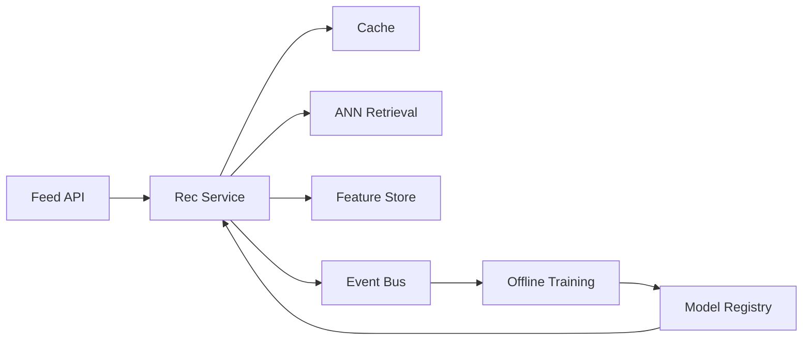

```markdown
---
title: "Recommendation System Infrastructure"
category: "Social & Discovery"
difficulty: "Hard"
tags: ["recommendations", "ranking", "ml-infra", "feature-store", "kafka", "serving"]
---

## Overview

This system produces a personalized ranked feed by splitting the problem into two stages: **cheap, high-recall candidate generation** followed by **expensive, high-precision ranking**. The elegance is in treating “recommendations” as an OLTP service with strict latency/SLOs, while treating “learning” as a separate, asynchronous pipeline with strong data guarantees and clear contracts.

The key insight: most teams fail not because their model is weak, but because their **data and feature semantics are inconsistent across online serving and offline training**. This design makes the feedback loop boring and reliable by anchoring everything on an immutable event log, a point-in-time correct feature pipeline, and a disciplined model lifecycle (registry + staged rollout + observability).

## What Makes This Hard

Naive implementations conflate “show content” with “learn from clicks” and end up with silent corruption:
- **Training-serving skew**: the model trains on features computed one way, serves on another, then performance degrades with no obvious bug.
- **Biased labels**: you only observe interactions for items you chose to show; the system trains itself into a popularity echo chamber.
- **Freshness vs. cost**: the best features are often the freshest (recent follows, recent likes), but recomputing them at request time blows your latency budget.

The trap: treating the pipeline as “ETL + model” instead of a product-critical distributed system with versioning, backfills, and hard correctness boundaries.

## Requirements

### Functional Requirements
- Generate a ranked list of items per user from multiple sources (social graph, content similarity, popularity).
- Enforce hard policy constraints (blocks, privacy, seen-content suppression, author mutes) deterministically.
- Log every impression with enough context to enable point-in-time training and debugging.
- Support continuous retraining and safe rollout (champion/challenger, gradual ramp, quick rollback).
- Close the loop: ingest implicit feedback (click/dwell/like/hide/follow) and delayed feedback (unfollow, report).

### Scale Targets
- **Peak read QPS (feed requests):** 150k QPS (e.g., 15M DAU, 10 feed opens/day, 2-hour peak).
- **Latency:** p95 150ms end-to-end; p99 300ms. Ranking must usually finish in <60ms to leave headroom for networking and cache misses.
- **Candidate set sizes:** 2k–10k retrieved per request; rank top 100; return top 20–50.
- **Event volume:** 5–20M events/min (impressions dominate). This matters because impression logs are the ground truth for unbiased learning and debugging.
- **Model update cadence:** daily full retrain + hourly/near-real-time calibration updates (to react to drift without destabilizing the whole model).

## Key Design Decisions

- **Two-stage retrieval + ranking**
  - Chose: ANN-based retrieval + lightweight ranking service.
  - Rejected: single giant model scoring the entire corpus per request.
  - Why: retrieval makes latency and cost predictable; ranking focuses compute on the only items that can matter.

- **Immutable event log as the system of record**
  - Chose: Kafka (or equivalent) for all user actions, impressions, and item updates.
  - Rejected: “just write rows to a database and batch it later.”
  - Why: the log gives replay, backfills, and deterministic training datasets; it turns pipeline bugs into fixable engineering problems instead of mystery model regressions.

- **Feature store with point-in-time correctness**
  - Chose: a single feature definition layer used by both offline and online (e.g., Feast-style contracts), with strict time-travel for training.
  - Rejected: separate “offline features in Spark” and “online features in Redis” maintained independently.
  - Why: prevents skew, enables reproducible training, and makes debugging model behavior tractable.

## Architecture



### Components

- **Feed API**
  - Owns request auth, privacy context, and response shaping. Keeps recommendation logic out of edge concerns.
- **Rec Service**
  - The latency-critical brain: merges retrieval sources, applies policy filters, fetches features, scores, ranks, and logs impressions.
  - Runs with strict budgets (timeouts per dependency) and returns “good enough” rather than timing out.
- **Cache**
  - Stores short-lived per-user results (e.g., last feed page) and expensive precomputed artifacts (e.g., user embedding).
  - Earns its place by turning dependency hiccups into slightly stale results instead of outages.
- **ANN Retrieval**
  - Serves top-K approximate nearest neighbors over item embeddings (plus optional per-user embedding).
  - Keeps recall high while making the ranking stage feasible.
- **Feature Store**
  - Online: low-latency access to user/item features (Redis/Cassandra-style).
  - Offline: point-in-time feature materialization for training (Parquet on object storage).
- **Event Bus**
  - The source of truth: impressions (with rank position), clicks, dwell, hides, follows, item publishes/edits, graph updates.
  - Enables replayable training sets and audit/debug of “why was this shown?”
- **Offline Training**
  - Builds datasets, computes features, trains retrieval embeddings + ranking model, and validates with offline metrics and guardrails.
- **Model Registry**
  - Stores versioned models, schemas, feature contracts, and rollout state; supports canary + rollback.

## Deep Dive: Feedback Loops Without Corrupting Learning

The hardest part is getting a learning loop that improves the product instead of amplifying bias. The core rule: **impressions are the unit of truth**, not clicks. Every ranking response logs an impression record per item with: user_id, item_id, timestamp, rank position, retrieval source, model version, and key feature hashes. This makes the dataset self-describing and debuggable.

Next, training data must be **point-in-time correct**. For each impression at time *t*, the offline pipeline joins features “as-of *t*” (user state, graph state, item state). Without this, you accidentally train on future information (data leakage) and ship a model that looks great offline and fails in production. Practically: store feature values with event-time, build offline feature tables with time travel, and enforce that training joins are constrained to `feature_time <= impression_time`.

Finally, you need controlled exploration to avoid popularity traps. The Rec Service reserves a small slice of the ranked list (e.g., 1–2 positions) for exploration candidates drawn from long-tail sources (fresh content, under-exposed creators). These impressions are tagged with an exploration policy id so the trainer can:
- avoid contaminating the main model with aggressively exploratory traffic, or
- explicitly learn from it using debiasing (position features, propensity-aware training).
This is the difference between “the model learns what we already show” and “the model learns what users actually prefer.”

## Trade-offs

| Optimized For | Sacrificed |
|--------------|------------|
| Low-latency serving with predictable cost | Perfect global optimal ranking |
| Reproducible training and debuggability | More upfront logging/feature discipline |
| Safe model iteration (canary/rollback) | Slightly slower experimentation velocity |
| High recall via ANN retrieval | Exactness of nearest neighbors |

## Failure Modes

- **Event pipeline lag or outage**
  - What happens: training freshness degrades; metrics drift; debugging becomes blind.
  - Detect: consumer lag SLOs, missing impression rate, schema validation failures.
  - Recover: buffer locally in Rec Service with backpressure limits; replay from Kafka; freeze training on known-good window.

- **Feature store staleness / hot-key overload**
  - What happens: rankings become generic; latency spikes; timeouts cascade.
  - Detect: feature fetch p95/p99, timeout rate, “fallback feature” counters, hot-key dashboards.
  - Recover: strict per-dependency timeouts; degrade gracefully to cached embeddings + simpler ranker; shard hot keys; precompute heavy aggregates.

- **Bad model rollout**
  - What happens: engagement drops; abuse signals rise; creator distribution skews.
  - Detect: online guardrails (CTR, hides, reports, diversity), per-slice metrics, canary delta alarms.
  - Recover: immediate rollback via Model Registry; freeze retraining; root-cause with impression-level replay.

## What I'd Do Differently At...

- **10x scale:** split ANN Retrieval by content type and recency tiers; add regional model replicas with local caches; push more features into streaming aggregates to reduce online fetch cost.
- **100x scale:** re-architect embeddings/ANN into a dedicated distributed vector service with strict SLAs and autoscaling; move from “daily retrain” to continuous training for fast-moving segments; invest in stronger debiasing and counterfactual evaluation because exploration traffic becomes expensive and risky.

## Operational Notes

- The on-call’s first question is “is this a serving issue or a data issue?” Maintain separate SLOs for Rec Service latency/error, ANN latency/recall proxy, feature fetch success, and event logging completeness.
- Treat feature definitions as an API: version them, validate schemas at ingestion, and block training/serving on incompatible changes.
- Keep a “last known good” model and feature snapshot pinned; rollback must not depend on the data pipeline being healthy.
- Always log: model version, feature schema version, retrieval sources, and timeouts taken—otherwise you can’t explain rankings when a VP asks “why did I see this?”
```