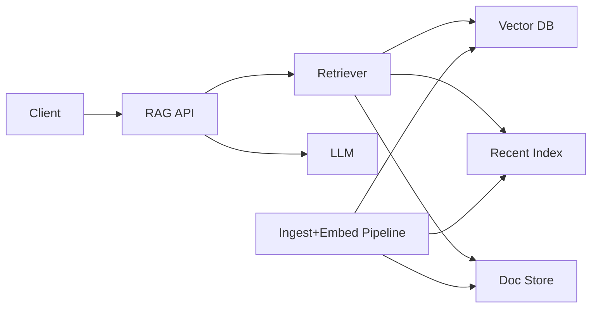

```markdown
---
title: "Retrieval-Augmented Generation (RAG) with Freshness Guarantees"
category: "AI/ML Infrastructure"
difficulty: "Hard"
tags: ["rag", "vector-search", "freshness", "consistency", "indexing", "llm-infra"]
---

## Overview

This system augments LLM prompts with retrieved context, but with a strict freshness contract: when a document changes, retrieval reflects that change within a bounded window (and supports read-after-write). The elegant move is to stop pretending the vector index is strongly consistent and instead **design an explicit “freshness layer”** that makes freshness a first-class query constraint.

The core idea is a **two-tier retrieval index**: a durable vector store for the bulk of history, plus a small “recent changes” vector index that is updated immediately and queried on every request. This avoids blocking queries on asynchronous pipelines and turns freshness from “best effort” into an enforceable SLA.

Everything else stays boring: Postgres for metadata, object storage for raw docs/chunks, a managed vector DB for main similarity search, and a simple async embedding pipeline for throughput and cost control.

## What Makes This Hard

Naive RAG systems silently serve stale context because the write path (documents) and the read path (vector index) are decoupled by an async embedding pipeline. Teams ship “eventual” freshness, then get paged when users ask “why doesn’t it know what I just changed?”

The trap: trying to “make the vector DB consistent” by adding retries and delays. You end up with tail-latency spikes, unpredictable correctness, and an on-call nightmare when the embedding pipeline lags. Freshness needs an explicit contract, a measurable watermark, and a plan for when the pipeline is behind.

## Requirements

### Functional Requirements
- Retrieve top-K relevant chunks for a query with **max staleness ≤ 60s** for updated documents.
- Support **read-after-write**: after a successful write, subsequent queries from that user reflect it immediately.
- Provide citations (document id, chunk id, version) for every returned chunk.
- Prevent mixing incompatible embedding spaces (model/version changes) in a single retrieval.

### Scale Targets
- Corpus: 10M documents, ~200M chunks (avg 20 chunks/doc).
- Online traffic: 500 QPS sustained, 2k QPS peak; p95 retrieval+prompt build ≤ 250ms (excluding LLM).
- Writes/updates: 200 updates/sec burst (import jobs), 10 updates/sec steady.
- Freshness SLA: 99.9% of queries satisfy max staleness; read-after-write is strict (not probabilistic).

## Key Design Decisions

- **Two-tier index (Main + Recent)**
  - Chose: main vector DB for history + “recent changes” vector index updated immediately.
  - Rejected: blocking reads until async pipeline catches up.
  - Why: guarantees freshness without turning indexing lag into user latency.

- **Watermark-based freshness contract**
  - Chose: every doc change emits a monotonically increasing `change_seq`; indexes publish `indexed_seq`.
  - Rejected: “timestamp-based” freshness inferred from clocks across services.
  - Why: sequence numbers are auditable, composable, and don’t fail under clock skew.

- **Versioned chunks and embeddings**
  - Chose: chunk ids include `doc_version`; retrieval filters by latest version and embedding model id.
  - Rejected: in-place updates in the vector store.
  - Why: avoids “split brain” retrieval where old and new chunks coexist and leak into prompts.

## Architecture



### Components

- `RAG API`
  - Owns the request contract: query, tenant, freshness requirements (`max_staleness`, optional `write_token`), and response citations.

- `Retriever`
  - Runs hybrid retrieval across `Recent Index` and `Vector DB`, merges results, fetches chunk text from `Doc Store`, and enforces freshness/version filters.

- `Vector DB` (main index)
  - Stores the bulk embedding index (HNSW/IVF), optimized for recall and cost. Updates arrive asynchronously via the pipeline.

- `Recent Index`
  - Small, fast index covering the last N minutes/hours of updates (time-bounded or size-bounded). It exists solely to satisfy freshness without waiting.
  - Practical implementation: a dedicated service running FAISS/HNSW in memory with WAL to disk; shard by tenant.

- `Doc Store`
  - Object storage for chunk text + Postgres for metadata (`doc_id`, `doc_version`, `change_seq`, ACLs, chunk mapping).
  - This is the source of truth; indexes are derived.

- `Ingest+Embed Pipeline`
  - Consumes document changes, chunks content, computes embeddings, and upserts into `Vector DB`. Also backfills/evicts in `Recent Index`.

- `LLM`
  - Receives a prompt built from retrieved chunks plus system instructions, returns completion with citations.

## Deep Dive: Freshness Guarantees

Freshness is enforced by a **sequence-based contract**:

1. **Write path produces a durable sequence**
   - Every document mutation commits to Postgres with an incrementing `change_seq` (global or per-tenant).
   - The write response returns a `write_token = (tenant_id, change_seq, doc_id, doc_version)`.

2. **Recent Index gives immediate visibility**
   - On write, the system synchronously computes embeddings for the new/changed chunks and inserts them into `Recent Index` keyed by `(doc_id, doc_version, chunk_id, model_id)`.
   - This is the only “synchronous ML” in the system, and it’s intentionally narrow: it only covers the delta that makes freshness hard.

3. **Async pipeline backfills the main index**
   - The pipeline processes the same change events, computes embeddings (same model id), and upserts into `Vector DB`.
   - Once a change is present in `Vector DB`, the pipeline marks it indexed by advancing `indexed_seq` and eventually removes it from `Recent Index` (or lets TTL expire).

4. **Query-time enforcement**
   - For a request with `max_staleness` and/or a `write_token`, the Retriever:
     - Always queries both indexes.
     - Filters results to the **latest `doc_version`** and the correct `model_id`.
     - If a `write_token` exists, it requires that any chunks from that `doc_id` come from `doc_version >= token.doc_version` (the Recent Index guarantees this immediately).
     - If the Recent Index is unavailable, the system fails closed for strict read-after-write (returns an explicit freshness error) rather than silently serving stale context.

5. **Why this is elegant**
   - Freshness is not “waiting for eventually consistent infrastructure.” It’s a deliberately small, bounded surface area: recent updates only.
   - When indexing lags (imports, outages), correctness stays stable; only capacity pressure grows in `Recent Index`, which is observable and controllable.

## Trade-offs

| Optimized For | Sacrificed |
|--------------|------------|
| Freshness with bounded latency | Higher write latency (sync embed) |
| Auditable correctness (seq/version) | More moving parts (Recent Index) |
| Stable p95 during indexing lag | Extra memory/ops for delta index |

## Failure Modes

- **Embedding pipeline lag spikes (backlog)**
  - What happens: `Vector DB` becomes stale; `Recent Index` grows.
  - Detect: `vector_index_lag = change_seq - indexed_seq`, Recent Index size/TTL pressure.
  - Recover: autoscale embedding workers; apply ingestion backpressure; temporarily extend Recent Index retention.

- **Recent Index outage**
  - What happens: freshness guarantee breaks for read-after-write.
  - Detect: health checks + query path “freshness_required_but_unavailable” counter.
  - Recover: fail closed for strict queries; route writes to a degraded mode (queue writes until Recent Index returns) or accept writes but warn clients that read-after-write is unavailable.

- **Embedding model upgrade**
  - What happens: mixed embedding spaces destroy retrieval quality.
  - Detect: requests retrieving across multiple `model_id`s; sudden recall drop.
  - Recover: dual-write embeddings to new `model_id`, run parallel retrieval + A/B, cut over by tenant, then garbage-collect old index.

## What I'd Do Differently At...

- **10x scale:**
  - Shard `Recent Index` by tenant and move it to a dedicated service tier with WAL + fast restarts.
  - Add ANN prefiltering by ACL/namespace to cut candidate sets early.

- **100x scale:**
  - Replace “sync embed on write” with a streaming, low-latency embedding tier (GPU pool) and strict admission control.
  - Partition the main `Vector DB` by tenant/namespace and introduce per-partition watermarks to avoid global head-of-line blocking during reindexing.

## Operational Notes

- Track three numbers per tenant: `change_seq`, `indexed_seq`, and `recent_index_oldest_seq`; alerts trigger on sustained divergence.
- Make freshness explicit in APIs: `max_staleness_ms` and `write_token`; log them so correctness bugs are debuggable.
- Keep `Recent Index` bounded by policy (TTL + max bytes). When it hits limits, reject bulk imports or relax freshness for non-interactive workloads—never silently drop recent updates.
```