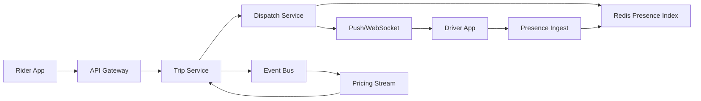

```markdown
---
title: "Ride-Hailing Dispatch"
category: "Commerce & Fintech"
difficulty: "Hard"
tags: ["geospatial", "matching", "real-time", "state-machines", "pricing", "streaming"]
---

## Overview

This system matches riders to drivers in real time, while continuously ingesting driver locations and updating prices based on local demand/supply. The elegant insight is to **separate durable trip state from ephemeral “who’s nearby right now” state**, and to make the hot path depend on **one fast, bounded, city-local index** rather than a pile of microservices and cross-region reads.

Most teams fail by either (a) treating geospatial matching like a database query problem, or (b) treating state transitions like “just write rows” and discovering races, double-assignments, and ghost drivers. This design uses a **cell-based presence index** for proximity and a **lease-based dispatch state machine** for correctness under concurrency.

## What Makes This Hard

Naive dispatch does “find nearest drivers, blast notifications, first to accept wins.” It looks fine in a demo and collapses in production:
- **Race conditions** create double-booked drivers, riders stuck “searching,” and drivers seeing phantom trips.
- **Stale location** makes “nearest” meaningless; drivers move faster than your database can be queried.
- **Over-notification** (broadcast) hurts driver experience and acceptance rate, and amplifies load at peak times.
- **Pricing feedback loops** happen when surge updates lag or overshoot, causing oscillations.

The trap is assuming you can get both *perfect global truth* and *sub-100ms matching* from the same storage layer. You can’t; you must pick what is durable vs. ephemeral and enforce that boundary.

## Requirements

### Functional Requirements
- Match a rider to a driver with a bounded notification strategy (no broadcast storms).
- Maintain a correct trip state machine: `requested → offered → accepted → arrived → in_trip → completed` (and cancellation paths) with no double-assignments.
- Handle continuous driver location updates and “availability” changes (online/offline, on-trip, paused).
- Provide surge pricing that reflects local supply/demand and updates fast enough to be trusted.
- Support retries and duplicate messages without corrupting state (idempotency everywhere).

### Scale Targets
- **Driver location updates:** 1 Hz average when moving, bursty on reconnect. In a large metro: 200k online drivers ⇒ ~200k updates/sec.
- **Ride requests:** peak events (rain/commute) in a large metro: 5k–20k requests/sec.
- **Match latency:** p95 < 1s from request to first offer; p95 < 5s to acceptance (or a clear failure).
- **Read/write patterns:** hot path is write-heavy (locations) and read-heavy (candidate fetch) with strict tail latency demands, so the system is **city-sharded** to keep the failure domain and latency bounded.

## Key Design Decisions

- **Presence Index: H3 cell buckets in Redis (ephemeral)**
  - **Chose:** H3 (or S2) cell ID + per-cell sorted sets in Redis with TTL-based liveness.
  - **Rejected:** PostGIS “nearest neighbor query” on every request.
  - **Why:** Dispatch is a *real-time presence* problem, not a relational query problem. Redis gives predictable latency; cell bucketing makes the search bounded and horizontally shardable.

- **Dispatch Correctness: lease-based offers + atomic reservation**
  - **Chose:** Offer a trip to drivers one at a time (or small fanout), backed by an atomic “reserve driver” operation with a short lease (e.g., 15s).
  - **Rejected:** Broadcast to all nearby drivers and accept the first response.
  - **Why:** Leases prevent double-booking and cap notification load. Atomic reservation is the only clean way to handle concurrent requests without a distributed lock festival.

- **Pricing: streaming aggregates per cell, not synchronous computation**
  - **Chose:** Compute supply/demand and surge multipliers with a stream processor over events; publish current multipliers to a low-latency cache.
  - **Rejected:** Recomputing surge in the request path.
  - **Why:** Surge must be fast and stable. Streaming gives smoothness, backpressure handling, and clear auditability.

## Architecture



### Components

- **API Gateway**
  - Auth, rate limits, request shaping. Keeps abusive clients from becoming an ops problem.

- **Trip Service (durable)**
  - System of record for trips, payments hooks, receipts, and the authoritative trip state machine.
  - Backed by Postgres (strong consistency, clear transactional semantics, easy ops).

- **Presence Ingest**
  - Terminates driver location streams (gRPC/WebSocket), validates timestamps, throttles, and writes to the presence index.
  - Enforces “last update wins” and drops obviously stale updates.

- **Redis Presence Index (ephemeral)**
  - Keyed by `(city, h3_cell)` with TTL-liveness; stores driver IDs plus minimal metadata for candidate selection.
  - Designed to be lossy: if Redis is wrong briefly, we fail gracefully (re-offer), not corrupt money/state.

- **Dispatch Service**
  - Implements matching, ETA estimation, offer sequencing, and atomic reservation/leases.
  - Owns the hard correctness boundary: “a driver can only be assigned to one trip.”

- **Push/WebSocket**
  - Reliable-ish delivery of offers and state updates to drivers. Retries are expected; idempotency is required.

- **Event Bus**
  - Trip lifecycle + presence + pricing signals. Enables replay, audits, and asynchronous consumers without coupling.

- **Pricing Stream**
  - Maintains rolling supply/demand per cell/time window and publishes surge multipliers.

## Deep Dive: Lease-Based Dispatch (The Hardest Part)

The core problem is **preventing double-booking while keeping latency low**. The solution is a small, explicit state machine with an atomic “reserve” primitive.

### 1) Data model: durable vs. ephemeral
- **Durable (Trip Service / Postgres):**
  - `trip_id`, rider, pickup, destination, fare quote, and the trip state machine.
- **Ephemeral (Redis):**
  - `driver_presence:{city}:{cell}` → sorted set of `(score=last_seen_ms, member=driver_id)` plus small hashes for `driver_status`.
  - `driver_reservation:{driver_id}` → `{trip_id, lease_expires_at}` with a short TTL.
  - `trip_offer:{trip_id}` → current offer attempt, for idempotency and retries.

### 2) Candidate selection is bounded, not “global nearest”
- Convert pickup location to an H3 cell.
- Expand ring-by-ring (cell neighbors) until you gather a target number of candidates (e.g., 30).
- Filter by driver status (`online`, `not_on_trip`, vehicle type, accessibility constraints).
- Rank by **ETA**, not Euclidean distance (precomputed road-speed heuristics + optional map ETA service). The key is consistency, not perfect optimality.

This guarantees dispatch cost is proportional to “how dense the area is,” not “how many drivers exist in the city.”

### 3) The atomic reservation (the correctness anchor)
When offering a trip to a driver, Dispatch executes an atomic script (Redis Lua) roughly equivalent to:
- If `driver_reservation:{driver_id}` exists and not expired → reject.
- Else set `driver_reservation:{driver_id} = trip_id` with TTL (lease).
- Record `trip_offer:{trip_id}` attempt and lease expiry for dedupe.

This single operation prevents two concurrent trips from assigning the same driver, even when both see the driver as “available” in the presence index.

### 4) Offer sequencing (avoids spam, improves acceptance)
- Send an offer to the top candidate, wait a short window (e.g., 3–5s).
- If no accept, proceed to the next candidate (or small fanout of 2–3 in high-demand conditions).
- On accept:
  - Trip Service performs an idempotent transition `offered → accepted` with conditional checks (expected state + offer token).
  - Dispatch releases reservations for non-selected candidates.

This produces predictable load and much better driver UX than broadcast storms.

### 5) Handling cancellations and retries without corruption
- Every state transition carries an **idempotency key** and expected previous state.
- Leases ensure the system self-heals: if a driver phone dies mid-offer, the reservation expires and the trip is re-offered.
- If events arrive out of order (common with mobile), the Trip Service rejects impossible transitions; Dispatch reconciles by reading the authoritative trip state.

## Trade-offs

| Optimized For | Sacrificed |
|--------------|------------|
| Low tail latency via city-local hot path | Perfect global optimization of “absolute best driver” |
| Correctness via atomic reservation + leases | Some wasted offers during churn/reconnect storms |
| Simple, proven stores (Postgres + Redis + stream processing) | Slightly lossy presence view (by design) |
| Bounded notification strategy | Occasional slower matches in sparse areas (ring expansion) |

## Failure Modes

- **Redis presence shard outage (city impact)**
  - **What happens:** Matching degrades; trips can’t find candidates reliably.
  - **Detect:** Redis error rates/latency, sudden drop in candidates per request, spike in “no driver found.”
  - **Recover:** Failover to replica if available; temporarily widen ring expansion + reduce offer strictness; degrade to “last known driver set” from a slower store only for critical flows.

- **Offer delivery issues (push/WebSocket delays)**
  - **What happens:** Drivers never see offers; acceptance rate drops; riders wait.
  - **Detect:** Offer sent vs. ack gap, rising offer timeouts, client delivery telemetry.
  - **Recover:** Shorten offer windows, increase small fanout, switch to SMS fallback only for high-value trips, and rely on lease expiry to prevent wedging.

- **Event bus lag (pricing and analytics drift)**
  - **What happens:** Surge uses stale aggregates; price feels “wrong,” oscillations increase.
  - **Detect:** Consumer lag metrics, divergence between real-time counters and stream outputs.
  - **Recover:** Freeze multipliers per cell at last good value with a max age; cap step changes; prioritize pricing streams in capacity.

## What I'd Do Differently At...

- **10x scale:** shard Redis by `(city, cell_prefix)` more aggressively; move ETA ranking to a dedicated low-latency service; tune fanout dynamically based on acceptance probability.
- **100x scale:** replace Redis presence with a purpose-built in-memory presence service (still cell-based) using consistent hashing + replication; push more logic to city-local clusters with strict isolation, and treat cross-region only as control plane and durability.

## Operational Notes

- City is the unit of isolation: deploy, shard, and page by city to keep outages bounded.
- Throttle driver location updates on the server (and enforce minimum intervals) to prevent reconnect storms from melting the index.
- Watch “offers per trip” and “time to first offer” as leading indicators of matching health; they move before outright errors.
- Treat every mobile message as duplicate/out-of-order; correctness comes from conditional transitions + leases, not from “reliable delivery.”
```