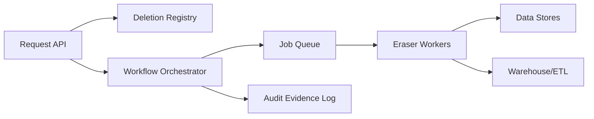

```markdown
---
title: "Right to be Forgotten Pipeline"
category: "Security & Access Control"
difficulty: "Hard"
tags: ["privacy", "gdpr", "ccpa", "data-governance", "deletion", "compliance", "security"]
---

## Overview

This system is a **deletion framework** that reliably purges a user’s data across the messy reality of production: primary databases, caches, object storage, search indexes, and analytical warehouses. It also produces a defensible, auditable record of what was deleted, when, and why—without turning the audit log into a new privacy liability.

The key insight is to treat deletion as a **workflow over a data map**, not as “run DELETE WHERE user_id=… everywhere.” We maintain a canonical **Deletion Registry** that becomes the source of truth for deletion intent and status, then drive an idempotent, retryable orchestration over system-specific “eraser” connectors. This separates the hard part (coordination, correctness, auditability) from the boring part (how to delete from Postgres vs S3 vs Snowflake).

A second insight: you can’t “prove absence” in distributed systems, but you can produce **credible evidence of best-effort completion** with bounded rechecks, deterministic scope, and explicit exceptions. Compliance wants a story you can defend; operations wants a system that converges.

## What Makes This Hard

Naive implementations fail because they assume a single database and a single deletion operation. Real systems have:
- **Multiple copies** (caches, search, derived tables, ML features, backups, exports).
- **Asynchrony** (data arrives late in warehouses; ETLs retry; downstream consumers rehydrate).
- **Weak ownership boundaries** (teams add new stores, forget to wire deletion, or don’t tag data properly).
- **Conflicting goals**: strong deletion guarantees vs availability, cost, and observability.

The trap: teams build a “best effort” script, declare victory, then discover months later that warehouses, exports, and backups silently kept user data. The hard problem isn’t issuing deletes—it’s **ensuring coverage, convergence, and proof** in a constantly evolving data ecosystem.

## Requirements

### Functional Requirements
- Accept deletion requests from authenticated channels (user self-service, support tooling, legal).
- Propagate deletion across:
  - Primary OLTP databases (row-level data)
  - Caches (Redis/memcached), search indexes
  - Object storage (S3/GCS) including thumbnails/derivatives
  - Analytical warehouse (Snowflake/BigQuery/Redshift) and derived datasets
- Provide an auditable record:
  - request metadata (who/what/why), scope, timestamps, status per target system
  - without storing deleted personal data
- Converge under retries and partial outages (idempotent execution).
- Handle “late data” and rehydration (ETLs/backfills shouldn’t resurrect deleted users).
- Support legal holds/exceptions with explicit, reviewable policy (rare but real).

### Scale Targets
- **Deletion requests:** 10k/day average, 100k/day spike (product changes, region launches). Matters because orchestration must be queue-driven, not synchronous.
- **Targets per request:** 20–200 deletion operations (microservices + stores). Matters because per-user fanout dominates cost/latency.
- **SLO:** 99% completed within 7 days, 95% within 24 hours. This matches common regulatory expectations while acknowledging warehouses/backups.
- **Warehouse lag:** up to 24 hours ingestion delay; backfills can be days. Matters because you need tombstones that block reingestion, not just one-time deletes.
- **Object count:** up to 1k objects/user worst-case (media-heavy). Matters because you need batch deletes + pagination + rate limits.

## Key Design Decisions

- **We chose: a central Deletion Registry + orchestrated, connector-based workflow**
  - Rejected: ad-hoc scripts per team; synchronous “delete everywhere in one request”
  - Why: the registry makes intent durable and queryable; connectors isolate per-system quirks; orchestration enables retries, throttling, and observability.

- **We chose: tombstones (“do-not-rehydrate” markers) as a first-class primitive**
  - Rejected: “delete once, assume it stays deleted”
  - Why: warehouses and pipelines continuously recompute; tombstones prevent resurrection by filtering ingestion/backfills and scrubbing derived datasets.

- **We chose: evidence-based completion (attestations + bounded verification), not “perfect proof”**
  - Rejected: attempting to prove global absence or scanning all historical data indefinitely
  - Why: perfect proof is intractable; instead we define scope precisely, verify in each target, record attestations, and surface explicit exceptions.

## Architecture



### Components

- **Request API**
  - Authenticates and normalizes deletion requests (user-initiated vs support vs legal).
  - Computes the deletion scope (which identifiers, which targets) using the current data map.

- **Deletion Registry (Postgres)**
  - Source of truth for deletion intent and lifecycle: `requested → in_progress → completed/exception`.
  - Stores only stable identifiers (user_id, hashed email/phone if needed), policy reason, timestamps, and per-target status.
  - Enforces idempotency (`(subject_id, request_type)` uniqueness) and provides a single place to answer “what is the status?”

- **Workflow Orchestrator**
  - Reads registry entries, expands them into target operations, schedules work, retries with backoff, and applies throttles per target system.
  - Owns the state machine; never directly “deletes”—it coordinates.

- **Job Queue (SQS/PubSub/Kafka)**
  - Buffers fanout and absorbs spikes so eraser capacity can be sized for average throughput.
  - Supports DLQ with reason codes (auth failure, schema mismatch, rate limited, transient outage).

- **Eraser Workers**
  - Execute idempotent deletion steps via connectors:
    - DB eraser: parameterized deletes, partition-aware, batched
    - Cache eraser: key pattern invalidation, versioned namespaces
    - Object store eraser: list + batch delete, lifecycle tags for eventual purge
    - Search eraser: delete-by-query on stable identifiers
    - Warehouse eraser: delete rows + scrub derived tables + refresh materializations
  - Emit per-step attestations and metrics (duration, rows deleted, objects deleted, failure types).

- **Data Stores**
  - OLTP databases, caches, object storage, search—each with explicit ownership and an eraser connector contract.

- **Warehouse/ETL**
  - Enforces tombstones at ingestion (drop events for deleted subjects).
  - Scrubs derived datasets and prevents rehydration during backfills.

- **Audit Evidence Log (WORM)**
  - Append-only, tamper-resistant log of actions and outcomes (request metadata, per-target attestations, exceptions).
  - Stores references and counts, not personal data (e.g., “deleted 37 objects under prefix hash X”).

## Deep Dive: Deleting Without Resurrection (The Hardest Part)

The hardest part is not removing rows from Postgres—it’s stopping data from coming back via ETLs, backfills, and derived computations. The solution is a **two-layer control plane**: (1) tombstones as a global “deny list” for rehydration and (2) scoped scrubbing jobs that converge warehouses and derived datasets.

1) **Tombstone registry as an always-on guardrail**
- When a deletion request is accepted, we immediately write a tombstone: `{subject_id, deletion_request_id, effective_at, policy}`.
- ETL ingestion and backfill jobs must join against tombstones and **drop** any records for deleted subjects. This is non-negotiable: if your pipeline can’t filter, it can’t hold personal data.
- For event-driven architectures, the filter sits at the earliest stable point (stream processor / ingestion service), not downstream in every consumer. One guardrail beats a thousand “remember to filter” reminders.

2) **Deterministic scope for warehouses**
Warehouses have multiple representations of a user:
- raw events (append-only)
- curated tables (denormalized)
- aggregates/materializations
- ML feature stores

We define a **data map contract**: every dataset that contains personal data must declare:
- subject keys (how to identify a user: user_id, device_id, email hash)
- retention policy and partitioning
- deletion method (row delete, partition rewrite, table rebuild)
- downstream dependencies (what needs refresh)

The orchestrator uses this map to schedule deletion in a topological order: scrub raw/curated tables first, then rebuild aggregates/materializations that could still carry identifying signals.

3) **Idempotent scrubbing with bounded verification**
Deletion steps are designed to be safe to retry:
- DB deletes are keyed by stable identifiers and partitioned to avoid long locks.
- Warehouse deletes use partition predicates (time + subject_id) where possible; otherwise table rewrites are scheduled off-peak.
- After each step, the connector emits an attestation: what query ran, what partitions, what row/object counts, and a verification query hash. Verification is **bounded** (sampled checks + deterministic queries), not a full scan.

4) **Explicit exception handling**
Some data cannot be deleted immediately (immutable audit logs, regulatory retention, active legal holds). The pipeline must record an **exception** with:
- reason code (legal_hold, statutory_retention, system_gap)
- expiration/review date
- owner/team accountable
This prevents “silent non-compliance” and turns it into visible risk with a ticketable trail.

## Trade-offs

| Optimized For | Sacrificed |
|--------------|------------|
| Convergence and auditability | Immediate global deletion everywhere |
| Operational simplicity (central registry + connectors) | Some per-system connector work upfront |
| Prevention of resurrection (tombstones) | Extra latency/overhead in ingestion/backfills |
| Clear accountability (exceptions) | Comfort of pretending deletion is perfect |

## Failure Modes

- **Connector drift (schema/table renamed, new dataset added)**
  - What happens: deletes silently stop for a target, or delete queries fail.
  - Detect: “coverage alarms” (registry targets vs executed targets), failed jobs by reason, periodic reconciliation reports.
  - Recover: block release on data map checks; DLQ replay after updating connector; require new datasets to register in the map before production.

- **Warehouse rehydration via backfill**
  - What happens: deleted users reappear in curated/derived tables.
  - Detect: continuous tombstone-based canary queries (“no rows for deleted subjects”) and ingestion filter metrics.
  - Recover: enforce tombstone join in the ingestion layer; run targeted re-scrub jobs; add guardrails to backfill tooling.

- **Orchestrator/queue outage during spike**
  - What happens: deletion backlog grows; SLO risk.
  - Detect: queue depth + age alarms; registry “in_progress too long” alerts.
  - Recover: queue buffering keeps requests durable; scale workers horizontally; apply per-target throttles to avoid making outages worse.

## What I'd Do Differently At...

- **10x scale:** shard workers by target type, add per-target rate limiters and adaptive concurrency, and precompute deletion plans (fanout) to reduce orchestration overhead.
- **100x scale:** treat deletion as a platform product: strict data classification gates in CI/CD, mandatory data map registration, and move more systems toward **single-source-of-truth identifiers** to reduce subject-key explosions (email/device/user merges).

## Operational Notes

- The Deletion Registry is the on-call “truth”: if it’s wrong, everything is wrong. Back it up, monitor it, and keep the schema stable.
- Every eraser connector must be **idempotent**, emit attestations, and have a runbook for common failures (rate limits, auth, schema drift).
- Tombstone enforcement is a production guardrail: changes to ingestion/backfill jobs must include a test proving deleted subjects are filtered.
- Expect long-tail completion times from warehouses and object storage; make this explicit in SLOs and user-facing messaging.
- The audit log must be WORM and privacy-safe: store hashes, counts, query fingerprints, and request metadata—never the personal data you just deleted.
```