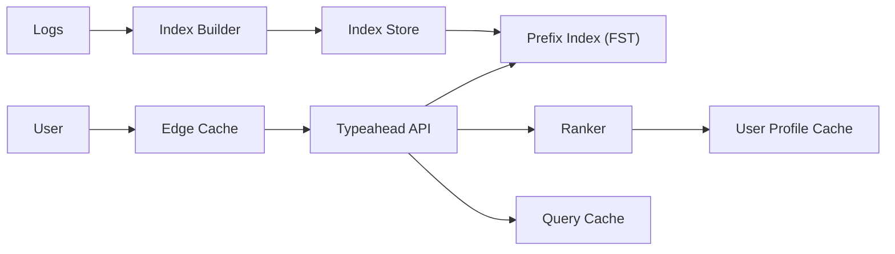

```markdown
---
title: "Search Autocomplete"
category: "Social & Discovery"
difficulty: "Medium"
tags: ["typeahead", "search", "tries", "personalization", "caching", "low-latency"]
---

## Overview

This system serves query suggestions as a user types, returning high-quality completions in under 100ms at high QPS while staying fresh as trends shift. The elegant insight is to separate **candidate generation** from **ranking**: generate a small set of plausible completions via a fast, memory-resident trie/FST index, then personalize and re-rank those candidates using lightweight user signals. This keeps the online path predictable and fast.

The second insight is to treat autocomplete as a **read-mostly, snapshot-driven** system. The serving index is rebuilt continuously from logs and periodically swapped atomically. This avoids expensive fine-grained mutations on tries in the hot path and keeps tail latency low.

The design uses boring pieces (CDN/edge cache, stateless services, Redis, object storage, offline batch + streaming) and spends complexity budget on the only hard parts: (1) **tight latency with good relevance** and (2) **safe freshness and personalization** without making the serving path stateful.

## What Makes This Hard

Naive implementations try to “just query the search engine on every keystroke.” That explodes QPS (every character multiplies traffic), creates brutal tail latency under load, and returns unstable results that jitter as the prefix changes.

The trap most teams hit is mixing concerns: if the trie is responsible for freshness, personalization, spelling correction, and ranking, it becomes an unmaintainable, mutation-heavy structure. The right move is: trie generates; ranker decides.

Finally, caching is deceptively tricky. Suggestions are prefix-based (high reuse) but also personalized (low reuse). If you cache the wrong thing, you either waste cache or leak personalization across users.

## Requirements

### Functional Requirements
- Return top-N query suggestions for a prefix, updated per keystroke.
- Support personalization (recent searches, follows/interests, locale) without making the online path stateful or slow.
- Support trending suggestions (global + per-locale) with minute-level freshness.
- Ensure result stability: small prefix changes shouldn’t reorder wildly.
- Provide safe degradation when personalization data is missing or stale.

### Scale Targets
- **DAU:** 50M
- **Active typers:** 10% concurrent peak ⇒ 5M sessions/day; peak concurrency ~200k.
- **Keystrokes per session:** ~20 ⇒ 100M requests/day.
- **Peak QPS:** assume 10x diurnal + bursty typing ⇒ ~20k–50k QPS.
- **Latency SLO:** p95 < 80ms, p99 < 120ms (server-side), budgeted for mobile networks.
- **Index size:** 50M unique queries; keep hot structure in RAM via compaction (FST) and sharding.

These numbers matter because autocomplete is dominated by **tail latency and cache hit rate**, not raw throughput. The system must keep serving path constant-time-ish regardless of corpus growth.

## Key Design Decisions

- **We chose:** Memory-resident prefix index (Trie → compiled to FST) for candidate generation  
  **We rejected:** Hitting the full-text search engine for every prefix  
  **Why:** Autocomplete needs predictable low latency and high QPS efficiency; FST lookup is fast, CPU-cache friendly, and stable.

- **We chose:** Snapshot-based index publishing with atomic swap  
  **We rejected:** Online per-query trie mutations in the serving path  
  **Why:** Fine-grained updates increase lock contention, GC pressure, and tail latency. Snapshot swaps make serving deterministic and simplify correctness.

- **We chose:** Two-stage ranking (cheap lexical + popularity, then personalization re-rank)  
  **We rejected:** Baking personalization into the index itself  
  **Why:** Personalization changes faster than the global corpus. Keeping it in a ranker allows rapid iteration and safe fallbacks.

## Architecture



### Components

- `Edge Cache`: Caches non-personalized responses for common prefixes (e.g., “a”, “the”, locale-specific). It’s the cheapest latency win and protects the backend during spikes.
- `Typeahead API`: Stateless service that normalizes input, enforces budgets, queries the prefix index, applies ranking, and returns top-N.
- `Prefix Index (FST)`: The fast path. Stores prefix → candidates with compact representation and precomputed global signals (freq, recency buckets, language).
- `Ranker`: Applies deterministic scoring and personalization. Designed to be CPU-only and bounded (e.g., 50 candidates max).
- `User Profile Cache`: Redis (or in-memory + Redis) keyed by user_id storing recent searches, follows/interests, locale, and lightweight embeddings or topic IDs.
- `Query Cache`: Caches final results for (prefix, locale, device class) and separately caches *candidate lists* for (prefix, locale). The split is crucial for personalization efficiency.
- `Index Builder`: Streaming + batch pipeline that computes query popularity, trends, and builds new snapshots. Publishes to `Index Store`.
- `Index Store`: Object storage (S3/GCS) holding versioned index shards + manifests for atomic rollout/rollback.

## Deep Dive: The Hardest Part — Personalization Without Killing Cache

The core tension: autocomplete wants aggressive caching (prefixes repeat constantly), but personalization reduces reuse. The elegant solution is to cache **intermediate artifacts** with high reuse and apply personalization late.

1) **Cache candidates, not personalized finals (mostly).**  
For a given (prefix, locale), the top ~50 global candidates are highly reusable. We cache this list with a short TTL (e.g., 1–5 minutes for trend-sensitive prefixes). This cache is hot and small. Personalization then reorders and filters those candidates per user. Now personalization cost scales with *candidate count* (bounded), not with corpus size.

2) **Make personalization additive and bounded.**  
We treat personalization as a small score delta:
- Base score: `global_popularity + trend_boost + lexical_quality`
- Personalization delta: `recent_search_match + follow_graph_topics + locale_affinity`
We cap the delta so it can’t completely override global quality. This prevents “weird” personal results and increases stability as the user types.

3) **Stability via prefix-consistent scoring.**  
A common UX failure is jitter: results reorder every keystroke. We enforce:
- Candidate set continuity: for prefix `p+char`, we include prior top-K that still match.
- Score smoothing: trend boosts are bucketed (e.g., 5-minute windows) rather than per-second counters.
- Tie-breaking determinism: stable secondary keys (query_id) to avoid random reshuffles.

4) **Selective final-result caching for anonymous or “lightly personalized” users.**  
For logged-out users (or users without enough signals), final results are effectively global. We cache finals at edge aggressively. For logged-in users, we optionally cache finals for extremely common prefixes for a short TTL keyed by `(prefix, locale, user_cluster_id)` where cluster_id is coarse (e.g., language + top interests). This preserves reuse without leaking data across individuals.

This approach teaches a non-obvious lesson: the winning cache unit isn’t the response; it’s the *candidate list*. Personalization is best as a cheap, late-stage permutation.

## Trade-offs

| Optimized For | Sacrificed |
|--------------|------------|
| Predictable low latency (FST lookup + bounded ranking) | Real-time per-query index updates (we do snapshot freshness instead) |
| Operational simplicity (stateless serving, atomic swaps) | Some freshness granularity (minutes, not seconds) |
| High cache efficiency (candidate caching) | Perfect personalization depth (bounded features, capped deltas) |

## Failure Modes

- **Index publish goes bad (corrupt shard / bad scoring)**
  - What happens: sudden relevance drop, 5xx from loading failures, or empty results for prefixes.
  - Detect: canary shard load checks + online metrics (empty-result rate, CTR proxy, latency spikes).
  - Recover: roll back via manifest pointer to previous index version; keep N-2 versions locally on hosts for instant swap.

- **Cache stampede on hot prefixes**
  - What happens: Redis/API overload, p99 latency blows up during spikes.
  - Detect: elevated miss rate + synchronized expirations + backend QPS surge.
  - Recover: request coalescing per prefix, randomized TTL jitter, serve stale candidate lists for short grace window.

- **Personalization store degraded (Redis partial outage)**
  - What happens: logged-in users see generic suggestions; latency may rise if retries cascade.
  - Detect: profile cache timeout rate; fallback rate.
  - Recover: hard timeouts (e.g., 5–10ms budget), no retries in hot path, degrade to non-personalized ranking and log for later backfill.

## What I'd Do Differently At...

- **10x scale:** shard the index by first 1–2 characters and pin shards to hosts; push more anonymous traffic to edge with precomputed top prefixes; move ranker to SIMD-friendly scoring and tighten candidate cap.
- **100x scale:** adopt a fully edge-served global candidate layer (CDN KV or edge compute) with regional snapshot distribution; invest in learned ranking distilled to a tiny model (e.g., linear + small tree/MLP) and move personalization features to compact user vectors to keep per-request CPU flat.

## Operational Notes

- Enforce strict budgets: e.g., 2ms normalization, 5ms profile fetch, 10ms ranking, remainder for serialization; fail fast and degrade gracefully.
- Track the three metrics that matter: `p99 latency`, `empty-result rate`, and `cache hit rate` (candidate and edge separately).
- Canary every index version with real traffic and automatic rollback thresholds (CTR proxy + error rate).
- Keep index loading off the request path: background preload + atomic pointer swap; never block serving threads on IO.
- Log the full decision trace for a sampled set of requests (prefix, candidates, scores, features used) to make relevance debuggable.
```