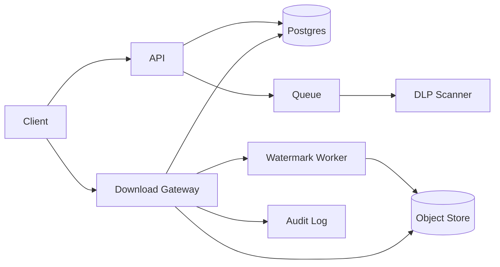

```markdown
---
title: "Secure File Sharing"
category: "Security & Access Control"
difficulty: "Hard"
tags: ["secure-sharing", "capability-urls", "dlp", "watermarking", "kms", "audit"]
---

## Overview

This system lets users share sensitive documents via expiring links while enforcing three things that matter in practice: (1) every access is authorized at download time (not just at link creation), (2) documents are DLP-scanned before they can be shared externally, and (3) every delivered copy is dynamically watermarked so leaks are attributable.

The key insight: **never hand out direct object-store access** (even “temporary” pre-signed URLs) as the primary sharing mechanism. Instead, treat a share link as a *capability pointer* to a server-side policy record, and force all downloads through a thin, high-throughput **Download Gateway** that can re-check revocation/expiry, log an immutable audit trail, and apply recipient-specific watermarking without persisting new “shadow copies” long-term.

This keeps the core system boring—Postgres for state, S3/GCS for blobs, a queue for scanning/rendering—while concentrating complexity into one well-defined choke point: secure delivery.

## What Makes This Hard

Naive designs rely on pre-signed object-store URLs for “expiring links.” The trap is that **revocation, policy changes, and DLP outcomes don’t reliably apply once a URL is minted**; caching layers and long TTLs turn “expiring” into “eventually expiring.”

The second trap is watermarking. Teams either pre-generate watermarked variants (explodes storage, hard to revoke, hard to rotate watermark formats) or watermark inline without guarding performance, turning “download” into a CPU-bound rendering pipeline that falls over during spikes.

Finally, DLP is not a checkbox—it’s a state machine with latency. If you don’t model “quarantine → scanned → allowed/blocked,” external shares will race the scanner and leak the unreviewed original.

## Requirements

### Functional Requirements
- **Hard revocation:** disabling a share link must take effect immediately for all future downloads.
- **DLP gating:** external sharing is blocked until the latest scan result is “allow”; “unknown” is treated as “deny.”
- **Dynamic watermarking:** every delivered file is stamped with an attribution string bound to the share context (recipient identity if known, link id, timestamp).
- **Tamper-evident audit:** every access attempt (allowed or denied) is recorded immutably with correlation ids.
- **Zero-trust delivery:** object store is not publicly reachable; only the Download Gateway can fetch originals.

### Scale Targets
- **Stored docs:** 50M documents, median 5 MB, 95p 80 MB (large PDFs/exports).
- **Traffic:** 3k downloads/s average, 20k downloads/s peak (incident spikes and all-hands distributions).
- **Latency:** p95 “first byte” < 700 ms for already-prepared watermarked copies; < 5 s when watermark must be generated.
- **DLP throughput:** sustain 2× peak upload rate with a 10-minute p95 scan completion target (prevents “scan backlog” becoming a security bypass via exceptions).

## Key Design Decisions

- **Decision 1: Opaque capability tokens + DB lookup (not JWT links, not pre-signed URLs)**
  - Chose: 256-bit random share token, stored as a hash in Postgres; every download does a constant-time lookup and policy check.
  - Rejected: self-contained JWT links (revocation lists become a second system); object-store pre-signed URLs (revocation and watermarking don’t compose).
  - Why: revocation and DLP status must be enforced at the moment bytes leave the system.

- **Decision 2: “Original is sacred”; deliver watermarked derivatives**
  - Chose: store one encrypted canonical original; deliver a per-request watermarked derivative generated on demand and cached short-term.
  - Rejected: pre-generating per-recipient copies (storage blowup, hard to rotate watermark formats); delivering originals with a “viewer overlay” (screenshots defeat it).
  - Why: watermarking must be attributable and unavoidable without turning storage into a combinatorial problem.

- **Decision 3: DLP as a first-class state machine**
  - Chose: explicit states on the document (`QUARANTINED`, `SCANNING`, `ALLOWED`, `BLOCKED`) that gate external share creation and download.
  - Rejected: “best effort” scanning after the fact.
  - Why: security systems fail at boundaries; making DLP part of the core state prevents accidental bypass.

## Architecture



### Components

- **API**
  - Owns share creation, permissions checks, and admin actions (revoke, rotate, set expiry, require OTP).
  - Earns its place by being the only write-path to the policy record.

- **Postgres**
  - Stores document metadata, DLP state, share policies, token hashes, and download receipts.
  - Earns its place by giving strong consistency for “is this allowed right now?”

- **Object Store (S3/GCS) + KMS**
  - Stores only encrypted originals and short-lived encrypted derivatives.
  - Earns its place by providing durable, cheap blob storage; KMS enforces separation between storage and decryption authority.

- **Queue**
  - Buffers DLP scanning and heavyweight watermark generation during spikes.
  - Earns its place by letting the download path stay fast while still supporting expensive work.

- **DLP Scanner**
  - Pulls from queue, runs content classification, and writes verdict + findings summary back to Postgres.
  - Earns its place by making “scan latency” an operationally visible pipeline, not a hidden side effect.

- **Download Gateway**
  - Validates share token, enforces expiry/revocation, checks DLP state, writes audit events, and serves bytes.
  - Earns its place as the single choke point where policy meets data exfiltration.

- **Watermark Worker**
  - Generates watermarked derivatives keyed by `(doc_version, share_id, watermark_policy_version, recipient_binding)`.
  - Earns its place by keeping CPU-heavy work off the gateway hot path while still enabling dynamic watermarking.

- **Audit Log**
  - Append-only store (e.g., Kafka → immutable object storage or a WORM-capable log) for access attempts.
  - Earns its place by enabling forensics without trusting mutable application tables.

## Deep Dive: Revocable Expiring Links + Watermarking Without Leaking Originals

The core problem is composing three constraints: (1) links must be shareable without accounts, (2) access must be revocable instantly, and (3) every delivered copy must be uniquely attributable.

**Token model (capability pointer):**
- Share link contains a single opaque token `t` (base64url of 32 random bytes).
- Server stores `H(t)` (SHA-256) with `share_id`, `doc_id`, `expires_at`, `revoked_at`, `max_downloads`, `require_otp`, and allowed actions.
- On request, the gateway hashes the presented token and looks up the row; this makes tokens non-recoverable even if the DB leaks.

**Policy enforcement at byte time:**
- The gateway enforces:
  - `now < expires_at`
  - `revoked_at is null`
  - document is `ALLOWED` for external sharing (or user is internal with stronger auth)
  - optional rate limits and `max_downloads`
- This is the piece pre-signed URLs cannot do reliably after issuance.

**Recipient binding that actually helps:**
- If `require_otp` is enabled (default for “sensitive”), the gateway requires an email OTP before first download and records `recipient_email_hash` on the share session.
- The watermark string binds to that identity when available; otherwise it binds to `share_id` and a per-download receipt id. This ensures even “link-only” sharing remains attributable.

**Watermark pipeline that avoids persistent sprawl:**
- The gateway computes a deterministic watermark request key:
  - `wm_key = hash(doc_version, share_id, recipient_binding, watermark_policy_version)`
- It checks for an existing derivative object at `derivatives/<wm_key>` with a short TTL lifecycle policy (e.g., 24 hours).
- On miss:
  - If file size < threshold and format is supported (PDF/image), the gateway can synchronously request watermark generation and stream once ready.
  - For large files, the gateway returns `202` with a “preparing” status endpoint; the worker generates the derivative asynchronously.
- Importantly, **the canonical original is never served**; even if watermarking fails, the system returns an error rather than downgrading security.

**Format strategy (pragmatic and safe):**
- Accept PDFs and common images as first-class.
- Convert Office docs to PDF at upload time (separate pipeline) so watermarking is consistent and does not require running complex parsers at download time.
- Use a PDF stamping approach (overlay text + identifier on each page) that preserves searchability while still being visible; rotate watermark template versions so attackers can’t trivially automate removal.

This design keeps revocation and attribution enforceable without building a bespoke DRM system.

## Trade-offs

| Optimized For | Sacrificed |
|--------------|------------|
| Immediate revocation and policy correctness | Direct-to-S3 CDN-style downloads |
| Strong attribution via unavoidable watermarks | Some download latency on cache misses |
| Simple, auditable security boundary (gateway) | Extra service in the critical path |
| Operational clarity (explicit DLP states) | Occasional “blocked until scanned” user friction |

## Failure Modes

- **DLP backlog causes sharing pressure**
  - What happens: docs remain `SCANNING`, external shares fail; teams ask for bypasses.
  - Detect: queue depth + scan p95 lag SLO breach; rising rate of “share denied due to scan pending.”
  - Recover: auto-scale scanners; prioritize scans for docs that have pending share attempts; never add “temporary bypass,” add a documented admin override with mandatory justification + alerting.

- **Watermark generation overload**
  - What happens: gateway timeouts, downloads stall; users retry and amplify load.
  - Detect: watermark queue latency, CPU saturation, derivative cache hit rate drop.
  - Recover: enforce backpressure (202 prepare flow), increase derivative TTL during incidents, and cap synchronous watermarking to small files only.

- **Token leakage (forwarded link, leaked chat, referrer logs)**
  - What happens: unauthorized access attempts spike from new IPs.
  - Detect: anomaly rules on token usage (new ASN/country, high failure rate, unusual concurrency), audit log correlation.
  - Recover: one-click revoke; rotate token (new share id); default `require_otp` for sensitive docs; set `Referrer-Policy: no-referrer` and never place tokens in URLs that third-party resources can see.

## What I'd Do Differently At...

- **10x scale:** put the Download Gateway behind an edge layer with regional POPs and keep derivatives regional; push audit to a streamed pipeline with compact schemas and aggressive sampling for *denied* events only (keep all allowed).
- **100x scale:** separate metadata reads for the gateway into a strongly consistent cache (Redis with write-through + short TTL) while keeping Postgres as source of truth; move watermarking to a dedicated rendering fleet with admission control and per-tenant fairness.

## Operational Notes

- Rotate token-signing/secrets and watermark templates regularly; keep old templates readable for forensics.
- Treat “serve original” as a Sev0-class bug: add a canary test that ensures every download response path invokes watermark enforcement.
- Lock down object store: private buckets, VPC endpoints, KMS key policy that only the gateway/worker roles can decrypt.
- Make audit logs immutable and queryable; on-call needs a single “show me every access attempt for doc X/share Y” command.
- Add explicit runbooks for revocation, incident-wide TTL changes for derivatives, and DLP vendor outage (fail closed for external sharing).
```