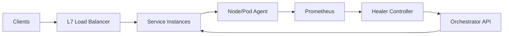

```markdown
---
title: "Self-Healing Infrastructure"
category: "Strategic Problems"
difficulty: "Medium"
tags: ["control-loop", "sre", "kubernetes", "traffic-draining", "reliability"]
---

## Overview

This system is a control loop that detects *degrading instances* (zombie accumulation, runaway memory growth) and recycles them without dropping traffic. The key insight is that **recycling is the easy part**—the elegant design is making recycling *safe*: explicit draining, bounded disruption, and anti-flap hysteresis.

The architecture separates concerns: a **local signal layer** (what’s happening on the box/container) and a **global remediation layer** (what actions are safe right now). Detection produces a small set of high-confidence “actionable” conditions; remediation is an idempotent state machine that moves an instance through *in-service → draining → terminated → replaced* under strict budgets.

This keeps the system boring: Prometheus for signals, Kubernetes (or an ASG equivalent) for replacement, and Envoy/LB semantics for draining. The only custom logic is the policy and state machine—which is exactly where the differentiation belongs.

## What Makes This Hard

Naive implementations confuse “unhealthy” with “kill it now”. That drops traffic because load balancers and clients are still using the instance, long-lived connections get severed, and retries amplify load (self-inflicted DDoS). The real trap is **flapping**: transient spikes trigger restarts, restarts cause warmup latency and cache misses, which trigger more restarts.

The second trap is relying on a single symptom. Zombies and leaks rarely fail cleanly; they degrade. If you only act on OOMKills, you recycle too late. If you act on raw RSS, you recycle too early. The design needs **trend-based signals + gating + disruption budgets**.

## Requirements

### Functional Requirements
- Detect and remediate:
  - Zombie process accumulation (increasing `process_state{state="Z"}` or rising “unreaped children” indicators)
  - Memory leaks (monotonic RSS/heap growth over time under steady load)
- Recycle instances without dropping traffic:
  - Stop sending *new* requests before termination
  - Allow in-flight requests to complete up to a bounded drain timeout
- Prevent self-harm:
  - Global disruption budget per service/cluster
  - Cooldowns and hysteresis to avoid flapping
  - Safe-mode when signals are stale or control plane is impaired
- Provide auditability:
  - Every recycle decision is explainable from recorded signals and policy

### Scale Targets
- Fleet: 5,000 instances across 50 services (typical mid-large platform)
- Detection latency: 15–30s (fast enough to catch runaway, slow enough to smooth noise)
- Remediation rate limit: max 1% of a service per 10 minutes (prevents brownouts)
- SLO constraint: recycling must not increase 5xx beyond 0.01% during steady state (forces real draining, not “best effort”)

## Key Design Decisions

- **Chose:** Explicit *instance lifecycle state machine* (InService → Draining → Recycled)
  - **Rejected:** “Restart on alert” scripts
  - **Why:** Safe recycling requires ordered steps, timeouts, and idempotency; scripts become untestable spaghetti under real failures.

- **Chose:** Trend + gating signals (rate-of-change, persistence windows) over single thresholds
  - **Rejected:** One-shot “RSS > X” or “zombies > Y” triggers
  - **Why:** Leaks and zombie accumulation are *slopes*, not points; gating eliminates noise and flapping.

- **Chose:** Enforced disruption budgets (PDB-style) as a hard constraint
  - **Rejected:** “Trust the controller to be careful”
  - **Why:** Budgeting is the only reliable way to keep remediation from becoming the outage.

## Architecture



### Components

- **Service Instances**: The units we recycle (pods/VMs). They expose readiness, drain hooks, and basic health endpoints.
- **L7 Load Balancer**: The traffic gate. It must support removing endpoints quickly (readiness/health) and respecting connection draining.
- **Node/Pod Agent**: A small daemon that emits *actionable* signals: zombie count, process count, RSS/heap, OOM events, restart loops. This is the only place that touches `/proc` and cgroups.
- **Prometheus**: The truth source for time-series trends and persistence windows. Also stores “why did we recycle this” evidence.
- **Healer Controller**: The policy engine + state machine. It decides *when* recycling is safe and executes the drain/recycle sequence.
- **Orchestrator API**: Kubernetes/ASG interface that cordons/drains/replaces instances. We use standard primitives (readiness gates, PDBs, rollouts).

## Deep Dive: Safe Recycling Without Dropping Traffic

The hardest part is turning “this instance is sick” into “this instance is gone” without interrupting real user traffic. The controller treats recycling as a **transaction with invariants**:

1. **Acquire permission (budget + safety gates)**
   - Check disruption budget: e.g., at least `N` healthy instances remain and max `K` concurrent drains for this service.
   - Check signal freshness: Prometheus scrape age < 2 intervals; otherwise, enter safe-mode (no action).
   - Check service health: if error rate is already elevated, pause recycling (don’t worsen an incident).

2. **Enter Draining (stop new traffic first)**
   - Flip instance to **NotReady** (Kubernetes readiness gate) so it is removed from LB/service discovery.
   - Wait for propagation: confirm endpoint removal via control-plane observation (e.g., endpoints list no longer includes it).
   - Start a drain timer.

3. **Grace period for in-flight work**
   - For HTTP: rely on Envoy/LB connection draining + server-side graceful shutdown.
   - For async workers: stop fetching new jobs, finish current lease, and extend visibility timeouts accordingly.
   - Enforce a hard deadline: draining is bounded (e.g., 60–120s). Past that, terminate anyway to avoid “immortal drains”.

4. **Recycle (idempotent)**
   - Terminate the instance (delete pod / terminate VM).
   - Replacement is handled by the orchestrator’s normal reconciliation (ReplicaSet/ASG).
   - Record an event with the precise trigger window (zombie slope, memory slope, persistence duration).

5. **Post-check and cooldown**
   - Observe service error rate and latency for a short window.
   - Apply cooldown per service to avoid synchronized churn (the classic “everyone leaked at the same time” scenario).

### Detection that’s actually actionable

Two examples of signals that work in practice:

- **Zombie accumulation**
  - Trigger on *sustained growth* in zombies, not absolute count:
    - `zombie_slope = deriv(process_state{state="Z"}[10m])`
    - Action when `zombie_slope > 0` for 10m **and** total zombies exceeds a small floor (filters noise).
  - Rationale: one-off zombies happen; monotonically increasing zombies means something isn’t reaping and will eventually hit PID/resource limits.

- **Memory leak**
  - Use a trend with workload normalization:
    - `rss_slope = deriv(container_memory_rss[30m])`
    - Gate on stable request rate (avoid mistaking load spikes for leaks).
  - Act *before* OOM: once OOM happens, you’ve already impacted latency and retry storms.

The controller doesn’t pretend to “fix” the leak; it restores a healthy steady state while surfacing a crisp, debuggable signal to engineers.

## Trade-offs

| Optimized For | Sacrificed |
|--------------|------------|
| Zero-drop recycling via draining | Faster “kill it now” remediation |
| Bounded disruption with budgets | Maximum remediation throughput |
| High-confidence, trend-based triggers | Detecting extremely rare edge cases quickly |
| Simple primitives (readiness, PDB, drain) | “Smart” in-process self-repair magic |

## Failure Modes

- **False positives cause churn**
  - *What happens:* Instances recycle unnecessarily; warmups and cache misses degrade p95.
  - *Detect:* Spike in recycle rate, elevated cold-start latency, stable error rate but rising latency.
  - *Recover:* Tighten persistence windows, add workload-stability gates, reduce budget temporarily; ship a “no recycle during incident” guardrail.

- **Drain gets stuck (hung connections / stuck workers)**
  - *What happens:* Instances remain in Draining; capacity shrinks.
  - *Detect:* Draining duration exceeds SLA; concurrent drains hits budget ceiling.
  - *Recover:* Enforce hard drain timeout; terminate after deadline; require services to implement graceful shutdown correctly.

- **Control plane / metrics outage**
  - *What happens:* Stale signals lead to bad decisions—or no decisions when needed.
  - *Detect:* Scrape age alarms, controller can’t observe endpoints, API errors.
  - *Recover:* Fail closed: stop initiating new recycling; allow only local protections (OOMKill, liveness) until signals recover.

## What I'd Do Differently At...

- **10x scale:** Move from per-instance decisions to *cohort* decisions (batch draining with jitter), shard the controller by service, and add per-service “risk budgets” that vary by criticality.
- **100x scale:** Treat remediation as a first-class platform product: dedicated remediation pipeline, stronger dependency-aware constraints (don’t recycle all of a tier across AZs), and richer signal attribution (eBPF profiles, heap sampling) to reduce false positives.

## Operational Notes

- The controller must be boring and predictable: **rate limits, budgets, and clear state transitions** matter more than clever detection.
- Enforce “drain correctness” as a platform contract: readiness must cut off new traffic quickly, and shutdown must be graceful within the drain timeout.
- Alert on *trends in remediation*: recycling rate and time-in-drain are leading indicators of systemic issues (leaks, deploy regressions, traffic shifts).
- Always log the “why” with the “what”: remediation without explainability becomes un-debuggable and will get turned off during the first incident.
```