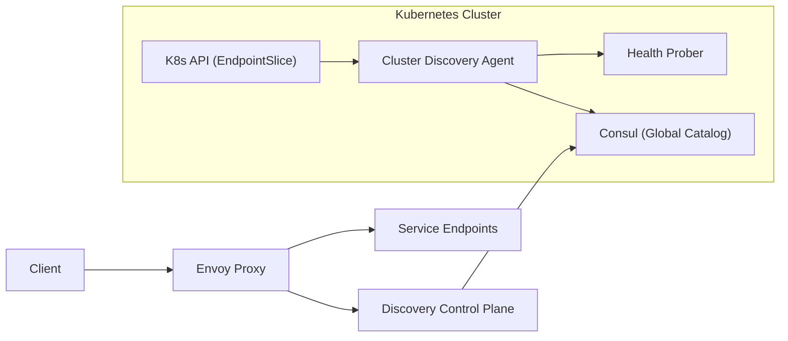

```markdown
---
title: "Service Discovery"
category: "Foundational Infrastructure"
difficulty: "Hard"
tags: ["service-discovery", "multi-cluster", "kubernetes", "health-routing", "eventual-consistency", "envoy", "consul"]
---

## Overview

This system provides **multi-cluster service discovery** with **health-based routing** across Kubernetes clusters. The key idea is to separate **(1) discovery state** (what endpoints exist) from **(2) routing safety** (which endpoints are safe to send traffic to right now). Most outages in “global discovery” are not caused by missing endpoints—they’re caused by **stale or wrong health** being treated as truth.

We use **Consul as a global service catalog** (boring, proven) and **Envoy as the data plane** for routing decisions (also boring, proven). Kubernetes remains the source of endpoint membership; Consul becomes the **distribution and query layer** for cross-cluster clients.

Elegance comes from one rule: **only advertise endpoints globally as soft-state with TTL**, and make the data plane resilient to lies via **passive health (outlier ejection) + locality-first routing + fast local failover**. Eventual consistency becomes survivable because it’s no longer trusted with correctness.

## What Makes This Hard

Naive designs treat discovery as a strongly consistent database problem (“just replicate the registry”), but the real trap is that **health is inherently time-sensitive**. In a multi-cluster world, by the time a “healthy” signal crosses regions and caches, it may already be wrong. That’s how you get **traffic blackholes**: the control plane says an endpoint is alive; the data plane keeps sending requests; users see timeouts.

The second trap is coupling failure domains: if your “global catalog” is down, naive clients lose the ability to resolve services at all. A discovery system must fail in a way that preserves a **local happy path** and degrades cross-cluster traffic gracefully.

## Requirements

### Functional Requirements
- Discover service endpoints across multiple Kubernetes clusters under a single logical service name.
- Route requests based on **health**, preferring same-cluster endpoints and failing over to other clusters.
- Handle eventual consistency explicitly: endpoints may be added/removed/partitioned while traffic continues.
- Support gradual rollouts: new endpoints must not receive global traffic until they’re demonstrably ready.
- Provide a control-plane API for operators: “what is routing to what, and why?”

### Scale Targets
- **Clusters:** 20 (typical large org footprint); design should not fall apart at 100.
- **Services:** 5,000; large enough that full-table polling is unacceptable.
- **Endpoints:** 200,000 total; forces watch/stream distribution and compact representations.
- **Discovery QPS:** 50k lookups/s equivalent at the edge (handled via xDS push + local caches, not synchronous queries).
- **Update rate:** 1,000 endpoint changes/s during deploy storms; requires incremental updates and TTL-based cleanup.

## Key Design Decisions

- **Chose:** Consul as the global catalog (multi-datacenter semantics, health checks, proven operational model)  
  **Rejected:** Building a custom “global Kubernetes API” replica  
  **Why:** The hard part is correctness under staleness, not storage. Consul gives a mature distribution/query layer and reduces bespoke failure modes.

- **Chose:** Envoy xDS (EDS/CDS) for endpoint distribution and health-aware routing  
  **Rejected:** DNS-only multi-cluster discovery  
  **Why:** DNS can tell you “where,” but not safely answer “who is healthy right now” at request time. Envoy can do locality preference, outlier ejection, circuit breaking, and fast failover.

- **Chose:** TTL-based soft-state advertisement from clusters  
  **Rejected:** “Write once, delete explicitly” endpoint records  
  **Why:** Deletes are the first thing you lose during partitions. TTL makes disappearance the default, preventing endpoint resurrection and long-lived ghosts.

## Architecture



### Components

- `Cluster Discovery Agent`
  - Watches Kubernetes `EndpointSlice` and `Service` objects.
  - Translates them into Consul service instances with **TTL** and metadata (`cluster`, `zone`, `revision`, `port`, `protocol`).
  - Enforces a gating rule: **only publish globally after local readiness is stable** (see deep dive).

- `Health Prober`
  - Runs close to endpoints (same cluster) to avoid cross-region health lies.
  - Produces a **liveness signal for discovery** (TTL renewal) and a **richer signal for routing** (success rates/latency buckets exported to the control plane).

- `Consul (Global Catalog)`
  - Stores the union of service instances across clusters as soft-state.
  - Acts as the distribution backbone (watch streams) for the control plane.

- `Discovery Control Plane`
  - Watches Consul changes and publishes **xDS snapshots/deltas** to Envoy.
  - Encodes routing policy: locality-first, cluster failover order, and safety knobs (max remote %, panic thresholds).

- `Envoy Proxy`
  - Consumes xDS and makes per-request decisions.
  - Protects users from stale control-plane state via **passive health** (outlier ejection) and **fast retries** with bounded budgets.

## Deep Dive: Health-Based Routing Under Eventual Consistency

The hardest part is preventing a globally consistent-looking system from confidently routing to dead endpoints. This design uses three layers of defense, each assuming the layer above can be wrong:

1) **Advertise only stable readiness (publish gating)**  
Kubernetes readiness is noisy during deploys (warmup, cache fill, JVM compilation, etc.). The agent does not immediately publish a new endpoint globally when it appears in `EndpointSlice`. Instead it requires a short stability window (e.g., N consecutive successful probes over M seconds) before creating the Consul instance. This single rule eliminates the common “deploy storm causes global brownout” failure mode.

2) **TTL as the only source of truth for existence**  
Every advertised instance is soft-state with a short TTL (e.g., 15–30s) renewed by the agent. If the cluster is partitioned from the catalog, renewals stop and instances **expire automatically**. This is intentionally biased toward removing endpoints too aggressively rather than keeping ghosts. That bias is correct because Envoy can retry/failover quickly; users cannot tolerate long hangs caused by dead routes.

3) **Data-plane skepticism (passive health and locality policy)**  
Even with TTL, health can be wrong for seconds to minutes (GC pauses, node-level issues, partial outages). Envoy treats the catalog as a hint:
- **Locality-first routing:** prefer same-cluster, then same-region, then other regions.
- **Outlier ejection:** a small number of consecutive 5xx/timeouts ejects an endpoint quickly, independent of control-plane health.
- **Bounded retries:** retries only on safe failures, with strict budgets to avoid amplifying incidents.
This makes eventual consistency an availability concern, not a correctness concern.

The net effect is that “global discovery” can be stale and you still don’t blackhole traffic: the data plane self-corrects faster than the control plane can converge.

## Trade-offs

| Optimized For | Sacrificed |
|--------------|------------|
| Fast failover, fewer blackholes | Strong global correctness guarantees |
| Operational simplicity (Consul + Envoy) | Pure Kubernetes-native minimalism |
| Safe deploy storms (publish gating + outlier ejection) | Slightly slower global traffic ramp-up for new endpoints |
| Partition tolerance via TTL | More churn in the catalog during unstable networks |

## Failure Modes

- **Stale “healthy” endpoints (ghost routes)**
  - What happens: callers hit dead pods, see timeouts.
  - Detect: elevated Envoy upstream timeouts + increasing outlier ejections for a cluster.
  - Recover: outlier ejection stops sending traffic within seconds; TTL expiry removes ghosts from future snapshots.

- **Catalog/control-plane outage**
  - What happens: xDS updates stop; naive clients would fail resolution.
  - Detect: Envoy xDS disconnects + snapshot age alerts.
  - Recover: Envoy continues routing on last-known-good config; local-first policy keeps same-cluster traffic working. Operators restore catalog/control plane without immediate user impact.

- **Network partition between a cluster and the global catalog**
  - What happens: that cluster’s endpoints expire globally; cross-cluster traffic stops flowing to it.
  - Detect: missing TTL renewals + sudden drop in advertised instances for that cluster.
  - Recover: when connectivity returns, the agent republishes; publish gating prevents half-ready endpoints from immediately taking traffic.

## What I'd Do Differently At...

- **10x scale:** shard the control plane by service namespace/team, and push **delta xDS** aggressively to reduce fanout; introduce per-service rate limits on update propagation to survive deploy storms.
- **100x scale:** replace a single global catalog with **regional catalogs + federation**, and move from “endpoint-level global routing” toward “cluster-level routing” (send traffic to a cluster gateway, then do local service discovery inside the destination cluster). Endpoint-level global state becomes too large and too noisy.

## Operational Notes

- Tune TTL and ejection thresholds together: short TTL with aggressive ejection can cause flapping; keep TTL moderately short and rely on passive health for second-level decisions.
- Alert on **snapshot age** and **outlier ejection rate**; they’re better early-warning signals than raw health-check counts.
- During incidents, your safest lever is policy: force “local-only” or “region-only” routing at the control plane; don’t hand-edit catalogs.
```