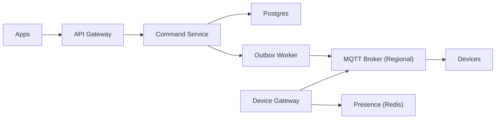

```markdown
---
title: "Smart Home Hub"
category: "IoT & Edge"
difficulty: "Hard"
tags: ["iot", "edge", "mqtt", "nat-traversal", "low-latency", "reliability"]
---

## Overview

This system is a backend that routes user commands (e.g., “lock door”, “set thermostat”) to devices that are frequently behind NATs, carrier-grade NAT, or restrictive firewalls—while keeping perceived latency low and reliability high.

The key insight is to **invert connectivity**: devices never accept inbound connections. Each device maintains a **long-lived outbound, authenticated session** to the cloud (preferably to a nearby region/PoP). Commands are routed to the region where that session currently lives and are pushed down that existing connection. This turns “NAT traversal” into **connection lifecycle + routing**, which is tractable.

Everything else stays boring: MQTT for device messaging (because it’s built for intermittent links and QoS), Postgres for device/account metadata, Redis for fast “device presence → region” lookups, and an outbox pattern to make command publication reliable.

## What Makes This Hard

Naive implementations assume you can “call the device” over the internet. You can’t—NAT and firewalls make inbound reachability the exception, not the rule. The common trap is falling back to polling (“device checks every N seconds”), which destroys latency, increases battery burn, and collapses under scale.

The genuinely hard part is **routing + correctness under churn**: devices reconnect, roam between networks, and drop packets. If you don’t design for duplicates, out-of-order delivery, and reconnect storms, you end up with ghost commands (“it said locked but didn’t”) or thundering herds that take down your brokers after an outage.

## Requirements

### Functional Requirements
- Route a command to the correct device even when it is behind NAT/firewall.
- Provide **bounded-latency** command push when device is online; provide clear semantics when offline (queued vs rejected).
- Ensure **idempotent execution**: the same command may be delivered more than once.
- Provide an auditable command trail: who issued what, when, and what the device acknowledged.
- Support device connectivity over restrictive networks: **MQTT over TLS (8883)** and **MQTT over WebSockets (443)**.

### Scale Targets
- **Online devices:** 5M concurrent connections (dominates architecture: connection state, broker clustering, keepalives).
- **Command rate:** 50k commands/sec peak (bursty: “everyone turns on lights at 7pm”; needs spike absorption).
- **Latency (online):** p50 < 150ms, p95 < 500ms end-to-end (requires routing to correct region + hot path without DB calls).
- **Offline tolerance:** devices may be offline for hours; system must not melt down when they return (reconnect storm control).

## Key Design Decisions

- **We chose:** MQTT with persistent sessions and QoS 1 for command delivery over device-initiated connections.  
  **We rejected:** custom long-polling / bespoke TCP protocol.  
  **Why:** MQTT is purpose-built for lossy networks, supports session resumption, and has well-understood operational playbooks.

- **We chose:** a **presence directory** (device → connected region/broker) backed by Redis with short TTL, written by gateways.  
  **We rejected:** “broadcast command to every region” fanout.  
  **Why:** low latency requires publishing directly to the region that holds the device session; global broadcast is expensive and amplifies failure.

- **We chose:** **at-least-once delivery + idempotency** (command IDs + device-side dedupe) with an outbox for reliable publish.  
  **We rejected:** exactly-once semantics.  
  **Why:** exactly-once across mobile → cloud → device is complexity theater; duplicates are inevitable, so we make them safe.

## Architecture



### Components

- `API Gateway`: Authenticates users, rate-limits, and normalizes requests. Keeps the hot path free of business logic.
- `Command Service`: Validates authorization (user can control device), assigns a `command_id`, persists intent, and returns a clear response (accepted/queued/rejected).
- `Postgres`: Source of truth for accounts, devices, ACLs, command log, and command state transitions (created → published → acked/failed).
- `Outbox Worker`: Publishes commands to the correct regional broker reliably (transactional outbox prevents “stored but never sent”).
- `Device Gateway`: Front door for device connections; terminates TLS/mTLS, enforces keepalive policy, and updates presence on connect/disconnect.
- `Presence (Redis)`: Stores `device_id -> {region, broker, session_id, last_seen}` with TTL; enables O(1) routing decisions.
- `MQTT Broker (Regional)`: Maintains device sessions and pushes commands down existing connections (QoS 1).
- `Devices`: Subscribe to their command topic, dedupe by `command_id`, execute, and publish acknowledgements.

## Deep Dive: Connection-Aware Command Routing (The Hardest Part)

The core problem is not “send a message” but “send a message to the region that currently owns the device’s live session.” Devices roam (Wi‑Fi ↔ LTE), NAT mappings expire, and reconnects can land in different regions.

**1) Presence as a first-class primitive**  
When a device connects to the `Device Gateway`, the gateway authenticates it via mTLS (per-device cert) and assigns a `session_id`. The gateway writes presence to Redis with a tight TTL (e.g., 90s) and refreshes it on keepalive. Presence is authoritative for routing but intentionally ephemeral: if Redis loses an entry, we treat the device as offline rather than guessing.

**2) Publishing without synchronous dependencies**  
The command hot path avoids cross-region calls and avoids waiting on brokers. `Command Service` writes a row to `commands` and an `outbox` row in the same Postgres transaction. The `Outbox Worker` reads outbox rows, looks up presence in Redis, and publishes to the MQTT broker in the indicated region. If presence is missing, the worker marks the command as `queued_offline` and (optionally) publishes to a “retained/queued” mechanism only for device classes that can safely buffer (e.g., thermostat) while rejecting unsafe ones (e.g., door unlock) unless explicitly configured.

**3) At-least-once + device idempotency**  
MQTT QoS 1 delivers “at least once.” Reconnects and broker failover produce duplicates. Every command carries:
- `command_id` (UUID)
- `issued_at`, `expires_at`
- optional `expected_state_version` (for optimistic concurrency on stateful operations)

Devices maintain a small LRU cache of recently executed `command_id`s (persisted if needed). If a duplicate arrives, they re-ACK without re-executing. This is the difference between “reliable” and “dangerous.”

**4) Ack semantics that match reality**  
A device ACK means “received and accepted for execution” (and optionally a second message “execution result”). The backend records both. This avoids lying to users when a device received a command but failed to act (motor jam, low battery, etc.).

## Trade-offs

| Optimized For | Sacrificed |
|--------------|------------|
| Low-latency online control via push | Exactly-once delivery semantics |
| NAT/firewall compatibility (outbound only) | True peer-to-peer device access |
| Operational simplicity (boring primitives) | Maximum bandwidth efficiency (some keepalive overhead) |
| Resilience under churn (idempotency + outbox) | Slightly higher end-to-end command latency when offline/queued |

## Failure Modes

- **Regional broker outage**
  - What happens: devices disconnect; commands routed to that region fail to publish or go unacked.
  - Detect: broker health + sharp drop in presence TTL refresh + rising publish errors.
  - Recover: devices reconnect to another broker in-region; if region is down, DNS/Anycast shifts to nearest region; outbox retries with backoff and marks commands as delayed.

- **Reconnect storm after internet/power event**
  - What happens: millions of devices reconnect simultaneously; gateway/broker CPU spikes; presence thrashes.
  - Detect: connection rate, TLS handshakes/sec, Redis write QPS, broker session churn.
  - Recover: admission control at gateways (token bucket per ASN/region), staged reconnect (server-sent backoff), prioritize existing sessions, and cap inflight TLS handshakes.

- **Duplicate/out-of-order command delivery**
  - What happens: user sees inconsistent device behavior if commands are not idempotent or ordered.
  - Detect: device reports “duplicate command_id” rate; conflicting state transitions.
  - Recover: strict device-side dedupe; optional `expected_state_version` to reject stale commands; backend surfaces “rejected as stale” rather than retrying blindly.

## What I'd Do Differently At...

- **10x scale:** Move gateways and brokers to more PoPs, tighten presence locality (Redis per region + lightweight global directory), and shift more auth decisions to cached policy to keep Postgres off the hot path.
- **100x scale:** Replace single Postgres command log with partitioned storage (e.g., sharded Postgres/Citus or a write-optimized event store), and introduce hierarchical routing (global presence directory + regional brokers) to avoid any global bottleneck.

## Operational Notes

- Keepalive tuning is not cosmetic: too frequent wastes battery and broker CPU; too infrequent breaks NAT mappings and increases “false offline.” Treat it as an SLO lever.
- Presence TTL must be shorter than your worst-case NAT idle timeout assumptions; otherwise you route commands into a void and inflate perceived latency.
- Device certificates are your security perimeter. Automate rotation and revocation; treat “cert provisioning” as a production system, not a script.
- The on-call runbook needs three dashboards: connection churn, outbox lag, and per-region publish/ack latency—those predict user-visible failures before tickets arrive.
```