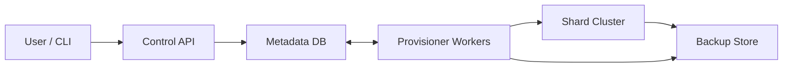

```markdown
---
title: "SQL Database-as-a-Service (Control Plane)"
category: "Storage & Data Platforms"
difficulty: "Hard"
tags: ["dbaas", "control-plane", "postgres", "ha", "backups", "pitr", "temporal", "patroni"]
---

## Overview

This system is the control plane for a managed, sharded Postgres offering. It provisions shard clusters, enforces HA policies, runs backups, and performs PITR as repeatable, retry-safe operations.

The control plane is declarative: it stores desired state and continuously reconciles. Seconds-level liveness stays in the shard cluster: Patroni handles leader election and failover close to the data. PITR is provision + replay + cutover: restore always produces a new cluster from immutable artifacts, then switches endpoints in a controlled way.

## What Makes This Hard

The hard part is correctness under partial failure: every operation is multi-step, slow, and only partially succeeds. Without idempotent steps and a single source of truth, you end up with scripts that cannot be safely retried.

The second hard part is avoiding split-brain writes. If a distant control plane decides primaries during partitions, dual-writes eventually happen. The last hard part is backup correctness: “it uploaded” is not the same as “it restores”.

## Requirements

### Functional Requirements
- **Sharded provisioning:** Create a logical database composed of N shards, each a highly-available SQL cluster with independent scaling and isolation boundaries.
- **Idempotent lifecycle ops:** Create/resize/rotate credentials/upgrade/restore operations are safe to retry and auditable.
- **HA policy enforcement:** Define replication factor, failover behavior, maintenance windows, and read/write endpoint semantics per shard.
- **Automated backups + PITR:** Continuous WAL archiving plus periodic base backups; restore any shard (or whole logical DB) to a timestamp with a verifiable recovery report.
- **Isolation and guardrails:** Per-tenant quotas, blast-radius limits for concurrent operations, and safe defaults that prevent accidental data loss.

### Scale Targets
- **10k tenants**, **100k shards** total. The control plane handles many small clusters.
- **Provisioning:** 1k shard creates/hour; each create is multi-minute.
- **Backups:** Daily base backup per shard + continuous WAL; **50–200 GB/day/shard** write volume for the “busy” tail.
- **PITR:** RPO ≤ 1 minute and RTO ≤ 30 minutes for a 1 TB shard.

## Key Design Decisions

- **Declarative “desired state” + reconciliation**
  - **Chose:** Store desired state and converge via workers.
  - **Rejected:** Imperative scripts in API handlers.
  - **Why:** Retry becomes a feature, not an incident.

- **Workflow state in Postgres, executed by workers**
  - **Chose:** A Postgres operations table (step state + retries) with workers that lease rows and run idempotent steps.
  - **Rejected:** A separate workflow engine for all operations.
  - **Why:** One durable system of record keeps the control plane small.

- **HA owned by Patroni, not the control plane**
  - **Chose:** Patroni (etcd-backed) inside each shard cluster for leader election and failover; control plane observes and enforces policy.
  - **Rejected:** A global control-plane “primary selector”.
  - **Why:** Leader truth lives where partitions and replication state are visible.

- **PITR as “restore-to-new + cutover”**
  - **Chose:** Restore produces a new cluster from base backup + WAL, then switches endpoints.
  - **Rejected:** In-place restore of a live cluster.
  - **Why:** Cutover is testable, reversible, and auditable.

## Architecture



### Components

- **Control API**
  - Justification: single front door for authn/z, quotas, and writing desired state.

- **Metadata DB (Postgres)**
  - Justification: source of truth for desired state, operation state, and audit trail.

- **Provisioner Workers**
  - Justification: bounded reconciliation + idempotent step runner that turns “stuck” into “eventually converges”.

- **Shard Cluster**
  - Justification: owns single-writer correctness and replication liveness (Postgres + Patroni).

- **Backup Store (Object Storage)**
  - Justification: immutable base backups + WAL for restore-to-new and verification.

**What We Removed**
- Workflow engine: operation state lives in Postgres and workers execute steps.
- Host agent: nodes are configured by standard bootstrapping (images + cloud-init/systemd or managed remote execution).
- Custom backup/manifest logic: backups use a standard tool (pgBackRest or WAL-G) with restore verification.
- Per-cluster etcd sprawl: Patroni uses a shared etcd per cell/region with namespace isolation and quotas.

## Deep Dive: Safe HA + “No Split-Brain” Writes

Single-writer safety lives in the shard cluster. Patroni uses etcd leases to ensure only the lease-holder presents itself as primary. With shared etcd per cell/region, namespacing and quotas keep clusters isolated and keep key churn bounded.

Writability is explicit at the edge:
- The write endpoint routes only to the node that proves “Patroni leader” and “accepts writes”.
- If leader proof is unavailable (etcd issues, partition ambiguity, crash loops), the write endpoint fails closed.

Cutover is fenced, not hopeful. The worker makes the old leader stop accepting writes (demote or stop Postgres), drains/terminates remaining connections, flips the endpoint, then resumes automation. Restore stays safe because it always targets a new cluster ID.

## Trade-offs

| Optimized For | Sacrificed |
|--------------|------------|
| Correctness under partitions | Some write unavailability during ambiguous leader states |
| Operational simplicity | Less “enterprise workflow” UX than a dedicated engine |
| Small-team operability | Fewer knobs for exotic environments |
| Reliable restores | Extra capacity needed to restore-to-new before cutover |

## Failure Modes

- **Metadata DB is down for 5 minutes**
  - **What happens:** API cannot accept changes; workers cannot start new work; shard clusters keep serving and failing over normally.
  - **Detect:** DB errors; API/worker health failing.
  - **Recover:** Restore DB; workers resume by reconciling desired state and re-leasing incomplete operations.

- **Workers are down / partitioned**
  - **What happens:** No provisioning/backups/restores start; backlog grows; shard HA continues.
  - **Detect:** Operation lease backlog; “last reconcile time” drifts.
  - **Recover:** Restart workers; rate-limit catch-up to protect shard I/O and object storage.

- **Object storage outage / elevated errors**
  - **What happens:** WAL archiving lags; RPO degrades; backups may miss schedules.
  - **Detect:** WAL backlog metrics per shard; “last archived WAL time”; restore-readiness failing.
  - **Recover:** Pause restore/maintenance; increase local WAL retention temporarily; resume archiving when store recovers; alert on RPO breach.

- **etcd overload or quorum loss (cell/region)**
  - **What happens:** Promotions stall; some shards fail closed on writes if they cannot prove a leader lease.
  - **Detect:** etcd latency/timeouts; Patroni leader flaps; write endpoint fail-closed spikes.
  - **Recover:** Reduce churn (freeze noisy automation), restore etcd capacity, then allow Patroni to converge.

- **Bad config rollout (Patroni/Postgres crash loops)**
  - **What happens:** Affected shards lose availability or oscillate leadership; automation amplifies blast radius.
  - **Detect:** Crash loops; leader churn; errors correlated to a config revision.
  - **Recover:** Freeze automation for the tenant/cell, roll back config revision, re-enable with a canary.

- **Cutover with long-lived connections**
  - **What happens:** Old sessions keep writing if the old leader isn’t fenced before endpoint flip.
  - **Detect:** Writes observed on the old cluster after cutover; unexpected WAL divergence risk.
  - **Recover:** Fence the old leader (stop/demote), terminate sessions, and rerun cutover; keep the write endpoint failed closed until fencing completes.

## What I'd Do Differently At...

- **10x scale:**
  - Introduce cells: separate worker pools, etcd, and backup namespaces per region/failure domain.
  - Tighten admission control: per-tenant operation budgets and backup I/O budgets.

- **100x scale:**
  - Hard isolation per cell with independent metadata partitions and a strict “no cross-cell operations” rule.

## Operational Notes

- Enforce **concurrency limits**: restores and base backups are I/O grenades.
- Run **restore verification** continuously (fire-drill restores into isolated sandboxes).
- Make cutovers predictable: validate new cluster, fence old leader, drain/terminate sessions, flip endpoint, and keep a rollback path.
- Keep “freeze automation” as a first-class state with clear entry/exit criteria.
- Back up and test-restore the **Metadata DB**; after metadata restore, workers converge from desired state and operation history.
```
