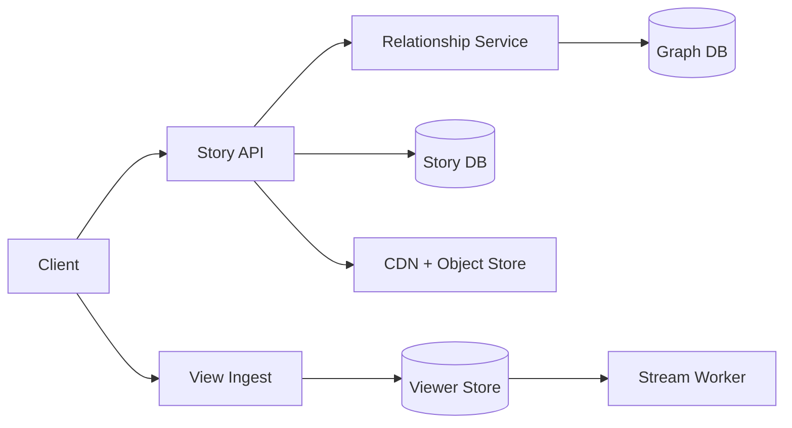

```markdown
---
title: "Stories Product"
category: "Social & Discovery"
difficulty: "Hard"
tags: ["stories", "ephemeral", "privacy", "feed", "cdn", "deduplication", "ttl"]
---

## Overview

Stories is an ephemeral media product: users post photos/videos that expire after 24 hours, viewers can watch them in a fast “tray” experience, and creators can see exactly who viewed each story. The system looks simple until you combine three constraints: strict privacy controls, extremely spiky read traffic, and “viewer lists” that must be correct (no duplicates, no missing viewers), all while data expires continuously.

The key insight is to split the system into two planes: (1) a **privacy-gated serving plane** that returns short-lived signed media URLs and never trusts the CDN for authorization, and (2) an **append-only viewing plane** where every view becomes an event, but *uniqueness* is enforced by a dedicated idempotency record. That keeps the watch path fast while producing accurate viewer lists and counts.

## What Makes This Hard

Naive implementations fail in two predictable ways:
1. **They let the CDN “cache auth.”** If media URLs are stable and cacheable, a blocked user can keep replaying cached content after privacy changes. Privacy must be enforced at the origin with short-lived URLs.
2. **They treat viewer lists like “just another table.”** At scale, view writes are high-QPS and bursty; enforcing “one row per (story, viewer)” with correct pagination and ordering becomes a hot partition problem. The trap is mixing dedupe, ordering, and serving in one store.

## Requirements

### Functional Requirements
- 24-hour expiration for story visibility and viewer lists (with small grace for clock skew).
- Privacy controls: public, followers-only, close-friends list, and “block” overrides.
- Viewer list: creator can page through viewers for a story; each viewer appears once; includes viewed timestamp.
- Fast tray load: viewer sees recent stories from relevant accounts with minimal latency.
- “Seen state” per viewer: which stories a viewer has already watched.

### Scale Targets
Assume:
- 10M DAU, 1.5M creators/day (15%), avg 3 stories/creator/day ⇒ ~4.5M stories/day.
- Avg 20 story views/user/day ⇒ 200M views/day (~2.3k/s avg).
- Peak factor 15× (evening + notifications) ⇒ ~35k view writes/s and ~150k story reads/s.
Why these matter: viewer tracking must absorb spikes without slowing playback, and the read path must stay low-latency even under cache churn from expiration.

## Key Design Decisions

- **Media access via short-lived signed URLs**
  - Chose: origin-authorized requests that return signed CDN URLs expiring in minutes.
  - Rejected: public/stable object URLs with “security by obscurity.”
  - Why: privacy changes (block/unfollow/close-friends edits) must take effect quickly; the CDN cannot be the source of truth for authorization.

- **Viewer lists built from an idempotent “seen” record + derived timeline**
  - Chose: a dedicated `(story_id, viewer_id)` uniqueness record, then an async derivation into a time-ordered viewer timeline.
  - Rejected: a single ordered table that also enforces uniqueness.
  - Why: ordering and dedupe fight each other under high write contention; isolating idempotency keeps the hot path constant-time.

- **Hybrid fanout for the tray (write for most, read for celebrities)**
  - Chose: precompute per-viewer “story tray” for normal accounts; switch to fanout-on-read for very high-fanout creators.
  - Rejected: pure fanout-on-write (explodes on celebrities) and pure fanout-on-read (slow trays).
  - Why: it keeps the tray fast without building a bespoke distributed graph query engine.

## Architecture



### Components

- **Story API**
  - Serves the tray, story metadata, and signed media URLs.
  - Owns the privacy decision on every “play” request; the CDN only accelerates bytes.

- **Relationship Service + Graph DB**
  - Authoritative source for follow edges, blocks, and close-friends lists.
  - Aggressively cached, but every cache entry has a short TTL and is invalidated on block/unblock.

- **Story DB**
  - Stores story metadata (owner, timestamps, privacy policy, media pointers, expires_at).
  - Partitioned by `expires_at` day so expiry is a drop-partition operation, not row-by-row deletes.

- **CDN + Object Store**
  - Stores immutable media objects; object lifecycle deletes after ~26 hours (24h + grace).
  - CDN caches are short (minutes) and keyed by signed URL to prevent long-lived sharing.

- **View Ingest**
  - Lightweight endpoint called when playback starts (or reaches a watch threshold).
  - Writes are designed to be fast and resilient to retries.

- **Viewer Store**
  - Holds (a) idempotency records and (b) materialized viewer timelines and counts with TTL.
  - TTL aligned to story expiration to make data disappear automatically.

- **Stream Worker**
  - Transforms “first time seen” events into a time-ordered timeline and aggregated counts.
  - Also maintains per-viewer “seen state” for tray UI.

## Deep Dive: Accurate Viewer Lists Without Slowing Playback

The hardest part is guaranteeing: “each viewer appears once per story,” supporting pagination, and surviving retries—at tens of thousands of writes per second—without turning the view endpoint into a transactional bottleneck.

### Data model (conceptual)

1. **Seen table (idempotency / uniqueness)**
   - Key: `(story_id, viewer_id)`
   - Attributes: `first_viewed_at`, `ttl = story_expires_at + grace`
   - Write: conditional insert “only if not exists”

This is the critical trick: the view endpoint becomes “try to create the uniqueness record.” Retries are safe; duplicates are blocked at the point of truth.

2. **Timeline table (ordered viewer list)**
   - Key: `(story_id, reverse_time#viewer_id)` to paginate “most recent first”
   - Attributes: `viewer_id`, `viewed_at`, `ttl`
   - Write: performed asynchronously only when the seen record is newly created

The Stream Worker consumes “new seen record” events and writes one timeline row. If the worker reprocesses, the timeline key is deterministic, so the write is idempotent.

3. **Counts**
   - Maintain `unique_view_count` per story via atomic increments from the same stream.
   - The creator UI reads `(count, timeline page)`; count can be slightly ahead of the paged list during stream lag, which is acceptable and visible via “updating…” UI state.

### Why this works operationally

- **Hot path is constant-time**: one conditional write to the Seen table.
- **Backpressure is isolated**: if the stream lags, playback is unaffected; only the creator viewer list becomes eventually consistent.
- **TTL is automatic**: both tables expire based on story expiry; no delete jobs that fall behind during peak.
- **Privacy is enforced at play time**: even if a user gets a signed URL and later becomes blocked, the URL expires quickly and cannot be refreshed.

## Trade-offs

| Optimized For | Sacrificed |
|--------------|------------|
| Fast playback under spikes | Viewer lists are eventually consistent (seconds) |
| Strong privacy guarantees | More origin traffic (short-lived URL minting) |
| Simple expiry operations | Slightly higher storage overhead (TTL + derived tables) |

## Failure Modes

- **Stream worker lag or outage**
  - What happens: playback and view recording continue; creator viewer lists/counts lag behind.
  - Detect: consumer lag alarms, “seen → timeline” processing latency SLO.
  - Recover: autoscale workers; replay from stream; UI shows “updating” when lag exceeds threshold.

- **Relationship cache staleness (blocks/close-friends)**
  - What happens: brief window where a user can see a story they shouldn’t.
  - Detect: audit logs comparing auth decisions vs. authoritative graph, spike in “policy mismatch.”
  - Recover: write-through invalidation on block/unblock; short TTL; force recheck on play even if tray cached.

- **Clock skew around expiration**
  - What happens: story appears expired on one device and active on another; TTL deletes too early.
  - Detect: elevated “expired” errors immediately after publish; time drift metrics from clients.
  - Recover: use server time for `expires_at`; add a small grace window; never rely on client time for expiry.

## What I'd Do Differently At...

- **10x scale:** move tray generation fully to hybrid fanout with dedicated “celebrity read path,” and introduce regional viewer stores to keep write latency low.
- **100x scale:** split the Viewer Store by consistent hashing on `story_id` with strict per-partition limits, and move relationship checks to precomputed audience tokens for common cases (followers-only) while keeping block overrides real-time.

## Operational Notes

- Treat “mint signed URL” as a tier-0 dependency: if it fails, playback fails; keep it simple and overprovisioned.
- Enforce a watch threshold (e.g., 1–2 seconds or 20% progress) before counting a view to avoid botty “open/close” inflation.
- Keep a tight SLO on “privacy decision latency” and “seen write latency”; those are the two metrics that correlate most with user-visible jank.
- Align all TTLs to `story_expires_at + grace` and make grace a single config knob used everywhere (DB TTL, object lifecycle, cache TTL caps).
```