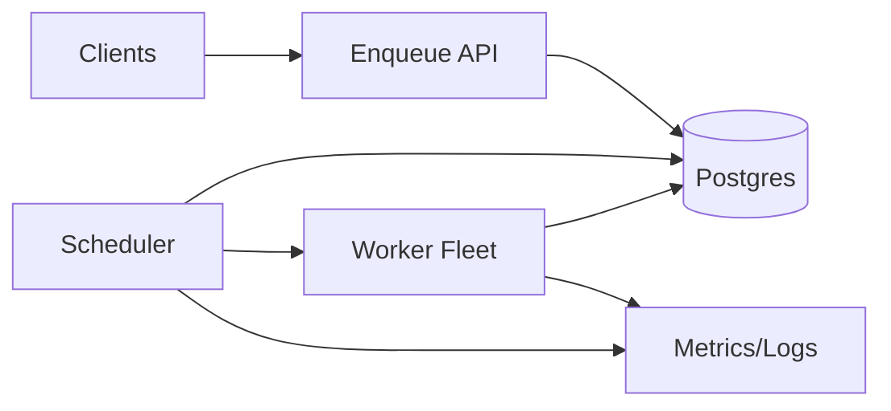

```markdown
---
title: "Task Scheduler (Batch)"
category: "Foundational Infrastructure"
difficulty: "Hard"
tags: ["scheduler", "batch", "multitenancy", "postgres", "retries", "delayed-jobs", "priority-queues"]
---

## Overview

This system is a distributed batch job scheduler: clients enqueue jobs with a priority and an optional “not before” time, workers execute them, and the platform handles retries, backoff, and tenant isolation. The design goal is not “a queue”, but **a controlled admission system** that keeps one tenant’s burst or poison workload from degrading everyone else.

The key insight is to make **the database the source of truth** (durability, ordering constraints, correctness), while keeping scheduling “smart” but small: a two-stage dispatch loop that selects *tenants* fairly first, then selects *jobs* within that tenant efficiently. This prevents the classic trap where a global priority queue becomes a noisy-neighbor amplifier.

Everything else stays boring: Postgres for persistence and locking, stateless scheduler nodes, a worker fleet that is at-least-once by design, and explicit operational knobs (per-tenant concurrency, rate limits, and DLQ policies).

## What Makes This Hard

Naive implementations get trapped by the interaction of **priority + delay + retries + multitenancy**. A single global “ORDER BY run_at, priority” queue looks correct, but it silently violates isolation: one tenant enqueuing millions of ready high-priority jobs forces every dispatcher query, index, and lock to contend on the same hot working set. Teams discover the problem only under incident load, when fairness matters most.

The second trap is pretending you can get exactly-once execution out of a distributed scheduler. You can’t. Worker crashes, timeouts, and network partitions force **leases and re-delivery**; correctness comes from idempotency and careful retry semantics, not wishful dedupe.

## Requirements

### Functional Requirements

- Enqueue a job with: `tenant_id`, `queue`, `priority`, `run_at` (delay), `max_attempts`, `timeout`, and an idempotency key.
- Dispatch jobs to workers with **at-least-once** semantics and a bounded execution lease.
- Retries with exponential backoff + jitter; support retry policies by error class (retryable vs fatal).
- Multi-tenant isolation:
  - Per-tenant concurrency limits (hard cap on in-flight jobs).
  - Per-tenant rate limits (sustained throughput cap).
  - Fair sharing across tenants when the system is saturated.
- Dead-lettering: jobs that exceed attempts (or hit fatal errors) are retained for inspection and replay.

### Scale Targets

- 1,000 tenants, long tail of tiny tenants plus a few heavy hitters.
- Peak enqueue: 50k jobs/min; sustained: 10k jobs/min.
- Pending jobs: up to 50M (delayed + retries included).
- Ready jobs: up to 1M at peak surge.
- Dispatch latency SLO: p95 < 2s from `run_at` to start (for ready capacity).
- Worker fleet: 2k–20k concurrent executions across all tenants.

These numbers force (1) avoiding global hot spots, (2) predictable DB query patterns, and (3) strict admission control so saturation degrades fairly instead of catastrophically.

## Key Design Decisions

- **Two-level scheduling (tenant-first, then job)**
  - Chose: fair tenant selection + per-tenant job selection.
  - Rejected: single global priority queue.
  - Why: global ordering optimizes “highest priority wins” but destroys isolation; tenant-first makes fairness and quotas enforceable.

- **Postgres as the durable scheduler core (with leases and `SKIP LOCKED`)**
  - Chose: Postgres for job state, readiness, and claiming.
  - Rejected: building a custom delay wheel + bespoke storage on day one.
  - Why: correctness is the hard part; Postgres gives atomicity, indexing, and concurrency control with minimal moving pieces.

- **At-least-once execution with explicit idempotency**
  - Chose: leases + retries; require idempotency keys for side-effecting jobs.
  - Rejected: “exactly-once” promises.
  - Why: distributed execution failures are inevitable; idempotency is the only scalable correctness strategy.

## Architecture



### Components

- **Enqueue API**
  - Validates tenant quotas (basic limits), stores job metadata, and (for large payloads) stores payload blobs separately and saves a pointer.
  - Earns its place by being the stable contract surface: jobs in, status out, minimal logic.

- **Postgres**
  - System of record for job state transitions, retry scheduling, dead-letter retention, and auditing.
  - Earns its place by providing transactional claiming (no double-dispatch from the scheduler’s perspective) and strong operational visibility.

- **Scheduler (stateless, horizontally scalable)**
  - Runs the dispatch loop: pick eligible tenants fairly, claim jobs for those tenants, hand them to workers (pull or push).
  - Earns its place by centralizing the “policy brain” (fairness, quotas, backoff) while keeping workers dumb.

- **Worker Fleet**
  - Executes jobs, heartbeats leases, reports completion/failure, and emits structured outcome data.
  - Earns its place by being disposable: scale out/in without coordination.

- **Observability**
  - Per-tenant lag, in-flight counts, retry rates, DLQ growth, and scheduler/DB contention signals.
  - Earns its place because isolation is meaningless without per-tenant visibility and alerting.

## Deep Dive: Multi-Tenant Fair Dispatch Without Hot Spots

The scheduler’s core loop enforces isolation using **admission control at the tenant level**. Instead of asking “what is the next job globally?”, it asks “which tenants are eligible to receive capacity right now?” That eligibility is determined by three facts: the tenant has ready work, the tenant is below its concurrency cap, and the tenant hasn’t exceeded its rate limit window.

### Data model (minimal but sufficient)

- `jobs` table (partitioned by hash of `tenant_id` into N partitions):
  - `id`, `tenant_id`, `queue`, `priority`, `run_at`, `status`, `attempt`, `max_attempts`
  - `lease_owner`, `lease_expires_at`
  - `idempotency_key`, `payload_ref`, `last_error`, `created_at`
  - Index per partition: `(tenant_id, status, run_at, priority desc, id)` for ready selection.

- `tenant_state` table (small, hot, one row per tenant):
  - `tenant_id`, `inflight`, `rate_tokens`, `rate_updated_at`, `next_ready_at`
  - Index: `(next_ready_at)` to find tenants with imminent work.

`tenant_state.next_ready_at` is the critical optimization: it prevents scanning `jobs` to discover who is ready. It is updated on enqueue and on job transitions (complete/fail/retry) to reflect the tenant’s earliest `run_at` among runnable jobs.

### Dispatch algorithm (fair + efficient)

1. **Select candidate tenants**: query `tenant_state` for tenants with `next_ready_at <= now()` ordered by a fairness policy (e.g., weighted deficit round-robin using a `deficit` counter persisted in `tenant_state`).
2. **Take a per-tenant scheduler lock**: use Postgres advisory locks keyed by `tenant_id` so multiple scheduler instances don’t stampede the same tenant.
3. **Claim jobs for that tenant** (single transaction):
   - `SELECT ... FOR UPDATE SKIP LOCKED` from the tenant’s job partitions where `status='ready' AND run_at <= now()` ordered by `(priority desc, run_at asc, id asc)` with `LIMIT batch_size`.
   - Update those rows with `status='leased'`, `lease_owner`, `lease_expires_at = now()+lease_ttl`.
   - Increment `tenant_state.inflight` by claimed count and update rate tokens.
4. **Hand off to workers**: workers pull leased jobs by ID (or scheduler pushes IDs through a simple RPC).
5. **Completion**:
   - On success: mark `done`, decrement `tenant_state.inflight`.
   - On failure: compute `next_run_at = now() + backoff(attempt) + jitter`, set `status='ready'`, update `run_at`, decrement `inflight`, update `next_ready_at`.
   - On fatal / attempts exceeded: move to `dead`, decrement `inflight`, update `next_ready_at`.

This design stays stable under saturation: heavy tenants consume only their allotted concurrency/rate, and the global system keeps moving because the scheduler’s hot queries hit `tenant_state` (O(tenants)) instead of the full `jobs` set (O(jobs)).

### Correctness: leases, timeouts, and idempotency

- A lease is a promise to *try*, not proof of execution. If a worker crashes, `lease_expires_at` passes and the job becomes eligible again.
- Workers extend leases via heartbeat for long-running jobs; missing heartbeats are treated as failure-to-progress.
- Idempotency is enforced at the side-effect boundary: each job carries an `idempotency_key` and downstream systems must reject duplicates (or the worker must record completion in an idempotency table keyed by `(tenant_id, idempotency_key)` before performing side effects).

## Trade-offs

| Optimized For | Sacrificed |
|--------------|------------|
| Operational simplicity (few moving parts) | Perfect global ordering across tenants |
| Strong durability and inspectability | Peak throughput vs specialized queue systems |
| Tenant isolation and fairness | Some extra bookkeeping (`tenant_state`) |
| Predictable failure behavior | “Exactly-once” execution guarantees |

## Failure Modes

- **Scheduler stampede / DB contention**
  - What happens: many schedulers poll aggressively; `tenant_state` becomes hot; latency spikes.
  - Detect: rising DB CPU, lock waits, scheduler loop latency, increased time-to-dispatch p95.
  - Recover: enforce jittered polling with adaptive backoff, cap schedulers, increase `batch_size`, and add more job partitions to spread index contention.

- **Stuck leases (worker loss)**
  - What happens: jobs stay `leased` until expiry; throughput drops for affected tenants.
  - Detect: growing count of expired leases, tenant lag increasing while inflight stays flat.
  - Recover: lease reaper marks expired leases back to `ready` (or treats as retry with backoff); alert if lease churn exceeds threshold.

- **Poison jobs causing retry storms**
  - What happens: immediate failures requeue quickly, consuming tenant capacity and log volume.
  - Detect: high retry rate for a job signature, repeated identical errors, DLQ growth.
  - Recover: enforce minimum backoff floors, classify fatal errors, circuit-break per job type, and auto-DLQ after N fast-fail attempts.

## What I'd Do Differently At...

- **10x scale:** shard schedulers by tenant (consistent hashing) to reduce cross-scheduler contention, increase Postgres partitions, and move per-tenant rate token accounting to Redis for lower write amplification on `tenant_state`.
- **100x scale:** stop using Postgres as the hot dispatch path; keep it as the audit store, and move readiness to a purpose-built queue layer (Kafka for durable streams + a delay service that materializes “ready” topics, or a dedicated delay-queue store with time-bucketed partitions).

## Operational Notes

- Treat `tenant_state` as a first-class SLO surface: alert on per-tenant lag, inflight saturation, and “ready but not dispatching” conditions.
- Keep payloads out of Postgres; store blobs in object storage and version the payload schema explicitly.
- Set strict timeouts and make them observable: `lease_ttl`, heartbeat interval, job timeout, and max runtime are the difference between “slow” and “stuck forever”.
- Plan partition management up front: partitions per hash shard, plus periodic vacuum tuning; scheduler performance depends on index health.
- Provide operator tools: pause tenant, drain tenant, replay DLQ, and bulk-cancel by predicate (queue/type/time window).
```