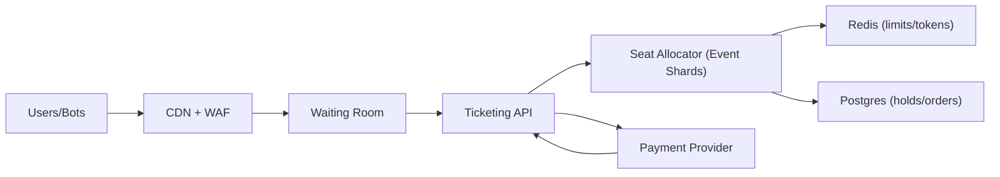

```markdown
---
title: "Ticket Reservation System"
category: "Commerce & Fintech"
difficulty: "Hard"
tags: ["ticketing", "high-contention", "consistency", "sharding", "anti-bot", "reservations"]
---

## Overview

This system allocates seats for high-demand events under extreme contention while keeping the user experience predictable: either you hold seats quickly, or you get a definitive “not available”—no ambiguous limbo. The core insight is to treat each event as a **single strongly-consistent “seat ledger” with one writer**, and scale by **sharding across events**, not by trying to make seat writes multi-writer and “distributed-locky”.

Most of the rest should be boring: Postgres is the source of truth for holds and purchases, Redis handles short-lived rate limits and tokens, and a waiting room shapes traffic so the allocator is sized for *sustained* throughput, not the first 30 seconds of a drop.

## What Makes This Hard

Naive implementations let many stateless API servers write seat state concurrently and “just use transactions”. Under a real on-sale (bots + humans), that becomes a thundering herd of conflicting updates, lock waits, deadlocks, and eventually inconsistent UX (double-sold seats, phantom availability, holds that never resolve).

The trap is that seat allocation *looks* like a database problem but is really a **contention and fairness problem**. If you don’t deliberately choose a single serialization point per event, you end up building a distributed lock manager accidentally—usually at 3am, during your biggest concert.

## Requirements

### Functional Requirements
- Place a **time-bound hold** on specific seats (or “best available” within constraints), returning a signed hold token.
- Confirm purchase using the hold token; purchase must be **idempotent** and must not oversell.
- Serve seat maps with near-real-time availability; availability can be slightly stale for reads, but **writes must be correct**.
- Enforce anti-bot/scalper controls: per-identity limits, velocity limits, queue fairness, and instrumentation for abuse.
- Provide an audit trail: who held what, when it expired, and why a purchase failed.

### Scale Targets
- On-sale peak: **200k requests/sec** at the edge, shaped to **20k seat-write ops/sec** into the allocator fleet.
- Concurrency: **1M users in waiting room**; **100k actively browsing** seat maps.
- Event size: up to **50k seats/event**; ~**10k events/day**; “hot” events dominate contention.
- Latency SLO (post-queue): **p95 hold < 250ms**, **p95 purchase < 500ms**. These matter because holds are user-visible and short TTLs amplify retry storms.

## Key Design Decisions

- **We choose:** Per-event single-writer allocation (sharded “event leaders”) that serializes seat writes.
  - **We reject:** Multi-writer seat updates with distributed locks or “just use SERIALIZABLE everywhere”.
  - **Why:** The single-writer makes correctness and UX stable under peak contention; scaling comes from event sharding, which matches real traffic (many events, a few hot).

- **We choose:** Postgres as the source of truth with explicit state machine for `seat -> held -> sold` plus idempotency keys.
  - **We reject:** Storing the authoritative seat state only in Redis (fast but fragile) or event-sourcing everything on day 1.
  - **Why:** Postgres gives durable correctness and simple recovery; Redis remains an accelerator, not a truth source.

- **We choose:** Waiting room + deterministic admission (token-based) to shape traffic and reduce bot advantage.
  - **We reject:** Letting everyone hit allocation endpoints directly and “rate limit later”.
  - **Why:** Without admission control, retries and bot bursts will drown the allocator and degrade fairness.

## Architecture



### Components

- `CDN + WAF`: Blocks obvious automation, terminates TLS, and caches static seat map assets (sections/rows geometry) so origin traffic is dominated by *availability deltas*, not SVG/JSON blobs.
- `Waiting Room`: Issues admission tokens (signed, short-lived) and meters entry per event. This is the fairness “front door” and the main tool to keep allocator throughput stable.
- `Ticketing API`: Stateless orchestration: validates admission + identity, calls allocator, handles purchase idempotency, and integrates with payment.
- `Seat Allocator (Event Shards)`: The only place allowed to mutate seat availability. Routes by `event_id` to a single leader instance per shard; maintains a hot in-memory view for fast selection and emits durable writes to Postgres.
- `Redis (limits/tokens)`: Fast checks for velocity limits, device/account quotas, token replay detection, and short-lived hold token registry (to reduce DB lookups on obviously invalid tokens).
- `Postgres (holds/orders)`: Durable state machine and audit log. Constraints ensure “no double-sell” even if upstream logic misbehaves.
- `Payment Provider`: External dependency; purchase flow is designed so payment callbacks can be retried safely without duplicating orders.

## Deep Dive: Contention-Safe Seat Allocation

The allocator runs a **single-writer loop per event**. Practically: consistent-hash `event_id` to a shard, then use a lightweight leader mechanism (etcd/consul session leases) so exactly one instance is active for that shard. All seat holds and purchases for an event are serialized through that leader. This avoids distributed locks on individual seats; the “lock” is simply “the event leader processes requests one at a time (or in a bounded batch)”.

**Hold flow (write path):**
1. API validates admission token + identity and forwards `HoldRequest(event_id, seat_ids | constraints, client_request_id)`.
2. Allocator checks in-memory availability, selects seats (or rejects).
3. Allocator writes a single Postgres transaction:
   - Insert `holds(hold_id, event_id, user_id, expires_at, request_id)` with `UNIQUE(user_id, request_id)` for idempotency.
   - Insert `held_seats(event_id, seat_id, hold_id)` with `UNIQUE(event_id, seat_id)` so a seat can only be held once.
4. Allocator returns a **signed hold token** containing `hold_id`, `event_id`, `expires_at`, and a nonce.
5. Expiry is enforced by time: holds past `expires_at` are treated as invalid; a background reaper updates state and frees seats (but correctness does not depend on the reaper being perfectly punctual).

The critical point is that correctness is achieved by **(a) event-level serialization** for performance and **(b) database uniqueness constraints** as the last line of defense. If two requests ever race (due to failover or retry), Postgres rejects the second claim on `(event_id, seat_id)` and the allocator returns a clean “seat not available” without corrupting state.

**Purchase flow (commit path):**
- Purchase is idempotent via `UNIQUE(order_request_id)` and transitions held seats to sold in a transaction that verifies:
  - hold exists, not expired, belongs to user, and seats match.
  - seats are still linked to that hold.
- Payment is handled as a two-step commit:
  - Create `order` in `PENDING_PAYMENT` with the held seats reserved.
  - On payment confirmation callback, transition to `PAID` and mark seats `SOLD`.
This isolates the allocator from payment latency while preserving a single authoritative outcome per `order_request_id`.

**Serving seat maps without melting the allocator:**
- Static geometry (sections/rows/seat coordinates) is CDN-cached.
- Dynamic availability is served as compact deltas (e.g., sold/held bitsets per section) pulled from allocator’s in-memory view, refreshed from Postgres on startup and periodically reconciled.
- Under extreme load, degrade gracefully: disable arbitrary seat picking and offer “best available” (same correctness, far less combinatorial scanning).

## Trade-offs

| Optimized For | Sacrificed |
|--------------|------------|
| Correctness under peak contention | Some per-event throughput ceiling (by design) |
| Predictable UX (fast yes/no) | Perfectly real-time availability reads everywhere |
| Simple recovery (DB truth) | Cross-event transactions (intentionally avoided) |
| Operability for small team | Maximum hardware efficiency at microsecond level |

## Failure Modes

- **Allocator leader dies mid-onsale**
  - **What happens:** Requests for affected events briefly fail or queue; holds/purchases may be retried.
  - **Detect:** Missing shard lease heartbeat; spike in allocator 5xx; increased API timeouts for specific `event_id`.
  - **Recover:** New leader acquires lease, warms in-memory state from Postgres (holds + sold), resumes; idempotency keys prevent duplicate outcomes.

- **Redis outage / eviction**
  - **What happens:** Rate limits and token replay detection degrade; more junk reaches API/allocator.
  - **Detect:** Redis error rate, increased WAF pass-through, elevated allocator CPU.
  - **Recover:** Fail open for non-critical checks but tighten waiting room admission; rely on Postgres constraints for correctness; restore Redis and re-enable strict limits.

- **Payment provider latency / webhook storms**
  - **What happens:** Many orders stuck in `PENDING_PAYMENT`; users retry purchase.
  - **Detect:** Growing pending orders, webhook retry counts, elevated purchase retries.
  - **Recover:** Purchase remains idempotent; seats stay reserved to the hold/order until TTL; surface clear UI timers; reconcile webhooks via periodic polling job for “unknown” payments.

## What I'd Do Differently At...

- **10x scale:** Split allocator shards more finely (more leaders), move availability deltas to a dedicated read path (materialized bitsets per section), and implement a stricter admission algorithm per event to keep write QPS flat.
- **100x scale:** Move from Postgres-centric writes to a log-based seat ledger per event (append-only + compaction) with Postgres as derived state, because the hottest events will outgrow single-node write IOPS even with sharding.

## Operational Notes

- Keep the “event leader” mapping visible: an on-call should be able to answer “which instance owns event 123?” in one command.
- Alert on **per-event** metrics, not just global: hottest events hide inside averages.
- Treat “retry storms” as a first-class incident: cap client retries, return explicit backoff headers, and let the waiting room absorb surges.
- Always prefer correctness over availability on writes: a clean “try again” is better than a double-sold seat you can’t unwind cleanly.
```