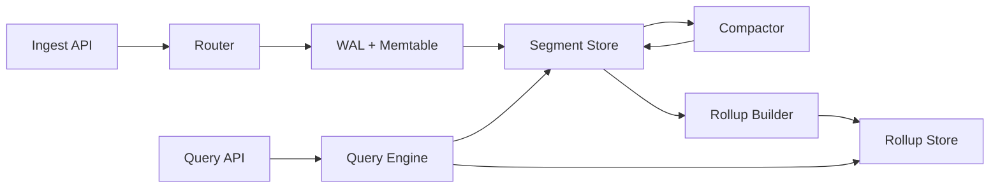

```markdown
---
title: "Time-Series Database"
category: "Storage & Data Platforms"
difficulty: "Hard"
tags: ["tsdb", "storage-engine", "lsm", "compaction", "rollups", "retention", "iot", "metrics"]
---

## Overview

This system is a distributed time-series database optimized for “append-mostly” telemetry: very high write throughput, time-bounded reads, fast aggregations, and predictable retention. The key insight is to **treat time as the primary physical layout constraint**: store data in immutable, time-partitioned segments so retention becomes a metadata operation (drop whole segments), and downsampling becomes a controlled rewrite of already-ordered data rather than a query-time tax.

Most teams get stuck trying to satisfy three goals at once—write speed, query speed, and rollups—using a single layout. The elegant approach is to separate concerns: **raw data optimized for ingest + range scans**, **rollup data optimized for aggregates**, and a **small metadata/index layer** that makes both cheap without storing tags on every point.

## What Makes This Hard

Naive implementations die from **write amplification and cardinality**. If you “just index everything” (tags, timestamps, fields) you either destroy ingest (too many random writes) or destroy storage (too much overhead per point). If you “just append logs,” queries require scanning too much data and rollups become expensive full scans.

The trap: retention and downsampling look like “policy features,” but they are **storage-engine features**. If you can’t delete in big chunks and you can’t compact predictably, you’ll end up with compaction debt, spiky latency, and on-call pain.

## Requirements

### Functional Requirements
- Ingest time-series points with tags/labels, timestamp, and numeric fields.
- Query by time range + tag filters; support common aggregates (sum/avg/min/max/p95) and group-by tag(s).
- Continuous downsampling into fixed windows (e.g., 1m, 1h) with multiple retention tiers (e.g., 7d raw, 90d 1m, 2y 1h).
- Exactly-once is not required; **idempotent ingest** and bounded duplication is acceptable.
- Backfill support (late/out-of-order points) within a bounded window.

### Scale Targets
- **Ingest:** 1,000,000 points/sec sustained, 3,000,000 points/sec burst (IoT fleets and scrape storms).
- **Cardinality:** 50,000,000 active series (metrics-style labels) with daily churn.
- **Queries:** P95 < 2s for “last 6h, filter by 2 tags, group-by 1 tag”; P95 < 5s for “last 7d rollup”.
- These numbers matter because they force: sequential writes, bounded index work per point, retention-by-drop, and rollups that don’t contend with ingest.

## Key Design Decisions

- **We chose:** Time-partitioned LSM-style storage with immutable segment files (SSTables) per shard and time window.
  - **We rejected:** B-tree / per-point updates, and “single huge log + query-time scan.”
  - **Why:** Sequential ingest + predictable compaction; retention becomes dropping whole segment directories.

- **We chose:** Series-ID indirection with a tag inverted index (tags → series IDs) and series dictionary (series key → series ID).
  - **We rejected:** Storing full tagsets on every point or building per-tag/time secondary indexes.
  - **Why:** Tags are high-entropy and repetitive; the only scalable approach is to pay the tag cost once per series, not per point.

- **We chose:** Rollups as first-class materialized streams (raw → rollup1m → rollup1h) stored separately with their own retention.
  - **We rejected:** Query-time downsampling and “rollups via ad-hoc batch jobs over raw.”
  - **Why:** Query-time downsampling is the silent killer of p95 latency; rollup computation must be incremental and bounded.

## Architecture



### Components

- `Ingest API`: Validates writes, normalizes tag order, enforces limits (max tags, max series per tenant) to prevent cardinality explosions.
- `Router`: Maps each point to a shard (hash(series_id) + time partition) and routes to the correct storage node(s); keeps ingest stateless.
- `WAL + Memtable`: WAL provides crash safety; memtable buffers sorted (series_id, timestamp) entries for efficient flush.
- `Segment Store`: Immutable segment files grouped by time window (e.g., 2h) and shard; stores compressed blocks and sparse indexes.
- `Compactor`: Merges overlapping segments, reclaims space, and enforces a bounded out-of-order window.
- `Rollup Builder`: Consumes compacted raw segments and produces fixed-window aggregates into dedicated rollup segments.
- `Rollup Store`: Physically separate namespace and retention policy; optimized for aggregate queries (fewer points, wider read).
- `Query Engine`: Plans queries by first resolving tag filters to series IDs, then performing time-range scans with predicate pushdown and aggregate execution.

## Deep Dive: The Hardest Part — Compaction That Doesn’t Kill Ingest

The core problem is this: ingest wants **append-only sequential IO**, while queries and retention want data organized for **fast range scans and bulk deletion**. LSM compaction is the bridge—but it’s also where TSDBs fail in production. If compaction falls behind, disk fills, read amplification explodes, and latency spikes exactly when traffic is highest.

This design keeps compaction predictable by making time a hard boundary. Each shard writes segments for fixed time windows (e.g., 2h). Within a window, the key is `(series_id, timestamp)`, enabling high compression and fast per-series scans. Compaction is constrained to:
1) merging a small set of segments within the same time window, and
2) a bounded “late data” horizon (e.g., allow out-of-order up to 30 minutes, after which late points are redirected to a small “late segment” that is compacted separately).

The compactor runs with explicit budgets: max IO per second, max concurrent merges, and priority based on “read amplification” and “disk pressure.” It never competes with the WAL path: WAL fsync and memtable flush have reserved IO and CPU. Practically, that means separate threadpools and an IO scheduler policy that favors small, latency-sensitive writes over bulk merges.

Rollups integrate cleanly by consuming **compacted** segments, not raw memtables. That’s the non-obvious win: rollup builders see stable, ordered data, so they can compute window aggregates with streaming scans and write their own immutable rollup segments. This avoids both double-counting (from partial compaction) and expensive reprocessing.

## Trade-offs

| Optimized For | Sacrificed |
|--------------|------------|
| Sustained ingest throughput | Complex compaction subsystem |
| Predictable retention cost (drop segments) | Less efficient for point updates/deletes |
| Fast time-range scans + aggregates | Extra storage for rollups |
| High-cardinality tag filters | Inverted index memory/disk overhead |

## Failure Modes

- **Compaction debt → disk pressure**
  - **What happens:** Segment count grows, reads touch more files, disk fills; ingest starts failing.
  - **Detect:** Compaction queue length, read amplification (files touched per query), disk watermark alerts.
  - **Recover:** Throttle ingest per tenant, temporarily pause rollups, increase compaction IO budget, add nodes and rebalance shards, then compact hottest windows first.

- **Cardinality explosion (tag abuse)**
  - **What happens:** Series dictionary and inverted index balloon; memory churn and GC spikes; query fanout becomes unbounded.
  - **Detect:** New series/sec, active series count per tenant, top-K tag values by new-series creation.
  - **Recover:** Enforce hard tenant limits, reject writes with high-entropy tags, require allowlisted tag keys, and offer a “drop/normalize tag” ingest rule.

- **Hot shard / uneven routing**
  - **What happens:** A small subset of series dominates ingest; one node becomes WAL/CPU bound.
  - **Detect:** Per-shard ingest rate and WAL fsync latency; router histogram of shard load.
  - **Recover:** Increase shard count, rebalance shard ownership, add a “salt” mechanism for known-hot series, and isolate noisy tenants.

## What I'd Do Differently At...

- **10x scale:** Move the inverted index to a dedicated service with memory-optimized structures and snapshotting; introduce query fanout limits and precomputed “popular” aggregates.
- **100x scale:** Split storage into hot-local + cold-object-store with remote segment reads; add multi-region ingest with local durability and asynchronous replication; redesign metadata to tolerate massive series churn (log-structured metadata + aggressive TTL).

## Operational Notes

- Compaction is the heartbeat: page on compaction lag and disk-watermark, not just CPU.
- Set explicit SLO budgets for “late data” and enforce them; unbounded out-of-order points are a stealth DoS.
- Keep rollup pipelines observable as first-class citizens: lag, window completeness, and duplicate detection.
- Capacity planning is driven by: points/sec, compression ratio, segment size, and compaction write amplification—track all four continuously.
```