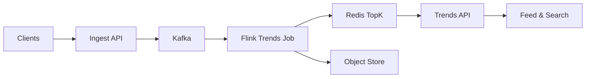

```markdown
---
title: "Trending Topics Engine"
category: "Social & Discovery"
difficulty: "Hard"
tags: ["stream-processing", "heavy-hitters", "sliding-windows", "flink", "kafka", "realtime-analytics"]
---

## Overview

This system identifies *surging* keywords in real time from a firehose of posts, comments, and searches. The elegant trick is to **separate “finding candidates” from “measuring surge”**: use a heavy-hitter algorithm to keep the candidate set small, then compute accurate sliding-window surge scores only for those candidates.

Naive designs try to maintain per-keyword windowed counts for the entire vocabulary. That explodes state (millions of keywords × many window buckets), melts RocksDB, and still produces junk trends because “popular” is not “surging.” This design stays boring everywhere (Kafka + Flink + RocksDB + Redis) and spends complexity only where it pays off: **approximate discovery + exact scoring for a small set**.

## What Makes This Hard

The trap is treating “trending” as “top counts in the last N minutes.” That yields stable head terms (“news”, “sports”) and misses sudden spikes. Real trending needs **a baseline** and a **surge function** (ratio / delta / z-score) over *sliding* windows.

The second trap is state: sliding windows tempt you into per-term ring buffers for all terms. At real scale, the long tail dwarfs the head, and you end up building an expensive distributed key-value store inside your stream processor.

## Requirements

### Functional Requirements
- Identify surging keywords in near real time across multiple windows (e.g., 1m, 5m, 1h sliding).
- Rank by “surge” (not raw volume) with a defensible formula and predictable behavior under bursty traffic.
- Handle out-of-order events using event time; late events are reflected for a bounded lateness.
- Provide an API that returns top trends per scope: global, locale, and topic cluster (optional taxonomy is a separate problem).
- Produce stable results: avoid flip-flopping rank due to tiny count changes.

### Scale Targets
- Ingest: 200k events/sec peak (posts, comments, searches), 50k/sec sustained.
- Unique keywords/day: 50–200M; active keywords/minute: 2–10M (long tail dominates).
- Latency: p95 < 2s from event ingest to trend update; p99 < 5s during spikes.
- Windows: 1m and 5m are primary (product-facing); 1h supports “what’s rising today.”
Why these numbers matter: 200k/sec makes “store per keyword per bucket” infeasible; the solution must keep per-event work O(1) and per-key state bounded.

## Key Design Decisions

- **Two-stage pipeline (candidate discovery → exact scoring)**
  - Chose: heavy-hitter discovery to produce ~10k–50k candidates/minute, then exact sliding-window counts only for candidates.
  - Rejected: exact window counts for all keywords.
  - Why: makes sliding-window surge tractable while preserving quality.

- **Event-time processing with bounded lateness**
  - Chose: Flink event-time windows with watermarks; accept lateness up to 30s (product-tunable).
  - Rejected: processing-time windows.
  - Why: trending breaks if mobile clients deliver late or if ingest retries reorder events.

- **Surge score based on ratio + smoothing**
  - Chose: a smoothed ratio vs baseline with a minimum support threshold:
    - `score = log((c_now + k) / (c_base + k)) * sqrt(c_now)`
  - Rejected: pure ratio (too noisy for small counts) and pure delta (biases high-volume terms).
  - Why: ratio captures “surge,” sqrt support dampens tiny-sample explosions, `k` stabilizes cold starts.

## Architecture



### Components

- **Ingest API**
  - Normalizes events (timestamp, locale, user id, text), applies basic abuse throttles, and publishes to Kafka with a stable partition key (e.g., locale + hash(keyword)).
  - Earns its place by preventing downstream from being the first line of defense.

- **Kafka**
  - The shock absorber and replay log. Trends is inherently “recomputable,” so Kafka is the correct source of truth.

- **Flink Trends Job**
  - Maintains the heavy-hitter structure, produces candidate sets, computes sliding-window counts for candidates, and emits ranked trend lists per scope (global/locale).
  - Uses RocksDB state backend + checkpoints to Object Store.

- **Redis TopK**
  - Serves the latest ranked lists with low latency (sorted sets per scope/window).
  - This is a cache of computed truth; recomputation comes from Kafka.

- **Trends API**
  - Simple read-only service: fetches precomputed lists from Redis, applies presentation rules (blacklists, de-dup, “topic grouping” if available).

- **Object Store**
  - Stores Flink checkpoints/savepoints for fast recovery and safe deploys.

## Deep Dive: Sliding Windows + Heavy Hitters Without Exploding State

The core problem is: “Find top surging keywords over a sliding window when the keyspace is unbounded.” The key insight is to avoid tracking the full keyspace with windowed state. Instead:

1) **Discover candidates with a bounded-memory heavy-hitter algorithm**
- Per scope (e.g., locale) and per short time slice (e.g., 10s), maintain a **Space-Saving** summary of size `M` (e.g., 20k entries).
- Space-Saving gives you an explicit set of tracked keys and an error bound; it’s practical to maintain in RocksDB and update in O(1).

2) **Promote candidates into an “exact scoring set”**
- Every slice, emit the top `N` keys from Space-Saving (e.g., 5k) as *candidates* for that scope.
- Maintain a TTL’d candidate registry in Flink state: a keyword stays “active” for scoring for, say, 30 minutes after last appearing as a candidate. This prevents thrash.

3) **Compute exact sliding-window counts only for active candidates**
- For each active candidate, keep a compact ring buffer of counts per small bucket (e.g., 5s buckets over 5m → 60 integers).
- Update is O(1): compute bucket index from event-time, increment bucket.
- For scoring, sum the last `W` seconds for `c_now` and the preceding window for `c_base`, both from the ring buffer; apply the surge formula.
- Result: exact window math for a bounded set, not for millions of terms.

4) **Make results stable and defensible**
- Enforce minimum support (e.g., `c_now >= 50` per 5m) to block “1 → 5 events” noise.
- Apply hysteresis on publishing: a term must stay above a score threshold for two consecutive evaluations to enter the list, and drop below a lower threshold to leave. This removes rank flicker without hiding real spikes.

Why this works operationally: Space-Saving adapts to traffic spikes and evolving vocab, while the TTL’d candidate registry ensures we only allocate ring buffers for terms that matter. The system spends memory proportional to “interesting terms,” not “all terms.”

## Trade-offs

| Optimized For | Sacrificed |
|--------------|------------|
| Low-latency, real-time updates | Perfect recall of every possible spike |
| Bounded state and predictable cost | Some approximation in candidate discovery |
| Event-time correctness | Added complexity (watermarks, late events) |
| Simple serving path (precomputed lists) | Less flexibility for ad-hoc queries |

## Failure Modes

- **Kafka lag spike (downstream can’t keep up)**
  - What happens: trend updates become stale; watermarks stop advancing.
  - Detect: consumer lag + watermark age alarms.
  - Recover: temporarily reduce candidate `N` and increase evaluation interval; scale Flink task slots; reprocess catches up automatically.

- **State blow-up from candidate churn**
  - What happens: too many candidates promoted; RocksDB grows; checkpoints slow.
  - Detect: candidate-set cardinality, RocksDB size, checkpoint duration.
  - Recover: tighten promotion (`N`), shorten candidate TTL, enforce per-scope candidate caps with LRU eviction.

- **Hot partitions from skewed keywords (e.g., one viral term)**
  - What happens: one Flink subtask becomes CPU bound; latency increases.
  - Detect: per-subtask busy time and backpressure metrics.
  - Recover: split processing by scope first (locale shard), then by keyword hash; ensure keying avoids single-key dominance in the scoring stage by aggregating counts with local pre-aggregation.

## What I'd Do Differently At...

- **10x scale:** introduce hierarchical aggregation (local pre-agg → global merge) and move candidate discovery to a dedicated first-stage job to reduce contention with exact scoring; tune RocksDB (bloom filters, compaction) and checkpointing.
- **100x scale:** make it multi-region with region-level trends computed locally and merged globally; serving becomes “regional truth + global overlay.” Candidate discovery becomes fully hierarchical to avoid shipping huge vocab across regions.

## Operational Notes

- Tune watermarks with real data: lateness is a product decision; too small loses mobile events, too large delays trends.
- Treat Redis as disposable: if it’s wiped, Flink repopulates from Kafka; keep TTLs on keys to avoid stale lists.
- Checkpoint health is the canary: alert on checkpoint duration and failure rate; if checkpoints fail, you don’t have recovery.
- Keep an explicit allow/deny list pipeline outside the core job (policy changes should not require redeploying Flink).
```