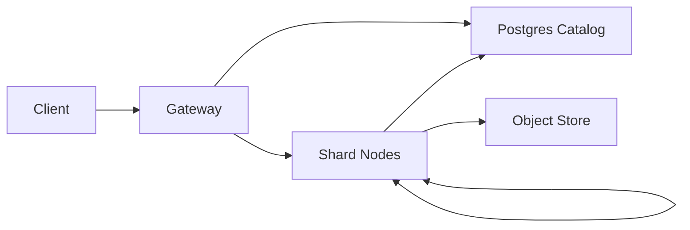

```markdown
---
title: "Vector Database"
category: "Storage & Data Platforms"
difficulty: "Hard"
tags: ["vector-search", "ann", "hnsw", "filters", "lsm", "rocksdb", "s3"]
---

## Overview

A vector database is a storage engine for embeddings that supports fast approximate nearest neighbor (ANN) search plus a small set of practical filters (tenant/namespace, tags, time). The core idea is an LSM shape: immutable index segments on disk, plus background compaction. Queries search a bounded number of segments and merge top‑k.

The hot path stays boring: append-only WAL, flush immutable segments, compact to pay down update/delete debt. The only “hard” parts are filter-aware candidate generation and keeping segment fanout bounded.

## What Makes This Hard

Naive systems die on two issues:

1) **Updates + deletes + recall**: HNSW/IVF indexes are great for static corpora, but continuous upserts and deletes degrade graph quality, explode memory, or force frequent rebuilds. Teams either accept silent recall loss or end up rebuilding giant indexes too often.

2) **Filtering without killing latency**: “ANN + filters” is not “ANN then filter.” If the filter is selective (e.g., tenant + tags + time), naive approaches waste most work retrieving candidates that will be discarded, causing unpredictable p95/p99.

## Requirements

### Functional Requirements
- `Upsert(id, vector, metadata)` with last-write-wins semantics per `(collection, id)`.
- `Delete(id)` that becomes effective quickly (seconds), without full index rebuild.
- `Search(vector, k, filter)` where filters include:
  - equality on low-cardinality fields (tenant, namespace)
  - set membership (tags)
  - numeric range (timestamp, price)
- Optional: return stored payloads (or external references), not just IDs.
- Multi-tenant isolation: no cross-tenant leakage, predictable noisy-neighbor behavior.

### Scale Targets
- Vectors: **500M** vectors total across cluster.
- Dimensionality: **768 float32** (≈ 3KB/vector raw); storage must not be raw-only.
- Write rate: **50k upserts/s** peak (batch-friendly).
- Read rate: **10k queries/s** peak, `k=20`, `p95 < 120ms`, `p99 < 250ms`.
- Filters: 80% of queries include `tenant` + 1–2 additional predicates; worst-case selectivity can be <0.1%.

## Key Design Decisions

- **Segmented (LSM-style) vector index**
  - Chose: immutable index segments + background compaction.
  - Rejected: single mutable global HNSW graph per shard.
  - Why: predictable writes, fast “deletes” via tombstones, and no catastrophic online rebuilds.

- **HNSW for candidate generation + exact rerank**
  - Chose: HNSW per segment to retrieve candidates; rerank with exact distance on original (or higher-precision) vectors.
  - Rejected: pure PQ-only retrieval for everything.
  - Why: HNSW gives strong recall/latency trade-offs; rerank makes results stable despite quantization.

- **Filter-aware retrieval via per-segment bitmap indexes**
  - Chose: per-segment inverted/bitmap indexes for filterable fields; integrate filtering into ANN expansion.
  - Rejected: “ANN first, SQL-style filter later.”
  - Why: makes selective filters cheap and turns worst-case latency into an engineered knob (candidate budget).

## Architecture



### Components

- `Gateway`: a thin stateless API that handles ingest + search, routes by `(collection, tenant)` to shard replicas, enforces timeouts, and merges top‑k.
- `Shard Nodes`: store segments on local disk and serve search from local mmap; also own WAL, flushing, compaction, and replication for their shard.
- `Postgres Catalog`: the single control plane for shard map + leases (advisory locks) + collection config; gateways/shards run on cached last-known-good when it’s unreachable.
- `Object Store`: durable blob store for segment snapshots/manifests; used for bootstrap/rehydration and auditability, not for on-demand reads during queries.

## Deep Dive: Filtered ANN Without Latency Spikes

The key trick: **make filtering a first-class constraint during candidate generation**, not an afterthought.

**Data layout per segment**
- Vectors stored as:
  - a quantized representation for fast coarse scoring (e.g., OPQ+PQ codes), and
  - a higher-precision store for exact rerank (float16 or float32, depending on cost/accuracy).
- Filters stored as:
  - dictionary-encoded columns for metadata, and
  - bitmap/inverted indexes per indexed field:
    - low-cardinality equality: Roaring bitmap per value
    - tags: inverted list -> Roaring bitmap
    - numeric ranges: coarse bucket bitmaps + per-candidate exact check
- Liveness stored as:
  - a per-segment `live_docs` bitset (mutable overlay) that hides deleted/updated rows without per-candidate KV lookups.

**Query execution**
1) **Build an “allowed set” bitmap** per segment from the filter expression:
   - `allowed = tenant_bitmap AND tag_bitmap AND time_bucket_bitmap ...`
2) **HNSW search with gated expansions**:
   - when exploring neighbors, discard nodes not in `allowed` immediately.
   - maintain a target of `candidate_budget = alpha * k` (e.g., 200 for k=20); stop when budget is satisfied and score frontier is “cold.”
3) **Exact rerank**:
   - fetch original vectors for the candidate set only, compute exact distance, return top‑k.

**Why this works**
- For selective filters, `allowed` becomes small, so the gated HNSW walk quickly “falls through” to the subset without wasting most expansions.
- For non-selective filters, the gating overhead is minimal (bitmap membership checks) and you behave like normal HNSW.

**Edge cases**
- If `allowed` is extremely small, HNSW connectivity might be poor. The fix is deterministic: fall back to a **filter-first scan** over `allowed` when `|allowed| < threshold` (e.g., 50k) using PQ coarse scoring then exact rerank. This is not “slow path”; it’s a controlled path with predictable cost.
- Updates/deletes: the shard assigns a per-shard monotonic `seqno` and records it in the WAL; updates/deletes flip `live_docs` bits for older rows and write a tiny `id -> (seqno, rowref)` map (embedded KV) so last-write-wins is deterministic under retries.

**Durability**
- Each shard has a leader + followers. The leader acks an upsert after its WAL is fsynced locally and replicated+fsynced on at least one follower; segment files replicate the same way.

## Trade-offs

| Optimized For | Sacrificed |
|--------------|------------|
| Predictable write performance via immutable segments | Extra read amplification (search multiple segments) |
| Fast deletes via tombstones | Background compaction complexity |
| Filtered query stability (bounded candidate budgets) | More index/storage overhead (bitmaps + dual vector representations) |
| Simple bootstrap via object store snapshots | No “query from object store” fallback if local is missing |

## Failure Modes

- **Compaction falls behind**
  - What happens: too many segments per shard; read amplification rises; tail latency drifts.
  - Detect: segments searched per query, compaction debt, WAL backlog, local disk pressure.
  - Recover: hard-cap segments searched (bounded work), throttle ingest, and run leveled compaction to a target segment size.

- **Hot tenant causes noisy neighbors**
  - What happens: cache thrash and CPU saturation on shared shards.
  - Detect: per-tenant QPS/CPU attribution, router-level tail latency by tenant.
  - Recover: isolate tenant to dedicated shard set (placement rule), apply per-tenant concurrency limits at router.

- **Catalog unavailable (Postgres down / partition)**
  - What happens: placement changes and failover stop; steady-state read/write continues on last-known-good shard leaders until leases expire.
  - Detect: failed lease renewals, rising “catalog stale” age.
  - Recover: gateways/shards serve from cached shard map/config for a bounded window; after that window, prefer unavailability over split-brain (reject writes and only serve reads from local leader epoch).

- **Object store slow/down**
  - What happens: segment uploads and bootstrap downloads stall; queries remain unaffected because shards serve from local disk.
  - Detect: upload queue depth, manifest lag, local disk headroom.
  - Recover: keep serving; throttle ingest when local disk watermark is hit; resume uploads when the store recovers.

- **High-cardinality ACL-like filters**
  - What happens: bitmap indexes blow up or become CPU-heavy.
  - Detect: per-field index size, filter build time, selectivity histograms.
  - Recover: treat ACL as an application concern (resolve to tenant/namespace/tags); the vector DB indexes only low-cardinality equality, tag sets, and numeric ranges.

## What We Removed

- Separate `Ingest API` and `Segment Builder` services; shard nodes ingest, WAL, flush, and compact for their own shard.
- `etcd` control plane; the catalog is Postgres-only (shard map + leases + config).
- Object store reads on the query path; shards serve only from local segments.
- Per-candidate KV lookups during search; `live_docs` hides stale rows inside the segment.
- Per-user ACL filters; filtering stays in the “indexes well” set (tenant/namespace, tags, ranges).

## Operational Notes

- Keep `candidate_budget` and `max_segments_searched` as first-class knobs; they define bounded work under load.
- Shards serve from local disk/mmap; placement changes prefetch segments before shifting traffic.
- Segment manifests use content hashes; downloads are verify-then-activate.
```
