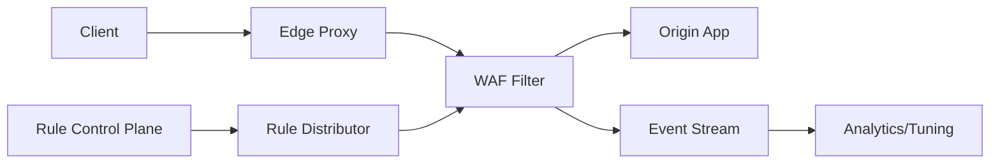

```markdown
---
title: "Web Application Firewall (WAF)"
category: "Security & Access Control"
difficulty: "Hard"
tags: [security, edge, waf, http, ddos, rules, observability]
---

## Overview

This system is an **edge WAF** that sits in front of web applications and blocks SQL injection, XSS, and malicious payloads **at line speed** without becoming the bottleneck. The key insight is to treat the WAF as a **deterministic, precompiled packet of logic** running in the data plane, and push all complexity—rule authoring, tuning, rollout safety, and analytics—into a separate control plane.

Most WAF attempts fail by mixing the two: they run heavy parsing and dynamic policy decisions inline, then “fix” latency with caching and exceptions until the WAF becomes a patchwork. This design keeps the data plane boring: strict resource caps, streaming parsing, bounded-time matching, and a small set of actions (allow/block/challenge/log).

## What Makes This Hard

Naive implementations get trapped in a three-way trade-off:

1. **Accuracy vs. latency:** Deep inspection and complex regex rules catch more attacks but explode CPU and tail latency under load.
2. **False positives vs. safety:** Over-blocking breaks real users; under-blocking leaves gaps. Teams end up shipping rules blindly because they lack feedback loops.
3. **Operational safety at the edge:** A bad ruleset rollout can take down *every* property globally faster than any application deploy.

The hard part is not “detect SQLi/XSS”; it’s **doing it deterministically under adversarial input** (regex bombs, giant headers, chunked bodies) while maintaining **safe, observable rule evolution**.

## Requirements

### Functional Requirements
- Detect and block common injection classes (SQLi, XSS, command injection, path traversal) across URL, headers, cookies, query params, and common body formats.
- Support **actions**: `ALLOW`, `BLOCK`, `CHALLENGE` (e.g., CAPTCHA/JS), `LOG_ONLY`.
- Support **per-route policy** (e.g., stricter on `/login`, looser on `/search`) without per-request DB lookups.
- Provide **shadow mode** and explainability: for a blocked request, identify rule(s) and matched locations.
- Provide **safe rollout**: canary, staged POP rollout, instant rollback.

### Scale Targets
- **Traffic:** 1M requests/sec aggregate; 50k RPS burst per POP. This is the regime where tail latency and CPU spikes define user experience.
- **Latency budget:** +2 ms p99 added by WAF at the edge. Anything higher becomes noticeable and forces teams to bypass protection.
- **Payload limits:** Up to 32 KB headers, 1 MB body (configurable per route). Hard caps prevent adversarial “slow parse” attacks.
- **Ruleset size:** 10k–50k signatures + heuristics. Large enough to be useful; small enough to keep matching predictable.

## Key Design Decisions

- **Choose: deterministic data plane with precompiled rules**
  - Rejected: dynamic rule evaluation via database calls or scripting per request
  - Why: bounded execution time is the only reliable defense under adversarial input.

- **Choose: streaming HTTP parsing + bounded body inspection**
  - Rejected: buffering entire requests for “full” inspection
  - Why: buffering creates a memory DoS vector and increases latency under chunked uploads.

- **Choose: control-plane-driven rollouts with shadow + canary**
  - Rejected: “push rules everywhere” or manual POP changes
  - Why: rules are code; unsafe rollout is a global outage waiting to happen.

## Architecture



### Components

- **Edge Proxy**
  - Terminates TLS, normalizes HTTP (canonicalization), and enforces hard limits (header size, URL length, body size, timeouts). This is where many attacks become cheap to stop.

- **WAF Filter (Data Plane)**
  - Runs inline in the proxy request path.
  - Implements: request normalization, signature matching, anomaly scoring, and action enforcement.
  - Uses only local memory and preloaded rule artifacts; no network calls.

- **Origin App**
  - Receives already-scrubbed traffic. The WAF is additive security, not a substitute for secure coding.

- **Event Stream**
  - Asynchronous security telemetry (sampled for allows, full for blocks/challenges) for tuning and incident response.

- **Rule Control Plane**
  - UI/API for rule authoring, exemptions, per-route policy, and rollout workflows.
  - Produces a signed, versioned ruleset artifact.

- **Rule Distributor**
  - Distributes artifacts to POPs, supports staged rollout, health checks, and instant rollback by version pinning.

- **Analytics/Tuning**
  - Aggregates matches, false-positive reports, and origin error correlations to drive rule improvements.

## Deep Dive: Line-Speed Detection Without Regex DoS

The core engineering problem is: **match lots of attack patterns on hostile input with a strict time budget**.

### 1) Canonicalization first, or rules are useless
Attackers win when the WAF and the origin parse differently. The data plane performs a strict normalization pass:
- Percent-decoding with limits (reject over-decode depth)
- Path normalization (`/a/../b` → `/b`) with strict RFC behavior
- Header and cookie parsing with bounded field counts and sizes
- UTF-8 validation; invalid encodings become immediate block signals

This makes matching predictable and reduces “bypass by encoding”.

### 2) Two-tier matching: cheap first, expensive rarely
All rules are compiled into bounded-time primitives:
- **Aho–Corasick** (or similar) for large sets of fixed substrings (fast multi-pattern scan).
- **RE2-style regex** only (no catastrophic backtracking). Regex is reserved for cases that genuinely need it, and is capped by input length.
- **Anomaly scoring**: individual weak signals add up; one shaky match doesn’t block by itself.

The filter runs:
1. **Cheap scans** on URL + headers + cookies (almost always enough for common attacks).
2. **Conditional body inspection** only for routes/content-types that accept user input and only up to a configured byte budget (e.g., first 64 KB of decoded fields).

### 3) Streaming body inspection with hard caps
The WAF never needs the full body to catch most real attacks, but it must not be blind:
- For `application/x-www-form-urlencoded` and `application/json`, parse incrementally and scan decoded values.
- Stop inspecting after the route’s inspection budget; continue forwarding the stream.
- If a match requires bytes beyond the budget, that’s a deliberate trade-off: the system favors availability and predictable latency.

### 4) Rollout safety is part of the detection design
Every rule is shipped with:
- **Mode** (`LOG_ONLY` → `BLOCK`)
- **Scope** (routes, methods, content-types)
- **Confidence** (used for anomaly scoring)
Rules move through a workflow: shadow → canary POPs → regional → global, with automated guardrails (block-rate deltas, origin error deltas). This is how you avoid “a ruleset update broke checkout worldwide”.

## Trade-offs

| Optimized For | Sacrificed |
|--------------|------------|
| Predictable latency under attack | Full deep-packet inspection of huge bodies |
| Safe, fast rollouts and rollback | “One-off” custom logic in the request path |
| Low operational complexity in data plane | Some detection sophistication moves to tuning/analytics |
| Consistent parsing across edge | Perfect fidelity to every origin framework quirk |

## Failure Modes

- **Bad ruleset blocks legitimate traffic**
  - What happens: sudden spikes in `BLOCK` on critical routes (login/checkout).
  - Detect: block-rate anomaly + correlated origin revenue/errors + user reports.
  - Recover: instant rollback by ruleset version pin; keep per-route emergency bypass token that downgrades to `LOG_ONLY`.

- **CPU saturation at POP during attack (tail latency blowup)**
  - What happens: proxy queues grow, p99 latency climbs, timeouts.
  - Detect: WAF CPU per request, queue depth, p99 per-route, dropped connections.
  - Recover: shed expensive work first (disable body inspection on low-risk routes), enforce stricter limits, increase challenges, then scale out.

- **Parsing differential causes bypass**
  - What happens: edge allows traffic that the origin interprets differently.
  - Detect: exploit reports, WAF/origin mismatch signatures, unusual 4xx/5xx patterns.
  - Recover: patch canonicalization, add regression tests with real framework parsers, ship fix as a high-priority ruleset + binary rollout.

## What I'd Do Differently At...

- **10x scale:**
  - Add POP-local reputation caches (hot IPs, JA3/JA4 fingerprints) and tighter adaptive challenges to cut load before deep inspection.
  - Increase automated tuning: promote rules from shadow to block based on measured false-positive rates.

- **100x scale:**
  - Split the WAF into two layers: ultra-cheap L7 gate (limits, reputation, bot/challenge) and a selective deep inspection tier for only suspicious traffic.
  - Invest in formal parser compatibility testing across common origin stacks; bypass-by-parsing becomes the dominant class of failures.

## Operational Notes

- Shadow mode is non-negotiable: run new rules as `LOG_ONLY` first and require block-rate and origin-error gates before promotion.
- Maintain strict per-route inspection budgets; the fastest WAF is the one that refuses to do unbounded work.
- Log with privacy in mind: store structured match metadata, not raw payloads, and sample allows aggressively.
- Keep an emergency “break-glass” config path that can downgrade to `ALLOW + LOG` globally when the control plane is impaired.
```