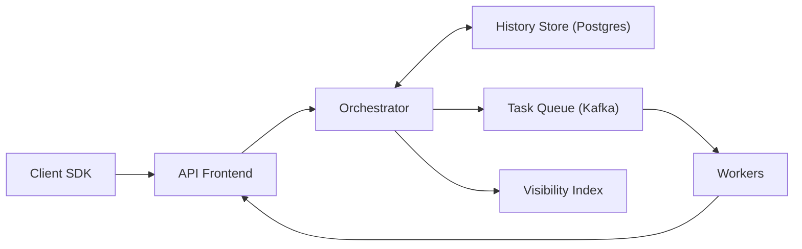

```markdown
---
title: "Workflow Orchestration Engine"
category: "Foundational Infrastructure"
difficulty: "Hard"
tags: [workflow, orchestration, temporal, durable-state, event-sourcing, exactly-once, distributed-systems]
---

## Overview

This system is a Temporal-like workflow engine for coordinating long-running business processes (minutes to months) with durable state, retries, timers, and *exactly-once* step effects. The core idea is to treat each workflow as a tiny, single-threaded state machine whose state is derived from an append-only history log. That makes crash recovery trivial: replay the history to reconstruct state, then continue.

The “elegance” comes from separating *orchestration* from *execution*. The engine never performs business side effects; it only records decisions (schedule activity X, start timer Y). Side effects happen in external workers, and the engine uses durable deduplication + fencing tokens to make step effects occur exactly once even though messages and workers are only at-least-once.

## What Makes This Hard

Naive implementations conflate orchestration with execution and store “current state” as mutable rows. That fails under retries, crashes, and partitions: you get double execution, lost progress, and impossible debugging (“why is this stuck?”).

The trap: “exactly-once” is not a queue setting—it’s an end-to-end property. You must assume duplicate delivery, duplicate worker attempts, and coordinator failover mid-decision, then still guarantee that *each step’s externally visible effect* happens once (or is provably equivalent to once).

## Requirements

### Functional Requirements
- Durable workflows: progress survives process crashes and restarts without manual recovery.
- Exactly-once step effects: each step’s side effect is applied once even with retries/duplicates.
- Timers and delays: schedule future steps reliably across outages.
- Retries with backoff, timeouts, heartbeats, and cancellation.
- Deterministic workflow logic: replay produces identical decisions (or fails loudly).
- Observability: inspect workflow history, current state, and “why it’s stuck”.

### Scale Targets
- 10M total workflows/day, 1M concurrently open (long-running).
- 50k workflow task decisions/sec peak (orchestrator evaluations).
- 200k activity dispatches/sec peak to workers.
- P95 decision latency < 200ms under normal load (excluding activity runtime).
- History retention 30 days; average history 200 events, p99 10k events.
Why these matter: they force sharding, bounded per-workflow contention, and history storage that stays append-only and cheap.

## Key Design Decisions

- **Event-sourced workflow history as the source of truth**
  - Chose: append-only history + replay-derived state.
  - Rejected: mutable “current state” rows with ad-hoc transitions.
  - Why: append-only enables deterministic recovery, auditability, and safe retries.

- **Single-writer per workflow via optimistic concurrency (no distributed locks)**
  - Chose: one “workflow task” at a time; commit decisions with a version check.
  - Rejected: global locks/leases, multi-writer merges.
  - Why: removes an entire class of races; contention is localized to a workflow ID.

- **Exactly-once step effects via durable dedupe + fencing tokens**
  - Chose: activity attempts are at-least-once delivered, but completions are fenced and deduped by `(workflow_id, activity_id)`.
  - Rejected: “exactly-once messaging” promises from brokers.
  - Why: the only reliable place to enforce exactly-once is the durable state machine that owns the step.

## Architecture



### Components

- **Client SDK**
  - Ensures deterministic workflow code (no wall-clock, random, IO during replay) by routing nondeterminism through engine APIs (timers, activities, signals).

- **API Frontend**
  - Auth, rate limits, idempotent request handling (e.g., `StartWorkflow(workflow_id)` is naturally idempotent).
  - Serves worker polling and completion APIs to keep the worker surface area small and stable.

- **Orchestrator**
  - The “workflow CPU”: takes one workflow at a time, replays history, produces the next set of decisions, and commits them atomically.
  - Sharded by `workflow_id` to scale horizontally; each shard is stateless beyond in-flight caches.

- **History Store (Postgres)**
  - Append-only `history_events` + compact `workflow_execution` row with `next_event_id`, status, and a version for optimistic concurrency.
  - Partition tables by shard (or by time + shard) to keep indexes small and vacuum predictable.

- **Task Queue (Kafka)**
  - Delivers workflow tasks (to orchestrators) and activity tasks (to workers) with at-least-once semantics.
  - Keyed by `workflow_id` (workflow tasks) and `task_queue` (activity routing) to preserve order where it matters.

- **Workers**
  - Execute activities (side effects) and report completion/heartbeat.
  - Must treat `activity_id` as an idempotency key for downstream effects (the engine enforces fencing; downstream idempotency makes failures non-catastrophic).

- **Visibility Index**
  - Read-optimized view for “list workflows”, search by attributes, and operational dashboards.
  - Built asynchronously from history/outbox so it never blocks correctness.

## Deep Dive: Exactly-Once Step Execution

The engine guarantees exactly-once *effects* by making “a step happened” a durable fact that can be checked and fenced—*before* accepting or applying a completion.

### 1) Model every step as a named, immutable decision
When workflow code says “do step S”, the orchestrator emits a decision:
- `ScheduleActivity(activity_id=S, input=..., retry_policy=...)`

That decision is appended to history. Importantly, “scheduled” is not “started” and not “completed”; it is the single durable intent.

### 2) Dispatch is derived, not authoritative (transactional outbox)
After committing history, the orchestrator writes an outbox record in the same database transaction:
- `outbox(activity_task, workflow_id, activity_id, attempt, task_queue, payload, fence_token)`

A separate dispatcher publishes outbox rows to Kafka and marks them sent. If the orchestrator crashes after committing history but before enqueueing, the outbox row still exists; if it crashes after enqueueing, re-sending creates duplicates that are safe.

### 3) Fencing tokens prevent “late completions” from winning
Each scheduled attempt has a monotonically increasing `fence_token` (e.g., the history event id or an explicit attempt token). The worker receives that token with the task.

On completion, the worker calls:
- `CompleteActivity(workflow_id, activity_id, fence_token, result)`

The API Frontend performs a single, decisive check in the History Store transaction:
- If `(workflow_id, activity_id)` is already completed → return the recorded result (idempotent completion).
- Else if `fence_token` != `current_expected_token` → reject as stale (a retry already superseded it).
- Else → append `ActivityCompleted` to history and mark the activity completed.

This is the key: duplicates are common; *accepting* a completion is rare and strictly fenced by durable state.

### 4) Workflow progress is exactly-once because decisions are versioned
The orchestrator runs with optimistic concurrency:
- Reads `workflow_execution.version = v`
- Replays history, produces decisions
- Writes new events and updates `version = v+1` with `WHERE version = v`

If two orchestrators race, one wins; the loser retries by replaying the now-longer history. This turns “split brain” into “extra work” without incorrectness.

### 5) The real-world side effect is exactly-once via idempotency keys
Even with engine-level fencing, a worker can crash after applying a side effect but before reporting completion. The retry will re-run the activity. The practical solution is explicit:
- Every activity integrates with downstream systems using an idempotency key = `activity_id` (or `workflow_id:activity_id`).
- Downstream systems store that key and return the original result on duplicates.

The engine provides the fencing boundary; idempotency keys make the boundary meaningful in the real world.

## Trade-offs

| Optimized For | Sacrificed |
|--------------|------------|
| Correctness under retries/partitions | Some extra compute from replay |
| Simple concurrency model (per-workflow single writer) | Hot workflow IDs can bottleneck |
| Operational debuggability (history is truth) | Storage growth without retention/compaction |
| Small-team operability (Postgres + Kafka) | Ultimate scale vs purpose-built storage |

## Failure Modes

- **Kafka outage / queue delay**
  - What happens: activity dispatch and workflow tasks stall; no state is lost.
  - Detect: queue consumer lag, outbox backlog growth.
  - Recover: dispatcher resumes; backlog drains; workflows continue from durable history.

- **Orchestrator crash mid-decision**
  - What happens: at worst, duplicate tasks are emitted; no double effects due to fencing.
  - Detect: spike in workflow-task retries, shard health alerts.
  - Recover: another orchestrator replays history and commits with version checks.

- **Worker applies side effect then crashes before completion**
  - What happens: activity retries; without downstream idempotency you risk double effects.
  - Detect: repeated attempts for same `(workflow_id, activity_id)`, long-running “in-progress” heartbeats missing.
  - Recover: rely on downstream idempotency; if absent, quarantine that activity type and require manual reconciliation.

## What I'd Do Differently At...

- **10x scale:**
  - Move Postgres to sharded Postgres (Citus-style) or split history by shard into multiple Postgres clusters.
  - Add history compaction/snapshots to reduce replay cost for very long histories.

- **100x scale:**
  - Replace Postgres history with a log-structured, horizontally scalable store (Cassandra/Scylla) and store large payloads in object storage.
  - Introduce multi-region active/active only for read/visibility; keep workflow state single-region per shard unless you accept complex consensus costs.

## Operational Notes

- Determinism is a product feature: non-deterministic workflow code must fail fast with a clear “non-determinism detected” error and history pointer.
- “Stuck” workflows are usually one of three things: missing worker pollers for a task queue, poisoned activity retries, or runaway history size causing replay latency—instrument each explicitly.
- Keep payloads out of history: store large inputs/outputs in object storage and reference them; history is for decisions and pointers.
- Make retention enforceable: TTL/archival is not cleanup—without it, your history store becomes your outage.
```