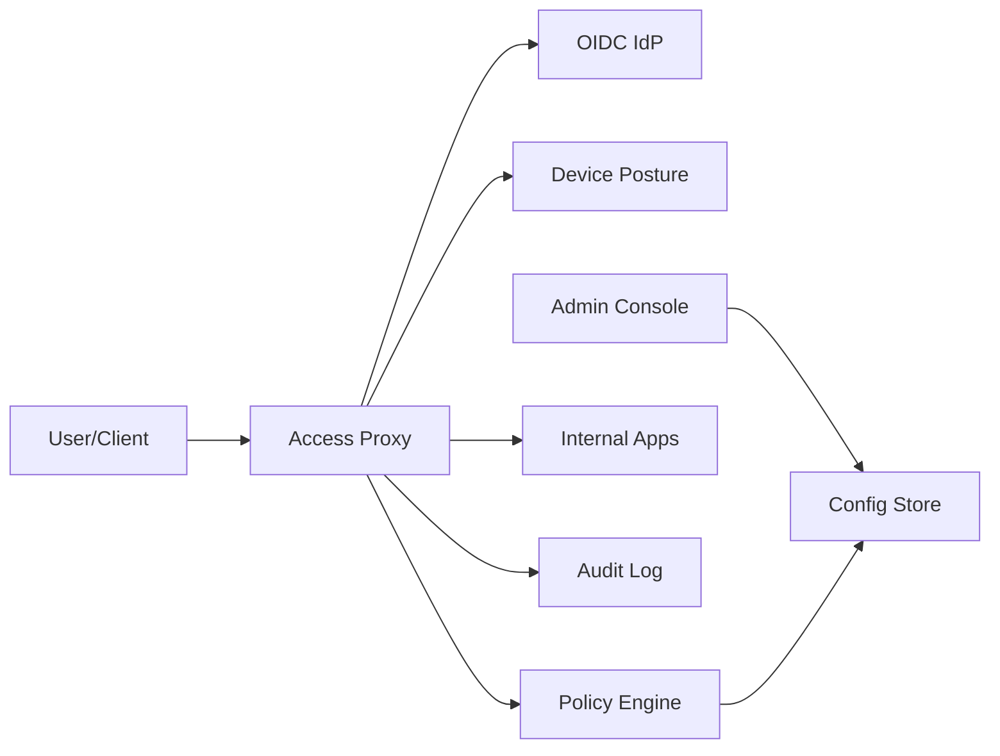

```markdown
---
title: "Zero-Trust Access Proxy"
category: "Security & Access Control"
difficulty: "Hard"
tags: ["zero-trust", "iap", "ztna", "oidc", "mTLS", "policy", "device-posture", "audit"]
---

## Overview

This system is a Zero-Trust Access Proxy (ZTAP) that replaces a VPN by authenticating and authorizing **every request** to internal applications using **user identity + device health** + fine-grained policy. Users reach internal apps through a gateway that enforces policy at L7, then forwards requests over mutually-authenticated transport to private services. The goal is to make “being on the network” irrelevant; the only thing that matters is *who you are, what device you’re on, and what you’re trying to do right now*.

The key insight that makes this design elegant is separating **identity proof** from **access decisions** and making both *cheap to evaluate per-request*. Identity is proven once via OIDC and represented as **short-lived, audience-bound tokens**. Access decisions are computed by a **central policy engine** using cached posture signals and request attributes, then enforced at the proxy. This avoids the two common failure modes: (1) “session equals trust” VPN semantics and (2) embedding authorization logic into every app.

Everything else is boring by design: Envoy/NGINX for the proxy, OIDC for identity, OPA (or Cedar) for policy, Postgres for configuration, append-only logging for audit, and mTLS for service-side enforcement.

## What Makes This Hard

Naive implementations authenticate the user once, then silently treat subsequent traffic as trusted (“VPN with SSO”). The trap is **stale trust**: device posture changes (EDR disabled, jailbroken device, certificate revoked) *after* login, and you only discover it after damage is done. Zero-trust means the decision must be continuously revalidated with bounded staleness.

The second trap is pushing policy into applications. Teams end up with inconsistent enforcement, divergent interpretations of “device healthy,” and no single place to answer “who accessed what and why was it allowed.” You want one enforcement point and one decision model, or you’ll never get predictable security outcomes.

## Requirements

### Functional Requirements
- Enforce access on **every request** using: user identity, device identity, device posture, app/resource, method/path, and risk signals.
- Support both **browser apps** (cookie/redirect flows) and **API clients** (non-interactive token flows).
- Provide **continuous access** semantics: access can be revoked within minutes (or faster for high-risk).
- Strong auditability: for each decision, record **inputs, policy version, decision result**, and downstream target.
- Minimal app changes: internal apps should not implement authentication; they should verify **mTLS + forwarded identity** and trust the proxy boundary.

### Scale Targets
- **Users:** 50k employees/contractors; **devices:** 80k managed endpoints.
- **Traffic:** 20k RPS average, 80k RPS peak (login storms + CI systems); p95 proxy-added latency < 25ms.
- **Policy eval:** must be sub-millisecond with caching; posture freshness target 60s (normal), 5–10s (high-risk apps).
- **Audit:** 100–300M events/day at peak organizations (requests + decisions + posture changes).

These numbers force: stateless proxy scaling, cached decision inputs, and an audit pipeline that can ingest continuously without back-pressuring the proxy.

## Key Design Decisions

- **Decision 1: Central policy decision, distributed enforcement**
  - **Chose:** Envoy-based proxy calls a Policy Decision Point (PDP) (OPA) for allow/deny + constraints; proxy enforces.
  - **Rejected:** Hardcoding rules in proxy config; pushing authorization logic to apps.
  - **Why:** You need a single source of truth, versioned policy, explainable decisions, and consistent enforcement without app rewrites.

- **Decision 2: Short-lived, audience-bound identity + continuous posture**
  - **Chose:** OIDC login produces a short-lived session; each request is evaluated against **current posture** (cached with strict TTL).
  - **Rejected:** Long-lived sessions; “device checked at login only.”
  - **Why:** Stale trust is the real enemy. Bounding token lifetime and posture TTL gives you predictable worst-case exposure.

- **Decision 3: mTLS to upstream + identity propagation contract**
  - **Chose:** Proxy-to-app mTLS with SPIFFE-like identities; forward identity in signed headers (or JWT exchange) with strict audience.
  - **Rejected:** Plain HTTP to apps; letting apps accept user JWTs directly from the internet.
  - **Why:** Apps must be able to prove “this request came through the proxy” and get a tamper-resistant user context.

## Architecture



### Components

- `Access Proxy`: The only public entry point. Terminates TLS, runs OIDC flows, normalizes requests, calls policy, enforces decisions, and forwards to internal apps over mTLS. Must be horizontally scalable and largely stateless.
- `OIDC IdP`: Workforce identity (Okta/AzureAD/Google). Issues identity tokens; the proxy treats it as the authority for user auth, not for fine-grained access.
- `Device Posture`: Aggregates device signals (MDM compliance, EDR running, disk encrypted, cert validity). Exposes a fast “device_id -> posture summary + timestamp” API.
- `Policy Engine`: PDP that evaluates requests (principal, device posture, app, route, method, risk, time) against versioned policy and returns allow/deny plus constraints (headers, max session age, step-up requirement).
- `Internal Apps`: Private services reachable only from the proxy. Validate mTLS client identity (proxy) and consume forwarded identity claims per a strict contract.
- `Audit Log`: Append-only event stream for decisions and access, designed so the proxy can log asynchronously without blocking user traffic.
- `Config Store`: Stores routes, app definitions, policy bundles, device posture thresholds, and keys; versioned and auditable.
- `Admin Console`: Manages apps/routes/policies, with change review and rollout controls (canary policy versions, emergency lock-down).

## Deep Dive: Continuous AuthZ With Bounded Staleness

The hardest part is making “authorize every request” both **secure** and **fast**. The correct model is: *every request produces an authorization decision derived from fresh-enough identity and posture signals, with explicit staleness bounds.*

**1) Identity proof is cheap, but must be constrained.**  
The proxy uses OIDC for browser flows (authorization code + PKCE) and issues its own **proxy session** (HTTP-only cookie) that maps to a short-lived internal session record (or a signed token) with: `user_id`, `groups`, `idp_issuer`, `auth_time`, `mfa_level`. For API clients, the proxy supports OIDC token exchange or mTLS client auth to mint an internal token. Critically, all tokens are **audience-bound to the proxy**; internal apps never accept raw IdP tokens from the outside world.

**2) Posture is evaluated per-request, but fetched amortized.**  
Calling an MDM/EDR API on every request is impossible. Instead, a Posture Service maintains a cached, normalized posture document per device:
- `device_id`, `compliance_state`, `edr_state`, `cert_status`, `last_seen`, `risk_score`, `timestamp`
The proxy fetches posture with aggressive caching and strict TTLs:
- Normal apps: accept posture up to 60s old.
- High-risk apps: 5–10s TTL or require step-up on stale posture.
If posture is older than TTL, the decision becomes **deny or step-up**, not “allow anyway.” This is the “bounded staleness” guarantee that makes revocation real.

**3) Policy is evaluated on a compact input and returns constraints, not just allow/deny.**  
The proxy sends a minimal, deterministic input to the PDP:
- `principal` (user + groups + auth_time + mfa_level)
- `device` (posture summary + timestamp)
- `request` (app_id, route_id, method, path template, source IP/geo if relevant)
- `context` (time, policy_version, emergency_mode)
The PDP response is richer than a boolean:
- `decision`: allow/deny
- `reason`: machine-readable code for audit
- `max_session_age`: force re-auth if auth is old
- `require_step_up`: trigger MFA for sensitive routes
- `headers_to_add`: signed identity context for upstream
This lets you express “allow, but only if auth is recent” without embedding authentication logic into policy or vice versa.

**4) Upstream identity propagation must be tamper-resistant.**  
Once allowed, the proxy forwards:
- mTLS to upstream with a stable proxy identity (and optionally per-tenant proxy identities).
- A signed, short-lived “upstream assertion” (JWT) containing `sub`, `groups`, `device_id`, `decision_id`, `issued_at`, `expires_at`, `app_audience`.
Apps verify signature and audience; they do not need to call the IdP or PDP. This gives apps a trustworthy user context while keeping the enforcement boundary at the proxy.

## Trade-offs

| Optimized For | Sacrificed |
|--------------|------------|
| Fast, consistent enforcement at a single choke point | Some proxy complexity and operational criticality |
| Real revocation via bounded posture/token staleness | Occasional “deny on stale signals” during outages |
| Minimal app changes (mTLS + assertion verify) | Apps must adopt a standard identity propagation contract |

## Failure Modes

- **IdP outage or latency spike**
  - **What happens:** New logins and step-up flows fail; existing sessions might continue until max age.
  - **Detect:** Elevated OIDC error rates, auth callback timeouts, step-up failures.
  - **Recover:** Use short grace windows for already-authenticated sessions (bounded by `max_session_age`), degrade to “no step-up allowed → deny sensitive routes,” and page quickly—this is a hard dependency by design.

- **Posture service stale or unavailable**
  - **What happens:** Proxy cannot refresh posture; risk of stale trust if you fail open.
  - **Detect:** Posture fetch error rate, posture age histogram drifting beyond TTL.
  - **Recover:** Default to **fail closed for high-risk apps**, fail to step-up or limited allow for low-risk apps only if posture age is within a tight emergency TTL. This is an explicit policy-mode switch (audited).

- **Bad policy rollout**
  - **What happens:** Accidental lockout or over-permissive access at scale.
  - **Detect:** Canary policy metrics (deny rate shifts), admin-change alerts, sampled decision diffs between versions.
  - **Recover:** Instant rollback to last known-good policy bundle; “break glass” admin path with strong controls and full audit.

## What I'd Do Differently At...

- **10x scale:** Push PDP closer to proxies (regional PDPs) and add decision-result caching keyed by `(principal, device_posture_hash, route_id)` with millisecond-level invalidation on policy version bump.
- **100x scale:** Make posture a streaming system (device events -> materialized posture state) and move to a multi-tenant policy distribution model with signed bundles and per-tenant isolation; audit becomes a dedicated pipeline with enforced schemas and tiered retention.

## Operational Notes

- Treat the proxy as a **tier-0** service: deploy multi-region, use fast health checks, and test “policy rollback” as a routine game day.
- Monitor **posture freshness** as a first-class SLO; it’s the practical meaning of “continuous trust.”
- Require mTLS on the internal side and ensure apps only accept traffic from the proxy identity; otherwise you’ve rebuilt a VPN with nicer login.
- Make every decision explainable: log `policy_version`, `reason`, `inputs_hash`, and a stable `decision_id` to correlate proxy logs with app logs.
```