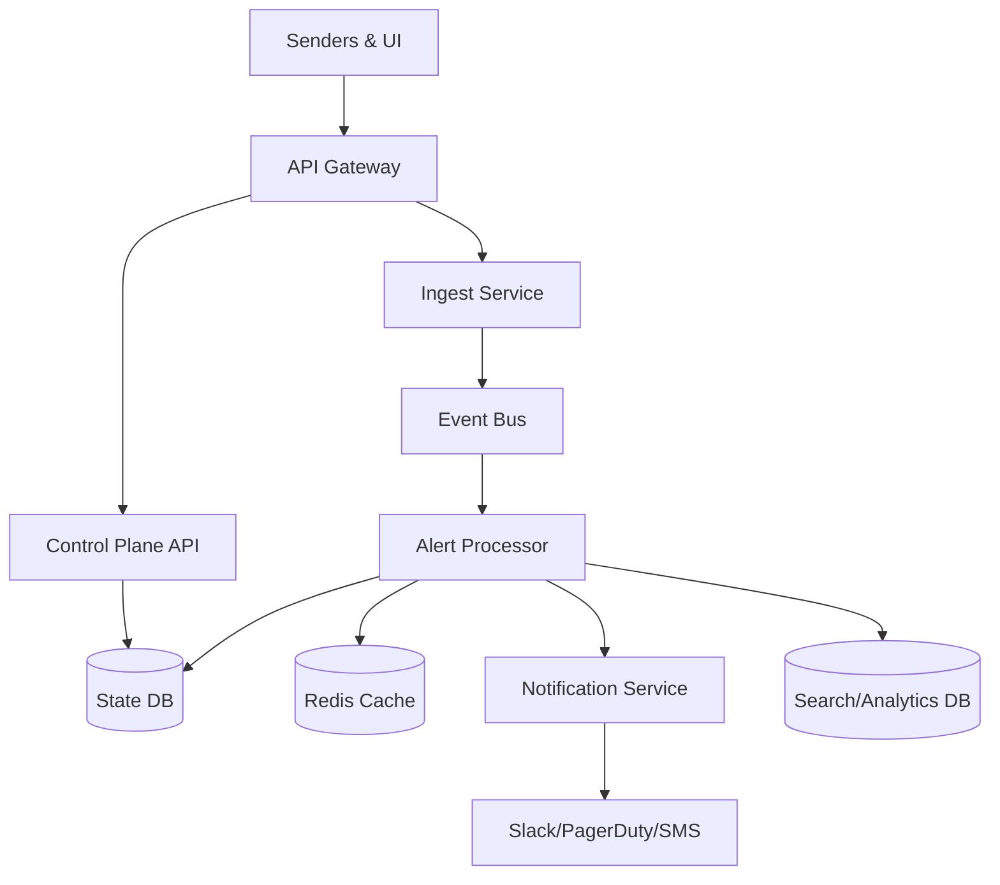
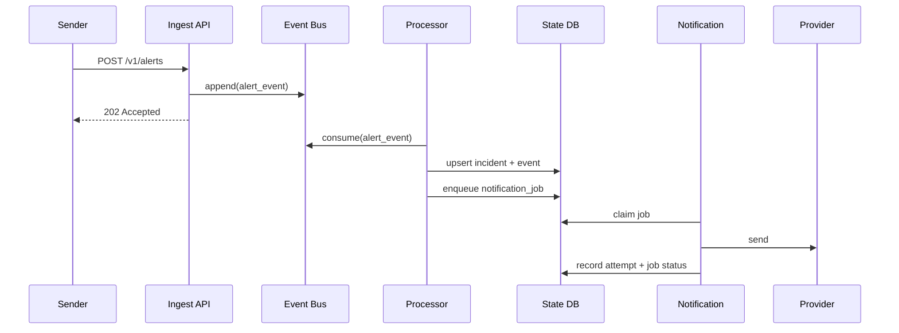

## Overview

Alerting platforms fail in two opposite ways: they either overwhelm humans with noisy, duplicative signals, or they miss the few critical signals that require immediate action. The hard part isn’t “send a notification when a threshold is crossed” — it’s *continuously* turning high-volume, imperfect telemetry and detector outputs into a small number of actionable incidents, routed to the right people, with the right urgency, and with guardrails that prevent alert storms.

This design centers on a few key insights: (1) treat alert events as an at-least-once stream and make routing idempotent; (2) separate **real-time** event processing (dedupe, grouping, silence, routing) from **control-plane** configuration (rules, policies, schedules) with strong consistency; and (3) implement SLO-based alerting using **multi-window, multi-burn-rate** detectors to reduce flapping while catching fast burns quickly.

The result is a production-grade platform that supports deduplication, silence rules, escalation policies, and SLO alerting, while remaining operable under incident-time load spikes.

## Requirements

### Functional Requirements
- Ingest alert events from multiple sources (Prometheus/Alertmanager, CloudWatch, custom webhooks) with authentication and multi-tenancy.
- Deduplicate and group alert events into alert groups/incidents using stable fingerprinting and configurable grouping keys.
- Apply silence rules (time-bounded) and inhibition/muting (e.g., suppress leaf alerts when a parent/root-cause alert is firing).
- Route incidents via escalation policies (on-call schedules, rotations, time-based rules) to targets (Slack, PagerDuty, SMS, email, webhook).
- Support SLO-based alerting with burn-rate detectors (multi-window) and per-service SLO definitions.
- Provide stateful incident lifecycle: open/ack/resolve, notes, ownership, and audit trail.
- Provide UI and APIs to manage rules, silences, policies, schedules, and to search historical incidents/alerts.
- Offer integrations and outbound events (webhooks) for incident automation (auto-remediation, ticketing systems).

### Non-Functional Requirements
- **Scale**: 10K tenants; 200K monitored services; steady-state 10K alert events/sec, burst 50K/sec for 10 minutes; 50M alert events/day; 5M incidents/day worst-case (storm), typical 50K/day.
- **Latency**:
  - Alert ingest ACK: P50 < 50ms, P99 < 250ms
  - End-to-end route (ingest → first notification attempt): P50 < 2s, P99 < 8s
  - UI read (incident list/search): P50 < 200ms, P99 < 1s (with pagination)
- **Availability**: 99.99% for ingest + routing; 99.9% for UI/search.
- **Consistency**:
  - Strong consistency for control-plane writes (rules, policies, silences).
  - Eventual consistency for incident/search analytics and historical reporting.
  - Idempotent, at-least-once processing for event stream and notifications.
- **Durability**: No loss of accepted alert events (RPO ~ 0 for ingested events). Incident state changes durably recorded before ACKing state transitions.

### Constraints & Assumptions
- Multi-tenant SaaS with per-tenant isolation (authz, quotas, rate limits).
- Team size ~6–10 engineers; prefer managed services where possible.
- Compliance: audit logging required; encryption in transit and at rest; optional data residency per region.
- Network access for third-party notification providers may be flaky; must tolerate partial outage.
- Metrics backend (Prometheus/Mimir/Thanos) is external; this system evaluates SLO alerts by reading timeseries via APIs.

## High-Level Architecture



This architecture separates the *data plane* (high-throughput alert events) from the *control plane* (configuration and user actions). Alert events enter via the Ingest Service and are written to an event bus for durability and backpressure. The Alert Processor consumes the stream to perform dedupe, silence evaluation, grouping, and routing decisions, writing authoritative incident state into a strongly consistent State DB.

Search and analytics are pushed to a separate store optimized for queries (e.g., ClickHouse/OpenSearch) so operational queries and dashboards don’t compete with real-time routing. Redis accelerates hot-path lookups (active silences, routing policy snapshots, active group state) and reduces DB load during storms.

## Component Deep-Dive

### API Gateway (Edge)

**Responsibility**: Authentication, tenant routing, rate limiting, request shaping, WAF, and consistent observability headers/trace context.

**Key Design Decisions**:
- Separate endpoints for ingest vs control-plane to apply distinct rate limits and SLOs.
- Enforce per-tenant quotas (events/sec, active incidents, notification fanout) to prevent noisy neighbors.

**Technology Choice**: Envoy/NGINX + managed API Gateway (or Kubernetes Ingress + external WAF).

**Scaling Strategy**: Stateless horizontal scale; global anycast or regional L7 with health checks.

---

### Ingest Service

**Responsibility**: Validate and normalize incoming alert events; authenticate senders; enqueue to event bus; provide fast ACK.

**Key Design Decisions**:
- ACK after durable write to event bus (not after processing) to keep ingest latency low and preserve durability.
- Normalize all sources into a canonical schema with stable fingerprinting inputs (labels/tags, source, tenant, rule ID).

**Technology Choice**: Go/Java service; Kafka/Pulsar for event bus; Protobuf/JSON schema for canonical events.

**Scaling Strategy**: Stateless; partition by `tenant_id` (and optionally `fingerprint_prefix`) to spread load.

---

### Alert Processor (Dedupe + Silence + Routing)

**Responsibility**: Consume events; compute dedupe keys; maintain active alert group state; apply silences/inhibition; resolve incidents; emit notification jobs.

**Key Design Decisions**:
- Use deterministic fingerprints and idempotency keys for every derived side effect (incident mutation, notification job).
- Maintain a per-tenant *policy snapshot* cache with versioning to avoid fetching rules on every event.

**Technology Choice**: Stream consumers (Kafka consumers) + Redis for hot state + Postgres for authoritative state.

**Scaling Strategy**:
- Consumer groups scale horizontally.
- Partitioning aligned to guarantee ordering for a given `dedupe_key` (so state updates remain consistent without distributed locks).
- Use a bounded work queue for notification job emission to protect processor latency.

---

### Control Plane API (Rules/Policies/Silences/SLOs)

**Responsibility**: CRUD for routing rules, escalation policies, schedules, silences, SLO definitions, permissions, and audit logs.

**Key Design Decisions**:
- Strong consistency and transactions for config; every change produces a monotonic `config_version` per tenant.
- Config changes invalidate Redis snapshots and are also published to a “config-changelog” topic for processors to refresh.

**Technology Choice**: Postgres with row-level security (or tenant_id scoping), plus an internal pub/sub (Kafka topic).

**Scaling Strategy**: Stateless API; read replicas for UI-heavy workloads; cache safe reads with ETags.

---

### Notification Service

**Responsibility**: Execute notification jobs, handle retries/backoff, provider adapters, dedupe of sends, and delivery tracking.

**Key Design Decisions**:
- Store notification attempts and use provider-specific idempotency where available; otherwise enforce internal idempotency by `(tenant_id, incident_id, step_id, channel, window)`.
- Adaptive retry policy with circuit breakers per provider and per tenant to avoid storms.

**Technology Choice**: Worker fleet + persistent queue (Kafka topic or DB-backed outbox) + provider SDKs.

**Scaling Strategy**: Horizontally scale workers; isolate provider adapters behind concurrency limits; prioritize “new critical” over “repeat reminders”.

## Data Model

### Storage Schema

**Postgres (authoritative state/control plane)**

- `tenants(tenant_id, name, plan, created_at)`
- `users(user_id, tenant_id, email, role, created_at)`
- `routing_rules(rule_id, tenant_id, name, match_expr, group_by, policy_id, enabled, version, updated_at)`
- `escalation_policies(policy_id, tenant_id, name, steps_json, repeat_interval_sec, version, updated_at)`
- `schedules(schedule_id, tenant_id, name, timezone, rotation_json, overrides_json, version, updated_at)`
- `silences(silence_id, tenant_id, name, match_expr, starts_at, ends_at, created_by, created_at, status)`
- `slos(slo_id, tenant_id, name, service, sli_query, objective, window_days, alerting_config_json, version, updated_at)`
- `incidents(incident_id, tenant_id, dedupe_key, status, severity, title, policy_id, owner, created_at, updated_at, last_event_at, config_version)`
- `incident_events(event_id, tenant_id, incident_id, type, payload_json, created_at)`  
- `notification_jobs(job_id, tenant_id, incident_id, step_id, channel, target, payload_json, dedupe_key, run_at, status, attempt, created_at)`
- `notification_attempts(attempt_id, tenant_id, job_id, provider, provider_msg_id, status, error, started_at, finished_at)`
- `audit_log(audit_id, tenant_id, actor, action, object_type, object_id, diff_json, created_at)`

**Redis (hot cache)**
- `tenant:{id}:config_version -> int`
- `tenant:{id}:routing_snapshot:{version} -> blob`
- `tenant:{id}:active_silences -> set/hash`
- `tenant:{id}:incident_state:{dedupe_key} -> small state (incident_id, status, last_update)`

**Search/Analytics (ClickHouse/OpenSearch)**
- Denormalized `incident_index`, `alert_event_index` for fast filtering by tenant/service/severity/time.

### Data Flow



## API Design

### Ingest APIs (REST)

**POST `/v1/alerts`** (bulk supported)

Request:
```json
{
  "source": "prometheus",
  "tenant_id": "t_123",
  "events": [
    {
      "starts_at": "2025-12-17T12:00:00Z",
      "ends_at": null,
      "labels": {"service":"checkout","severity":"critical","alertname":"HighErrorRate"},
      "annotations": {"summary":"5xx > 2%"},
      "generator_url": "https://..."
    }
  ]
}
```

Response: `202 Accepted` with `ingest_id` and per-event validation errors (partial acceptance).

Error handling:
- `400` invalid schema
- `401/403` auth
- `409` rejected due to tenant disabled
- `429` rate limited (include `Retry-After`)
- `503` transient overload (prefer `429` for controlled shedding)

Idempotency:
- Support `Idempotency-Key` header; for bulk, also compute event-level `event_hash` for dedupe at ingest.
- Ingest writes are at-least-once; downstream must be idempotent regardless.

### Control Plane APIs

**POST `/v1/silences`**, **GET `/v1/silences`**, **DELETE `/v1/silences/{id}`**  
- Silences are validated (time bounds, match expression) and written transactionally with audit log.

**POST `/v1/routing-rules`**, **PUT `/v1/routing-rules/{id}`**  
- Updates bump `version` and `tenant config_version`. Responses include `ETag` for optimistic concurrency.

**POST `/v1/incidents/{id}:ack`**, **POST `/v1/incidents/{id}:resolve`**
- Require `If-Match` (incident version) to avoid clobbering concurrent updates.

### Notification Webhooks (Outbound)

**POST `<customer_webhook_url>`** with signed payload
- Retries with exponential backoff; dead-letter after max attempts; expose delivery logs.

## Scaling & Performance

### Bottleneck Analysis
- **Processor state contention**: If multiple consumers update the same incident concurrently, state thrashes.
  - Mitigation: partition stream by `dedupe_key` (or stable hash) to preserve per-incident ordering.
- **Config lookups on hot path**: Fetching routing rules/silences per event overloads DB.
  - Mitigation: versioned per-tenant snapshots in Redis + changelog topic to refresh.
- **Notification fanout storms**: A single noisy alert can generate millions of sends.
  - Mitigation: notification dedupe windows, escalation pacing, per-tenant/channel rate limits, and “notify-on-change” policies.

### Horizontal Scaling
- **Edge/Ingest**: scale stateless pods; use autoscaling by CPU + request rate.
- **Event Bus**: scale partitions; target ~5–10 MB/s per partition; use rack-aware replication.
- **Processor**: scale consumer group; ensure partition count supports expected parallelism.
- **State DB**: partition by tenant (logical), read replicas for UI; consider sharding by tenant for very large scale.
- **Notification Workers**: scale by pending jobs and provider latency; isolate per provider with separate queues if needed.

### Caching Strategy
- Cache per-tenant routing config snapshots keyed by `config_version` (TTL 5–15 minutes) with explicit invalidation on updates.
- Cache active silences in Redis with expiry at `ends_at`; refresh periodically to handle clock drift.
- Cache incident hot state keyed by `dedupe_key` for quick dedupe decisions; write-through on updates.
- Invalidation: bump `tenant config_version` on any config change; processors fetch new snapshot lazily.

## Trade-offs & Alternatives

### Key Trade-offs Made
- **Chosen**: Event bus + asynchronous processing  
  **Sacrificed**: Immediate “processing completed” response on ingest  
  **Why**: Keeps ingest SLOs stable during storms and ensures durability/backpressure.
- **Chosen**: Strongly consistent Postgres for control-plane + incident state  
  **Sacrificed**: Some write scalability vs fully distributed KV  
  **Why**: Simpler correctness for incident lifecycle, audits, and concurrency control; scale further via sharding if needed.
- **Chosen**: Multi-window burn-rate SLO alerting  
  **Sacrificed**: More complex configuration and evaluation logic  
  **Why**: Industry-proven approach that catches fast burns quickly while reducing noise/flapping.

### Alternative Approaches
- **Use Alertmanager as core engine**: Great baseline, but limited multi-tenant SaaS needs (policy versioning, audit, advanced escalation workflows).
- **Fully stream-native state (Kafka Streams/Flink)**: Strong for scale, but operational complexity increases; harder to model incident lifecycle transactions and audits.
- **Single datastore (e.g., Cassandra only)**: Scales writes, but increases complexity for multi-entity transactions (policies/silences/incidents) and audit integrity.

## Failure Modes & Mitigations

### Failure Scenarios
- **Scenario**: Event bus partition outage  
  **Impact**: Delayed routing for affected partitions (some tenants/incidents)  
  **Detection**: Consumer lag alarms, broker health, increased ingest-to-notify latency  
  **Mitigation**: Replication factor 3, rack-aware placement, automatic leader election, throttled catch-up with prioritization for critical severity.

- **Scenario**: Processor crash-loop during alert storm  
  **Impact**: Rising lag and delayed notifications  
  **Detection**: Lag + crash metrics, K8s restart rate, job backlog  
  **Mitigation**: Backpressure and shedding (drop/aggregate low-severity), isolate tenants via quotas, safe-mode routing (minimal rules, no expensive joins).

- **Scenario**: Redis outage  
  **Impact**: Higher DB load; slower decisions; potential latency increase  
  **Detection**: Redis health, increased DB QPS, increased processor latency  
  **Mitigation**: Fallback to DB reads with circuit breaker; degrade features (e.g., reduced silence evaluation caching) while preserving correctness.

- **Scenario**: Notification provider outage (PagerDuty/Slack)  
  **Impact**: Undelivered pages or delayed alerts  
  **Detection**: Provider error rates, timeouts, delivery SLO violation  
  **Mitigation**: Provider circuit breaker, reroute to secondary channels (SMS/email/webhook), retry with jitter, and surface “delivery degraded” banner in UI.

- **Scenario**: Bad config push (routing rule silences everything)  
  **Impact**: Missed pages  
  **Detection**: Config change audit, sudden drop in notifications vs incident creation  
  **Mitigation**: Staged rollout (canary tenant), config validation + simulation (“dry-run”) and quick rollback via version history.

### Disaster Recovery
- **Targets**: RTO 30 minutes; RPO 5 minutes for control-plane/incident state; RPO ~0 for accepted ingest events (via replicated bus).
- **Backup strategy**: Daily full + continuous WAL archiving for Postgres; snapshot + PITR; periodic export of critical config to object storage.
- **Failover procedures**: Active-active per region for ingest (with tenant affinity); active-passive for stateful DB if needed; replay bus consumers in standby region.

## Operational Considerations

### Monitoring & Alerting
- Ingest: `requests/sec`, `p99 latency`, `429 rate`, `invalid payload rate`, `bus append latency`.
- Bus/Processor: `consumer lag`, `processing time`, `state DB latency`, `redis hit rate`, `dedupe ratio`, `incidents created/sec`.
- Notifications: `time-to-first-notify`, `send success rate`, `provider error rate`, `retry queue depth`, `jobs stuck`.
- Correctness: `duplicate notification rate`, `silence match rate`, `incident flaps/hour`, `config snapshot staleness`.
- Alerts: page on `time-to-first-notify P99 > 8s` for critical severity; warn on rising lag and provider degradation.

### Deployment Strategy
- Blue/green or canary for data-plane services; feature flags for new routing/SLO logic.
- Backward-compatible schema evolution; use outbox pattern for critical side effects.
- Rollback: keep previous processor version able to read current config snapshots; versioned config schema with migrations.

## References & Further Reading
- Google SRE Workbook: SLOs and burn-rate alerting (`multi-window, multi-burn-rate`)
- PagerDuty Incident Response documentation and escalation policy patterns
- Prometheus Alertmanager concepts: grouping, inhibition, silences
- Kafka design patterns: idempotent consumers, exactly-once semantics trade-offs
- “The Incident Management Guide” (various org playbooks) for lifecycle and operational ergonomics