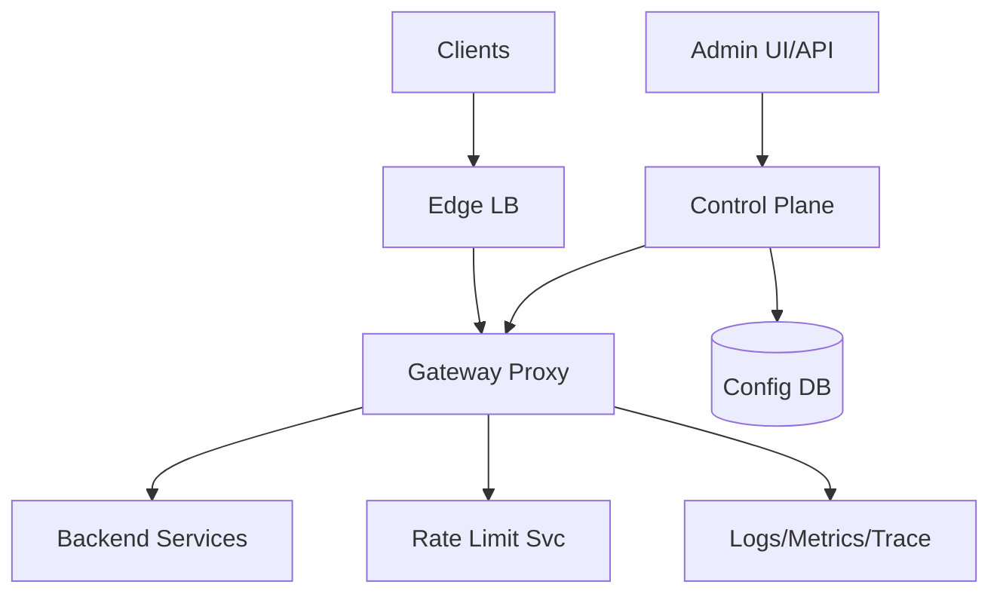
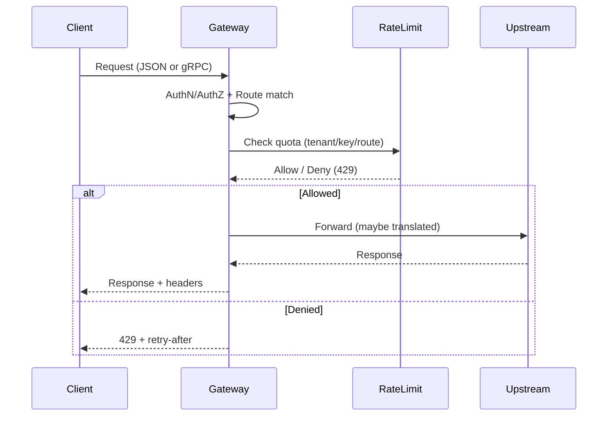

## Overview

An API Gateway is the unified entry point for clients (IoT devices, mobile/web apps, partner integrations) into a fleet of backend services. It must reliably route requests, enforce security and quotas, translate protocols (e.g., gRPC ↔ JSON/HTTP), and protect upstreams via circuit breaking—while operating under high cardinality (millions of device identities), bursty traffic, and heterogeneous network conditions.

The core challenge is that the gateway sits on the fault line between the public internet and internal systems: it must be fast on the happy path, safe under abuse and partial failures, and operationally flexible (rapid config changes, safe rollouts, deep observability). The key insight is to split the system into a **data plane** (high-performance, stateless edge proxies) and a **control plane** (configuration, policy, keys, and rollout orchestration), so you can scale traffic handling independently from policy management.

## Requirements

### Functional Requirements
- Terminate client connections (TLS/mTLS) and authenticate requests (API keys, OAuth2/JWT, device certs).
- Route requests to upstream services based on host/path/method/headers, with weighted traffic splitting for canaries.
- Perform protocol translation between **gRPC** services and **JSON/HTTP** clients (including error mapping and schema validation).
- Enforce rate limiting and quotas per tenant/device/API key, with burst handling and configurable policies.
- Apply circuit breaking (timeouts, retries, outlier detection) to protect upstream services and fail fast under degradation.
- Provide request/response transformations (header normalization, request IDs, limited body transforms) and CORS support.
- Emit comprehensive observability signals (structured access logs, metrics, traces) with correlation IDs.
- Offer an admin surface for managing routes, policies, credentials, and rollout/versioning with auditability.

### Non-Functional Requirements
- **Scale**: 5M registered devices, 200k concurrent connections per region, peak 150k RPS global, sustained 50k RPS; config objects: 50k routes, 500k identities/keys.
- **Latency**: Gateway added overhead P50 ≤ 5ms, P99 ≤ 25ms (excluding upstream); rate-limit decision P99 ≤ 3ms.
- **Availability**: 99.99% for the data plane per region; global 99.995% with multi-region failover.
- **Consistency**: Strong consistency for credential issuance and admin writes; eventual consistency (≤ 30s) acceptable for route/policy propagation to edges.
- **Durability**: No loss for admin configuration and audit logs (RPO ~ 0); runtime counters can be best-effort (bounded error acceptable for rate limiting under partitions).

### Constraints & Assumptions
- Edge presence in 3+ regions (or PoPs) to keep device latency low; traffic enters via Anycast DNS/Geo routing.
- Team can operate a Kubernetes-based platform (or managed equivalents); prefers proven components (Envoy/Kong + Redis + Postgres).
- Compliance: audit trails for admin actions; secrets stored in KMS/HSM-backed secret manager.
- Network access from edge to control plane may be intermittently impaired; data plane must continue serving with last-known-good config.

## High-Level Architecture

The system is split into **data plane** and **control plane**. The data plane is a fleet of stateless gateway proxies deployed close to clients (regional/edge). It handles request processing (routing, authn/z, translation, retries/timeouts, circuit breaking) and emits telemetry. It scales horizontally with traffic and maintains minimal local state (caches, short-lived counters).

The control plane manages configuration (routes, policies), credentials, and safe rollout of changes to the data plane. Configuration is stored durably (e.g., Postgres) and distributed to proxies via a push-based mechanism (e.g., Envoy xDS). This separation enables rapid config updates without redeploying the proxy fleet and reduces blast radius when policies change.

## Component Deep-Dive

### Gateway Proxy (Data Plane)

**Responsibility**: Terminate connections, authenticate/authorize, route, translate protocols, enforce local protections (timeouts/retries), and apply circuit breaking.

**Key Design Decisions**:
- Use a high-performance L7 proxy (Envoy) as the core to avoid bespoke networking code and to leverage mature features (xDS, outlier detection, gRPC-Web/JSON transcoding).
- Keep proxies stateless; store only caches (JWKS, route tables) and short-lived rate limit tokens to enable rapid autoscaling and safe restarts.

**Technology Choice**: Envoy Proxy (or Kong Gateway/NGINX with equivalent modules). Envoy is strongly suited for gRPC, xDS configuration, and resilience policies.

**Scaling Strategy**: Horizontal autoscaling by CPU/RPS and active connections; multiple replicas per zone; connection draining on rollout; keep-alive tuned for IoT clients.

### Control Plane (Config + Policy Orchestration)

**Responsibility**: Manage routes, auth policies, rate-limit rules, upstream clusters, and distribute validated versions to proxies.

**Key Design Decisions**:
- Version every config change (immutable snapshots) with validation and staged rollout (canary → regional → global) to prevent “bad config” outages.
- Push config via streaming (xDS-like) with ACK/NACK and automatic rollback to last-known-good on rejection.

**Technology Choice**: Custom control plane service (Go/Java) + Envoy xDS, backed by Postgres for config and an object store for large artifacts.

**Scaling Strategy**: Scale by number of connected proxies and config change rate (not by client traffic); shard control plane per region with a global source-of-truth.

### Rate Limiting Service

**Responsibility**: Enforce per-identity quotas/bursts consistently across a proxy fleet; provide deterministic decisions under load.

**Key Design Decisions**:
- Hybrid enforcement: local token buckets for ultra-fast per-proxy limiting + centralized checks for strict tenant quotas to avoid “N× burst” during scaling.
- Degrade safely: on rate-limit service failure, apply conservative local limits (fail-closed for untrusted clients, fail-open for trusted internal traffic based on policy).

**Technology Choice**: Envoy Global Rate Limit service + Redis Cluster (or Aerospike) for counters; optionally use per-tenant sharded Redis keys.

**Scaling Strategy**: Partition counters by tenant/API key hash; scale Redis horizontally; rate limit service stateless and scalable behind an internal LB.

### Observability Pipeline

**Responsibility**: Collect, correlate, and retain access logs, metrics, and traces for SLOs, debugging, and security investigations.

**Key Design Decisions**:
- Emit structured logs with stable fields (request_id, tenant_id, route_id, upstream_cluster, status, latency) to support incident queries.
- Always-on tail-based sampling for traces during errors (e.g., sample 100% of 5xx/429/timeout) to reduce cost while preserving debuggability.

**Technology Choice**: OpenTelemetry SDK/collector, Prometheus + Alertmanager, Grafana, and a log pipeline (Loki/ELK/Splunk).

**Scaling Strategy**: Collect locally with OTel collectors per node; batch and compress; separate hot (7–14 days) and cold retention.

## Data Model

### Storage Schema

**Postgres (Control Plane)**
- `routes`
  - `route_id` (PK), `host`, `path_pattern`, `methods[]`, `upstream_cluster`, `rewrite_rules`, `timeout_ms`, `retry_policy`, `version`, `created_at`
- `upstreams`
  - `cluster_id` (PK), `endpoints` (jsonb), `healthcheck`, `circuit_breaker` (jsonb), `tls_policy`, `version`
- `identities`
  - `identity_id` (PK), `tenant_id`, `type` (device|partner|app), `status`, `metadata` (jsonb)
- `credentials`
  - `credential_id` (PK), `identity_id` (FK), `kind` (api_key|jwt_client|mtls_cert), `secret_ref`, `expires_at`, `rotated_at`
- `rate_limit_policies`
  - `policy_id` (PK), `scope` (tenant|identity|route), `key_pattern`, `limit_rps`, `burst`, `window_ms`, `fail_mode`, `version`
- `config_snapshots`
  - `snapshot_id` (PK), `hash`, `status` (staged|active|rolled_back), `created_by`, `created_at`
- `audit_log`
  - `event_id` (PK), `actor`, `action`, `resource_type`, `resource_id`, `before` (jsonb), `after` (jsonb), `created_at`

**Redis (Runtime)**
- `rl:{tenant_id}:{route_id}` → token bucket state / counters (sharded by hash slot)
- `jwk:{issuer}` → cached JWKS (TTL)

### Data Flow

## API Design

### Data Plane (Client-Facing)
- `ANY /{path...}`
  - Behavior: Route by `Host` + `path` + `method`; enforce auth, rate limits, and circuit breaking.
  - Protocol translation:
    - JSON → gRPC: map HTTP path to gRPC service/method; JSON body to protobuf; map gRPC status to HTTP.
    - gRPC → JSON: expose REST-ish endpoints for web/partners where needed.
  - Error handling:
    - `401/403` auth failures, `404` no route, `429` rate limited, `503` circuit open/upstream unavailable, `504` upstream timeout.
  - Idempotency:
    - Support `Idempotency-Key` for unsafe methods if upstream supports it; gateway stores short-lived dedupe keys (optional) or forwards to upstream.

### Control Plane (Admin)
- `POST /v1/snapshots`
  - Creates a new validated config snapshot from staged resources.
  - Response: `{ snapshot_id, hash, status }`
- `POST /v1/snapshots/{snapshot_id}:promote`
  - Request: `{ scope: "canary|region|global", percent?: number }`
  - Safe rollout with automatic rollback on proxy NACK rate or error budget burn.
- `PUT /v1/routes/{route_id}`
  - Request: `{ host, path_pattern, methods, upstream_cluster, timeout_ms, retry_policy, transforms }`
- `PUT /v1/rate-limit-policies/{policy_id}`
  - Request: `{ scope, key_pattern, limit_rps, burst, window_ms, fail_mode }`
- `POST /v1/credentials:issue`
  - Request: `{ identity_id, kind, ttl_seconds }`
  - Response: `{ credential_id, secret_ref, expires_at }`
- Error model (admin): `{ code, message, details, request_id }` with consistent `4xx` validation errors and `409` on version conflicts.

## Scaling & Performance

### Bottleneck Analysis
- **TLS + auth verification** (JWT/mTLS): mitigate with session reuse, JWKS caching, and hardware acceleration where available.
- **Rate limit checks**: minimize network hops using local buckets + batched/pooled calls to the rate limit service; shard Redis keys; apply per-route defaults.
- **Config propagation storms**: use snapshot versioning, staggered rollout, and bounded update rates per proxy.

### Horizontal Scaling
- **Edge LB + Gateway**: scale by replicas and zones; use connection-aware load balancing; ensure sufficient file descriptors and HTTP/2 stream limits.
- **Rate limit service**: stateless; scale behind internal LB; Redis cluster scales by shard count and CPU.
- **Control plane**: scale by connected proxies; use regional control plane replicas; cache snapshot artifacts.

### Caching Strategy
- **JWKS cache** at proxy (TTL 5–15 min) with background refresh; pin by issuer/kid.
- **Route/config** in-memory at proxy via xDS; keep last-known-good snapshot on disk for fast restart.
- **Rate limiting**:
  - Local token bucket per (tenant, route) with small burst allowance (e.g., 10–50 requests).
  - Central counters for strict quotas (per-minute/hour) with approximate enforcement acceptable during partitions.

## Trade-offs & Alternatives

### Key Trade-offs Made
- **Chosen**: Envoy-based data plane + separate control plane  
  **Sacrificed**: Simplicity of a single monolith  
  **Why**: Safer config rollouts, better performance, mature resilience features.
- **Chosen**: Hybrid local + centralized rate limiting  
  **Sacrificed**: Perfect global precision under all failures  
  **Why**: Keeps P99 low while bounding abuse; avoids single dependency on a central service.
- **Chosen**: Eventual config propagation (≤ 30s)  
  **Sacrificed**: Immediate global policy enforcement  
  **Why**: Prevents control plane hiccups from taking down traffic; supports offline edge operation.

### Alternative Approaches
- **Managed API Gateway (cloud)**: faster time-to-market, but limited deep customization (gRPC/IoT nuances), higher cost at scale, and harder multi-cloud strategy.
- **Service mesh only**: great east-west traffic, but does not replace north-south edge concerns (WAF, device auth, partner quotas) cleanly.
- **Monolithic custom gateway**: maximal flexibility, but higher long-term risk (security surface, protocol correctness, perf tuning) and slower feature velocity.

## Failure Modes & Mitigations

### Failure Scenarios
- **Scenario**: Rate limit service/Redis outage  
  **Impact**: Potential abuse or over-throttling  
  **Detection**: Increased RL error rate, proxy fallback counters, Redis health alarms  
  **Mitigation**: Policy-based fail-open/closed; local buckets; shed load with global per-tenant caps.
- **Scenario**: Bad config push (broken route, invalid cluster)  
  **Impact**: Partial/total traffic outage  
  **Detection**: Proxy NACKs, sudden 404/503 spike, synthetic checks fail  
  **Mitigation**: Snapshot validation, canary rollout, automatic rollback on NACK/error SLO burn.
- **Scenario**: Upstream latency spike  
  **Impact**: Thread/connection exhaustion at gateway, cascading failures  
  **Detection**: Upstream P99 latency, queue depth, retry storms, elevated 504  
  **Mitigation**: Tight timeouts, bounded retries, circuit breaking/outlier detection, bulkheads per cluster.
- **Scenario**: Region failure  
  **Impact**: Loss of a full edge region  
  **Detection**: Health checks, BGP/DNS health signals, SLO alarms  
  **Mitigation**: Multi-region active-active, DNS/Anycast failover, warm capacity in alternate regions.

### Disaster Recovery
- **RTO/RPO**: RTO 30 minutes for control plane; RPO ~ 0 for config/audit.
- **Backup strategy**: Continuous PITR for Postgres; daily snapshot + WAL archiving; periodic restore drills.
- **Failover procedures**: Promote standby Postgres, re-point control plane, proxies continue serving last-known-good until reconnection.

## Operational Considerations

### Monitoring & Alerting
- Key metrics:
  - Gateway: RPS, P50/P95/P99 latency, 4xx/5xx/429 rates, active connections, CPU/mem, upstream timeout/circuit-open counts.
  - Rate limiting: decision latency, error rate, Redis ops/sec, hot keys, eviction rate.
  - Control plane: config push success/NACK rate, rollout progress, admin error rate.
- Alerts (examples):
  - P99 added latency > 25ms for 5 min
  - 5xx rate > 1% or 429 rate anomaly per tenant
  - Config NACKs > 0.1% of proxies in a rollout stage

### Deployment Strategy
- Data plane: rolling updates with connection draining; canary by region/PoP; fast rollback.
- Control plane: blue/green or canary; strict backwards compatibility for xDS/config schema.
- Config rollout: staged promotion with automated gates (synthetics + NACK + error budget); immutable snapshots and “break-glass” rollback.

## References & Further Reading
- Envoy Proxy docs (xDS, outlier detection, circuit breakers): https://www.envoyproxy.io/
- gRPC JSON Transcoding (Envoy / google.api.http patterns): https://cloud.google.com/endpoints/docs/grpc/transcoding
- Resilience patterns (timeouts, retries, circuit breakers): https://martinfowler.com/articles/microservice-resilience.html
- Token bucket rate limiting (practical guide): https://cloud.google.com/architecture/rate-limiting-strategies-techniques
- Google SRE Book (SLOs, error budgets): https://sre.google/sre-book/table-of-contents/