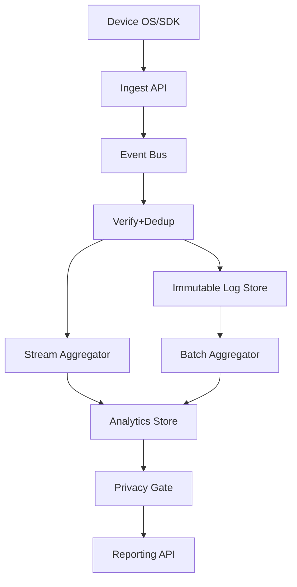
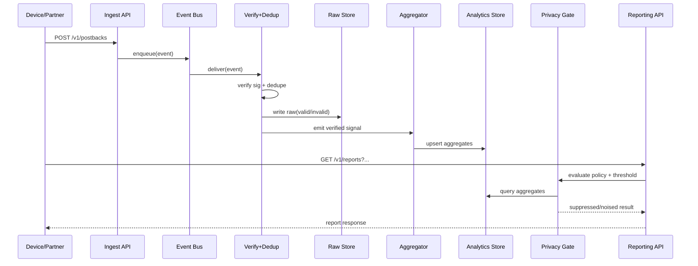

## Overview

Attribution measurement answers a deceptively hard question: “Which ads caused which conversions?” In modern mobile ecosystems, this must be done under strict privacy constraints (e.g., Apple SKAdNetwork), where user-level identifiers are unavailable, reporting is delayed, and only coarse/aggregated signals are permitted. The core challenge is building a system that is **useful for marketing decisions** while being **provably resistant to re-identification** and robust against **fraud and gaming**.

The key insight is to separate the system into two planes: (1) a **privacy-preserving collection plane** that ingests signed, constrained signals (e.g., SKAN postbacks) or privacy-safe events, and (2) an **aggregation and reporting plane** that enforces privacy rules (thresholding, noise, caps, and privacy budgets) before any output is queryable. Correlation is achieved at the **campaign/cohort level**, not per user, with deterministic deduplication and cryptographic verification to ensure integrity.

## Requirements

### Functional Requirements
- Ingest attribution signals from privacy-constrained sources (e.g., SKAdNetwork postbacks) and partner/mobile/web SDK events where allowed.
- Verify authenticity and integrity of incoming signals (signature validation, schema validation, replay protection).
- Produce standard marketing reports: installs, purchases, revenue, ROAS, conversion funnels, broken down by campaign/adgroup/creative, country, and time.
- Support SKAN-like semantics: delayed reporting windows, conversion value updates (coarse/fine), and multiple postbacks per install (where applicable).
- Enforce privacy constraints on outputs: k-anonymity thresholds, minimum time buckets, suppression, and noise addition where required.
- Provide near-real-time “directional” dashboards (delayed and privacy-safe) and finalized reports after attribution windows close.
- Detect and mitigate fraud patterns (click spamming, install hijacking, postback replay, bot traffic), producing both alerts and filtered views.
- Offer backfills and reprocessing for late-arriving signals, with versioned aggregates and auditability.

### Non-Functional Requirements
- **Scale**: 5K–20K sustained ingest QPS (bursty to 100K QPS during campaign spikes); 1–5B events/day total including raw logs; 100K active campaigns; 10K report queries/min peak.
- **Latency**:
  - Ingest acknowledgement: P99 < 200ms (write-path only).
  - Near-real-time dashboards: P50 5 min, P99 30 min (bounded by privacy delays and streaming lag).
  - Report queries: P50 < 300ms, P99 < 2s for common breakdowns.
- **Availability**: 99.95% for ingest APIs; 99.9% for reporting APIs (graceful degradation to cached aggregates).
- **Consistency**:
  - Raw ingestion: at-least-once with idempotent dedupe (eventual consistency acceptable).
  - Published aggregates: read-after-write not required; correctness achieved via window finalization and versioning.
- **Durability**: No loss of accepted events (RPO ~ 0 for raw logs); aggregates reproducible from immutable raw storage.

### Constraints & Assumptions
- Must comply with platform privacy constraints (SKAN-style: no device IDs, delayed postbacks, coarse metadata).
- Output must prevent small-cohort inference: minimum threshold (e.g., k ≥ 50) and minimum time granularity (e.g., 1 day) for sensitive breakdowns.
- Multi-tenant system: strict tenant isolation, per-tenant encryption keys, and access control.
- Budget/team constraint typical for a “platform team”: prioritize managed components (Kafka/MSK, Flink, BigQuery/Snowflake, Redis) where possible.
- Network access to third parties may be limited; rely on partner “push” to ingest endpoints, not “pull”.

## High-Level Architecture

The architecture is a dual-path pipeline: all accepted signals are written to an immutable raw store (for audit/replay) and processed through streaming/batch aggregators to produce queryable aggregates. This decouples ingestion reliability from analytics complexity and enables backfills as privacy rules or attribution logic evolve.

A dedicated **Privacy Gate** sits between analytics storage and consumers to enforce minimum thresholds, bucket constraints, suppression, and noise. This ensures privacy is not a “best effort” in downstream dashboards, but a hard boundary that all outputs must pass.

## Component Deep-Dive

### Ingest API
**Responsibility**: Accept attribution signals (SKAN postbacks, privacy-safe events), validate schema, authenticate clients/partners, and enqueue for processing.

**Key Design Decisions**:
- Use a thin write-optimized service: validate + enqueue only, avoiding synchronous attribution logic to keep P99 latency low.
- Require idempotency keys for partner submissions and enforce rate limits per tenant/partner to reduce abuse and stabilize load.

**Technology Choice**: Envoy/API Gateway + stateless services (Go/Java) + Kafka (or Pub/Sub) for buffering.

**Scaling Strategy**: Horizontal scale behind L7 load balancer; partition event bus by `tenant_id` + `source` + `event_day` to distribute load.

### Verify + Dedup
**Responsibility**: Cryptographically verify signed signals (e.g., SKAN), validate partner auth, prevent replay, and deduplicate at-least-once deliveries.

**Key Design Decisions**:
- Maintain a bounded “seen set” keyed by `event_id` (or postback signature hash) with TTL aligned to maximum late arrival (e.g., 45–90 days).
- Treat verification failures as first-class metrics and store invalid samples (redacted) for debugging without leaking sensitive payloads.

**Technology Choice**: Stream processor (Flink/Kafka Streams) + Redis/Cassandra for dedupe keys; KMS-backed key management for signature verification key rotation.

**Scaling Strategy**: Parallelize by partition key; keep verification stateless per event; dedupe store sharded by consistent hashing.

### Aggregation (Stream + Batch)
**Responsibility**: Transform verified signals into privacy-aware aggregates (campaign metrics, conversion value distributions, time-windowed summaries).

**Key Design Decisions**:
- Split “directional” (stream) aggregates from “final” (batch) aggregates to accommodate SKAN delays and late arrivals while keeping dashboards responsive.
- Version aggregates by `logic_version` and `privacy_policy_version` to support reprocessing and safe rollout of changes.

**Technology Choice**: Flink/Spark Structured Streaming for stream; Spark/DBT for batch; raw store in S3/GCS + Parquet; orchestration with Airflow/Dagster.

**Scaling Strategy**: Time-partitioned and tenant-partitioned processing; autoscaling stream jobs; batch reprocessing per day/tenant to bound blast radius.

### Analytics Store
**Responsibility**: Serve aggregated metrics with high query concurrency and predictable latency.

**Key Design Decisions**:
- Store only aggregates (not user-level event rows) in OLAP to reduce privacy risk and cost.
- Precompute common cubes (by day/campaign/country) and keep “long tail” breakdowns limited by privacy policy.

**Technology Choice**: ClickHouse/Druid/BigQuery (depending on ops model); Redis for hot aggregate caching.

**Scaling Strategy**: Shard by `tenant_id` and time; replicate for read scaling; pre-aggregate materialized views for common queries.

### Privacy Gate
**Responsibility**: Enforce privacy constraints at query time and/or publish time: thresholds, bucketization, suppression, noise, and privacy budgets.

**Key Design Decisions**:
- Apply **k-anonymity thresholding** (e.g., suppress cells with installs < 50) and enforce minimum time granularity for sensitive dimensions.
- Optionally add **differential privacy-style noise** for selected metrics and track a per-tenant privacy budget if repeated slicing is allowed.

**Technology Choice**: Stateless service colocated with Reporting API; policy configs in a strongly-consistent store (Postgres); audit logs in immutable storage.

**Scaling Strategy**: Stateless horizontal scale; aggressive caching of “approved” aggregates; circuit-breaker to fail closed (suppress) on policy store issues.

## Data Model

### Storage Schema

**Raw immutable log (Parquet in object store)**
- `tenant_id` (string)
- `source` (enum: `skan`, `sdk`, `partner`)
- `received_at` (timestamp)
- `event_time` (timestamp, if provided)
- `event_type` (enum: `postback`, `click`, `conversion`)
- `payload` (json/binary, encrypted at rest)
- `verify_status` (enum: `valid`, `invalid_sig`, `invalid_schema`, `replay_suspected`)
- `event_id` (string; derived hash for idempotency)

**Dedupe key store**
- `tenant_id` (pk part)
- `event_id` (pk part)
- `first_seen_at`
- TTL: 90 days

**Aggregates (OLAP)**
- `tenant_id`
- `day` (date)
- `campaign_id`
- `adgroup_id` (optional)
- `creative_id` (optional)
- `country` (optional/coarse)
- `source` (`skan`/`sdk`)
- `installs` (int)
- `conversions` (int)
- `revenue` (decimal)
- `cv_bucket` (int, e.g., 0–63 or coarse tiers)
- `postback_count` (int)
- `logic_version` (int)
- `privacy_policy_version` (int)
- `finalized` (bool)

**Policy config (OLTP)**
- `tenant_id`
- `min_k` (int)
- `min_time_bucket` (enum: `day`, `week`)
- `allowed_dimensions` (json)
- `noise_mode` (enum)
- `updated_at`

### Data Flow

Key operations:
- **Postback ingestion**: verify signature, dedupe, persist raw, aggregate by campaign and time bucket.
- **Finalization**: batch job closes attribution windows (e.g., day+N), marks aggregates as finalized, recomputes with late arrivals, and publishes a new version.
- **Reporting**: queries hit OLAP, then privacy gate applies suppression/noise and returns only policy-compliant cells.

## API Design

### Ingest APIs

**POST `/v1/postbacks`**
- Purpose: ingest SKAN-like signed postbacks (or equivalent privacy-preserving signals).
- Request (JSON):
  - `tenant_id` (string)
  - `source` (string, e.g., `skan`)
  - `payload` (object; signed fields)
  - `idempotency_key` (string)
- Response:
  - `202 Accepted` with `{ "accepted": true, "request_id": "..." }`
- Errors:
  - `400` invalid schema
  - `401/403` auth failure
  - `409` duplicate (optional; otherwise treat as accepted-noop)
  - `429` rate limited
- Idempotency: required `idempotency_key`; duplicates must not double count.

**POST `/v1/events/conversions`** (for non-SKAN environments where allowed)
- Accepts privacy-safe conversion events with strict field allowlist and no stable user identifiers.
- Same idempotency/error semantics.

### Reporting APIs

**GET `/v1/reports/attribution`**
- Query params:
  - `tenant_id`
  - `from` (date), `to` (date)
  - `group_by` (comma list: `day,campaign_id,country,cv_bucket` subject to policy)
  - `source` (`skan`/`sdk`)
  - `finalized_only` (bool)
- Response (JSON):
  - `data`: list of rows with requested dimensions + metrics
  - `suppressed_cells`: count
  - `privacy_policy_version`
  - `logic_version`
- Error handling:
  - `400` invalid group_by (not allowed by policy)
  - `403` tenant access denied
  - `422` query would violate privacy constraints (fail closed) or return empty-with-explanation
- Idempotency: GET is naturally idempotent; include `result_version` (etag) for caching.

## Scaling & Performance

### Bottleneck Analysis
- **Ingest bursts**: mitigated via event bus buffering and autoscaling stateless ingest/verify services.
- **Dedupe hot keys**: mitigated by sharding dedupe store and using hash-based keys; degrade gracefully by accepting at-least-once and deduping in aggregation if necessary.
- **OLAP query fanout**: mitigated by pre-aggregation/materialized views, caching hot queries, and limiting dimensions per policy.
- **Batch backfills**: mitigated by partitioned reprocessing (per day/tenant) and versioned publishes.

### Horizontal Scaling
- **Ingest API**: scale out pods/instances; keep request CPU predictable (no heavy crypto if possible—offload to verify stage).
- **Verify+Dedup**: scale stream parallelism with partition count; dedupe store scales via sharding/cluster.
- **Aggregators**: stream jobs scale with partitions; batch scales with distributed compute; isolate tenants if needed (“noisy neighbor” control).
- **Analytics Store**: shard by tenant/time; replicate for read QPS; compress and TTL older intermediate aggregates.

### Caching Strategy
- Cache common finalized reports (e.g., last 7/30 days by campaign) in Redis/CDN with TTL 5–30 minutes.
- Cache policy-compliant query results keyed by `(tenant, query, logic_version, policy_version)` to avoid recomputation.
- Invalidation: bump `logic_version`/`policy_version` on changes; time-based expiration for rolling windows.

## Trade-offs & Alternatives

### Key Trade-offs Made
- **Chosen**: aggregate-only OLAP with privacy gate.
  - **Sacrificed**: flexible arbitrary slicing and deep per-user debugging.
  - **Why**: materially reduces privacy risk and aligns with SKAN-like constraints.
- **Chosen**: dual stream + batch aggregation with versioning.
  - **Sacrificed**: system complexity and storage overhead.
  - **Why**: supports late arrivals, backfills, and reproducibility while keeping dashboards responsive.
- **Chosen**: strict fail-closed privacy enforcement.
  - **Sacrificed**: occasionally “missing” data for small campaigns.
  - **Why**: prevents accidental leakage and simplifies compliance posture.

### Alternative Approaches
- **Fully batch-only pipeline**: simpler and cheaper, but poor freshness and harder incident response for ingest/verification issues.
- **Event-level reporting with pseudonymous IDs**: more powerful analytics, but typically incompatible with SKAN-class privacy constraints and increases re-identification risk.
- **Secure multi-party computation (MPC) / clean room**: strong privacy for cross-party joins, but higher operational complexity, cost, and latency; overkill unless you must join advertiser + publisher data without trust.

## Failure Modes & Mitigations

### Failure Scenarios
- **Scenario**: Event bus outage/partition unavailability  
  **Impact**: ingest accepted but processing delayed; dashboards stale  
  **Detection**: queue lag, consumer offsets, increased end-to-end delay  
  **Mitigation**: multi-AZ bus, backpressure, spool to raw store as fallback, replay consumers on recovery
- **Scenario**: Signature verification key rotation bug  
  **Impact**: large fraction of postbacks rejected → undercounting  
  **Detection**: spike in `invalid_sig` ratio, partner complaints  
  **Mitigation**: support multiple active keys, staged rollout, canary tenants, “quarantine then reprocess” from raw logs
- **Scenario**: Dedupe store degradation  
  **Impact**: overcount risk from retries  
  **Detection**: dedupe latency/errors, divergence vs expected retry rates  
  **Mitigation**: degrade to probabilistic dedupe (Bloom filter) + downstream aggregate-level dedupe; reconcile in batch finalization
- **Scenario**: OLAP hotspot from expensive breakdowns  
  **Impact**: query latency spikes, partial outages  
  **Detection**: p99 query latency, CPU saturation, slow query logs  
  **Mitigation**: limit dimensions, require pre-aggregated endpoints, query quotas per tenant, cached responses
- **Scenario**: Fraud wave (click spamming/install hijacking)  
  **Impact**: inflated attribution, customer trust loss  
  **Detection**: anomaly detection on click-to-install rates, geo/device attestation signals, partner-level outliers  
  **Mitigation**: filter rules, tenant-visible “filtered vs unfiltered” reporting, automated partner throttling, manual review workflow

### Disaster Recovery
- RTO: 4 hours for reporting; 1 hour for ingest (degraded mode acceptable).  
- RPO: ~0 for raw events (immutable log replicated cross-region); < 24 hours for derived aggregates (rebuildable).
- Backup strategy: cross-region replication of object store; daily snapshots of policy/config OLTP; OLAP backups via incremental snapshots.
- Failover: active-active ingest endpoints (DNS/LB failover); replay consumers in secondary region; rebuild aggregates from raw logs if OLAP lost.

## Operational Considerations

### Monitoring & Alerting
- Ingest: QPS, P99 latency, 4xx/5xx rates, auth failures, rate limiting counts.
- Verification: `valid/invalid_sig/invalid_schema` ratios, dedupe hit rate, replay detections, stream lag.
- Aggregation: watermark delay, late-event rate, job restarts, output row counts per tenant/day.
- Reporting: P50/P99 latency, cache hit rate, suppressed cell counts (by tenant), query error rates.
- Data quality: day-over-day deltas, invariant checks (e.g., finalized counts should not decrease beyond tolerance), reconciliation between stream and batch.

### Deployment Strategy
- Use blue/green or canary for ingest/verify; feature flags for logic/policy versions.
- Backward-compatible schemas with explicit version fields; reject unknown-critical fields to avoid silent misinterpretation.
- Rollback: keep previous `logic_version` aggregates queryable; flip traffic back; reprocess from raw logs if needed.

## References & Further Reading
- Apple SKAdNetwork documentation (postbacks, conversion values, privacy constraints)
- Apple Private Click Measurement (PCM) concepts for privacy-preserving attribution
- “Prochlo” (privacy-preserving data collection) and general differential privacy primers
- Kafka + exactly-once/idempotent stream processing patterns (Kafka Streams/Flink)
- Druid/ClickHouse best practices for time-series aggregates and materialized views