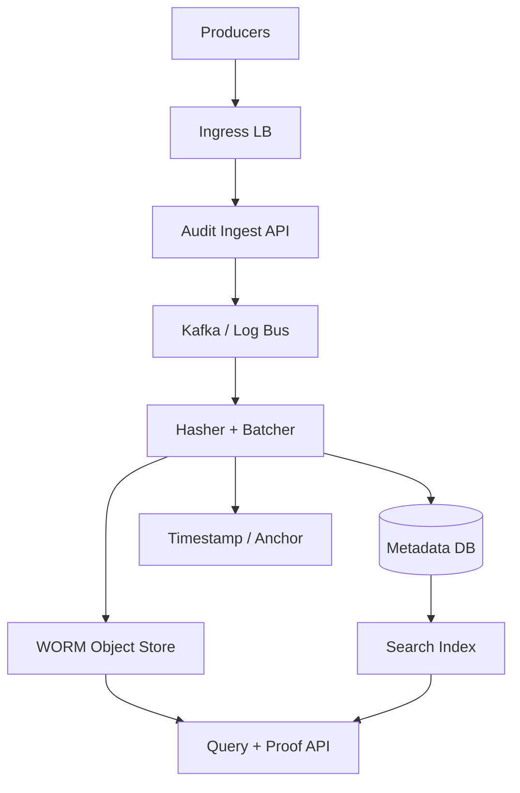
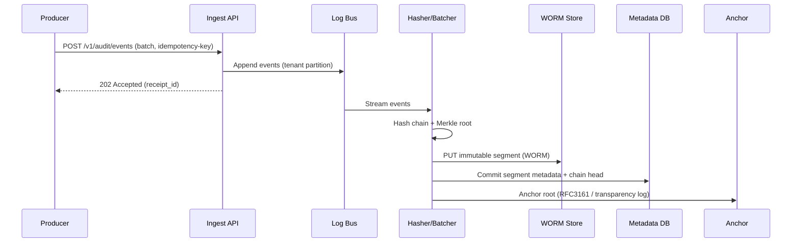

## Overview

An audit trail system is the backbone of compliance (SOX, HIPAA, PCI DSS, SOC 2) and incident forensics: it must reliably record security-relevant events (auth, authorization, data access, admin actions) and preserve them for years. The core challenge is not just ingesting logs at scale, but guaranteeing that once written, records cannot be altered or deleted without detection—despite insider threats, compromised credentials, or operational mistakes.

The key insight is to combine **WORM (Write-Once-Read-Many) immutable storage** with **cryptographic tamper-evidence** and **independent anchoring**. WORM prevents deletion/modification at the storage layer (retention + legal hold), while hash chaining / Merkle proofs make any attempted tampering detectable. An external anchor (e.g., RFC3161 timestamp authority or public transparency log) reduces trust in any single admin domain and strengthens evidentiary value.

## Requirements

### Functional Requirements
- Ingest audit events from services (REST/gRPC) with authentication, authorization, and per-tenant isolation.
- Enforce immutable retention policies (e.g., 1–7 years) and legal holds; prevent deletion/modification.
- Provide searchable queries by tenant, actor, action, resource, time range, and correlation/request ID.
- Produce cryptographic proofs (hash chain / Merkle inclusion) for individual events and batches.
- Support export for compliance (daily/weekly signed bundles) and forensic investigations.
- Detect and alert on gaps, reordering, duplicate submissions, and integrity violations.
- Provide administrative APIs for policy management, access control, and audit-reader permissions.
- Support multi-region durability and disaster recovery without weakening immutability guarantees.

### Non-Functional Requirements
- **Scale**:
  - Writes: 10K events/sec peak (~10K QPS), 2KB avg/event ⇒ ~20MB/s ingest.
  - Reads/search: 1K QPS peak; investigations can spike to heavy scans/exports.
  - Tenants: 10K; largest tenant 30% of traffic.
  - Retention: 5 years typical; total volume ~3PB (compression + tiering expected).
- **Latency**:
  - Ingest ack: P50 50ms, P99 250ms (ack after durable immutable commit).
  - Search query: P50 200ms, P99 2s (depends on index/selectivity).
  - Proof generation: P50 50ms, P99 300ms (precomputed roots).
- **Availability**:
  - Ingest: 99.99% monthly.
  - Query: 99.9% monthly (degraded search acceptable if raw retrieval works).
- **Consistency**:
  - **Write path**: strongly consistent durability for accepted events (ack only after immutable write + metadata commit).
  - **Search/index**: eventual consistency (seconds–minutes) acceptable.
- **Durability**:
  - Target: no acknowledged event lost (RPO=0 for acked writes).
  - Integrity: any modification/deletion must be detectable; unauthorized deletion must be prevented by WORM.

### Constraints & Assumptions
- Cloud-first design (can be mapped to AWS/GCP/Azure); on-prem equivalent uses immutable object storage + HSM.
- Compliance requires retention enforcement at the storage layer (not only application logic).
- A small platform team (6–10 engineers) operates the system; minimize bespoke crypto where possible.
- PII may appear in audit payloads; encrypt at rest, strict access controls, and configurable redaction.
- Network access controls and service identities (mTLS/OIDC) are available in the environment.

## High-Level Architecture



Producers (services, databases, admin consoles) send structured audit events to an ingest API. The ingest tier validates identity, schema, rate limits, and idempotency, then appends events to a durable log bus (Kafka/Pulsar). A stream processor batches events into immutable segments, computes cryptographic integrity structures (hash chains and Merkle roots), writes segments to WORM object storage, and commits metadata pointers.

Queries use a read API that pulls immutable payloads from WORM storage and leverages a separate search index for fast filtering. Integrity proofs are derived from stored hashes and anchored roots; anchoring (e.g., RFC3161 timestamp or transparency log) provides independent evidence that a particular root existed at a given time.

## Component Deep-Dive

### Audit Ingest API

**Responsibility**: Authenticate producers, validate and normalize events, enforce quotas, and provide durable acceptance semantics.

**Key Design Decisions**:
- **Idempotent ingest** using `Idempotency-Key` + content hash to prevent duplicates from retries.
- **Strict schema + versioning** (e.g., JSON Schema/Protobuf) to keep downstream indexing reliable and reduce “stringly-typed” audit logs.

**Technology Choice**: Envoy + gRPC/REST service (Go/Java), OIDC/mTLS for service identity, Kafka/Pulsar for buffering.

**Scaling Strategy**: Stateless horizontal scaling behind L7 load balancer; partition events by `(tenant_id, time_bucket)` into the log bus for even distribution and ordered batching.

---

### Log Bus (Kafka/Pulsar)

**Responsibility**: Absorb spikes, decouple ingestion from storage/indexing, and provide replay for recovery.

**Key Design Decisions**:
- **At-least-once** delivery with idempotent downstream processing (dedupe via event_id/content hash).
- **Partitioning strategy**: partitions keyed by `tenant_id` (or `tenant_id % N`) plus time to bound hot partitions.

**Technology Choice**: Kafka with ISR replication, idempotent producers, and exactly-once semantics where feasible; or Pulsar for tiered storage.

**Scaling Strategy**: Add partitions/brokers; isolate largest tenants into dedicated partition groups when needed.

---

### Hasher + Batcher (Stream Processor)

**Responsibility**: Convert an event stream into immutable segments, compute integrity structures, and commit to WORM storage + metadata.

**Key Design Decisions**:
- **Segmented append-only format** (e.g., 1 minute or 128MB per segment per tenant) to balance object count and query granularity.
- **Tamper-evidence**:
  - Per-tenant hash chain: `H_i = SHA-256(H_{i-1} || event_hash || metadata)`
  - Segment Merkle tree root to support compact inclusion proofs.
  - Periodic root anchoring (e.g., every 10 minutes, daily final root) to an independent system.

**Technology Choice**: Flink/Kafka Streams; cryptography via well-vetted libraries; KMS/HSM for signing roots.

**Scaling Strategy**: Parallel by bus partitions; compute Merkle trees per segment; backpressure under downstream slowness, with ingest throttling.

---

### WORM Object Store (Immutable Storage)

**Responsibility**: Store audit payload segments immutably for the full retention period.

**Key Design Decisions**:
- **Storage-enforced immutability** (e.g., S3 Object Lock in Compliance mode, Azure Immutable Blob, GCS Bucket Lock) with retention and legal hold.
- **Envelope encryption**: per-object DEK, encrypted with KMS; store encrypted payload + metadata and integrity fields.

**Technology Choice**: Cloud object storage with WORM + versioning + multi-region replication.

**Scaling Strategy**: Virtually unlimited; use prefix distribution and object sizing to avoid hot prefixes and small-object overhead.

---

### Query + Proof API

**Responsibility**: Search and retrieve audit events and generate/verifiy integrity proofs for compliance and forensics.

**Key Design Decisions**:
- **Dual-path read**: search index for discovery; WORM store as source of truth for returned payloads.
- **Proofs as first-class output**: inclusion proof + segment root + anchor evidence, enabling third-party verification.

**Technology Choice**: Stateless API service; Elasticsearch/OpenSearch for index; Redis for caching hot proofs/metadata.

**Scaling Strategy**: Scale read API horizontally; shard index by tenant and time; cache frequent queries and proof material.

## Data Model

### Storage Schema

**Event canonical form (logical)**:
- `event_id` (UUID ULID): globally unique.
- `tenant_id` (string)
- `ts` (int64 epoch millis, producer + server-received timestamps)
- `actor` (object): `type`, `id`, `ip`, `user_agent`
- `action` (string): e.g., `AUTH_LOGIN`, `READ_OBJECT`, `UPDATE_POLICY`
- `resource` (object): `type`, `id`, `attributes`
- `result` (enum): `ALLOW|DENY|ERROR`
- `request_id` / `correlation_id` (string)
- `payload` (object): event-specific details (bounded size; e.g., max 16KB)
- `content_hash` (bytes32): SHA-256 over canonical encoding
- `prev_chain_hash` (bytes32) and `chain_hash` (bytes32)
- `segment_id` (string), `segment_offset` (int32)

**WORM object (immutable segment)** (e.g., `tenant_id/yyyy/mm/dd/hh/mm/segment_id`):
- Header: schema version, segment time window, event count
- Events: encrypted canonical events (compressed)
- Integrity: Merkle tree nodes (or sufficient data to reconstruct), segment root
- Signature: `sig(segment_root, segment_metadata)` using KMS/HSM-backed key

**Metadata DB (append-only)**:
- `segments` table:
  - `segment_id` (PK)
  - `tenant_id`, `start_ts`, `end_ts`
  - `object_uri`, `object_etag`
  - `segment_root_hash`, `segment_signature`
  - `anchor_ref` (timestamp token / transparency log inclusion)
- `chain_heads` table (per tenant):
  - `tenant_id` (PK)
  - `last_chain_hash`
  - `last_event_ts`, `last_segment_id`
- `anchors` table:
  - `anchor_id` (PK)
  - `root_hash`, `ts`
  - `proof_blob_uri` (WORM or immutable store)

### Data Flow



Notes:
- The ingest API can return `202 Accepted` (durable in log bus) or `201 Created` (durable in WORM) depending on strictness needs. For compliance-grade “accepted == immutable,” use `201` only after WORM+metadata commit; otherwise `202` is faster but weaker semantics.

## API Design

### Ingest

`POST /v1/audit/events`
- Headers:
  - `Authorization: Bearer <token>` (service identity)
  - `Idempotency-Key: <uuid>`
- Request (JSON example):
  ```json
  {
    "tenant_id": "t_123",
    "events": [
      {
        "event_id": "01J0...ULID",
        "ts": 1734372000123,
        "actor": {"type":"user","id":"u_9","ip":"203.0.113.5"},
        "action": "READ_OBJECT",
        "resource": {"type":"file","id":"f_77"},
        "result": "ALLOW",
        "request_id": "req_abc",
        "payload": {"path":"/finance/q4.pdf"}
      }
    ]
  }
  ```
- Response:
  - `201 Created` (strict): `{ "receipt_id": "...", "segment_hint": "...", "accepted_count": 100 }`
  - or `202 Accepted` (async): `{ "receipt_id": "...", "accepted_count": 100 }`
- Errors:
  - `400` invalid schema/size; `401/403` authz; `409` idempotency conflict (same key, different body); `429` quota; `503` temporary.
- Idempotency:
  - Store `(tenant_id, idempotency_key) -> content_hash, receipt_id, status` for 24h+.
  - If same key+hash: return same response; if mismatch: `409`.

### Query/Search

`GET /v1/audit/events?tenant_id=...&start_ts=...&end_ts=...&actor_id=...&action=...&cursor=...`
- Response:
  ```json
  {
    "events": [
      {
        "event": { "...": "..." },
        "proof": { "segment_id":"...", "merkle_path":[...], "segment_root":"...", "anchor_ref":"..." }
      }
    ],
    "next_cursor": "..."
  }
  ```
- Consistency:
  - Search results may be slightly delayed; returned events always fetched/validated against WORM segment and hashes.

### Proofs and Verification

`GET /v1/audit/proofs/{event_id}?tenant_id=...`
- Returns inclusion proof + segment signature + anchor token reference.

`POST /v1/audit/verify`
- Request: `{ "event": {...}, "proof": {...} }`
- Response: `{ "valid": true, "checks": { "hash_chain": true, "merkle": true, "signature": true, "anchor": true } }`

### Policy/Admin

`POST /v1/audit/policies`
- Configure retention duration, legal hold rules, tenant quotas, allowed producers, and reader roles.
- Enforce “two-person rule” for decreasing retention or removing legal hold (where allowed).

## Scaling & Performance

### Bottleneck Analysis
- **Indexing throughput**: search index writes can lag under high ingest.
  - Mitigation: async indexing pipeline, bulk indexing, time-based indices, backpressure + priority for security-critical tenants.
- **Hot tenants**: one tenant dominates partitions.
  - Mitigation: split tenant into multiple partitions by `(tenant_id, hash(actor_id))` while preserving chain at segment level; compute per-substream chains and combine with higher-level Merkle root.
- **Proof computation**: generating Merkle paths on-demand can be CPU-heavy.
  - Mitigation: store minimal Merkle proof material per segment, cache proofs, precompute roots/signatures.

### Horizontal Scaling
- **Ingest API**: stateless; scale by CPU/network; rate-limit per tenant and per producer.
- **Log bus**: add brokers/partitions; isolate noisy tenants; ensure replication factor (>=3).
- **Stream processor**: scale with partitions; checkpoint state to durable store.
- **Search index**: shard by tenant+time; hot/warm architecture for cost; rollover daily indices.
- **Metadata DB**: partition by tenant; write-optimized (append); read replicas for queries.

### Caching Strategy
- Cache segment metadata (`segment_id -> object_uri, roots, signatures`) in Redis, TTL 1–24h.
- Cache frequently requested proofs and recent query pages.
- Avoid caching raw event payloads broadly (sensitive); prefer caching proof/material and metadata.
- Invalidation: mostly TTL-based since WORM data is immutable; metadata updates are append-only.

## Trade-offs & Alternatives

### Key Trade-offs Made
- **Chosen**: WORM object storage + hash/Merkle proofs  
  **Sacrificed**: simpler “DB-only” logging  
  **Why**: DB-only immutability is hard to guarantee against privileged insiders; storage-enforced immutability is stronger.
- **Chosen**: Eventual-consistent search index  
  **Sacrificed**: immediately searchable writes  
  **Why**: decoupling indexing protects ingest durability and keeps cost/ops manageable at high write rates.
- **Chosen**: Anchoring roots periodically (minutes/daily)  
  **Sacrificed**: per-event anchoring  
  **Why**: anchoring each event is expensive; batching preserves strong evidence while controlling cost/latency.

### Alternative Approaches
- **Append-only ledger DB (e.g., AWS QLDB)**: strong cryptographic verification built-in, but vendor-specific and can be costlier at PB scale; still often paired with WORM exports.
- **Blockchain anchoring per event**: high integrity but high cost/latency and operational complexity; batching roots is more practical.
- **Filesystem WORM appliance** (on-prem): viable for regulated environments, but adds hardware ops burden and may limit elasticity versus cloud object storage.

## Failure Modes & Mitigations

### Failure Scenarios
- **Scenario**: Log bus partition unavailable  
  **Impact**: ingest throttling or partial tenant outage  
  **Detection**: broker ISR shrink, producer retries, lag alarms  
  **Mitigation**: multi-AZ replication, automated leader election, per-tenant backpressure and retry with idempotency.
- **Scenario**: WORM store region outage  
  **Impact**: cannot finalize immutable segments; ingest may degrade  
  **Detection**: elevated PUT failures/latency  
  **Mitigation**: multi-region replication, failover to secondary region for new writes; queue in bus until store recovers.
- **Scenario**: KMS/HSM outage or throttling  
  **Impact**: cannot encrypt/sign segments; writes stall  
  **Detection**: KMS error rates, signing latency  
  **Mitigation**: KMS multi-region keys, client-side envelope cache with strict TTL, capacity reservations.
- **Scenario**: Insider attempts deletion/modification  
  **Impact**: forensic evidence risk  
  **Detection**: WORM prevents deletes; integrity verifier detects chain/root mismatch; audit-reader alerts  
  **Mitigation**: Compliance-mode retention, separate duties, break-glass with alerting, external anchoring.
- **Scenario**: Clock skew / timestamp manipulation  
  **Impact**: ordering and legal timelines questioned  
  **Detection**: NTP drift alarms, server-received timestamp comparisons  
  **Mitigation**: store both producer and server timestamps; anchor includes trusted time; enforce max skew policy.

### Disaster Recovery
- **Targets**: RPO=0 for acknowledged immutable writes; RTO=1 hour for ingest, 4 hours for full query capability.
- **Backup strategy**:
  - Metadata DB: continuous backups + point-in-time recovery.
  - Search index: snapshot to object storage (non-authoritative; can be rebuilt).
  - WORM segments: rely on storage replication + immutability; do not “rewrite” backups that could violate WORM semantics.
- **Failover**:
  - Pre-provision secondary region with bus, processor, metadata replicas, and read services.
  - DNS/traffic failover; processors resume from bus offsets; rebuild index if needed.

## Operational Considerations

### Monitoring & Alerting
- Ingest: QPS, error rates, p99 latency, `429` rate-limit counts, idempotency conflicts.
- Log bus: partition lag, ISR health, disk utilization, under-replicated partitions.
- Processor: checkpoint success, processing lag, segment finalization rate, hash/root mismatch counters (should be zero).
- WORM: PUT/GET error rates, replication status, retention configuration drift alarms.
- Security: admin actions, policy changes, failed verification, unusual query patterns (exfiltration risk).

### Deployment Strategy
- Blue/green or canary for ingest and query services; feature flags for schema versions.
- Stream processor rollouts with state compatibility checks and staged upgrades.
- Rollback: stateless services rollback instantly; processor rollback requires checkpoint compatibility; keep prior job version until stable.
- Change management for retention/policy: approval workflows, audit every policy change into the same system.

## References & Further Reading
- AWS S3 Object Lock (WORM) and Compliance mode: https://docs.aws.amazon.com/AmazonS3/latest/userguide/object-lock.html
- Azure Immutable Blob Storage: https://learn.microsoft.com/azure/storage/blobs/immutable-storage-overview
- Google Cloud Bucket Lock: https://cloud.google.com/storage/docs/bucket-lock
- RFC 3161 Time-Stamp Protocol (TSP): https://www.rfc-editor.org/rfc/rfc3161
- Certificate Transparency / append-only logs (conceptual): https://certificate.transparency.dev/
- Trillian (transparency log framework): https://github.com/google/trillian
- Kafka Idempotent Producer + EOS semantics: https://kafka.apache.org/documentation/