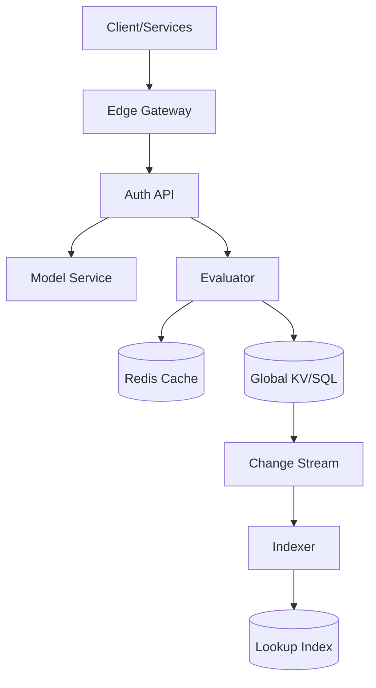
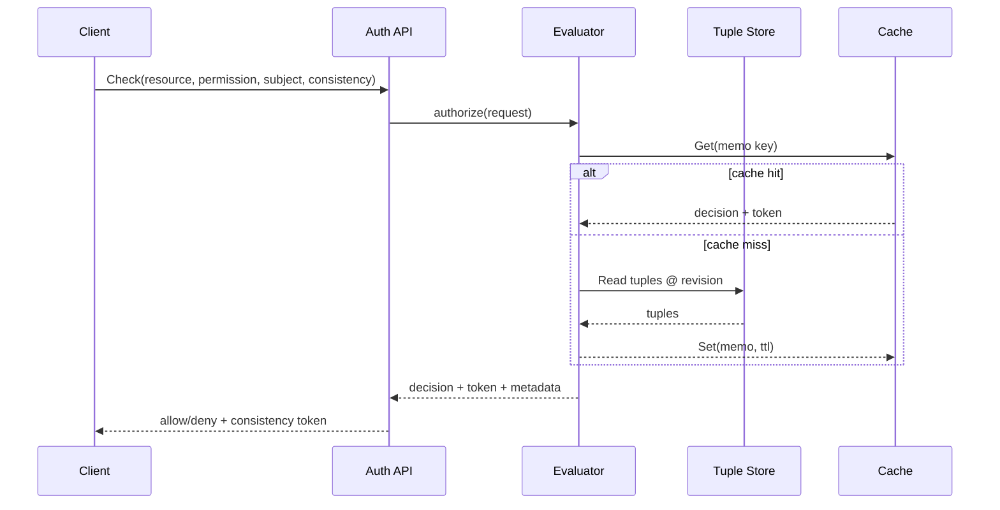

## Overview

A global relationship-based access control (ReBAC) service answers questions like “Can user U `view` document D?” by evaluating a graph of relationships (e.g., `doc:123#viewer@user:alice`, `doc:123#viewer@group:eng#member`) under a developer-defined authorization model. The challenge is serving these checks at very low latency (single-digit milliseconds at the edge) while supporting high write rates, model evolution, and correctness guarantees that prevent privilege escalation.

The key insight behind a Zanzibar-style design is to treat authorization as a *data problem with bounded staleness*: store relationship tuples in a globally consistent datastore, evaluate permission logic using a compiled model, and return a decision along with a *consistency token* (a “snapshot” timestamp/revision). Clients can trade off freshness vs latency by selecting a consistency mode (e.g., “fully consistent”, “at least as fresh as token T”, or “best effort”). Caching and precomputation accelerate reads, but correctness is anchored in the authoritative tuple store and model versioning.

## Requirements

### Functional Requirements
- Create, delete, and read relationship tuples (e.g., `resource#relation@subject`), with idempotent writes.
- Define and version an authorization model (types, relations, permission rules) and evaluate checks against a specific model revision.
- `Check` API: determine if a subject has a permission on a resource; return a consistency token.
- `Expand` API: explain/expand why a permission holds (graph expansion), bounded by limits.
- `LookupResources` API: list resources of a type that a subject can access for a permission, with pagination.
- `LookupSubjects` API: list subjects who have a permission on a resource, with pagination.
- Audit-friendly observability: request tracing, decision metadata (model id, revision), and optional decision logs.

### Non-Functional Requirements
- **Scale**: 50K QPS peak `Check` globally; 5K QPS relationship writes; 10B relationship tuples total; 200M principals; 5M resource types/tenants (multi-tenant).
- **Latency**: `Check` P50 5ms, P99 30ms (same region); cross-region P99 80ms; `WriteRelationships` P99 150ms.
- **Availability**: 99.99% for `Check`; 99.9% for writes (degraded modes allowed).
- **Consistency**: Strong consistency for writes and “fully consistent” reads; bounded-staleness/eventual for cached reads when requested; monotonic reads via consistency tokens.
- **Durability**: RPO ≤ 1 minute for relationship tuples and models; no silent data loss; backups verifiable.

### Constraints & Assumptions
- Multi-tenant: strict tenant isolation (data + rate limits + encryption boundaries).
- Typical authorization graph depth is small (median 2–4 edges), but worst-case exists; enforce evaluation limits.
- Compliance: SOC2-style audit trails; encryption in transit and at rest; data residency support (EU/US).
- Team constraint: small platform team (6–10 engineers) → favor managed primitives and well-known patterns.

## High-Level Architecture

The system separates *serving* (low-latency `Check`) from *indexing* (efficient `Lookup*`) while keeping a single source of truth for relationship tuples and model versions. The Auth API authenticates callers, enforces tenant isolation, and routes requests to the Evaluator with the appropriate model revision and consistency mode.

The Evaluator resolves permissions by reading tuples from the authoritative store and optionally using caches keyed by (tenant, model_id, revision, resource, permission, subject). For `LookupResources/LookupSubjects`, a derived index is maintained asynchronously from the tuple change stream; these endpoints support consistency tokens and can either (a) read from the index at/after a revision or (b) fall back to online evaluation for correctness under stricter modes.

## Component Deep-Dive

### Edge Gateway

**Responsibility**: TLS termination, authn (mTLS/JWT), rate limiting, request shaping, and regional routing.

**Key Design Decisions**:
- Enforce per-tenant quotas and burst limits at the edge to protect the core store and prevent noisy-neighbor issues.
- Route to nearest region for reads; route writes to tenant’s home region (or multi-home) to control consistency.

**Technology Choice**: Envoy + OPA/ExtAuthz (or managed API gateway) with mTLS, JWT validation, and per-tenant rate limit service.

**Scaling Strategy**: Stateless horizontal scaling behind Anycast/L7 LB; cache public keys and policies; isolate hot tenants via dedicated pools.

### Auth API

**Responsibility**: Public API surface, request validation, idempotency, tenancy, and policy/model selection.

**Key Design Decisions**:
- First-class idempotency keys for write APIs to safely retry under timeouts.
- Explicit consistency modes: `fully_consistent`, `at_least_as_fresh(token)`, `best_effort` to make freshness trade-offs visible.

**Technology Choice**: gRPC for internal + external (optional REST gateway). Strong typed protos reduce ambiguity and improve latency.

**Scaling Strategy**: Stateless; autoscale on CPU + concurrency; shed load for expensive endpoints (`Expand`, `Lookup*`) via admission control.

### Model Service

**Responsibility**: Store, validate, and version authorization models (schemas and permission expressions) per tenant.

**Key Design Decisions**:
- Compile model to an IR (bytecode/AST) and cache by `(tenant, model_id)` to make evaluation fast and deterministic.
- Validate model changes with static checks (cycle detection, type correctness, max expansion bounds) before activation.

**Technology Choice**: Same authoritative store as tuples for transactional model updates; optional separate config store if needed.

**Scaling Strategy**: Read-heavy caching; write rate is low; replicate compiled models to all regions.

### Evaluator

**Responsibility**: Execute `Check/Expand` by traversing relationship graph and applying model rules with limits.

**Key Design Decisions**:
- Use a snapshot/revision (consistency token) to guarantee repeatable reads and avoid “split-brain” decisions during concurrent writes.
- Enforce evaluation budgets: max depth (e.g., 10), max visited nodes (e.g., 10K), and timeouts (e.g., 20ms) to prevent worst-case blowups.

**Technology Choice**: In-memory graph traversal with memoization; Redis for short-lived memo caches; structured tracing for explainability.

**Scaling Strategy**: Stateless workers; shard cache keys by tenant; co-locate with store replicas; circuit-break to `best_effort` when store tail latency spikes.

### Storage + Indexing

**Responsibility**: Persist relationship tuples and serve point/range queries; maintain derived lookup indexes for reverse queries.

**Key Design Decisions**:
- Authoritative tuple store provides global consistency + change stream (logical CDC) for downstream indexing.
- Lookup index is eventually consistent by default, but can be revision-aware (store per-row “indexed_at_revision” watermark) to support “at least as fresh” queries.

**Technology Choice**:
- Tuple store: Google Spanner / CockroachDB / Yugabyte (global SQL with MVCC + bounded staleness reads).
- Change stream: built-in CDC to Kafka/PubSub.
- Lookup index: Elastic/OpenSearch (for large fanout) or Bigtable/DynamoDB/Cassandra (for key-based inverted indexes), depending on query patterns.

**Scaling Strategy**: Partition by `(tenant_id, resource_type, resource_id_hash)`; separate read replicas for `Check`; scale indexer consumers by partitions.

## Data Model

### Storage Schema

**Relationship Tuples (authoritative)**
- `relationship_tuples`
  - `tenant_id` (STRING, PK part)
  - `resource_type` (STRING, PK part) — e.g., `document`
  - `resource_id` (STRING, PK part)
  - `relation` (STRING, PK part) — e.g., `viewer`
  - `subject_type` (STRING, PK part) — e.g., `user`, `group`
  - `subject_id` (STRING, PK part)
  - `subject_relation` (STRING, PK part, nullable) — for subject sets, e.g., `member`
  - `caveat_name` (STRING, nullable) — optional conditional relationship
  - `caveat_context` (JSON/BYTES, nullable)
  - `created_at` (TIMESTAMP)
  - `deleted_at` (TIMESTAMP, nullable) — soft delete for audit/tombstones
  - `write_id` (STRING) — idempotency correlation / dedupe

**Authorization Models**
- `auth_models`
  - `tenant_id` (STRING, PK part)
  - `model_id` (STRING, PK part)
  - `version` (INT64, PK part) — monotonic
  - `dsl` (TEXT/BYTES)
  - `compiled_ir` (BYTES)
  - `created_at` (TIMESTAMP)
  - `state` (ENUM: `active`, `deprecated`)

**Revisions / Tokens**
- Consistency token encodes `(tenant_id, store_timestamp/revision, model_id, model_version)`.

**Lookup Index (derived, example inverted index)**
- `subject_access_index`
  - `tenant_id`, `subject_type`, `subject_id`, `permission`, `resource_type` (PK parts)
  - `resource_id` (clustering)
  - `indexed_at_revision` (INT64)
- `resource_subject_index` (optional symmetric)
  - `tenant_id`, `resource_type`, `resource_id`, `permission` (PK parts)
  - `subject_type`, `subject_id` (clustering)
  - `indexed_at_revision` (INT64)

### Data Flow

- `WriteRelationships`: Auth API writes tuples transactionally to the store and returns a new revision token.
- CDC emits changes to a stream; indexer updates lookup indexes asynchronously and advances per-tenant watermarks.
- `LookupResources/LookupSubjects`: read from lookup index when its watermark satisfies requested consistency; otherwise fall back to online evaluation (slower but correct).

## API Design

### gRPC (recommended)

**WriteRelationships**
- `POST /v1/relationships:write` (REST gateway) or `WriteRelationships(WriteRelationshipsRequest) -> WriteRelationshipsResponse`
- Request:
  - `tenant_id`, `model_id`, `writes[]`, `deletes[]`, `idempotency_key`
  - Tuple: `{resource, relation, subject, caveat?}`
- Response:
  - `written_at_token` (consistency token), `status`
- Errors:
  - `ALREADY_EXISTS`/`NOT_FOUND` (depending on operation semantics), `FAILED_PRECONDITION` (model mismatch), `RESOURCE_EXHAUSTED` (rate limit)
- Idempotency:
  - Deduplicate by `(tenant_id, idempotency_key)` with stored outcome and token.

**Check**
- `Check(CheckRequest) -> CheckResponse`
- Request:
  - `tenant_id`, `model_id`, `resource`, `permission`, `subject`
  - `consistency`: `FULLY_CONSISTENT | AT_LEAST_AS_FRESH(token) | BEST_EFFORT`
  - `context` (for caveats/ABAC attributes)
- Response:
  - `allowed: bool`, `decision_token`, `evaluated_model_version`, `trace_id`
- Errors:
  - `INVALID_ARGUMENT` (bad resource format), `DEADLINE_EXCEEDED` (budget hit), `FAILED_PRECONDITION` (token/model mismatch)

**Expand**
- `Expand(ExpandRequest) -> ExpandResponse`
- Returns a bounded proof tree (or a summarized DAG) with truncation markers.

**LookupResources**
- `LookupResources(LookupResourcesRequest) -> stream LookupResourcesResponse` (or paginated)
- Must specify `resource_type`, `permission`, `subject`, `page_size`, `page_token`.
- Consistency-aware; can return partial results only if explicitly requested.

**LookupSubjects**
- Symmetric to `LookupResources`, scoped to a resource.

## Scaling & Performance

### Bottleneck Analysis
- **Tuple store read amplification** during graph traversal: mitigate with memoization, batching, and tuple adjacency indexes.
- **High fanout relations** (e.g., large groups): mitigate with subject-set edges, precomputed membership materialization for common paths, and evaluation limits.
- **Lookup queries** are inherently expensive without indexes: mitigate via derived inverted indexes and streaming pagination.
- **Hot resources/tenants**: mitigate with per-tenant sharding, dedicated cache partitions, and adaptive rate limits.

### Horizontal Scaling
- **Edge/Auth/Evaluator**: stateless autoscaling; isolate “expensive” endpoints on separate pools.
- **Tuple store**: partition by tenant and resource; use read replicas/follower reads for `best_effort`/bounded staleness.
- **Indexer + lookup store**: scale consumers by stream partitions; partition indexes by subject/resource prefixes.

### Caching Strategy
- **Evaluator memo cache (Redis)**: cache intermediate sub-checks like `(tenant, revision, object#perm, subject)` TTL 5–30s; include revision in key to prevent stale privilege grants.
- **Model cache**: cache compiled model by `(tenant, model_id, version)` with long TTL and explicit invalidation on activation.
- **Negative caching**: short TTL (1–5s) to reduce repeated denies without making newly granted access slow to appear.
- **Invalidation**: revision-keyed caching avoids global invalidation; for `best_effort` mode, allow serving slightly stale decisions with bounded TTL.

## Trade-offs & Alternatives

### Key Trade-offs Made
- **Chosen**: Revision/token-based consistency.
  - **Sacrificed**: Simplicity in client APIs (clients must pass/handle tokens).
  - **Why**: Enables low-latency reads with explicit correctness semantics and safe caching.
- **Chosen**: Separate derived lookup indexes for `Lookup*`.
  - **Sacrificed**: Additional infra and eventual consistency surface.
  - **Why**: Makes “list what I can access” feasible at scale without online graph evaluation per candidate.
- **Chosen**: Evaluation limits and truncation for `Expand`.
  - **Sacrificed**: Complete explanations in pathological graphs.
  - **Why**: Protects availability and latency under adversarial or accidental worst cases.

### Alternative Approaches
- **RBAC-only (roles/groups)**: simpler, but insufficient for rich resource hierarchies and delegation patterns common in modern apps.
- **Inline ACLs per resource (document contains full ACL list)**: fast checks for single resource, but poor for lookups, group nesting, and global operations; update fanout is large.
- **Policy engine only (OPA/ABAC) without relationship graph**: expressive, but expensive for joins/graph traversal; hard to make low-latency and explainable at global scale.

## Failure Modes & Mitigations

### Failure Scenarios
- **Scenario**: Tuple store tail latency spike or partial outage.
  - **Impact**: `Check` P99 increases; timeouts may deny access or fail open depending on client policy.
  - **Detection**: Store latency SLO burn, increased evaluator retries/timeouts.
  - **Mitigation**: Serve `best_effort` via follower reads; use cached decisions; apply load shedding for `Expand/Lookup*`.
- **Scenario**: Stale/incorrect cache entries granting access.
  - **Impact**: Potential privilege escalation.
  - **Detection**: Token mismatch audits; anomaly detection comparing cached vs recomputed sample.
  - **Mitigation**: Revision-keyed caches, short TTLs, and “deny by default” on ambiguity; periodic cache correctness sampling.
- **Scenario**: Indexer lag causes `LookupResources` missing newly granted access.
  - **Impact**: UX inconsistency (can access but not listed).
  - **Detection**: Per-tenant watermark lag metrics; stream consumer backlog.
  - **Mitigation**: Consistency-aware queries that fall back to online evaluation when watermark < requested token; autoscale indexers.
- **Scenario**: Bad model deployment (semantic bug).
  - **Impact**: Widespread incorrect auth decisions.
  - **Detection**: Canary tenants, shadow evaluation vs previous model, spike in denies/allows.
  - **Mitigation**: Versioned models with instant rollback; staged rollout; automated validation and policy tests.
- **Scenario**: Cycles / explosive graph traversal.
  - **Impact**: Elevated CPU, timeouts, partial outage.
  - **Detection**: Budget exhaustion metrics, high recursion depth/visited nodes.
  - **Mitigation**: Cycle detection, memoization, strict limits, and schema validation preventing dangerous constructs.

### Disaster Recovery
- **RTO/RPO**: RTO 30 minutes (regional), RPO 1 minute (tuples/models).
- **Backup strategy**: Continuous PITR for tuple store; daily full backups; restore drills; checksum verification.
- **Failover procedures**: Multi-region store configuration; automated regional failover for reads; controlled write failover with fencing to avoid split-brain (single-writer per tenant or strongly consistent multi-writer DB).

## Operational Considerations

### Monitoring & Alerting
- Key metrics:
  - `Check` allow/deny rates, P50/P95/P99 latency, timeout rate, budget-exceeded rate
  - Tuple store read/write latency and error rates
  - Cache hit ratio, evictions, memory pressure
  - Indexer lag (watermarks), backlog, reprocessing rate
  - Per-tenant QPS, throttles, and hot-key detection
- Alert thresholds:
  - SLO burn alerts (multi-window) for `Check` availability and P99 latency
  - Indexer watermark lag > 60s for top tenants
  - Error rate > 0.5% for `Check` over 5 minutes

### Deployment Strategy
- Use progressive delivery: canary → 10% → 50% → 100% by region/tenant.
- Backward-compatible model and API changes; enforce model version pinning in requests.
- Rollback: keep N previous evaluator builds and model versions; instant rollback via traffic shifting and model activation toggles.

## References & Further Reading

- Zanzibar: “Google’s Consistent, Global Authorization System” (USENIX ATC 2019): https://www.usenix.org/conference/atc19/presentation/pang
- SpiceDB (open-source Zanzibar-inspired): https://github.com/authzed/spicedb
- OpenFGA (Zanzibar-inspired): https://openfga.dev/
- OPA (policy engine, useful for ABAC/caveats): https://www.openpolicyagent.org/
- Spanner TrueTime and external consistency (for global revisions): https://cloud.google.com/spanner/docs/true-time-external-consistency