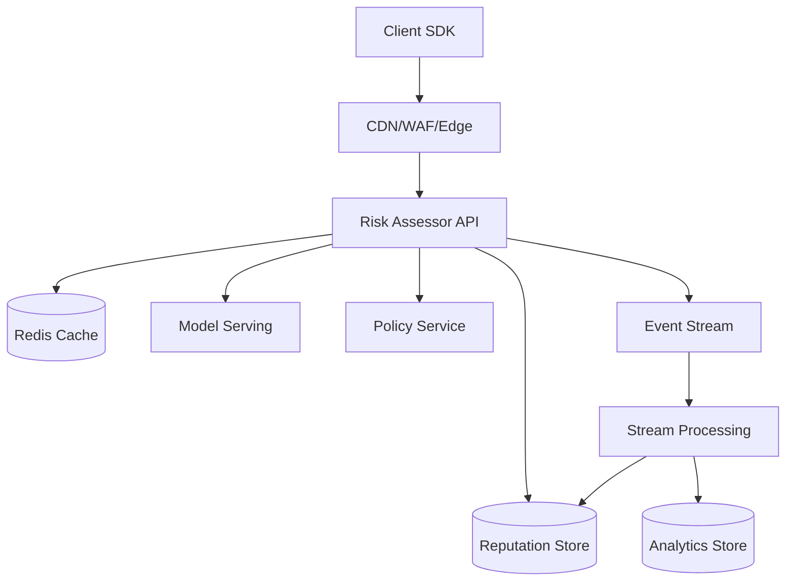
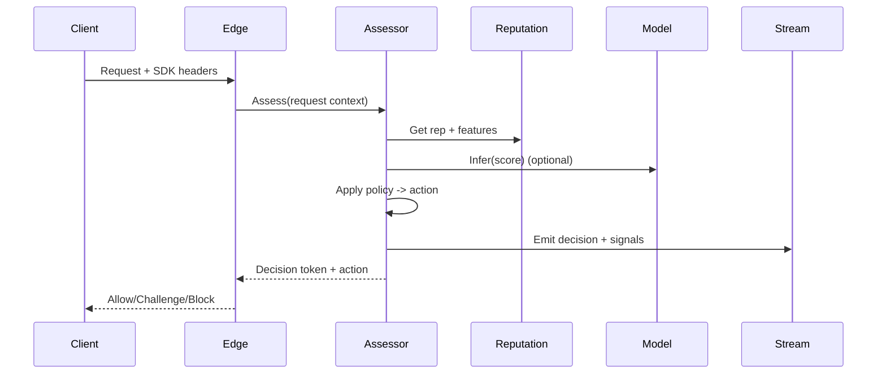

## Overview

Modern automated attacks rarely look like “obvious” bots: they rotate IPs via residential proxies, replay real browser fingerprints, mimic human pacing, and target high-value endpoints (login, signup, checkout, inventory, scraping). A production bot detection system must make high-confidence decisions under tight latency budgets while minimizing false positives that harm legitimate users and revenue.

The key insight is to treat bot defense as a **real-time risk assessment pipeline**: collect multi-layer signals (edge + client + server), transform them into stable identities and behavior features, combine **reputation + rules + ML scoring**, and enforce **graduated actions** (allow, monitor, rate-limit, step-up challenge, block). The system must continuously learn from outcomes (fraud reports, account takeovers, chargebacks, challenge success) to adapt to evolving attacker strategies.

## Requirements

### Functional Requirements
- Generate a **risk assessment** for each protected request (e.g., `/login`, `/signup`, `/checkout`, `/api/*`) returning an action: allow / allow+monitor / challenge / rate-limit / block.
- Perform **device fingerprinting** (first-party JS/mobile SDK + server-side hints) and map to a stable `device_id` with confidence.
- Run **behavioral analysis**: session velocity, navigation patterns, typing/mouse/touch signals (where available), request graph features, anomaly detection.
- Maintain **reputation scoring** for IPs, ASNs, CIDRs, device IDs, accounts, and token identifiers (good/bad/unknown with decay).
- Support **policy management**: rules per endpoint, per tenant/app, per geo, per risk band; ability to override via allowlists/blocklists.
- Provide **step-up challenges** (CAPTCHA, WebAuthn, email OTP) with verification and binding to session/device.
- Offer **investigation & analytics**: searchable events, decision reason codes, replay of assessments, and cohort analysis.
- Support **feedback ingestion** from downstream systems (fraud confirmed, ATO, user complaint, chargeback, successful login) to close the loop.

### Non-Functional Requirements
- **Scale**: 50K sustained QPS assessments (burst 200K QPS); telemetry up to 300K events/sec; 5–10B signals/day (~5–15 TB/day compressed).
- **Latency** (critical path = request-time decision):
  - P50: 10–20ms at edge/service
  - P99: ≤75ms decision latency (excluding challenge render)
- **Availability**: 99.99% for decisioning; graceful degradation without taking down protected apps.
- **Consistency**:
  - Strong consistency for policy/rules updates (seconds-level propagation OK).
  - Eventual consistency for reputation aggregation and ML feature updates (minutes-level acceptable).
- **Durability**: No loss of policy; telemetry can tolerate small drops (≤0.1%) during overload; decisions/audit logs retained with ≥99.999% durability.

### Constraints & Assumptions
- Multi-tenant SaaS supporting multiple applications; each tenant has isolated policy namespaces.
- Privacy/compliance: GDPR/CCPA; minimize PII, avoid raw biometrics; store fingerprints as salted hashes; configurable retention (e.g., 30–180 days).
- Attackers can execute JavaScript, use headless browsers, rotate IPs, and farm challenge solves; assume adversarial environment.
- Small platform team (5–10 engineers): prefer managed primitives where possible; operational simplicity matters.

## High-Level Architecture



The system splits into a **synchronous decision path** and an **asynchronous learning path**. The synchronous path (Edge + Assessor) must be low-latency and highly available, relying on fast caches, a reputation store optimized for reads, and a model server for inference. The asynchronous path ingests telemetry and outcomes into a stream, computes aggregates/features, updates reputations, and writes to analytics for investigation and tuning.

This structure isolates hard real-time requirements from heavy computation: complex feature engineering and long-window aggregation happen off the critical path, while the decision service consumes precomputed features and lightweight real-time signals.

## Component Deep-Dive

### Client SDK (Web/Mobile)

**Responsibility**: Collect device/behavior signals and bind them to sessions safely (first-party context), then send telemetry and request annotations.

**Key Design Decisions**:
- Prefer **first-party JS served from customer domain** (CNAME) to reduce adblock/cross-site restrictions and improve signal quality.
- Use **progressive signal collection**: minimal required signals for initial request; richer behavior signals over session to reduce first-load overhead.

**Technology Choice**: TypeScript web SDK + native iOS/Android SDKs; signed telemetry with rotating keys; Web Crypto for local hashing.

**Scaling Strategy**: Stateless; edge-cached SDK assets; sampling controls (e.g., 1–10% for low-risk endpoints).

---

### Edge Enforcement (CDN/WAF + Gateway Plugin)

**Responsibility**: Fast pre-filtering, rate limiting, header normalization, bot signature checks, and enforcement of decisions (block/challenge).

**Key Design Decisions**:
- Do **cheap checks at edge** (known bad IPs, volumetric limits) to protect origin and decision service.
- Use **token-bound decisions**: decision tokens (JWT/PASETO) issued by Assessor, validated at edge to avoid re-calling on every request.

**Technology Choice**: Cloudflare/Akamai/Fastly + WAF rules; Envoy/Nginx gateway with WASM/Lua plugin.

**Scaling Strategy**: Global anycast; per-pop caches; edge KV for hot blocklists.

---

### Risk Assessor API (Decision Service)

**Responsibility**: Compute per-request risk score, decide action via policy, and emit auditable reasons.

**Key Design Decisions**:
- Two-stage scoring: **rules/reputation gating** first, then **ML inference** when needed to control cost/latency.
- Return **reason codes + TTL** to make decisions explainable and cacheable while limiting attacker learning.

**Technology Choice**: Go/Rust service; gRPC internal, REST external; Redis for request cache; circuit breakers to model server.

**Scaling Strategy**: Stateless horizontal scaling; shard-safe caches; adaptive sampling and load shedding by endpoint risk.

---

### Reputation & Feature Stores

**Responsibility**: Serve fast lookups for IP/device/account reputation and rolling-window features; accept updates from streaming jobs.

**Key Design Decisions**:
- Separate **hot key-value reputation** (fast reads) from **append-only event analytics** (heavy queries).
- Use **time-decayed scores** with confidence and evidence counters to avoid permanent poisoning.

**Technology Choice**:
- Hot store: Redis Cluster + persistence or Aerospike.
- Durable wide-column: Cassandra/ScyllaDB for identities and reputations.
- Analytics: ClickHouse/Druid/BigQuery for exploration.

**Scaling Strategy**: Partition by `tenant_id` + hash(identity); multi-region replication for reads; background compaction and TTL-based retention.

---

### Streaming + Detection Pipeline

**Responsibility**: Ingest telemetry/outcomes, compute aggregates/features, update reputations, and feed model training.

**Key Design Decisions**:
- Use **event-time windows** (1m/5m/1h/24h) to handle late arrivals and clock skew.
- Maintain **feature versioning** to keep online/offline parity and allow safe model rollouts.

**Technology Choice**: Kafka/Pulsar + Flink/Spark Structured Streaming; feature registry (e.g., Feast-like) backed by Redis/Cassandra + object storage for offline.

**Scaling Strategy**: Partition topics by `tenant_id` and high-cardinality identity; autoscale consumers; backpressure to protect downstream.

## Data Model

### Storage Schema

**1) Device Identity (`device_identity`)**
- `tenant_id` (pk part)
- `device_id` (pk part, ULID)
- `fp_hash` (salted hash of normalized fingerprint)
- `fp_confidence` (0–1)
- `first_seen_at`, `last_seen_at`
- `attributes` (json: platform, os, browser, locale, tz, hw hints)
- `risk_tags` (set: headless_suspected, emulator_suspected, etc.)
- TTL: 90–180 days configurable

**2) Reputation (`reputation_entity`)**
- `tenant_id` (pk part)
- `entity_type` (ip|cidr|asn|device|account|session)
- `entity_id` (pk part; e.g., `ip:203.0.113.4`)
- `score` (float, -100..+100)
- `confidence` (0–1)
- `evidence_counts` (map: reason_code -> count)
- `updated_at`
- TTL: type-specific (IP shorter, device longer)

**3) Decisions (`decision_log`)** (analytics store)
- `tenant_id`
- `request_id`
- `timestamp`
- `endpoint`
- `ip`, `asn`, `country`
- `device_id`, `session_id`, `account_id?`
- `risk_score`, `action`, `reason_codes[]`
- `challenge_id?`, `challenge_result?`
- `latency_ms`
- Retention: 30–90 days typical

**4) Feedback (`outcome_event`)**
- `tenant_id`
- `event_id`
- `timestamp`
- `type` (fraud_confirmed|ato|chargeback|user_report|false_positive|challenge_pass)
- `links` (request_id, device_id, account_id, ip)
- `metadata` (json)

### Data Flow



## API Design

### `POST /v1/assess`
Assess a single request for bot risk.

**Request**
```json
{
  "tenant_id": "t_123",
  "request_id": "req_01J...",
  "timestamp": 1734400000,
  "endpoint": "/login",
  "http": { "method": "POST", "path": "/login" },
  "network": { "ip": "203.0.113.4", "user_agent": "..." },
  "session": { "session_id": "s_...", "account_id": "u_..." },
  "signals": { "sdk_token": "...", "fp_hint": "...", "behavior_hint": "..." }
}
```

**Response**
```json
{
  "action": "CHALLENGE",
  "risk_score": 87,
  "decision_ttl_ms": 60000,
  "reason_codes": ["IP_REP_BAD", "VELOCITY_HIGH"],
  "decision_token": "eyJ...",
  "challenge": { "type": "CAPTCHA", "challenge_id": "ch_01J..." }
}
```

**Error Handling**
- `400` invalid schema; `401/403` auth; `429` throttled; `503` degraded mode.
- On `503`, edge policy should default to **fail-open for low-risk endpoints** and **fail-closed or challenge for high-risk endpoints** (tenant-configurable).

**Idempotency**
- Use `Idempotency-Key` header or `request_id`; duplicate requests return the same decision within `decision_ttl_ms`.

---

### `POST /v1/telemetry`
Ingest client-side signals (async, best-effort).

- Accepts batched events; returns `202 Accepted`.
- Apply server-side validation and sampling; drop on overload with counters.

---

### `POST /v1/feedback`
Downstream outcomes to improve reputation/model training.

- Requires signed server-to-server auth; supports late arrivals.
- Deduplicate by `event_id`.

---

### `POST /v1/challenge/verify`
Verify a completed challenge and issue a proof token bound to session/device.

- Response includes `proof_token` with short TTL (e.g., 15–60 minutes) to reduce repeated challenges.

## Scaling & Performance

### Bottleneck Analysis
- **Hot reputation lookups**: mitigate with Redis caching, batching/mget, and compact identity keys.
- **Model inference latency**: mitigate with gating (only infer when needed), model quantization, warm pools, and circuit breakers.
- **Telemetry volume**: mitigate with sampling, client batching, edge buffering, and partitioned streaming.
- **Cardinality explosion** (device/session IDs): mitigate with TTLs, sketches (HLL), and separating analytics from online stores.

### Horizontal Scaling
- **Edge**: global PoPs; local caching of decision tokens; rate-limits per tenant/endpoint.
- **Assessor**: stateless autoscaling; consistent hashing for sticky caches not required; multi-region active-active.
- **Streaming**: partition by `tenant_id` and identity; autoscale consumers; isolate noisy tenants with quotas.
- **Storage**:
  - Redis Cluster for hot reputation/features.
  - Cassandra/Scylla for durable reputations and identities with RF≥3 per region.
  - ClickHouse/Druid for decision logs with sharding by day+tenant.

**Sharding/Partitioning**
- Primary key pattern: `(tenant_id, hash(entity_id))` to avoid cross-tenant interference and enable per-tenant quotas.

### Caching Strategy
- **Decision token cache** at edge: TTL 30–120s for stable sessions; reduces assess calls on asset/API fanout.
- **Reputation cache** in Assessor: LRU with 1–5s TTL to smooth spikes.
- **Policy cache** in Assessor: strong consistency via versioned config + watch (poll or pub/sub), TTL 30s fallback.
- Invalidation via **versioned policies** and short TTLs; reputation updates are eventually consistent.

## Trade-offs & Alternatives

### Key Trade-offs Made
- **Chosen**: Two-stage (rules/reputation then ML)  
  **Sacrificed**: Some nuanced detection on low-risk traffic  
  **Why**: Protects latency/cost and reduces model load under attack.
- **Chosen**: Token-bound decisions validated at edge  
  **Sacrificed**: Immediate revocation for a single token  
  **Why**: Massive QPS reduction; revocation handled via short TTL + reputation updates.
- **Chosen**: Separate online KV stores vs analytics OLAP  
  **Sacrificed**: Single-store simplicity  
  **Why**: Online stores need predictable latency; OLAP needs scan-heavy queries.

### Alternative Approaches
- **All-edge bot detection only (WAF rules + fingerprints)**: simpler, but limited learning, weaker behavioral context, harder multi-tenant customization.
- **Pure ML real-time scoring for every request**: better detection in theory, but cost/latency explode under volumetric attacks and model becomes a single choke point.
- **Fully centralized identity graph DB**: powerful relationships, but operationally complex and often unnecessary for request-time decisions.

## Failure Modes & Mitigations

### Failure Scenarios
- **Scenario**: Model server outage  
  **Impact**: Reduced detection accuracy  
  **Detection**: Elevated inference errors/latency, circuit breaker trips  
  **Mitigation**: Fall back to rules + reputation; raise action to challenge for high-risk endpoints; autoscale/warm standby.
- **Scenario**: Redis cluster degradation  
  **Impact**: Slower decisions, more DB hits  
  **Detection**: Cache hit-rate drop, p99 latency increase  
  **Mitigation**: Local in-process cache, partial decisions, strict timeouts; shed telemetry first.
- **Scenario**: Attacker poisons reputation (false reports)  
  **Impact**: False positives/negatives  
  **Detection**: Drift in metrics (challenge pass rate, complaint rate), anomaly in feedback sources  
  **Mitigation**: Weight feedback by trust, require corroboration, cap per-source influence, decay scores faster for low-confidence.
- **Scenario**: Stream processing lag/backlog  
  **Impact**: Stale features/reputation  
  **Detection**: Consumer lag metrics  
  **Mitigation**: Degrade to shorter-window features, increase sampling, scale consumers, prioritize high-risk tenants/endpoints.

### Disaster Recovery
- **RTO/RPO**: RTO 30 minutes for decision service; RPO 0 for policy, ≤5 minutes for reputation.
- **Backup strategy**: Versioned policy in durable DB + object storage snapshots; Cassandra incremental backups; ClickHouse daily partitions.
- **Failover**: Active-active for Assessor with regional routing; read-local reputation, async cross-region replication; emergency “edge-only mode” using last-known blocklists.

## Operational Considerations

### Monitoring & Alerting
- Key metrics:
  - Decision latency (P50/P99), error rate, timeouts
  - Action rates by endpoint (allow/challenge/block), challenge pass rate
  - False-positive proxies: user complaints, login success drop, conversion drop
  - Redis hit rate, Kafka lag, model QPS/latency
  - Reputation update throughput and feature freshness
- Alert thresholds:
  - P99 decision latency > 75ms for 5 minutes
  - `5xx` > 0.5% for 5 minutes
  - Kafka consumer lag > 2 minutes for high-priority topics
  - Challenge pass rate swings > 3σ baseline (possible rule/model regression)

### Deployment Strategy
- **Safe rollout**: canary by tenant and endpoint; shadow mode (score but don’t enforce) for new models/rules.
- **Versioning**: policy version + model version included in decision logs for fast rollback.
- **Rollback**: instant policy rollback (previous version); model rollback via traffic splitter; edge rules revert via staged config.

## References & Further Reading
- Cloudflare Bot Management: https://www.cloudflare.com/products/bot-management/
- Google reCAPTCHA (concepts and trade-offs): https://developers.google.com/recaptcha
- OWASP Automated Threat Handbook: https://owasp.org/www-project-automated-threats/
- “Practical lessons in building ML systems” (serving + monitoring patterns): https://martin.zinkevich.org/rules_of_ml/
- Netflix resilience patterns (timeouts, bulkheads, circuit breakers): https://netflixtechblog.com/