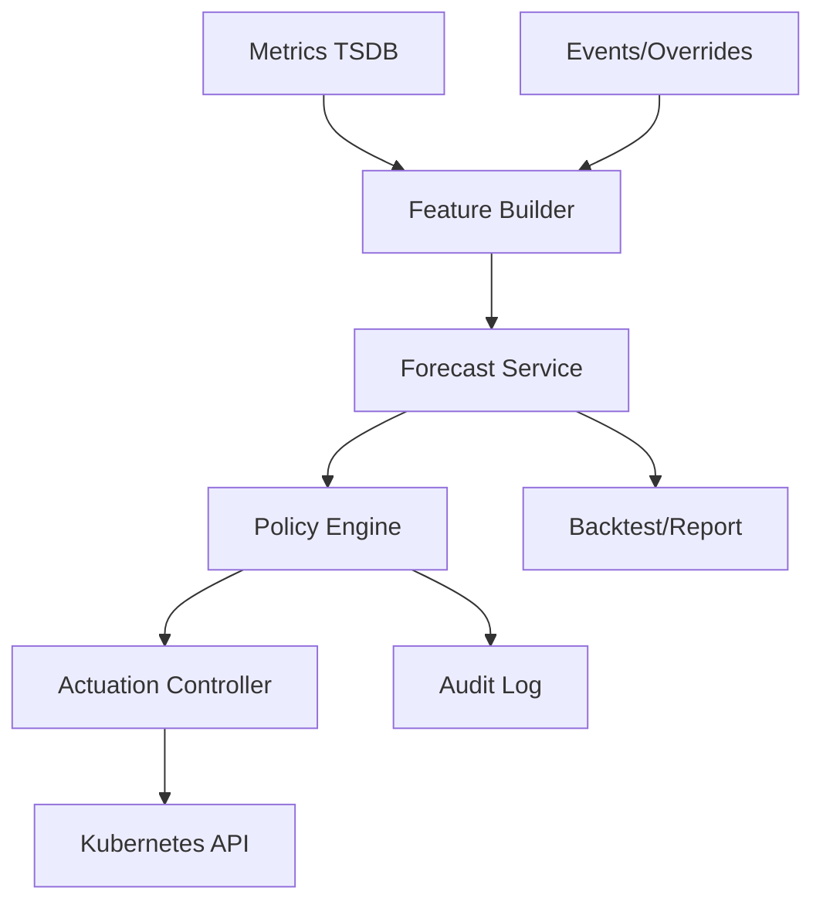
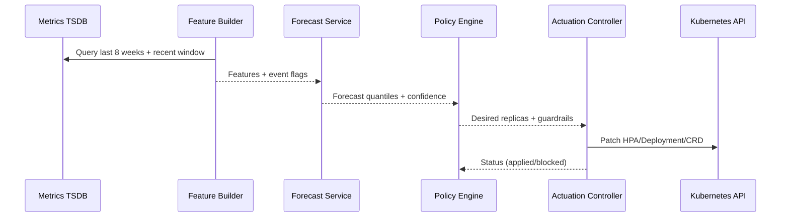

## Overview

Predictive autoscaling provisions compute capacity *ahead* of demand using historical signals, scheduled events, and safety margins. Unlike reactive scaling (CPU-based HPA), predictive scaling must forecast future load, translate it into resource needs, and execute changes early enough to absorb ramp-up times (e.g., node provisioning, JVM warmup, cache warming). The hardest parts are not the model itself but production realities: noisy signals, shifting traffic patterns, partial outages, model drift, and safe actuation under uncertainty.

The key insight is to treat this as a closed-loop control system with strong safety rails: (1) multi-signal forecasting with explicit uncertainty bounds, (2) conservative capacity decisions with configurable risk budgets, (3) staged actuation (pods first, then nodes), and (4) continuous backtesting + guardrails that fall back to reactive scaling when confidence is low.

This design targets Kubernetes-based workloads but generalizes to VM/ASG environments. It cleanly separates forecasting from actuation so teams can evolve models without risking cluster stability.

## Requirements

### Functional Requirements
- Forecast workload demand 5–60 minutes ahead using historical signals (QPS, RPS per route, queue depth, CPU, latency, concurrency).
- Convert forecasts into target capacity (replicas, CPU/memory requests, node counts) using service-specific performance models (e.g., QPS per pod at SLO).
- Apply safety margins based on forecast uncertainty, warmup time, and business risk tolerance.
- Support scheduled events and overrides (marketing campaigns, product launches, known cron spikes).
- Perform what-if simulations and backtesting on historical windows; generate accuracy and cost reports.
- Provide safe actuation with guardrails: max scale rate, min/max bounds, circuit breakers, and fallback to reactive autoscaling.
- Offer per-service policies (SLO, warmup time, min headroom, max spend, scaling cooldowns).
- Expose audit logs and explainability: “why did we scale?” including contributing signals and uncertainty.

### Non-Functional Requirements
- **Scale**:
  - 5,000 services across 200 clusters.
  - 100 signals/service at 10s–60s resolution ⇒ ~5–30M samples/minute ingestion.
  - Forecast generation every 1 minute for 5,000 services ⇒ 5,000 forecasts/minute.
- **Latency**:
  - Forecast compute: P50 < 300ms/service, P99 < 2s/service (batchable).
  - Actuation decision: P99 < 5s from forecast to applying desired state (excluding node provisioning).
- **Availability**:
  - Control plane 99.95% (autoscaler service); actuation should degrade safely.
- **Consistency**:
  - Strong consistency for policy/config updates and audit logs.
  - Eventual consistency acceptable for time-series ingestion and derived features.
- **Durability**:
  - Zero data loss for policies, overrides, and audit logs.
  - Time-series can tolerate up to 1–5 minutes of delayed ingestion; no silent drops.

### Constraints & Assumptions
- Kubernetes is the primary platform; integration with HPA/KEDA and Cluster Autoscaler (or Karpenter) is required.
- Network access to metrics systems (Prometheus/Thanos/Mimir) and to the Kubernetes API.
- Small platform team (5–10 engineers); solution must be operable with limited oncall load.
- Must avoid aggressive overprovisioning; target <10–20% average headroom while meeting SLOs.
- Compliance: auditability for scaling actions and overrides (who/when/why).

## High-Level Architecture



The architecture separates data (metrics + events), intelligence (feature building + forecasting), decisioning (policy + safety margins), and actuation (writing desired state to Kubernetes). This reduces blast radius: a broken model should not directly destabilize the cluster; the policy engine and actuator enforce bounds and fallbacks.

Batching is central: features and forecasts are computed per service on a cadence (e.g., every minute), enabling predictable load and easy backtesting. The actuation controller applies changes using idempotent writes and rate limits, coordinating with existing reactive autoscalers rather than replacing them.

## Component Deep-Dive

### Feature Builder

**Responsibility**: Ingest and normalize historical signals; produce model-ready features (seasonality, lagged values, rolling stats, event flags).

**Key Design Decisions**:
- Use multi-resolution aggregation (10s/1m/5m) to balance fidelity vs cost; most predictive power comes from 1–5 minute features.
- Treat missing data explicitly (gap flags, forward-fill with caps) rather than silently interpolating; missingness is informative during incidents.

**Technology Choice**: Stream + batch hybrid (Kafka/PubSub for eventing; Spark/Flink optional; commonly a stateless service reading from TSDB APIs and writing derived features to an OLAP store).

**Scaling Strategy**: Partition by `service_id` and time window; run as horizontally scaled workers. Cache recent windows in Redis to reduce TSDB fanout.

### Forecast Service

**Responsibility**: Generate demand forecasts and uncertainty bounds for each service and horizon (e.g., 5, 10, 30, 60 minutes).

**Key Design Decisions**:
- Prefer robust, interpretable baselines (seasonal decomposition + quantile regression) before complex ML; production wins come from reliability and calibrated uncertainty.
- Output quantiles (P50/P90/P99 forecast) rather than point estimates to drive safety margins and risk controls.

**Technology Choice**: Python service (statsmodels/prophet/lightgbm) or JVM (e.g., Tribuo) with model registry; run inference in containers. Store model artifacts in object storage (S3/GCS) with versioning.

**Scaling Strategy**: Batch inference (per cluster or per 1,000 services); autoscale inference workers by queue depth. Use CPU-bound workers; isolate from control-plane latency SLOs.

### Policy Engine

**Responsibility**: Convert forecast + uncertainty into desired capacity while enforcing SLO, cost, and safety constraints.

**Key Design Decisions**:
- Use an explicit capacity model per service: `capacity_needed = forecast_qps / qps_per_pod_at_SLO`, where `qps_per_pod_at_SLO` is derived from load tests and continuously re-estimated.
- Introduce a risk budget: choose forecast quantile based on policy (e.g., P90 for normal, P99 during events) and add fixed headroom for warmup.

**Technology Choice**: Stateless service with strongly consistent config store (Postgres) and policy definitions in code (OPA/Rego optional but often overkill).

**Scaling Strategy**: Stateless; scale with forecast volume. Cache policies locally with watch-based invalidation.

### Actuation Controller

**Responsibility**: Apply desired state to Kubernetes safely (replicas, HPA targets, node provisioning hints) with guardrails and rollback.

**Key Design Decisions**:
- Two-stage actuation: scale pods first (Deployment/ScaledObject/HPA target), then scale nodes if pending pods persist beyond a threshold.
- Implement circuit breakers: freeze predictive changes when metrics are stale, forecasting is degraded, or clusters are unhealthy; fall back to reactive HPA.

**Technology Choice**: Kubernetes controller/operator (Go) with leader election; uses CRDs like `PredictiveScalingPolicy` and `PredictiveRecommendation`.

**Scaling Strategy**: One controller per cluster (or per few clusters) to keep K8s API locality and minimize cross-cluster coupling.

### Backtest / Reporting

**Responsibility**: Continuous evaluation of forecast accuracy and cost impact; produces dashboards and regression alerts for model drift.

**Key Design Decisions**:
- Always compare against simple baselines (yesterday-same-time, last-week-same-time). If fancy models don’t beat baselines reliably, don’t ship them.
- Track calibration of uncertainty (e.g., 90% interval contains actual ~90% of the time); uncalibrated quantiles lead to unsafe provisioning.

**Technology Choice**: OLAP store (BigQuery/Snowflake/ClickHouse) + scheduled jobs; dashboards in Grafana/Looker.

**Scaling Strategy**: Batch jobs by day/hour; incremental computation to control cost.

## Data Model

### Storage Schema

**Postgres (control plane)**
- `services`
  - `service_id (pk)`, `cluster_id`, `namespace`, `workload_ref`, `owner_team`
- `scaling_policies`
  - `policy_id (pk)`, `service_id (fk)`, `min_replicas`, `max_replicas`
  - `warmup_seconds`, `scale_up_rate_limit`, `scale_down_rate_limit`, `cooldown_seconds`
  - `risk_quantile` (e.g., 0.9), `base_headroom_pct` (e.g., 0.15)
  - `qps_per_pod_slo` (or `cpu_util_target`, `concurrency_per_pod`)
  - `created_at`, `updated_at`, `version`
- `overrides`
  - `override_id (pk)`, `service_id`, `start_time`, `end_time`, `forced_min_replicas`, `risk_quantile`, `reason`, `created_by`
- `recommendations`
  - `rec_id (pk)`, `service_id`, `generated_at`, `horizon_minutes`
  - `forecast_p50`, `forecast_p90`, `forecast_p99`, `chosen_quantile`
  - `desired_replicas`, `desired_nodes_hint`, `confidence_score`, `model_version`
- `audit_log`
  - `audit_id (pk)`, `service_id`, `timestamp`
  - `action` (e.g., `SET_MIN_REPLICAS`, `PATCH_HPA_TARGET`)
  - `old_value`, `new_value`, `reason`, `actor` (system/user), `request_id`

**Time-series (Prometheus/Thanos/Mimir)**
- Metrics like `http_requests_total`, `queue_depth`, `cpu_usage_seconds_total`, `request_duration_seconds_bucket`, `inflight_requests`, plus derived SLO burn rates.

**OLAP (ClickHouse/BigQuery)**
- `features_daily` keyed by `service_id, ts_bucket`
- `backtest_results` keyed by `service_id, date, model_version`

### Data Flow



Key operations:
- **Every minute**: Feature Builder fetches recent data, computes features; Forecast Service produces quantiles for each horizon.
- **Decision**: Policy Engine chooses the quantile and adds headroom and warmup buffers; produces a recommendation.
- **Actuation**: Controller applies changes with rate limiting; monitors pod pending and node provisioning lag; triggers node scaling if needed.

## API Design

### Control Plane APIs (REST)

**Create/Update scaling policy**
- `PUT /v1/services/{serviceId}/policy`
- Request:
  ```json
  {
    "minReplicas": 10,
    "maxReplicas": 500,
    "warmupSeconds": 180,
    "cooldownSeconds": 120,
    "scaleUpRateLimit": 2.0,
    "scaleDownRateLimit": 0.5,
    "riskQuantile": 0.9,
    "baseHeadroomPct": 0.15,
    "capacityModel": { "type": "QPS_PER_POD", "qpsPerPodSlo": 120 }
  }
  ```
- Response: `200 OK` with `version` and normalized policy.
- Errors: `400` validation, `404` service missing, `409` version conflict.

**Create override (scheduled event)**
- `POST /v1/services/{serviceId}/overrides`
- Request:
  ```json
  {
    "startTime": "2025-12-20T18:00:00Z",
    "endTime": "2025-12-20T22:00:00Z",
    "forcedMinReplicas": 200,
    "riskQuantile": 0.99,
    "reason": "Marketing campaign"
  }
  ```
- Idempotency: `Idempotency-Key` header; store keyed by `(serviceId, idempotencyKey)`.

**Get recommendations**
- `GET /v1/services/{serviceId}/recommendations?from=...&to=...`
- Response includes forecast quantiles, chosen quantile, desired replicas, confidence, model version.

**Audit query**
- `GET /v1/services/{serviceId}/audit?from=...&to=...`

### In-Cluster CRDs (Kubernetes)

- `PredictiveScalingPolicy` (spec mirrors policy fields; status includes last applied and health)
- `PredictiveRecommendation` (time-stamped desired replicas + metadata)

**Error handling approach**
- Prefer explicit “blocked” statuses over failing silently.
- Surface reasons: stale metrics, confidence low, rate limit hit, max bound reached, cluster unhealthy.

## Scaling & Performance

### Bottleneck Analysis
- **TSDB query fanout**: 5,000 services querying weeks of data can overload TSDB.
  - Mitigation: pre-aggregate, cache windows, limit lookback (e.g., 8 weeks), compute features incrementally, and schedule queries with jitter.
- **Kubernetes API write pressure**: frequent patching can cause throttling.
  - Mitigation: only apply when recommendation changes materially (e.g., >5% or >N replicas), batch writes, per-namespace rate limits, and backoff on `429`.
- **Cold start latency**: nodes/pods take minutes, making “5-minute” forecasts too late.
  - Mitigation: separate horizons; use 30–60 minute horizon for node scaling, 5–10 minute for pod scaling; include warmup in policy.

### Horizontal Scaling
- **Feature Builder / Forecast**: partition by `service_id`; scale workers; use queue-based scheduling.
- **Policy Engine**: stateless; scale by request rate.
- **Actuator**: per-cluster controller replicas with leader election; horizontally scale across clusters.
- **Data stores**: Postgres with read replicas; OLAP is naturally scalable.

### Caching Strategy
- **Recent metrics windows**: cache last 1–2 hours per service in Redis (TTL 5–10 minutes) to reduce TSDB reads.
- **Policy cache**: local in-memory cache with watch/invalidation (ETag/version).
- **Feature cache**: store derived features for the last N buckets to enable incremental updates.
- Invalidation: versioned policies; metrics caches are TTL-based; recommendations are immutable time-stamped records.

## Trade-offs & Alternatives

### Key Trade-offs Made
- **Quantile forecasts over point forecasts**
  - Chosen: quantiles (P50/P90/P99) for risk-aware scaling.
  - Sacrificed: slightly more complex model training/evaluation.
  - Why: uncertainty is the core of safe proactive provisioning.
- **Separate policy engine from actuator**
  - Chosen: layered control with guardrails.
  - Sacrificed: additional components and operational overhead.
  - Why: reduces blast radius and enables safer iteration on models.
- **Conservative actuation with thresholds**
  - Chosen: apply only material changes and rate-limit scaling.
  - Sacrificed: fastest possible response to sudden spikes.
  - Why: prevents oscillations and avoids fighting reactive autoscalers.

### Alternative Approaches
- **Pure reactive autoscaling (HPA/KEDA only)**: simpler but cannot handle long warmup times or predictable spikes without large constant headroom.
- **End-to-end RL/controller**: can optimize cost/SLO but is hard to validate, explain, and keep safe under distribution shift.
- **Per-route forecasting + admission control**: powerful for multi-tenant gateways but significantly more complex; better as a later iteration.

## Failure Modes & Mitigations

### Failure Scenarios
- **Scenario**: Metrics ingestion delay or TSDB outage  
  **Impact**: forecasts become stale; wrong capacity decisions  
  **Detection**: data freshness SLI (last sample age), TSDB query errors  
  **Mitigation**: freeze predictive scaling; fall back to reactive HPA; apply minimum headroom floor during freeze.

- **Scenario**: Forecast model drift (traffic pattern change)  
  **Impact**: systematic under- or over-provisioning  
  **Detection**: backtest regression alerts, interval calibration failures, SLO burn correlation with recommendations  
  **Mitigation**: automatic downgrade to baseline model; increase risk quantile temporarily; require approval to re-enable new model.

- **Scenario**: Actuator bugs or bad config (too high max, wrong qps_per_pod)  
  **Impact**: runaway scaling or SLO misses  
  **Detection**: anomaly alerts on scale rate, cost spikes, error budget burn  
  **Mitigation**: hard global caps, per-service max replicas, “two-person rule” for risky overrides, fast rollback to last known good policy version.

- **Scenario**: Kubernetes API throttling / partial cluster failure  
  **Impact**: recommendations cannot be applied  
  **Detection**: `429`/timeouts, controller error rate  
  **Mitigation**: exponential backoff, priority to scale-up actions, store desired state and retry, degrade gracefully.

### Disaster Recovery
- **RTO/RPO**: RTO 30 minutes for control plane; RPO near-zero for policies/audit (Postgres WAL + replicas).
- **Backup strategy**: daily full + continuous WAL archiving; object storage versioning for model artifacts.
- **Failover procedures**: run control plane in multi-AZ; promote Postgres replica; actuator continues local safe behavior (reactive fallback) even if control plane is down.

## Operational Considerations

### Monitoring & Alerting
- **Control plane**: forecast job success rate, queue lag, recommendation freshness, policy fetch errors.
- **Actuation**: applied vs blocked counts, scale-up/down rate, K8s API error rate/throttling, pending pods duration.
- **Outcome**: SLO burn rate, latency P99, error rate, cost/headroom (% unused capacity), incident correlation.
- Example alerts:
  - Recommendation freshness > 5 minutes for >10% services (page).
  - Scale-up blocked due to max bound while SLO burn > threshold (page).
  - Forecast interval calibration drops (ticket).

### Deployment Strategy
- Canary by service allowlist (1%, 5%, 20%, 100%); compare against control group cost/SLO.
- Feature flags for model version and actuation mode (observe-only vs apply).
- Rollback: pin to previous model artifact and policy version; actuator supports “stop applying predictive” switch while retaining auditability.

## References & Further Reading

- Kubernetes Autoscaling: HPA/VPA and Cluster Autoscaler/Karpenter docs  
  - https://kubernetes.io/docs/tasks/run-application/horizontal-pod-autoscale/
  - https://karpenter.sh/
- “Site Reliability Engineering” (Google): error budgets, safe automation  
  - https://sre.google/books/
- Forecasting & uncertainty:
  - Facebook Prophet (seasonality, holidays): https://facebook.github.io/prophet/
  - “Forecasting: Principles and Practice” (Hyndman): https://otexts.com/fpp3/
- Real-world patterns:
  - Netflix SRE and autoscaling talks (predictive scaling + guardrails)
  - AWS Auto Scaling predictive scaling concepts (for inspiration and pitfalls)
```

