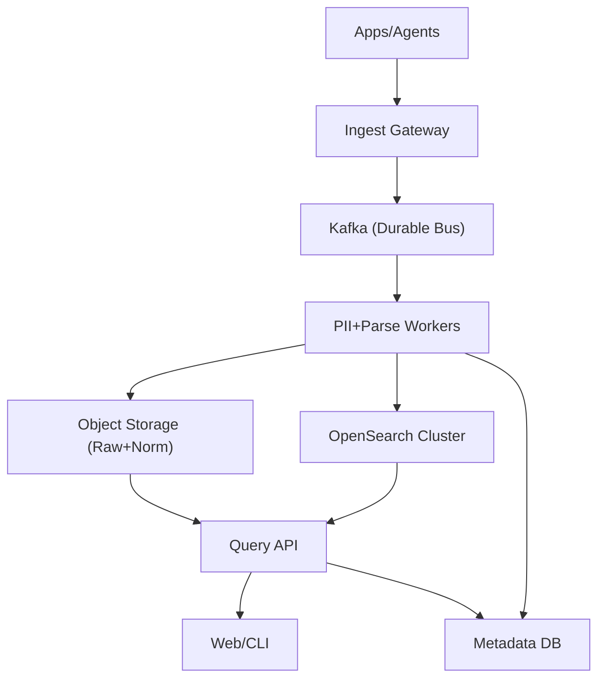
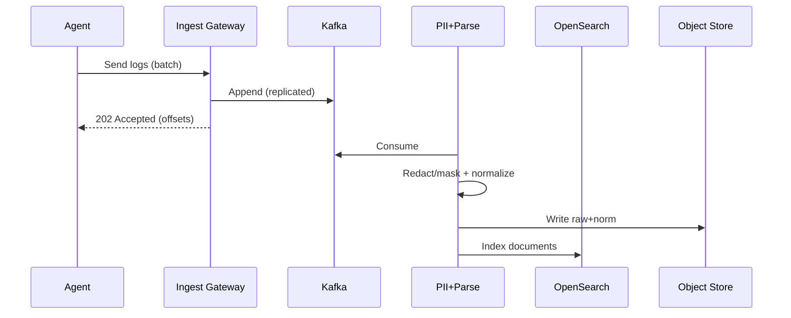

## Overview

A centralized logging platform must ingest high-volume, high-cardinality events from many producers, enforce privacy controls (PII redaction/masking), support continuous schema evolution, and still provide fast, flexible text search for on-call and incident response. The hard part is balancing *ingest durability + low latency* with *search performance + cost*, while ensuring redaction is correct and auditable.

The key insight is to treat logs as an event stream with a durable buffer (for backpressure and replay), perform deterministic and policy-driven PII transformations in a dedicated processing tier, and store data in two complementary forms: (1) immutable raw/normalized logs in cheap object storage for long retention and reprocessing, and (2) indexed documents in a search engine for low-latency queries over the “hot” window. Schema evolution is handled by versioned parsing/normalization plus “raw always” storage to avoid data loss when schemas change.

## Requirements

### Functional Requirements
- Ingest logs from agents and services over HTTP/gRPC in both structured (JSON) and semi/unstructured text formats.
- Enforce tenant isolation (multi-tenancy), authentication, and per-tenant retention policies.
- Perform PII detection and redaction/masking/tokenization based on centrally managed policies before data becomes searchable.
- Support schema evolution: new fields, changed field types, and parser updates without downtime or data loss.
- Provide fast text search and filters (time range, service, host, severity, arbitrary fields) with pagination and streaming.
- Support “tail -f” live log viewing for recent streams with low latency.
- Provide export APIs to retrieve raw logs for compliance/forensics with strict access controls and full audit trail.
- Provide operational tooling: ingestion health, pipeline lag, index status, usage/cost by tenant.

### Non-Functional Requirements
- **Scale**: 50k services; 500k agents; average 100k events/sec, peak 300k events/sec; ~10 TB/day compressed; 30–180 day retention (tiered).
- **Latency**:
  - Ingest ack: P50 20ms, P99 200ms (acked only when durably buffered).
  - Search (last 15 min, common queries): P50 200ms, P99 1s.
  - Search (24h range, complex text): P99 5s.
- **Availability**:
  - Ingestion: 99.99% (buffer-first design).
  - Search UI/API: 99.9% (degrade gracefully if index behind).
- **Consistency**:
  - Ingest durability: strong for acked writes.
  - Search: eventual (seconds to minutes) depending on indexing lag.
- **Durability**: 0 data loss for acked events; tolerate up to 5 minutes of unacked loss during catastrophic regional failure.

### Constraints & Assumptions
- Cloud object storage available (e.g., S3/GCS) and managed KMS for encryption keys.
- Network access is untrusted; all ingestion uses mTLS or signed tokens.
- Team size 6–10; prefer managed services where it reduces ops burden.
- Compliance: GDPR/CCPA; PII must be masked before being queryable by default; full access requires explicit break-glass + audit.
- Budget constraint: indexing everything forever is too expensive; require hot/warm/cold tiers.

## High-Level Architecture



Producers send logs to an ingestion gateway that authenticates, rate-limits, and immediately appends to a durable event bus (Kafka), acknowledging only after the write is replicated. Downstream processors consume from Kafka to apply tenant-aware parsing, schema normalization, and PII policies. They write (1) immutable, partitioned log files to object storage for long retention and replay, and (2) indexed documents to a search engine for fast text queries over a hot window.

This structure isolates concerns: ingestion remains highly available under downstream failures, processors can be scaled independently (CPU-heavy PII detection), and search indexing can be tuned/costed separately from long-term storage. Schema evolution is managed in the processing tier with versioned parsers and a schema registry/metadata store; raw logs are always retained to enable reprocessing when schemas or redaction rules change.

## Component Deep-Dive

### Ingest Gateway

**Responsibility**: Authenticate agents/services, enforce tenant quotas, accept/batch events, and durably enqueue to Kafka with minimal latency.

**Key Design Decisions**:
- Ack only after Kafka quorum write: ensures “acked == durable” and simplifies producer retry semantics.
- Support both structured and unstructured payloads with a common envelope: preserve original bytes while extracting minimal routing fields (tenant, timestamp, source).

**Technology Choice**: Envoy/Nginx + stateless Go/Java service; Kafka producer with idempotent producer enabled; mTLS + JWT/OIDC for auth.

**Scaling Strategy**: Horizontally scale behind L7 load balancer; partition Kafka topics by `tenant_id` and `source` to distribute load; apply adaptive rate limits per tenant to prevent noisy neighbors.

### Durable Event Bus (Kafka)

**Responsibility**: Buffer logs to absorb bursts, decouple ingestion from processing/indexing, and enable replay for schema/redaction updates.

**Key Design Decisions**:
- Multi-topic strategy: `logs_raw` (immutable), `logs_deadletter` (unprocessable), optional `logs_reprocess` for backfills.
- Partitioning by `tenant_id` (and optionally `service`) to keep per-tenant ordering where useful and localize hot tenants.

**Technology Choice**: Kafka (or managed equivalent) with RF=3, `min.insync.replicas=2`, tiered storage if available.

**Scaling Strategy**: Increase partitions to scale consumer parallelism; isolate high-volume tenants into dedicated topics/clusters if needed; monitor and rebalance partition leadership.

### Processing Pipeline (PII + Parsing + Schema)

**Responsibility**: Apply PII policies, parse/normalize fields, manage schema evolution, write to object storage and search index.

**Key Design Decisions**:
- Deterministic tokenization for certain PII: e.g., HMAC-SHA256 with per-tenant key to allow exact-match search on masked values without revealing originals.
- “Raw always, normalized best-effort”: store original payload unmodified (access-controlled) plus normalized/redacted representation for search/analytics.

**Technology Choice**: Stream processing via Kafka consumers (Go/Java) or Flink; PII detection via pattern library + optional DLP service; schema metadata in Postgres; keys via KMS.

**Scaling Strategy**: Scale consumer groups by partitions; separate CPU-heavy PII detection workers from lightweight parsing; use backpressure (pause consumption) when OpenSearch slows, while Kafka absorbs.

### Search & Query Layer

**Responsibility**: Index normalized logs for fast full-text search and filtering; serve search queries with RBAC and auditability.

**Key Design Decisions**:
- Hot/warm/cold indexing: keep 7–14 days in OpenSearch “hot”, older in “warm” or removed from index but still in object storage.
- Query fanout control: enforce time-range defaults, shard pre-filtering, and query guards (max regex complexity, max hits) to protect cluster health.

**Technology Choice**: OpenSearch/Elasticsearch for inverted index + aggregations; Redis for query-result caching and session state; stateless Query API service.

**Scaling Strategy**: Scale OpenSearch data nodes and shards; tune refresh interval; use index lifecycle management (ILM); route tenant-heavy queries via dedicated coordinator nodes.

### Storage & Metadata

**Responsibility**: Cheap durable storage for long retention and reprocessing; metadata for schemas, policies, and access control.

**Key Design Decisions**:
- Partitioned object layout: `s3://bucket/tenant=.../dt=YYYY-MM-DD/hour=HH/` with compressed columnar for normalized (Parquet) plus compressed raw bundles.
- Strong audit trail: every export/de-mask action logs to immutable audit store.

**Technology Choice**: S3/GCS + Parquet; Postgres for metadata; optional Iceberg/Delta for table management; WORM storage for audit logs.

**Scaling Strategy**: Object storage scales naturally; metadata DB scales via read replicas and partitioning by tenant; cache policy/schemas in-memory with version checks.

## Data Model

### Storage Schema

**Kafka message envelope (logical)**:
- `event_id` (UUID/ULID, producer-generated)
- `tenant_id` (string)
- `source` (service/agent id)
- `timestamp` (ms since epoch)
- `format` (`json|text|otlp`)
- `raw_bytes` (bytes, optionally compressed)
- `attributes` (map: a few routing hints like `level`, `env`, `region`)
- `schema_hint` (optional: parser name/version)

**Postgres (metadata)**
- `tenants(tenant_id, name, plan, retention_days_hot, retention_days_cold, created_at)`
- `pii_policies(policy_id, tenant_id, version, rules_json, created_at, active)`
- `schemas(schema_id, tenant_id, name, version, json_schema, created_at, active)`
- `parsers(parser_id, tenant_id, name, version, config_json, created_at, active)`
- `audit_log(audit_id, tenant_id, actor, action, resource, reason, created_at, immutable_ref)`

**Object storage**
- Raw: `.../raw/.../part-*.zst` (append-only bundles containing `raw_bytes` + envelope)
- Normalized: `.../norm/.../part-*.parquet` with columns:
  - `tenant_id, timestamp, source, level, message, trace_id, span_id, attrs(map), pii_tokens(map), raw_ref`

**OpenSearch document (normalized)**
- `tenant_id` (keyword)
- `@timestamp` (date)
- `source` / `service` / `host` (keyword)
- `level` (keyword)
- `message` (text)
- `attrs.*` (keyword/text as controlled)
- `pii.token_email` (keyword, deterministic token)
- `raw_ref` (keyword; points to object storage location, access-controlled)

### Data Flow



Key operations:
- **Ingest**: Gateway validates and writes to Kafka; producer retries are safe (idempotent producer + `event_id`).
- **Process**: Workers load tenant policy+schema versions (cached), redact, parse, and write outputs; unparseable logs go to `logs_deadletter` with diagnostics.
- **Query**: Query API hits OpenSearch for hot window; for older ranges, it can fall back to object storage scan (slower) or require an “export job”.

## API Design

### Ingestion APIs

`POST /v1/logs:ingest`
- **Request**:
  - Headers: `Authorization`, `X-Tenant-Id`, optional `Idempotency-Key`
  - Body:
    ```json
    {
      "source": "payments-api",
      "events": [
        {
          "event_id": "01J...ULID",
          "timestamp_ms": 1734372000123,
          "format": "json",
          "payload": {"msg":"...","user_email":"a@b.com","level":"INFO"},
          "attrs": {"env":"prod","region":"us-east-1"}
        }
      ]
    }
    ```
- **Response** `202 Accepted`:
  ```json
  {"accepted": 500, "kafka_offsets": {"partition": 12, "offset": 918273}}
  ```
- **Errors**: `401/403` auth, `413` batch too large, `429` rate limited, `400` invalid timestamp.
- **Idempotency**: `event_id` required (or derived by agent); dedupe in processing/indexing by `(tenant_id, event_id)` with bounded window.

`POST /v1/otlp/logs` (optional)
- Accept OpenTelemetry Logs (gRPC/HTTP) for standardization.

### Query APIs

`POST /v1/logs:search`
- **Request**:
  ```json
  {
    "tenant_id": "t_123",
    "time_range": {"from": "2025-12-17T00:00:00Z", "to": "2025-12-17T01:00:00Z"},
    "query": "error AND timeout",
    "filters": {"service": ["payments-api"], "level": ["ERROR"]},
    "page": {"size": 200, "cursor": null}
  }
  ```
- **Response**:
  ```json
  {
    "hits": [{"timestamp":"...","service":"...","message":"...","attrs":{"...": "..."}}],
    "next_cursor": "opaque"
  }
  ```
- **Errors**: `400` invalid query, `413` too broad, `429` cluster protected, `403` forbidden fields (PII).
- **Notes**: Enforce max time range and query complexity; cursor-based pagination to avoid deep paging costs.

`GET /v1/logs:tail?service=payments-api&since=...`
- Server-Sent Events or WebSocket; backs by Kafka “recent” topic or OpenSearch near-real-time.

### Policy & Schema APIs (admin)

`PUT /v1/tenants/{tenant_id}/pii-policies/{policy_id}`
- Versioned updates; activates only after validation and staged rollout.

`PUT /v1/tenants/{tenant_id}/schemas/{schema_name}`
- Upload JSON Schema; supports compatibility modes (`backward`, `forward`, `none`).

## Scaling & Performance

### Bottleneck Analysis
- **Search indexing throughput**: OpenSearch can become CPU/IO bound during spikes.
  - Mitigation: larger bulk index batches, increase refresh interval, add ingest nodes, and allow temporary indexing lag with Kafka buffering.
- **PII detection CPU**: regex-heavy scanning is expensive.
  - Mitigation: pre-classify by source/parser, only scan fields likely to contain PII, use Aho–Corasick/prefilters, and isolate heavy tenants.
- **Hot shards / tenant skew**: one tenant dominates partitions and shards.
  - Mitigation: partition/topic split for heavy tenants; index routing by `tenant_id`; dedicated clusters for largest tenants.

### Horizontal Scaling
- **Gateway**: stateless; scale replicas; partition-aware producers.
- **Kafka**: scale brokers + partitions; monitor ISR and leader skew.
- **Processors**: scale consumer group members; separate pipelines (PII vs parse) if needed.
- **OpenSearch**: scale data nodes; shard sizing (e.g., 30–50GB/shard); ILM rollover by size/time.
- **Metadata**: Postgres read replicas; cache hot policy/schema objects.

### Caching Strategy
- **Query result cache** (Redis): cache identical searches for short TTL (5–30s) during incidents; key includes tenant + RBAC scope.
- **Metadata cache**: schema/policy versions cached in processors and Query API with ETag/version invalidation.
- **Hot field dictionaries**: cache parsed field mappings to reduce dynamic mapping overhead.

Cache invalidation:
- Policy/schema updates publish an “invalidate” event (Kafka topic `meta_updates`) consumed by processors/APIs to refresh by version.

## Trade-offs & Alternatives

### Key Trade-offs Made
- **Kafka buffer + eventual search**: Chosen to guarantee durability and absorb spikes; sacrificed immediate search consistency (seconds-minutes lag).
- **Dual storage (object + search index)**: Chosen for cost-effective long retention and reprocessing; sacrificed simplicity (two read paths, ILM complexity).
- **Deterministic tokenization for PII**: Chosen to allow exact-match and joins without exposing PII; sacrificed perfect reversibility (by design) and required key management rigor.
- **Schema “normalize best-effort”**: Chosen to avoid dropping data on schema changes; sacrificed strict typing in search (some fields may remain strings until schema stabilizes).

### Alternative Approaches
- **All-in-one index (OpenSearch only)**: Simpler, but prohibitively expensive for long retention and risks cluster overload.
- **Columnar-only (ClickHouse) with text indexes**: Great for analytics and structured queries, but weaker/complex for rich full-text search and relevance ranking.
- **Agent-side redaction only**: Lower central CPU cost, but inconsistent enforcement and hard to audit; central policy enforcement is safer for compliance.

## Failure Modes & Mitigations

### Failure Scenarios
- **Scenario**: OpenSearch cluster degraded/red.
  - **Impact**: Indexing slows; search partial/unavailable for hot window.
  - **Detection**: Indexing error rate, queue growth, cluster health red, P99 search latency.
  - **Mitigation**: Kafka buffers; processors backoff and prioritize object storage writes; degrade UI to “recent only”; autoscale/restore shards.

- **Scenario**: Kafka broker outage / ISR shrink.
  - **Impact**: Ingest may reject or slow; risk of reduced durability if misconfigured.
  - **Detection**: ISR metrics, under-replicated partitions, producer acks timing out.
  - **Mitigation**: RF=3 and `min.insync.replicas=2`; gateway returns `503` if durability can’t be met; auto-heal via broker replacement.

- **Scenario**: PII policy bug causes under-redaction.
  - **Impact**: Sensitive data becomes searchable (high severity).
  - **Detection**: Canary sampling with DLP scanner, policy unit tests, anomaly alerts on PII detectors post-index.
  - **Mitigation**: Default-deny on unknown fields, emergency “search block” for affected tenant, reprocess from Kafka/object store with fixed policy, audit and notify.

- **Scenario**: Hot tenant causes noisy-neighbor.
  - **Impact**: Elevated latency and drops for other tenants.
  - **Detection**: Per-tenant QPS, partition lag, shard CPU skew.
  - **Mitigation**: Per-tenant rate limits, dedicated topics/shards, plan-based quotas, optional dedicated cluster.

### Disaster Recovery
- **RTO/RPO**: RTO 60 minutes; RPO 5 minutes for acked data (via cross-region replication).
- **Backup strategy**: OpenSearch snapshots to object storage; Postgres PITR; Kafka MirrorMaker (or managed replication) to secondary region.
- **Failover procedures**: Promote secondary metadata DB, switch DNS/load balancer, enable consumers/producers in DR region, rehydrate search from snapshots and continue indexing from mirrored Kafka.

## Operational Considerations

### Monitoring & Alerting
- Ingest: request rate, `202` vs `429/5xx`, batch sizes, auth failures, per-tenant throttles.
- Kafka: consumer lag, under-replicated partitions, produce latency, disk usage.
- Processing: redaction error rate, dead-letter volume, policy/schema cache hit rate, end-to-end lag.
- Search: indexing throughput, refresh/merge times, heap pressure, P50/P99 query latency, slow queries, shard imbalance.
- Data correctness: sampling-based PII leakage tests, schema drift detection, parse failure ratios.
- Alert thresholds (examples): consumer lag > 5 minutes (page), OpenSearch health red (page), PII leakage signal > baseline (page).

### Deployment Strategy
- Progressive delivery: canary gateway + processors; shadow-indexing for new parsers/policies; feature flags per tenant.
- Rollback: versioned policies/schemas; keep last-known-good active; processors load by version; reprocess from Kafka/object store if needed.
- Safe migrations: index templates with versioned aliases (write to `logs_vN`, read via alias), rollover without downtime.

## References & Further Reading

- OpenTelemetry Logs: https://opentelemetry.io/docs/specs/otel/logs/
- Kafka Design & Exactly-Once Semantics: https://kafka.apache.org/documentation/
- Elasticsearch/OpenSearch Index Lifecycle Management concepts: https://opensearch.org/docs/
- Streaming reprocessing patterns (Lambda/Kappa architecture): https://martinfowler.com/bliki/LambdaArchitecture.html
- Google DLP (concepts transferable to any DLP engine): https://cloud.google.com/dlp/docs/concepts