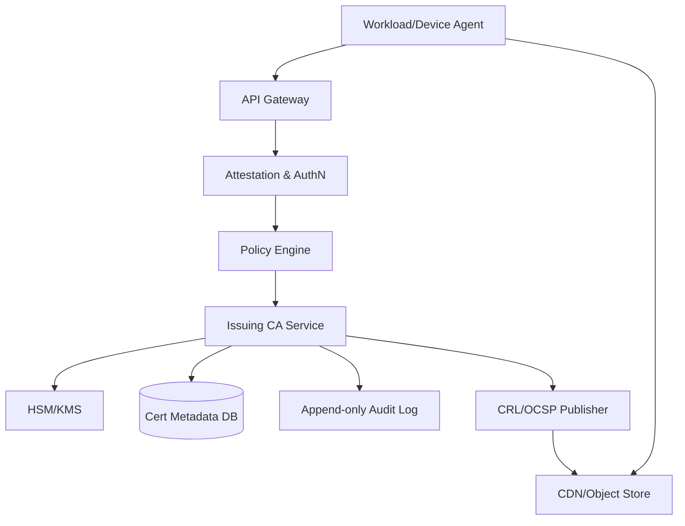
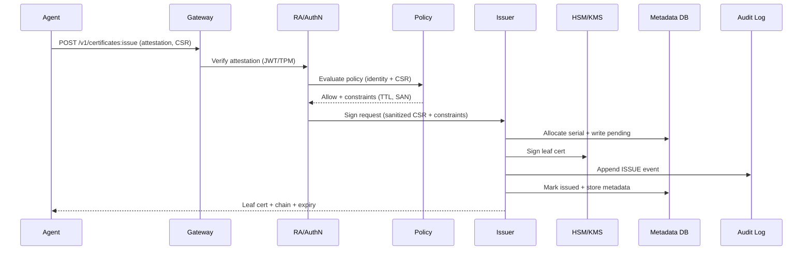

## Overview

An internal Certificate Authority (CA) for mTLS at “millions of microservices/devices” must do three things exceptionally well: (1) reliably bind a workload/device to a cryptographic identity, (2) issue/rotate certificates at high volume with low operational toil, and (3) minimize blast radius when keys leak or systems fail. The hard part is not signing X.509—it's identity proofing at scale, safe key custody, and keeping the system available during fleet-wide rotations, deploy storms, and regional outages.

The key insight is to treat certificate issuance as an automated control plane: use an offline Root CA for trust anchoring, multiple online Intermediate CAs for issuance (backed by HSM/KMS), and an Enrollment/Registration Authority (RA) that performs strong, policy-driven attestation (Kubernetes identity, node attestation, device hardware attestation). Combine this with short-lived certificates for microservices (to reduce reliance on revocation) and a robust status plane (CRL/OCSP) for devices and longer-lived credentials.

This design is production-grade: multi-region active/active issuance, strict auditability, rate-limits and abuse controls, partitioned signing capacity, and a clear operational model (key ceremonies, rollovers, incident revocation, and disaster recovery).

## Requirements

### Functional Requirements
- Automatically enroll workloads/devices and obtain an identity (e.g., SPIFFE ID, device ID) based on strong attestation.
- Issue X.509 mTLS leaf certificates (including chain) from policy-approved Intermediate CAs.
- Support automated rotation (renewal) with zero downtime for millions of clients.
- Support revocation for compromised identities/keys and publish status (CRL and/or OCSP).
- Provide certificate discovery/distribution to workloads (sidecar/agent integration) and integrate with service meshes/gateways.
- Support multi-tenant policies (per cluster/team/device-fleet) including SAN constraints, key usage, and max TTL.
- Maintain tamper-evident audit logs for all security-sensitive actions (issuance, revocation, key operations).
- Provide admin workflows for CA hierarchy management (intermediate rollover, root ceremony, trust bundle distribution).

### Non-Functional Requirements
- **Scale**:
  - 5M workloads + 50M devices (identities) across multiple regions.
  - Steady-state issuance: ~5M/day for workloads (24h TTL) ≈ 60 QPS average; plan for **10k QPS** bursts during deploy/incident rotations.
  - Status checks (if used): up to **100k QPS** aggregate OCSP (edge cached).
  - CRL size: aim <50 MB per CA shard; support delta CRLs for devices if needed.
- **Latency**:
  - Workload renewal: **P50 50ms**, **P99 200ms** (in-region) from CSR to cert.
  - Device issuance: **P99 500ms–2s** (includes stronger attestation / throttling).
- **Availability**:
  - Issuance control plane: **99.99%** (multi-region).
  - Trust bundle distribution: **99.999%** (CDN/object storage).
- **Consistency**:
  - Strong consistency for: serial number uniqueness per issuer, revocation state transitions, policy evaluation results.
  - Eventual consistency acceptable for: CRL propagation, monitoring dashboards, analytics.
- **Durability**:
  - **0 tolerated loss** of CA private keys (HSM/KMS-backed, quorum-protected).
  - Issuance/revocation audit records durable (append-only, immutable retention).
  - Issued cert metadata can be reconstructed from audit log if necessary, but operationally keep it strongly durable.

### Constraints & Assumptions
- Private trust only (not publicly trusted); clients control their trust store via internal bundle distribution.
- Certificates used for mTLS between services/devices; identity is the primary authorization input (zero trust).
- Compliance target: FIPS 140-2/140-3 validated crypto modules for CA keys; SOC2-style auditability.
- Teams: small security/platform team (5–10 engineers) operating a shared CA platform.
- Network: internal connectivity between clusters and CA endpoints; edge access for devices via API gateway.
- Preference for automation: no per-certificate human approval except break-glass scenarios.

## High-Level Architecture



The system separates **identity proofing (RA)** from **signing (CA)**. Agents authenticate via attestation (Kubernetes service account JWT + node identity, SPIRE-style workload attestation, or device hardware attestation). A policy engine validates requested SANs/URIs, TTL, key usages, and issuer selection. Only after policy approval does the issuing service sign via HSM/KMS.

For scale and resilience, issuance is **multi-region active/active** with multiple intermediate CAs (and optionally multiple “CA shards” per region/tenant). Trust distribution (root + intermediates + policy bundle) and status artifacts (CRL/OCSP) are served from durable object storage and CDN, decoupling clients from the issuance control plane for steady-state verification.

## Component Deep-Dive

### Enrollment / Registration Authority (RA)
**Responsibility**: Authenticate workloads/devices, map them to stable identities, and authorize certificate requests.

**Key Design Decisions**:
- Use **attestation-based auth** (K8s projected JWT + node attestation, TPM/TEE for devices) rather than static credentials to reduce secret sprawl.
- Issue **short-lived enrollment tokens** only as a fallback (bootstrapping), with strict scoping and one-time use.

**Technology Choice**: SPIFFE/SPIRE-compatible model (SPIFFE IDs), OIDC/JWT validation, optional device attestation service (TPM attestation, Android Keystore/StrongBox, Secure Enclave).

**Scaling Strategy**: Stateless RA instances behind gateway; cache public keys/JWKS and attestation metadata; isolate per-region to keep latency low.

### Policy Engine
**Responsibility**: Decide whether a request may be signed and with what constraints (SANs, TTL, EKU, issuer).

**Key Design Decisions**:
- Centralized, versioned policies with **deny-by-default** and explicit allow lists for namespaces/fleets.
- Make policy evaluation **pure and deterministic** (inputs: identity claims + request + time), and log decisions for auditability.

**Technology Choice**: OPA (Open Policy Agent) with bundled policies, or a custom rules engine if policy set is small; store policies in GitOps with signed bundles.

**Scaling Strategy**: Run sidecar/embedded policy evaluator per RA/issuer node; cache compiled policies; roll out policy versions gradually.

### Issuing CA Service (Online Intermediates)
**Responsibility**: Validate CSR structure, allocate serial numbers, sign certificates, and emit audit + metadata.

**Key Design Decisions**:
- Keep Root CA **offline**; use **multiple online Intermediate CAs** with limited scopes (per environment/region/tenant) to reduce blast radius.
- Prefer **short-lived workload certs** (e.g., 12–24h) to reduce dependence on revocation; keep device certs longer-lived with status support.

**Technology Choice**: Go/Rust signing service using PKCS#11 to HSM, or cloud KMS/HSM (AWS CloudHSM/AWS KMS w/ X.509 support where applicable, GCP Cloud HSM). X.509 via BoringSSL/OpenSSL (careful with config hardening).

**Scaling Strategy**: Horizontal scale-out signers; partition by issuer (“CA shard”) to spread HSM throughput; pre-validate CSRs before HSM call; apply per-identity and per-tenant rate limits.

### Certificate Status (Revocation + CRL/OCSP)
**Responsibility**: Record revocations and publish verifiable status artifacts (CRL/OCSP), optimized for client performance.

**Key Design Decisions**:
- For workloads: rely primarily on **short TTL**; revocation is for emergency only, minimizing OCSP dependencies.
- For devices: support **CRL + optional OCSP**; serve via CDN; issue delta CRLs if CRLs become large.

**Technology Choice**: CRL generator + object storage (S3/GCS) + CDN; OCSP responder behind edge cache; signed artifacts with intermediate key (or dedicated OCSP signing key if policy requires).

**Scaling Strategy**: Cache OCSP responses at CDN (respect `nextUpdate`); shard CRLs by CA and optionally by revocation cohort; background job pipelines for publishing.

### Audit & Observability Plane
**Responsibility**: Provide immutable evidence of actions and operational visibility (security and SRE).

**Key Design Decisions**:
- Write **append-only** audit events for all sensitive actions before acknowledging issuance success.
- Separate audit retention from operational metadata to meet compliance and reduce DB load.

**Technology Choice**: Append-only log (Kafka + tiered storage, or cloud audit log + WORM storage), plus SIEM export; metrics via Prometheus/OpenTelemetry.

**Scaling Strategy**: Asynchronous pipelines for analytics; strong durability for audit stream; backpressure that fails issuance safely if audit can’t be recorded.

## Data Model

### Storage Schema

**certificates**
- `cert_id` (UUID)
- `issuer_id` (FK to `issuers`)
- `serial_number` (string/bytes, unique per `issuer_id`)
- `spiffe_id` / `subject_id` (string)
- `subject_dn` (string)
- `sans_dns` (array)
- `sans_uri` (array)
- `public_key_fingerprint` (bytes)
- `not_before` (timestamp)
- `not_after` (timestamp)
- `status` (enum: `ISSUED`, `REVOKED`, `EXPIRED`)
- `csr_sha256` (bytes)
- `issued_at` (timestamp)
- Indexes: (`issuer_id`, `serial_number`), (`subject_id`, `not_after`)

**revocations**
- `issuer_id`
- `serial_number`
- `revoked_at`
- `reason` (enum)
- `revoked_by` (principal)
- Primary key: (`issuer_id`, `serial_number`)

**issuers**
- `issuer_id`
- `region`
- `env` (prod/stage/dev)
- `intermediate_cert_pem`
- `chain_pem`
- `key_ref` (HSM/KMS key handle)
- `status` (ACTIVE, DRAINING, RETIRED)

**policies**
- `policy_id`
- `version`
- `tenant_id`
- `bundle_digest`
- `created_at`
- `active` (bool)

**audit_events** (often not in OLTP DB; stored in log/WORM)
- `event_id`
- `event_type` (ISSUE, REVOKE, LOGIN, POLICY_CHANGE, KEY_OP)
- `principal`
- `request_hash`
- `decision` (ALLOW/DENY + reason)
- `timestamp`
- `payload` (structured)

### Data Flow



Key operations:
- **Issuance**: Attest → authorize → sign → audit → return cert.
- **Rotation**: Agent renews at ~50% of TTL jittered; mTLS endpoints reload seamlessly (hot reload).
- **Revocation**: Admin/system marks (`issuer_id`, `serial`) revoked → publish CRL/OCSP updates → devices check status (workloads largely rely on TTL).

## API Design

Choose **gRPC** for internal mesh/control-plane traffic and **REST** (ACME-like) for devices/externalized environments. All APIs are served over TLS with strict auth.

### Issue Certificate
`POST /v1/certificates:issue`

Request:
```json
{
  "attestation": { "type": "k8s_jwt", "token": "..." },
  "csr_pem": "-----BEGIN CERTIFICATE REQUEST-----...",
  "requested_ttl_seconds": 86400
}
```

Response:
```json
{
  "certificate_pem": "-----BEGIN CERTIFICATE-----...",
  "chain_pem": ["-----BEGIN CERTIFICATE-----..."],
  "serial_number": "0x12ab...",
  "not_after": "2026-01-01T00:00:00Z"
}
```

Errors:
- `400` invalid CSR (bad key type, unsupported extensions)
- `401/403` attestation failed / policy denied
- `409` idempotency conflict (same key + different params)
- `429` rate limited
- `503` signing capacity unavailable

Idempotency:
- Client sends `Idempotency-Key` header; server binds it to `(subject_id, csr_sha256, constraints)` and returns the same result for retries within a window.

### Revoke Certificate (Admin/Automation)
`POST /v1/certificates:revoke`

Request:
```json
{ "issuer_id": "prod-us-east-1-a", "serial_number": "0x12ab...", "reason": "KEY_COMPROMISE" }
```

Response: `200 OK`

Notes:
- Requires privileged auth (break-glass or automated detection principal).
- Writes audit before acknowledging.

### Fetch Trust Bundle
`GET /v1/trust-bundle`

Response:
```json
{ "roots_pem": ["..."], "intermediates_pem": ["..."], "version": "2026-01-01" }
```

Caching:
- Strong cache headers; versioned bundles; clients pin and refresh periodically.

### Fetch CRL
`GET /crl/{issuer_id}.crl`

- Served from CDN/object storage; signed CRL.
- Support `If-Modified-Since` / ETag.

### OCSP
`POST /ocsp` (standard OCSP request/response)
- CDN-cached where possible; responders return short `nextUpdate`.

## Scaling & Performance

### Bottleneck Analysis
- **HSM/KMS signing throughput**: Often the primary limit.
  - Mitigation: multiple intermediates (shards), multiple HSM partitions, prioritize renewals, pre-validate and reject early, separate device vs workload issuers.
- **Deploy storms causing renewal spikes**:
  - Mitigation: client-side jitter, renewal at 50–70% TTL, backoff, token bucket per identity/tenant, warm standby capacity.
- **Metadata DB hot partitions** (by issuer/serial):
  - Mitigation: allocate serials per issuer with local counters; partition tables by `issuer_id`; write minimal metadata synchronously.
- **Status plane load** (OCSP):
  - Mitigation: short-lived workload certs, CDN caching, stapling at gateways, shard OCSP by issuer.

### Horizontal Scaling
- **Gateway/RA/Policy**: Stateless, scale by CPU; regional deployments behind global traffic management.
- **Issuers**: Stateless but bound by HSM; scale-out signers + scale-up HSM cluster; shard issuers by region/tenant to parallelize.
- **Storage**:
  - Metadata DB: strongly consistent SQL (e.g., CockroachDB) or partitioned Postgres per region/tenant.
  - Audit log: Kafka + WORM storage or managed equivalents.

Sharding strategy:
- `issuer_id` is the natural shard key; each issuer corresponds to an intermediate CA key. Large fleets get multiple issuer IDs (e.g., `prod-us-east-1-1..N`).

### Caching Strategy
- Cache **trust bundles** at CDN and locally in agents; refresh every 1–6 hours.
- Cache **policy bundles** in RA/issuer processes; roll forward by version.
- Cache **OCSP responses** at CDN; set `nextUpdate` to minutes-hours depending on device risk profile.
- Cache **attestation verification keys** (JWKS) in RA.

Cache invalidation:
- Trust bundle changes are versioned; clients poll and validate signatures.
- Revocation updates are pushed by publishing new CRLs/OCSP responses; clients rely on standard freshness windows.

## Trade-offs & Alternatives

### Key Trade-offs Made
- **Short-lived workload certs chosen**; sacrificed: more issuance load; gained: reduced revocation dependence and simpler client behavior.
- **Offline root + online intermediates**; sacrificed: operational complexity (ceremonies, rollover); gained: strong blast-radius reduction and recoverability.
- **Policy-driven issuance**; sacrificed: upfront policy work and governance; gained: consistent controls and safer self-service at scale.
- **CRL/OCSP for devices only (primarily)**; sacrificed: uniformity; gained: performance/reliability for microservices and feasible revocation semantics for devices.

### Alternative Approaches
- **Single monolithic CA**: simpler, but unacceptable blast radius and scaling bottlenecks (key compromise impacts entire fleet).
- **Mutual TLS with self-signed per-service certs**: avoids central CA scaling, but breaks trust distribution and governance; revocation and auditing become unmanageable.
- **Rely entirely on OCSP for all clients**: can work, but turns availability of OCSP into a critical dependency and is expensive at microservice scale.

## Failure Modes & Mitigations

### Failure Scenarios
- **Scenario**: HSM/KMS partition outage  
  **Impact**: Issuance stalled for issuer shard; rotations may fail eventually  
  **Detection**: signing error rate, HSM health checks, queue depth  
  **Mitigation**: multiple issuer shards per region, failover to secondary HSM partition, temporarily extend TTL issuance policy (controlled), prioritize renewals.

- **Scenario**: RA attestation verification bug / policy misconfig  
  **Impact**: unauthorized issuance or denial of service  
  **Detection**: policy change alerts, anomaly detection on SAN patterns, canary enforcement  
  **Mitigation**: signed policy bundles + staged rollout, break-glass freeze, rapid revocation for affected issuer shard, rotate intermediate if needed.

- **Scenario**: Intermediate CA key compromise  
  **Impact**: attacker can mint valid certs under that intermediate  
  **Detection**: HSM tamper alerts, abnormal issuance patterns, SIEM correlation  
  **Mitigation**: revoke/retire intermediate, publish updated trust bundle removing it, emergency fleet rotation to new issuer, tighten policy, incident response playbook.

- **Scenario**: Metadata DB outage / partition  
  **Impact**: issuance may fail or risk duplicate serial allocation  
  **Detection**: DB latency/errors, write failures  
  **Mitigation**: keep serial allocation strongly consistent per issuer, regional replicas, degrade by issuing with “audit-only” disabled is NOT allowed; instead fail safe and rely on existing cert TTL grace.

- **Scenario**: CDN/object storage outage (CRL/bundles)  
  **Impact**: new devices may fail status checks; trust updates delayed  
  **Detection**: synthetic probes, 4xx/5xx spikes  
  **Mitigation**: multi-CDN or multi-region buckets, long cache lifetimes with versioning, client fallback to previous bundle/CRL until expiry.

### Disaster Recovery
- **RTO/RPO**: RTO 30 minutes for regional issuer; RPO ~0 for audit events (append-only replicated).
- **Backup strategy**:
  - CA keys: stored only in HSM; backed by HSM vendor mechanisms with quorum controls.
  - Metadata DB: continuous backups + point-in-time restore; cross-region replication.
  - Audit: replicated log + WORM archival (immutable retention).
- **Failover procedures**:
  - Global traffic shifts to healthy region.
  - Promote standby issuer shard if needed (pre-provisioned intermediate).
  - Distribute updated trust bundle if an intermediate is retired/rotated.

## Operational Considerations

### Monitoring & Alerting
- Key metrics:
  - Issuance QPS, P50/P99 latency, error rate by reason (auth, policy, HSM, DB).
  - HSM/KMS signing latency, queue depth, partition health.
  - Renewal success rate by client population; “time-to-expiry” distribution.
  - Revocation publish lag (DB → CRL/OCSP → CDN).
  - Audit pipeline lag and write success.
- Alerts (examples):
  - P99 issuance latency > 500ms for 5m.
  - Issuance error rate > 1% for 5m (excluding 4xx policy denies).
  - Any audit write failure sustained > 1m.
  - % identities with <2h to expiry > 0.5%.

### Deployment Strategy
- Blue/green or canary per region for RA/issuer; keep backward-compatible APIs.
- Signed policy bundles deployed via staged rollout (canary tenants first).
- Rollback:
  - Application rollback via traffic shift.
  - Policy rollback by reverting bundle version (signed, immutable history).
  - Intermediate rollover requires controlled cutover; keep old intermediate trusted until fleet rotates.

## References & Further Reading
- SPIFFE/SPIRE (workload identity): https://spiffe.io/ and https://spiffe.io/spire/
- ACME protocol (issuance patterns): https://datatracker.ietf.org/doc/html/rfc8555
- OCSP/CRL basics: RFC 6960 (OCSP), RFC 5280 (PKI)
- Google BeyondCorp / Zero Trust concepts: https://cloud.google.com/beyondcorp
- Netflix security & PKI scaling talks (operational patterns): search “Netflix internal PKI” and “certificate rotation” engineering blogs