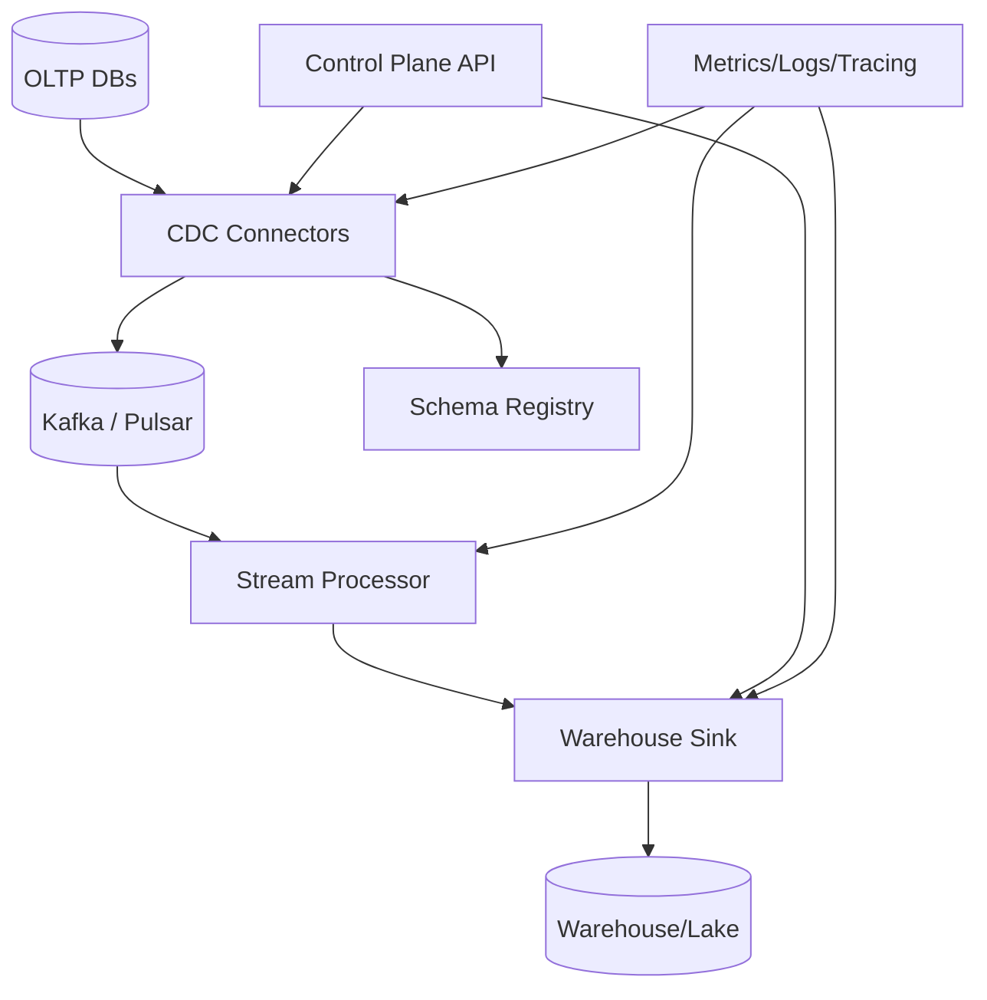
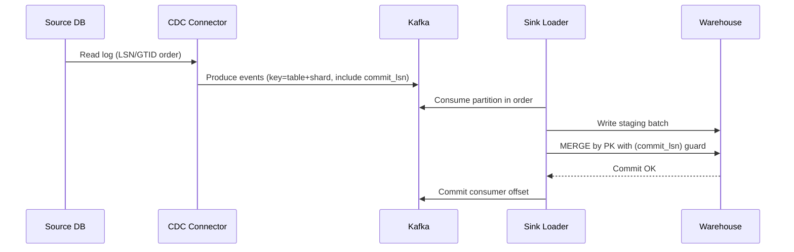

## Overview

A CDC platform streams row-level changes (inserts/updates/deletes) from OLTP databases into analytical destinations (data warehouses/lakes) with low latency and high reliability. The challenge is not just moving bytes—it’s preserving *correctness* under failures: ordering, transaction boundaries, schema evolution, duplicates, backfills, and replayability while sources and sinks evolve independently.

The key insight is to treat the database transaction log as the source of truth, model changes as an immutable ordered event stream, and enforce ordering guarantees at well-defined scopes (typically per table-partition/shard) using monotonic log positions (LSN/SCN/binlog offsets). Downstream, correctness is achieved via idempotent upserts and checkpointed commits, rather than assuming exactly-once delivery end-to-end.

## Requirements

### Functional Requirements
- Capture row-level changes from multiple OLTP engines (e.g., Postgres, MySQL, SQL Server) using log-based CDC.
- Preserve ordering guarantees for changes within a defined scope (per source partition/table shard) and preserve transaction boundaries.
- Support initial snapshot/backfill plus continuous incremental streaming without double-applying rows.
- Deliver changes to multiple destinations (Snowflake/BigQuery/Redshift, and/or lake tables like Iceberg/Delta/Hudi).
- Handle schema evolution (add/drop columns, type changes) with compatibility rules and versioning.
- Provide a control plane to manage connectors, monitor lag/health, and pause/resume/restart safely.
- Support filtering/routing (by database/schema/table) and basic transformations (PII masking, column selection).
- Enable replay from a point-in-time (by log position / timestamp) for recovery and reprocessing.

### Non-Functional Requirements
- **Scale**: 200 source DBs, up to 50K row changes/sec aggregate; peak 200K changes/sec; 5–20 TB/day egress.
- **Latency**: P50 < 2s source→bus, P99 < 10s source→warehouse (steady state); backfill can be hours.
- **Availability**: 99.99% for control plane; 99.9% for data plane (streaming continues during partial connector failures).
- **Consistency**: Ordering + “exactly-once effect” per table shard in the destination via idempotent writes; eventual consistency across tables.
- **Durability**: No committed source transactions lost; tolerate duplicates; RPO ≤ 1 minute, RTO ≤ 30 minutes.

### Constraints & Assumptions
- Ordering guarantee scope: **total order per (source DB, table, shard/partition)**, not global order across all tables.
- Source DBs permit replication/log access (logical replication / binlog / CDC).
- Team size 4–8 engineers; prefer managed components where possible.
- Compliance: encryption in transit + at rest; audit trails; optional field-level masking for PII.

## High-Level Architecture

The system splits into a **data plane** (connectors → durable event bus → sinks) and a **control plane** (provisioning, configuration, observability, safety rails). Kafka/Pulsar provides replayable ordered partitions; CDC connectors emit changes with log positions and transaction metadata; sinks commit to warehouses using checkpointing and idempotent upserts.

This structure isolates the “hard correctness” of CDC (offsets, ordering, schema) from destination-specific loading mechanics, and allows independent scaling: connectors scale with number of sources, the bus scales with throughput, and sinks scale with destination load/merge capacity.

## Component Deep-Dive

### CDC Connectors
**Responsibility**: Read database change logs, translate to a canonical change event format, and publish ordered events to the bus.

**Key Design Decisions**:
- Use **log-based CDC** (WAL/binlog) instead of triggers to reduce overhead and preserve transaction ordering.
- Emit **transaction metadata** (txid, begin/commit markers or commit timestamps) to preserve atomicity and enable downstream exactly-once *effects*.

**Technology Choice**: Debezium (Kafka Connect) for Postgres/MySQL/SQL Server, or native connectors (e.g., AWS DMS-style agents) if constrained.

**Scaling Strategy**:
- One connector task per source partition (e.g., MySQL server/GTID stream; Postgres replication slot).
- Horizontally scale connector workers; isolate noisy sources with dedicated workers and quotas.
- Backpressure by slowing reads and relying on bus durability (never drop committed events).

### Event Bus (Kafka/Pulsar)
**Responsibility**: Provide durable, replayable ordered streams with consumer groups and retention.

**Key Design Decisions**:
- Partitioning strategy enforces ordering: key by **(db, schema, table, shard)** so all changes for a shard land in one partition.
- Retention sized for recovery/replay (e.g., 7–14 days) plus compaction for “latest state” topics when useful.

**Technology Choice**: Kafka (mature ecosystem with Debezium, Connect, Schema Registry); Pulsar is viable if multi-tenancy/isolation is primary.

**Scaling Strategy**:
- Scale partitions based on peak throughput and per-partition ordering constraints.
- Use separate clusters or namespaces for production vs. replay/backfill to avoid noisy-neighbor impact.

### Schema Registry & Compatibility Gate
**Responsibility**: Version schemas, validate evolution, and prevent breaking changes from silently corrupting downstream consumers.

**Key Design Decisions**:
- Canonical schema per topic/table with enforced rules (BACKWARD or FULL compatibility depending on consumers).
- Include schema version + column metadata in each event for safe evolution.

**Technology Choice**: Confluent Schema Registry (Avro/Protobuf/JSON Schema) or Apicurio.

**Scaling Strategy**:
- Stateless registry behind load balancer; cache aggressively in connectors/consumers.
- Treat schema writes as control-plane operations with audit logs and approvals for risky changes.

### Stream Processor (Optional but common)
**Responsibility**: Normalize events, apply masking/filtering, route to destinations, and prepare sink-friendly micro-batches.

**Key Design Decisions**:
- Prefer **minimal transformations** to preserve auditability; heavy transforms belong in warehouse/lake.
- Use event-time + log-position ordering for deterministic outputs (no reordering within a partition).

**Technology Choice**: Kafka Streams / Flink (Flink if you need complex stateful processing and large joins).

**Scaling Strategy**:
- Scale by partitions; maintain state stores with changelog topics; tune exactly-once semantics where applicable.

### Warehouse Sink / Loader
**Responsibility**: Load CDC events into warehouse/lake with idempotent semantics, preserving ordering per shard and checkpointing progress.

**Key Design Decisions**:
- Use **staging + MERGE/UPSERT** (warehouse) or **ACID table formats** (Iceberg/Delta/Hudi) to achieve “exactly-once effect”.
- Commit offsets only after the destination commit succeeds (two-phase pattern at the application level).

**Technology Choice**:
- Snowflake: staged files + Snowpipe/Copy + MERGE into target.
- BigQuery: write to staging table then MERGE; or Storage Write API with careful dedupe.
- Lake: Iceberg/Delta/Hudi with upsert keyed by PK + sequence (LSN).

**Scaling Strategy**:
- Micro-batch per partition (e.g., 1–5s or N records) to amortize MERGE overhead.
- Parallelize by table and shard; throttle merges to avoid warehouse contention.

## Data Model

### Storage Schema

**Canonical CDC Event (topic message)**
- `source`: `{db, schema, table, shard}`
- `op`: `"c" | "u" | "d"` (create/update/delete)
- `pk`: primary key fields (required for upsert destinations)
- `before`: previous row (nullable; optional for privacy/size)
- `after`: new row (nullable for deletes)
- `ts_ms`: source event time
- `tx`: `{txid, begin_lsn, commit_lsn, commit_ts}` (engine-specific mapping)
- `pos`: `{lsn|gtid|binlog_file, binlog_pos}` monotonic per source stream
- `schema_version`: integer/uuid
- `headers`: optional (tenant, masking policy, trace ids)

**Control Plane Metadata (relational DB)**
- `connectors(id, source_type, config, state, created_at, updated_at)`
- `streams(id, connector_id, db, schema, table, shard_key, topic, status)`
- `offset_checkpoints(stream_id, consumer_group, last_committed_pos, updated_at)`
- `schema_versions(topic, version, fingerprint, compatibility, created_at)`
- `load_jobs(id, stream_id, dest, batch_id, status, started_at, finished_at, error)`

### Data Flow

Destination correctness rule (typical): for each PK, apply the row with the greatest `(commit_lsn, op_order)`; ignore older or duplicate events.

## API Design

Control plane APIs (REST; gRPC also fine). Data plane is the bus topics.

### Manage Connectors
- `POST /v1/connectors`
  - Request: `{name, sourceType, connection, includeTables, shardStrategy, options}`
  - Response: `{connectorId, status}`
  - Errors: `400` invalid config, `409` duplicate, `422` missing privileges, `503` capacity
- `GET /v1/connectors/{id}` → status, lag, tasks, lastError
- `POST /v1/connectors/{id}:pause` / `:resume` / `:restart`

**Idempotency**: `POST` supports `Idempotency-Key` header; server stores result keyed by `(client, key)`.

### Stream Subscriptions (Routing)
- `POST /v1/streams`
  - Request: `{connectorId, table, destination, mode: "append|upsert", pkFields, partitionKey}`
  - Response: `{streamId, topic, destinationSpec}`
- `GET /v1/streams/{id}/lag` → `{sourcePos, busLag, sinkLagSeconds}`

### Replay / Backfill
- `POST /v1/streams/{id}:snapshot`
  - Request: `{snapshotMode: "initial|rebuild", consistentCut: true}`
- `POST /v1/streams/{id}:replay`
  - Request: `{fromPos|fromTimestamp, dryRun: false}`
  - Notes: replay uses separate consumer group and writes to isolated destination/staging.

## Scaling & Performance

### Bottleneck Analysis
- **Source DB pressure**: replication slot/binlog retention, IO overhead.
  - Mitigation: tune batch sizes, heartbeat, dedicated replicas for CDC, per-source rate limits.
- **Bus partition hot spots**: skewed keys (e.g., one “big tenant”).
  - Mitigation: shard key includes tenant or hash(PK) while keeping per-shard ordering; increase partitions.
- **Warehouse MERGE cost**: large upsert merges are expensive.
  - Mitigation: micro-batch sizing, clustered keys/sort keys, partition pruning, periodic compaction, “insert-only + periodic merge” option.

### Horizontal Scaling
- **Connectors**: scale workers; isolate heavy sources; one task per source stream.
- **Bus**: scale brokers; add partitions; separate topics per table family.
- **Processors/Sinks**: scale by consumer group; one consumer per partition; autoscale on lag.

**Partitioning strategy**:
- Topic naming: `{env}.{db}.{schema}.{table}`
- Partition key: `hash(shardKey)` where `shardKey = tenant_id` (if present) else `hash(pk)`
- Ordering guarantee: within a partition (shard) only.

### Caching Strategy
- Cache schema lookups in connectors/consumers (TTL 5–15 minutes, invalidate on schema change events).
- Cache control-plane configs in agents (watch-based refresh); never cache offsets or data-plane ordering state outside the bus.

## Trade-offs & Alternatives

### Key Trade-offs Made
- **Kafka ordering per partition**
  - Chosen: per-shard ordering (practical at scale).
  - Sacrificed: global ordering across all tables/rows.
  - Why: global order collapses throughput and creates single-partition bottlenecks.
- **Idempotent sink over end-to-end exactly-once**
  - Chosen: at-least-once delivery + exactly-once *effects* via MERGE/sequence guards.
  - Sacrificed: simplicity in sink logic (needs dedupe/guards).
  - Why: warehouses rarely support transactional offset coupling with Kafka.
- **Minimal transformations in-stream**
  - Chosen: normalization + masking only.
  - Sacrificed: convenience of doing all ETL in-flight.
  - Why: reduces operational complexity and improves auditability.

### Alternative Approaches
- **Managed CDC (AWS DMS, Datastream, Fivetran)**: faster to adopt, but less control over ordering/format/latency and higher long-term cost at scale.
- **Trigger-based CDC**: simpler conceptually but adds write latency, risks missed changes, and complicates transactional ordering.
- **Direct-to-warehouse streaming (no bus)**: lower components, but loses replayability and decoupling; outages force source-side buffering or data loss.

## Failure Modes & Mitigations

### Failure Scenarios
- **Connector crash / restart**
  - Impact: temporary lag; possible duplicates after restart.
  - Detection: task status + increasing lag + missing heartbeats.
  - Mitigation: resume from last committed log position; ensure idempotent downstream apply.
- **Replication slot/binlog retention exceeded**
  - Impact: connector can’t catch up; potential data loss window.
  - Detection: DB metrics (slot lag), alerts on WAL/binlog age.
  - Mitigation: auto-throttle heavy sinks, scale consumers, emergency snapshot + resume; enforce per-source SLOs.
- **Kafka partition unavailability**
  - Impact: streaming stalls for affected partitions.
  - Detection: consumer errors, under-replicated partitions.
  - Mitigation: RF=3, min ISR, rack awareness; replay after recovery.
- **Warehouse MERGE failures / throttling**
  - Impact: lag grows; possible partial loads if not transactional.
  - Detection: load job failures, increasing sink lag.
  - Mitigation: transactional staging + commit markers; retry with exponential backoff; adaptive batch sizing; circuit breaker per table.
- **Schema breaking change**
  - Impact: consumer deserialization failures, wrong columns.
  - Detection: schema compatibility checks, DLQ spikes.
  - Mitigation: registry enforcement; route incompatible events to DLQ; automated rollback of connector schema emission.

### Disaster Recovery
- **RTO/RPO**: RTO 30 minutes, RPO 1 minute (bounded by bus durability and source log retention).
- **Backup strategy**: Kafka topic replication + periodic tiered storage snapshots; control-plane DB PITR; warehouse/lake native backups.
- **Failover procedures**: warm-standby in second region; mirror topics; promote standby control-plane; re-point connectors/sinks via config.

## Operational Considerations

### Monitoring & Alerting
- Connector: source log lag (LSN delta), read QPS, error rate, snapshot progress.
- Bus: under-replicated partitions, produce/consume latency, partition skew, consumer lag.
- Sink: batch commit latency, merge cost, retries, DLQ volume.
- Alerts (examples): P99 end-to-end latency > 30s (10m), consumer lag > 15m, slot/binlog retention < 6h, DLQ rate > 0.1%.

### Deployment Strategy
- Blue/green for control plane; rolling upgrades for workers with safe draining.
- Versioned event schema + compatibility checks; canary a subset of tables/tenants.
- Rollback: pin connector/sink versions; stop committing offsets if destination commit is suspect; replay from last good checkpoint.

## References & Further Reading
- Debezium: https://debezium.io/documentation/
- Kafka Ordering & Exactly-Once Semantics: https://kafka.apache.org/documentation/
- Designing Data-Intensive Applications (Kleppmann) — logs, replication, stream processing
- Lakehouse upserts: Apache Iceberg / Delta Lake / Apache Hudi docs
- Snowflake MERGE + ingestion patterns: Snowflake documentation on staging and MERGE best practices