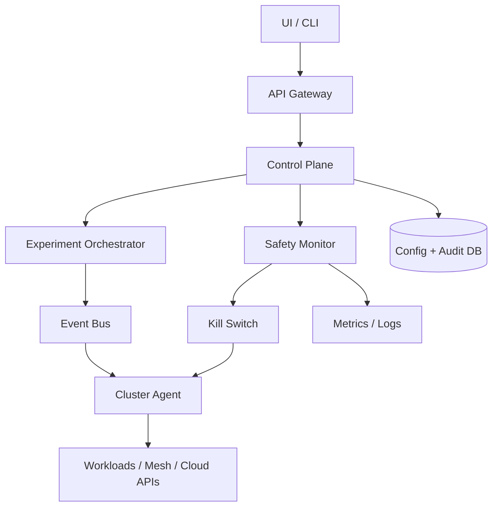
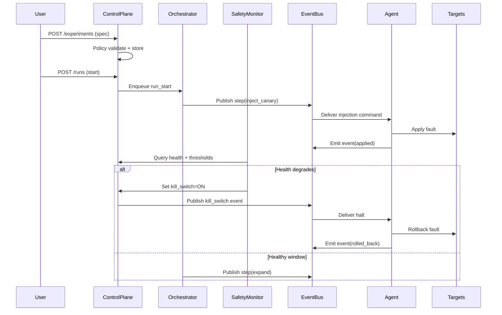

## Overview

A chaos engineering platform enables teams to inject controlled faults (latency, packet loss, instance termination, dependency blackholes, resource pressure) to validate resilience, reduce unknown failure modes, and continuously improve incident readiness. The core challenge is safety: injecting faults into production must have tight blast-radius control, strong guardrails, and fast automatic rollback when health signals degrade.

This design uses a policy-driven control plane with an orchestrator that executes experiments via cluster agents and existing infrastructure hooks (Kubernetes, service mesh, cloud APIs). A dedicated Safety Monitor evaluates health signals (SLOs, error rates, saturation) with hysteresis and triggers an automatic halt (kill switch) that is enforced independently of the orchestrator, ensuring experiments stop even if the main control path fails.

## Requirements

### Functional Requirements
- Create, validate (dry-run), approve, and schedule chaos experiments (with templates and parameters).
- Target selection by service, environment, region/AZ, cluster, label selectors, and traffic percentage.
- Enforce blast-radius constraints (max targets, max % traffic, max zones/regions, allowlists/denylists).
- Execute fault injections (e.g., pod kill, CPU burn, network latency/loss, dependency blackhole, DNS failure).
- Continuously evaluate health signals and automatically halt/rollback on degradation.
- Provide real-time experiment timeline: actions taken, targets affected, health metrics, and stop reasons.
- Support safe progressive rollout (canary → expand) and timeboxed experiments.
- Produce immutable audit logs (who/what/when/why) and post-experiment reports.

### Non-Functional Requirements
- **Scale**: 2,000 services; 200 clusters; 50,000 nodes; up to 5,000 concurrent agents; peak 200 experiment starts/hour; 20 writes/sec to config DB; telemetry ingestion 200k events/sec (aggregated).
- **Latency**:
  - Start/stop command acceptance: P50 100ms, P99 500ms (control plane).
  - Safety halt propagation to agents: P50 1s, P99 5s.
  - UI timeline freshness: <5s behind real time.
- **Availability**: 99.95% control plane; Safety halt path designed for >99.99% (degraded-mode stop still works).
- **Consistency**:
  - Strong consistency for experiment specs, approvals, and guardrails.
  - Eventual consistency acceptable for telemetry and derived dashboards.
- **Durability**: RPO ≤ 5 minutes for config/audit; telemetry can tolerate partial loss (best effort) but halt signals must be durable/replicated.

### Constraints & Assumptions
- Runs primarily on Kubernetes with a service mesh available in many environments (Istio/Linkerd); supports non-mesh via iptables/tc where permitted.
- Teams require RBAC, approvals for production, and integration with existing observability (Prometheus/Datadog) and incident tooling (PagerDuty/Slack).
- Small platform team (3–6 engineers) → prefer managed components (Postgres, Kafka/NATS, object storage) and simple operational model.
- Compliance: immutable audit logs, least privilege, and environment segregation (dev/stage/prod).

## High-Level Architecture

The system is split into a **Control Plane** (authoring, policy, scheduling, audit) and a **Data/Execution Plane** (agents performing injections close to targets). Experiments are executed asynchronously via an event bus to decouple the orchestrator from transient cluster issues and to support retries, ordering, and backpressure.

Safety is treated as a first-class, independent path. The **Safety Monitor** continuously evaluates health signals and can trip a **Kill Switch** that agents honor immediately, even if the orchestrator or UI is unhealthy. This reduces the probability of “runaway” experiments and constrains blast radius by design.

## Component Deep-Dive

### Control Plane (API + Policy)
**Responsibility**: Manage experiment specs, guardrails, approvals, scheduling, RBAC, and audit logging.

**Key Design Decisions**:
- Policy-as-code guardrails (OPA/Rego) evaluated on every create/start: ensures consistent, reviewable safety rules.
- Separate “spec” from “run”: immutable run snapshots prevent mid-run tampering and improve auditability.

**Technology Choice**: Go/Java service, Postgres for config/audit, OPA embedded or sidecar for policy evaluation.

**Scaling Strategy**: Stateless APIs behind L7 LB; Postgres read replicas for heavy reads; write path limited (spec/run lifecycle only).

### Experiment Orchestrator
**Responsibility**: Convert an approved spec into an execution plan, coordinate progressive rollout, manage timeouts, and emit run events.

**Key Design Decisions**:
- Event-driven state machine: each run is a deterministic sequence of steps (select targets → inject → observe → expand/stop).
- Progressive expansion gates: only expand blast radius after health stays within bounds for a defined window.

**Technology Choice**: Worker service consuming from Kafka/NATS; workflow engine optional (Temporal) if complex multi-step retries are common.

**Scaling Strategy**: Partition runs by `run_id` for ordering; horizontal worker pool; idempotent step execution with run-state checkpoints.

### Cluster Agent
**Responsibility**: Enforce local safety, apply and revert injections on targets, report status/events, and honor kill switch.

**Key Design Decisions**:
- “Deny by default” capabilities: agent only performs actions explicitly allowed by cluster policy and per-namespace allowlists.
- Local enforcement of kill switch: agent stops/rolls back even if disconnected from control plane.

**Technology Choice**: Kubernetes DaemonSet/Deployment (Go/Rust), integrates with service mesh APIs, `tc/netem`, Kubernetes API, and cloud provider APIs via tightly scoped IAM.

**Scaling Strategy**: One agent per cluster; sharded internal workers per node/namespace; bounded concurrency and rate limiting.

### Safety Monitor + Kill Switch
**Responsibility**: Evaluate health signals, detect degradation, and halt experiments automatically with low latency.

**Key Design Decisions**:
- Multi-signal evaluation with hysteresis: reduce false positives by requiring sustained breach and using burn-rate style alerts (fast + slow windows).
- Independent stop path: kill switch updates a replicated store (and/or bus topic) that agents poll/subscribe to.

**Technology Choice**: Service querying Prometheus/Datadog APIs; small state store (Redis or Postgres) for kill switch; optional direct bus topic `kill_switch_events`.

**Scaling Strategy**: Per-run evaluators are lightweight; shard by run; cache metric queries; enforce query budgets to protect observability systems.

### Telemetry & Reporting
**Responsibility**: Store run events, timelines, and generate postmortem-ready reports.

**Key Design Decisions**:
- Append-only event log: enables replay, debugging, and consistent reporting even if derived views lag.
- Separate hot vs cold storage: recent run timelines in a queryable store, older logs in object storage.

**Technology Choice**: Kafka topic for events; OLAP store optional (ClickHouse) for timelines; S3/GCS for long-term retention.

**Scaling Strategy**: Partition by `run_id`; compact derived views; TTL and downsampling for high-cardinality event fields.

## Data Model

### Storage Schema

**Postgres: `experiments`**
- `experiment_id` (UUID, PK)
- `name` (text)
- `owner_team` (text)
- `environment` (enum: dev/stage/prod)
- `target_selector` (jsonb) — labels/services/namespaces/regions
- `fault_type` (enum) — `pod_kill`, `net_latency`, `cpu_stress`, `mesh_abort`, etc.
- `fault_params` (jsonb) — e.g., `latency_ms`, `jitter_ms`, `percentage`
- `blast_radius` (jsonb) — max targets, max %, max AZs
- `safety_policy_id` (UUID, FK)
- `created_at`, `updated_at`

**Postgres: `runs`**
- `run_id` (UUID, PK)
- `experiment_id` (UUID, FK)
- `state` (enum: `pending`, `running`, `halting`, `halted`, `completed`, `failed`)
- `snapshot` (jsonb) — immutable copy of spec + resolved policy at start
- `started_by` (text)
- `started_at`, `ended_at`
- `stop_reason` (text)
- `kill_switch_version` (bigint)

**Postgres: `approvals`**
- `approval_id` (UUID, PK)
- `experiment_id` (UUID, FK)
- `required` (bool)
- `approved_by` (text)
- `approved_at` (timestamp)
- `expires_at` (timestamp)

**Event Log (Kafka topic `run_events`)**
- Key: `run_id`
- Value: `{ts, type, actor, target, details}`

**Kill Switch Store**
- `run_id` → `{status: on|off, reason, updated_at, version}`

### Data Flow

## API Design

### Core Endpoints (REST)

**Create experiment**
- `POST /v1/experiments`
- Request:
  - `name`, `environment`, `target_selector`, `fault_type`, `fault_params`, `blast_radius`, `safety_policy_id`
- Response: `201 {experiment_id}`
- Errors: `400` (invalid), `403` (policy denied), `409` (name conflict)

**Dry-run validation**
- `POST /v1/experiments/{experiment_id}:validate`
- Response: `200 {resolved_targets_estimate, policy_results, warnings}`

**Start run**
- `POST /v1/experiments/{experiment_id}/runs`
- Request: `{idempotency_key, schedule_at?, rationale}`
- Response: `202 {run_id, state}`
- Idempotency: `idempotency_key` scoped to `experiment_id` prevents duplicate runs.
- Errors: `409` (approval missing/expired), `403` (policy denied), `429` (rate limited)

**Stop run**
- `POST /v1/runs/{run_id}:stop`
- Request: `{reason, idempotency_key}`
- Response: `202 {state}`
- Semantics: triggers kill switch + orchestrator halt; returns quickly.

**Get run status**
- `GET /v1/runs/{run_id}`
- Response: `{state, started_at, current_step, blast_radius_current, stop_reason?}`

**Stream run events**
- `GET /v1/runs/{run_id}/events?since=...` (poll) or `GET /v1/runs/{run_id}/events:stream` (SSE/WebSocket)
- Response: list/stream of append-only events.

### Error Handling Approach
- Structured errors: `{code, message, details, retryable}`
- Control plane returns `202` for async operations; clients observe progress via run status/events.
- Safe retries: idempotency keys on state-changing endpoints.

## Scaling & Performance

### Bottleneck Analysis
- **Metric query load**: Safety monitor can overload Prometheus/Datadog.
  - Mitigation: query caching, per-run budgets, pre-aggregation, use recording rules, and rate limiting.
- **High-cardinality events**: per-target events can explode.
  - Mitigation: aggregate per step + sample per-target events; store raw events in cold storage with TTL.
- **Agent fan-out**: starting runs across many clusters simultaneously.
  - Mitigation: progressive rollout, bounded concurrency per cluster, and backpressure via bus partitions.

### Horizontal Scaling
- **API/Control Plane**: stateless scale-out; Postgres as shared state with read replicas.
- **Orchestrator**: worker pool; partition by `run_id` to preserve ordering; store checkpoints.
- **Event Bus**: partitioned topics; separate topics for commands, events, and kill switch.
- **Agents**: one per cluster; internal worker queues per namespace/node.

### Caching Strategy
- Cache policy decisions for unchanged specs (minutes) to reduce OPA evaluation overhead.
- Cache resolved target sets for dry-run and start (short TTL, e.g., 30–60s) because cluster state changes quickly.
- Cache health query results at small intervals (e.g., 5–10s) with jitter to avoid thundering herds.
- Invalidation: spec updates bump `experiment_version`; caches keyed by version.

## Trade-offs & Alternatives

### Key Trade-offs Made
- **Event-driven orchestration chosen** over synchronous RPC control.
  - Sacrificed: simpler debugging in request/response flows.
  - Why: better resilience, retries, and decoupling from cluster/network partitions.
- **Independent kill switch path chosen** (Safety Monitor + agent enforcement).
  - Sacrificed: more components and operational overhead.
  - Why: materially reduces risk of runaway experiments; safety is the product.
- **Progressive rollout gates chosen** instead of “full blast” by default.
  - Sacrificed: slower experiments and longer feedback loops.
  - Why: aligns with production safety and reduces blast radius.

### Alternative Approaches
- **Service-mesh-only fault injection** (Istio faults everywhere):
  - Not chosen because it doesn’t cover node/pod/CPU failures and excludes non-mesh workloads.
- **Client-side chaos libraries** embedded in apps:
  - Not chosen due to rollout friction, language diversity, and risk of bypassing centralized guardrails.
- **Single monolith control plane** (API + orchestrator + safety combined):
  - Not chosen because safety should remain operable if orchestration is degraded.

## Failure Modes & Mitigations

### Failure Scenarios
- **Scenario**: Safety Monitor down during an experiment  
  **Impact**: delayed detection of health degradation  
  **Detection**: missing safety heartbeats; alert on evaluator lag  
  **Mitigation**: agent timebox (max duration), conservative defaults, and fallback to orchestrator-side thresholds; auto-halt if no safety heartbeat for N seconds.

- **Scenario**: Orchestrator crashes mid-run  
  **Impact**: experiment may stall (fault still applied)  
  **Detection**: run step heartbeat missing; consumer group lag  
  **Mitigation**: agent-enforced max TTL per injection; run state checkpoints allow resume; kill switch always available for stop.

- **Scenario**: Agent loses connectivity to control plane  
  **Impact**: cannot receive stop commands  
  **Detection**: agent heartbeat missing; bus delivery failures  
  **Mitigation**: agent local TTL + rollback-on-disconnect; optional secondary channel for kill switch (direct read of kill store).

- **Scenario**: False positive health degradation triggers halt  
  **Impact**: experiments stop early; reduced learning  
  **Detection**: post-run analysis shows unrelated alert causes  
  **Mitigation**: hysteresis, multi-window burn-rate, require multiple signals, and allow “observation-only” mode in staging.

- **Scenario**: Policy misconfiguration allows too-large blast radius  
  **Impact**: widespread user impact  
  **Detection**: policy change audit + drift detection  
  **Mitigation**: policy PR reviews, unit tests for OPA rules, “break-glass” admin controls, and hard-coded absolute maxima in agents.

### Disaster Recovery
- **RTO/RPO**: RTO 30 minutes (control plane), RPO 5 minutes (config/audit). Kill switch should remain functional in-region; cross-region failover supported.
- **Backup strategy**: continuous Postgres WAL archiving; daily snapshots; event log retained in object storage.
- **Failover procedures**: promote standby Postgres; re-point API; agents reconnect and resubscribe; active experiments auto-halt if control plane unavailable beyond threshold.

## Operational Considerations

### Monitoring & Alerting
- Key metrics:
  - Run lifecycle: starts/hour, success rate, mean time to halt, rollback success rate.
  - Safety: evaluator lag, metric query error rate, kill switch propagation latency.
  - Agents: heartbeat freshness, injection failures, rollback failures, privilege denials.
  - Bus/DB: consumer lag, publish errors, DB tx latency, deadlocks.
- Alert thresholds:
  - Kill switch P99 propagation > 5s for 5 minutes.
  - Any rollback failure rate > 0.1% per day.
  - Safety evaluator lag > 15s sustained.
  - Agent heartbeat missing for >2 minutes in prod clusters.

### Deployment Strategy
- Progressive delivery: canary control plane releases; feature flags for new fault types.
- Safe rollout for agents: per-cluster staged upgrades; auto-rollback on elevated injection/rollback error rate.
- Rollback procedures: versioned APIs; run snapshots ensure older agents can execute known schemas; “disable new runs” global toggle.

## References & Further Reading
- Netflix: Chaos Monkey and the Simian Army (concepts and guardrails)
- “Site Reliability Engineering” (Google) — error budgets, burn-rate alerts
- LitmusChaos (Kubernetes-native chaos patterns)
- Gremlin (industry reference for guardrails and blast radius)
- OPA (Open Policy Agent) documentation for policy-as-code
- Istio fault injection docs (HTTP abort/delay, traffic shaping)