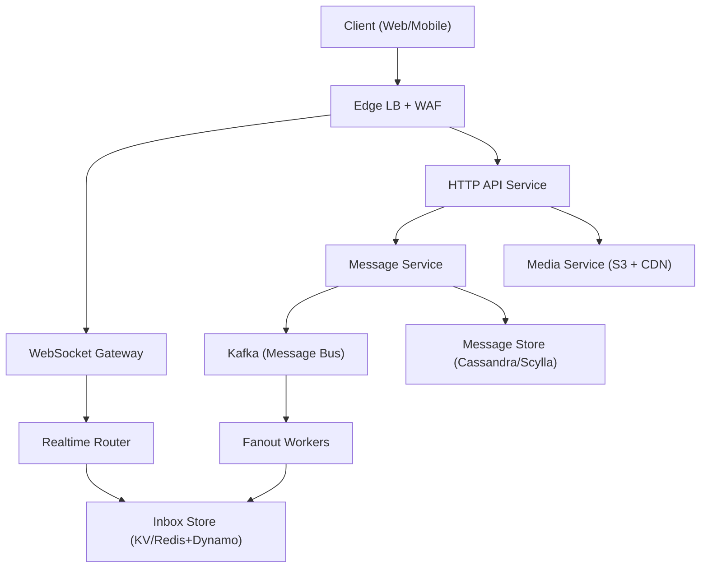
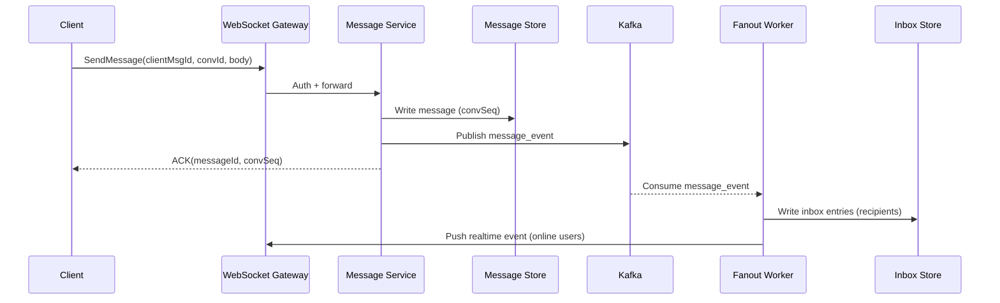

## Overview

A production chat system is deceptively complex: beyond “send and receive messages,” it must deliver low-latency real-time experiences while supporting offline devices, multi-device sync, read receipts, typing indicators, and reliable fan-out to groups that may range from a few users to hundreds of thousands. The core challenges are (1) correctness under partial failure (duplicates, reordering, retries), (2) scaling real-time delivery state (connections, presence) independently from durable storage, and (3) avoiding “N×M” amplification for large groups.

The key insight is to split the system into two planes: a **real-time plane** (WebSocket gateway + ephemeral presence/typing) optimized for low latency and connection scale, and a **durable event plane** (message persistence + delivery events) optimized for durability, replay, and backpressure. Group delivery uses a **hybrid fan-out** strategy: fan-out-on-write for small groups (fast reads) and fan-out-on-read / partitioned inboxes for large groups (bounded write amplification), with clear semantics for ordering and read receipts.

## Requirements

### Functional Requirements
- Send/receive messages in 1:1 and group conversations across web/mobile clients.
- Real-time delivery when online via persistent connections; graceful fallback to push notifications when offline.
- Offline sync: clients can fetch missed messages and reconcile state across multiple devices per user.
- Read receipts (per message, per recipient) and delivery receipts (server/device acknowledgements).
- Typing indicators and presence (online/last seen) with low latency and ephemeral semantics.
- Group management: create groups, invite/kick, roles (admin/member), and membership changes.
- Media messaging (images/files) with upload, secure download, and thumbnails.
- Abuse controls: rate limiting, spam prevention, and reporting hooks.

### Non-Functional Requirements
- **Scale**: 20M DAU, 2M peak concurrent connections, peak 300K msgs/sec (bursty), 10B msgs/day stored (incl. media metadata).
- **Latency**:
  - Send path: P50 < 50ms, P99 < 200ms (client → server ACK).
  - Online delivery: P50 < 100ms, P99 < 400ms (sender ACK → recipient receive).
  - Sync fetch: P99 < 1s for 500 messages.
- **Availability**: 99.99% for send/receive APIs; 99.9% acceptable for presence/typing.
- **Consistency**:
  - Messages: durable, ordered **within a conversation** (best-effort global ordering not required).
  - Membership: strongly consistent for authorization decisions.
  - Presence/typing: eventual/best-effort.
- **Durability**: No silent message loss; tolerate duplicates. RPO ≤ 1 minute, RTO ≤ 30 minutes for regional disasters.

### Constraints & Assumptions
- Multi-region active-active for read/write traffic; clients connect to nearest region.
- Compliance: encryption in transit; at-rest encryption; audit logs for admin actions; optional E2EE as an extension.
- Team constraint: prefer managed primitives where possible (e.g., object storage, managed Kafka) but design remains portable.

## High-Level Architecture



Clients maintain a WebSocket connection to the gateway for real-time events (messages, typing, receipts). The HTTP API handles authentication, conversation/group management, history fetch, and media upload coordination. The Message Service durably stores messages first, publishes events to Kafka, and returns an ACK to the sender once persisted.

Fanout workers consume message events and deliver them to recipients by writing to per-user/per-device inboxes and pushing real-time notifications through the Realtime Router to connected devices. Offline devices rely on inbox + sync APIs (and optional push notifications) to catch up.

## Component Deep-Dive

### WebSocket Gateway

**Responsibility**: Maintain millions of concurrent connections, authenticate sessions, multiplex real-time events (message delivery, receipts, typing), and apply backpressure.

**Key Design Decisions**:
- Use stateless gateway nodes with sticky routing by connection; store connection metadata in an external presence store to allow horizontal scaling.
- Separate “realtime event push” from “durable state changes”: gateways do not decide delivery correctness; they only route events to live connections.

**Technology Choice**: Envoy/Nginx at edge; gateway in Go/Java/Netty; QUIC optional later. Use JWT + short-lived session tokens; mTLS for internal hops.

**Scaling Strategy**: Horizontal scale by sharding connections across gateway pods; use consistent hashing on `userId` for routing; autoscale on open connections, CPU, and outbound queue depth.

### Message Service

**Responsibility**: Validate requests, authorize membership, assign message IDs, persist messages, publish to the event bus, and provide idempotent send semantics.

**Key Design Decisions**:
- “Persist then publish” with transactional outbox or equivalent to ensure messages are not ACKed without eventual fan-out.
- Conversation-local ordering via a monotonically increasing `convSeq` (allocated by a lightweight sequencer per conversation partition) or via message IDs with server timestamps + tie-breakers.

**Technology Choice**: gRPC between services; Cassandra/Scylla for message storage (wide rows by conversation); Kafka for durable event streaming; PostgreSQL for strongly consistent metadata (users, groups, roles).

**Scaling Strategy**: Partition by `conversationId` across message service shards; Cassandra scales by adding nodes; Kafka partitions scale consumers for fanout.

### Fanout Workers

**Responsibility**: Expand a message event to its recipients, write delivery entries to inboxes, and trigger real-time pushes/push notifications.

**Key Design Decisions**:
- Hybrid group strategy:
  - Small groups (e.g., ≤ 200 members): fan-out-on-write to each member inbox for fast sync and per-user unread counts.
  - Large groups/channels: store message once; maintain per-user read cursors and allow fan-out-on-read (pull) to avoid huge write amplification.
- Use at-least-once processing with recipient-level idempotency to tolerate retries.

**Technology Choice**: Kafka consumers; Redis or DynamoDB/Scylla KV for inbox entries; optional RocksDB state for local dedupe windows.

**Scaling Strategy**: Scale by Kafka partitions; shard by `conversationId` to preserve ordering per conversation; apply per-group fanout rate limits and batch writes.

### Inbox & Sync Service

**Responsibility**: Provide offline sync: “what did I miss since cursor X?” plus fast unread counters and per-device reconciliation.

**Key Design Decisions**:
- Maintain per-user/per-device cursors (`lastDeliveredSeq`, `lastReadSeq`) and a compact inbox index keyed by `(userId, timeBucket)` or `(userId, seqRange)`.
- Support “delta sync” primarily; fall back to history scan from Message Store when inbox entries expired or for large groups.

**Technology Choice**: DynamoDB/Scylla KV for inbox index; Redis as hot cache; HTTP endpoints for sync; protobuf payloads for efficiency.

**Scaling Strategy**: Partition by `userId`; time-bucketed keys to avoid hot partitions; TTL inbox entries (e.g., 30–90 days) with history as source of truth.

### Presence & Typing Service (Realtime Router)

**Responsibility**: Track online/offline and route ephemeral events (typing, presence, “delivered”) with low latency.

**Key Design Decisions**:
- Ephemeral state with TTL (e.g., 30s heartbeat) to avoid strong consistency and reduce storage load.
- Typing indicators are best-effort and not persisted; they should not block message delivery.

**Technology Choice**: Redis Cluster (or Aerospike) for presence TTL; pub/sub via Redis, NATS, or Kafka (separate topic) depending on latency needs.

**Scaling Strategy**: Shard by `userId`; keep hot presence in-memory; degrade gracefully (disable typing) when overloaded.

## Data Model

### Storage Schema

**PostgreSQL (metadata, strong consistency)**
- `users(user_id, created_at, status, ...)`
- `conversations(conversation_id, type, created_at, created_by)`
- `conversation_members(conversation_id, user_id, role, joined_at, left_at, mute_settings, notification_settings)`
- `devices(device_id, user_id, platform, push_token, last_seen_at)`

**Cassandra/Scylla (messages, durable)**
- `messages_by_conversation`
  - Partition key: `conversation_id`
  - Clustering: `conv_seq DESC` (or `message_id DESC`)
  - Fields: `conv_seq`, `message_id`, `sender_id`, `sent_at`, `payload_type`, `payload`, `media_refs`, `edit_of`, `deleted_at`
- `message_dedup`
  - Key: `(sender_id, client_msg_id)` → `message_id`, `conv_seq`, `sent_at` (TTL 7–30 days)

**Inbox KV (delivery index, fast sync)**
- `inbox_entries`
  - Key: `(user_id, bucket)` → list/map of `(conversation_id, conv_seq, message_id, sent_at)` (bounded, append-only)
- `read_state`
  - Key: `(user_id, conversation_id)` → `last_read_seq`, `last_delivered_seq`, `unread_count`, `updated_at`

**Receipts (KV or wide rows)**
- `delivery_receipts(message_id, user_id) -> delivered_at, device_id`
- `read_receipts(message_id, user_id) -> read_at, device_id`

**Media (object storage)**
- `media_object` stored in S3/GCS; metadata in DB: `media_id, owner_id, content_type, size, checksum, created_at, object_key, thumbnail_key`

### Data Flow



Offline sync:
- Client calls `SyncInbox(sinceCursor)` to fetch missing entries, then `GetMessages(convId, fromSeq)` for any gaps or large-group backfills.
- Client sends `AckDelivered/AckRead` which updates receipt stores and triggers realtime receipt events.

## API Design

### Authentication
- `POST /v1/auth/token`
  - Returns short-lived access token; WebSocket uses it during connect.
  - Errors: `401` invalid credentials, `429` throttled.

### Messaging
- `POST /v1/conversations/{conversationId}/messages`
  - Request:
    ```json
    { "clientMsgId":"uuid", "type":"text", "body":"hi", "mediaIds":["..."], "idempotencyKey":"uuid" }
    ```
  - Response:
    ```json
    { "messageId":"snowflake", "convSeq":12345, "sentAt":"RFC3339" }
    ```
  - Idempotency: `(senderId, clientMsgId)` or `Idempotency-Key` maps to the same `messageId/convSeq`.
  - Errors: `403` not a member, `409` conversation state changed, `413` payload too large.

- `GET /v1/conversations/{conversationId}/messages?fromSeq=12000&limit=200`
  - Returns ordered messages; supports pagination by `fromSeq`/`beforeSeq`.
  - Cache: CDN not used (auth); server-side caching by hot conversation pages.

### Sync
- `POST /v1/sync/inbox`
  - Request:
    ```json
    { "deviceId":"...", "cursor":"opaque", "limit":1000 }
    ```
  - Response:
    ```json
    { "nextCursor":"opaque", "entries":[{"conversationId":"...","convSeq":12345,"messageId":"...","sentAt":"..."}] }
    ```
  - Cursor encodes `(bucket, offset)`; idempotent by cursor.

### Receipts & Typing
- `POST /v1/conversations/{conversationId}/read`
  - Request: `{ "convSeq":12345, "deviceId":"..." }`
  - Semantics: monotonic; server stores `max(last_read_seq, convSeq)`.

- WebSocket events:
  - `message.new`, `receipt.delivered`, `receipt.read`, `typing.start`, `typing.stop`, `presence.update`
  - Error handling: gateway sends `error` frames; client retries with exponential backoff and reconnect jitter.

### Groups
- `POST /v1/groups` `{ "name":"...", "members":[...]}`
- `POST /v1/groups/{groupId}/members` `{ "userId":"...", "role":"member" }`
- Membership updates are strongly consistent (Postgres) and versioned (`membershipVersion`) to prevent stale authorization.

## Scaling & Performance

### Bottleneck Analysis
- **WebSocket connection load**: CPU for TLS, memory per connection, outbound queueing.
  - Mitigation: connection sharding, backpressure (drop typing before messages), efficient binary frames, keepalive tuning.
- **Fan-out amplification** (large groups): writes to inboxes can explode.
  - Mitigation: hybrid fan-out; cap fanout-on-write group size; batch recipient writes; prioritize online recipients.
- **Hot conversations** (celebrity chats): single partition hotspots in message store.
  - Mitigation: partition by `(conversationId, timeBucket)` or “sub-partitions” for very large conversations; keep ordering per bucket and merge by `convSeq`.
- **Receipt storms** in large groups:
  - Mitigation: aggregate receipts (e.g., per-user lastReadSeq instead of per-message read receipts for groups), sampling, or only expose “read up to” semantics.

### Horizontal Scaling
- **Client/Edge/Gateway**: stateless; scale by open connections; consistent-hash routing for push.
- **Message Service**: shard by `conversationId`; independent autoscaling; protect with per-conversation rate limits.
- **Kafka**: partition by `conversationId` to preserve ordering; scale consumers by partitions.
- **Message Store**: Cassandra/Scylla scale-out; careful partition sizing; compaction tuned for time-series writes.
- **Inbox Store**: partition by `userId`; time buckets; TTL and compaction to control size.

### Caching Strategy
- **Redis**:
  - Presence/typing (TTL seconds).
  - Hot conversation metadata and membership (TTL minutes) with version checks.
  - Recent message pages for hot conversations (TTL 10–60s).
- **Invalidation**:
  - Membership changes publish an event; services update caches by `conversationId`.
  - Message cache is write-through (Message Service writes + updates cache); safe because source of truth is Cassandra.
- **Client caching**:
  - Local DB (SQLite) stores messages; sync is incremental via cursors.

## Trade-offs & Alternatives

### Key Trade-offs Made
- **Kafka + outbox (chosen)** vs direct synchronous fanout:
  - Sacrifice: more components and eventual delivery to offline inbox.
  - Gain: durability, backpressure, replayability, and decoupled scaling.
- **Hybrid fan-out (chosen)** vs fan-out-on-write everywhere:
  - Sacrifice: more complex sync logic for large groups.
  - Gain: bounded write amplification and predictable cost.
- **Per-conversation ordering (chosen)** vs global ordering:
  - Sacrifice: no total order across conversations (not needed).
  - Gain: simpler partitioning and higher throughput.

### Alternative Approaches
- **Pure fan-out-on-read** (store once, everyone pulls):
  - Not chosen because it makes offline sync/unread counts expensive and increases read load dramatically for typical small groups.
- **Single datastore (e.g., only DynamoDB)**:
  - Not chosen because strong metadata consistency + high-throughput time-series messaging benefit from specialized storage patterns.
- **CRDT-based messaging**:
  - Not chosen due to complexity; typical chat can accept server-assigned order and at-least-once semantics.

## Failure Modes & Mitigations

### Failure Scenarios
- **Scenario**: Kafka outage or severe lag  
  **Impact**: Messages persisted but delayed delivery/fanout  
  **Detection**: consumer lag alerts, publish error rate, end-to-end delivery SLO burn  
  **Mitigation**: multi-AZ Kafka, retry with backoff, prioritize online push via a secondary fast path (optional), replay from topic once recovered.

- **Scenario**: Message store partial unavailability  
  **Impact**: Send fails or history missing  
  **Detection**: elevated write/read latencies, error rate, quorum failures  
  **Mitigation**: multi-AZ replication, tuned quorum (e.g., LOCAL_QUORUM), fail fast + client retry, degraded mode (queue send locally).

- **Scenario**: Duplicate deliveries due to retries  
  **Impact**: Users see duplicates if client not deduping  
  **Detection**: dedupe metrics, client reports  
  **Mitigation**: idempotency keys, message IDs, client-side dedupe by `messageId`.

- **Scenario**: Presence/typing store failure  
  **Impact**: Wrong presence/typing, but messaging still works  
  **Detection**: Redis errors, heartbeat drops  
  **Mitigation**: degrade by disabling typing/presence; keep core messaging independent.

- **Scenario**: Large group receipt storm  
  **Impact**: elevated write QPS, lag, increased costs  
  **Detection**: receipt QPS, p99 latency spikes  
  **Mitigation**: switch to “read up to seq” aggregation, rate limit receipts, batch updates.

### Disaster Recovery
- **Targets**: RPO ≤ 1 minute, RTO ≤ 30 minutes (regional).
- **Backups**: periodic snapshots for Cassandra + incremental backups; Postgres PITR; Kafka topic replication + mirror to secondary region.
- **Failover**: DNS/Anycast to healthy region; clients reconnect; replay Kafka from last committed offsets; rebuild caches from stores.

## Operational Considerations

### Monitoring & Alerting
- Gateway: open connections, reconnect rate, outbound queue depth, write failures, CPU/mem per node.
- Message Service: send QPS, p99 persist latency, idempotency hit rate, auth failures, per-conversation rate limiting.
- Kafka: consumer lag, under-replicated partitions, produce latency, partition skew.
- Stores: Cassandra p99 read/write latency, tombstone metrics, compaction backlog; Redis evictions/latency.
- SLO alerts: end-to-end “send → delivered” latency, message loss signals (persisted but never fanned out within SLA).

### Deployment Strategy
- Progressive rollout (canary) by region and percentage of users; feature flags for fanout mode and receipt behavior.
- Backward-compatible WebSocket event schemas (versioned envelope).
- Rollback: keep previous consumer group available; schema evolution via protobuf with reserved fields.

## References & Further Reading

- Kafka: Exactly-once semantics, idempotent producers, consumer lag patterns: https://kafka.apache.org/documentation/
- Cassandra data modeling for time-series and wide rows: https://cassandra.apache.org/doc/latest/
- “Outbox pattern” for reliable event publishing: https://microservices.io/patterns/data/transactional-outbox.html
- WhatsApp-style scaling discussions (high-level patterns): https://www.infoq.com/presentations/whatsapp-scalability/
- Designing presence systems and ephemeral state (Redis TTL/heartbeats): https://redis.io/docs/latest/