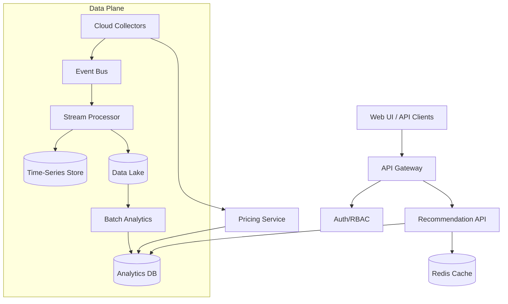
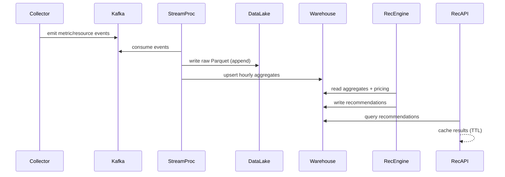

## Overview

A cloud cost optimization platform continuously ingests infrastructure inventory and utilization telemetry, correlates it with billing/pricing dimensions, and produces actionable recommendations (e.g., rightsizing, spot adoption) with quantified savings and risk. The challenge is less about “running analytics” and more about building a trustworthy decision system: cloud data is incomplete and delayed, pricing rules are complex, workloads are spiky, and recommendations must be explainable, auditable, and safe to apply.

The key insight is to separate concerns into (1) reliable ingestion/normalization of multi-cloud signals, (2) a canonical cost + utilization model with strong provenance, and (3) a recommendation engine that is conservative-by-default, uses percentile-based utilization windows, and emits recommendations with confidence/risk scoring, guardrails, and clear explanations. The platform should support both batch (daily/weekly) and near-real-time (hourly) computation to balance freshness, cost, and correctness.

## Requirements

### Functional Requirements
- Connect customer cloud accounts (AWS/Azure/GCP), discover resources (VMs, ASGs/MIGs, node pools, EBS/PD, RDS/CloudSQL, LB).
- Ingest utilization metrics (CPU, memory, disk, network) and events (scale, deployments, interruptions) with attribution to resources and tags.
- Compute rightsizing recommendations for compute (instance type/size, min/max, reserved/commit options) with estimated savings and impact.
- Recommend spot/preemptible adoption strategies (mixed-instance policies, fallback capacity, diversification) with interruption risk scoring.
- Provide a UI and API to browse recommendations, filter by org/account/app/tag, and see “why” (evidence window, percentiles, headroom).
- Support workflows: accept/ignore/snooze recommendations, export (CSV/BI), and optional “apply via IaC/automation” with approvals.
- Maintain audit logs and recommendation history; track realized savings vs predicted savings.
- Alerting/reporting: weekly digest, anomaly flags (sudden spend spikes, underutilized fleets), and policy checks.

### Non-Functional Requirements
- **Scale**:
  - Tenancy: 5,000 orgs, up to 50,000 cloud accounts.
  - Inventory: 200M resources total (peaks), 20M “active compute” resources.
  - Metrics ingest: peak 1M samples/sec sustained (Prometheus-style), 20TB/day raw across all tenants.
  - Recommendation jobs: daily batch over 30 days history; hourly incremental updates for top fleets.
- **Latency**:
  - UI/API read paths: P50 100ms, P99 400ms for “list recommendations” (cached).
  - Write paths (actions like accept/ignore): P99 250ms.
  - Freshness: recommendations available within 2 hours of new metrics; pricing updates within 30 minutes of change.
- **Availability**: 99.95% for read APIs/UI; 99.9% for ingestion pipelines (graceful backfill).
- **Consistency**:
  - Strong consistency for auth/RBAC, recommendation state transitions, and audit logs.
  - Eventual consistency for metrics, derived aggregates, and recommendation recomputation.
- **Durability**:
  - Raw telemetry and recommendation history: 11x9s object-store durability.
  - RPO 15 minutes (control plane); RTO 2 hours (full service).

### Constraints & Assumptions
- Multi-tenant SaaS; data isolation is mandatory (tenant-aware authz at every layer).
- Assume read-only cloud access for discovery/metrics by default; optional write access for “apply” automation.
- Team size ~8–12 engineers; prioritize managed services where possible (Kafka-managed, object storage, hosted TSDB/warehouse).
- Compliance targets: SOC2 Type II; encryption in transit/at rest; immutable audit logs.

## High-Level Architecture



This architecture splits the system into a low-latency control plane (API/UI, auth, actions) and a high-throughput data plane (collection, streaming, batch). Metrics and inventory land in durable storage (TSDB for recent/high-resolution queries and a data lake for cheap retention and recomputation). Recommendations are served from an analytics-optimized store with aggressive caching for interactive browsing.

Separating ingestion from computation allows independent scaling and failure isolation: collectors can buffer and backfill; processors can re-run; and serving remains stable even during data pipeline incidents. A dedicated pricing service normalizes cloud pricing into a canonical model used by recommendation computation to ensure consistent savings estimates.

## Component Deep-Dive

### Cloud Collectors
**Responsibility**: Discover resources and ingest telemetry signals from cloud providers and/or customer monitoring (CloudWatch/Stackdriver/Azure Monitor, Prometheus remote-write, CUR/Billing exports).

**Key Design Decisions**:
- Use provider-specific collectors that emit a canonical event schema (resource upsert, metric sample, pricing hint) to decouple downstream systems from provider quirks.
- Support both pull (cloud APIs) and push (Prometheus remote write / OTLP) ingestion; push is preferred for high-cardinality K8s metrics.

**Technology Choice**: Kubernetes-deployed collectors (Go), provider SDKs, Prometheus remote-write receiver or OpenTelemetry Collector.

**Scaling Strategy**: Shard collection by `(tenant_id, account_id)`; apply rate limiting/backoff per provider; spool to local disk + retry; batch API calls; use async pagination.

### Event Bus + Stream Processor
**Responsibility**: Buffer and normalize incoming events, deduplicate, enrich with inventory context, and compute rolling aggregates.

**Key Design Decisions**:
- Use an event bus to absorb bursts and provide replay; enforce schema with versioning.
- Compute hourly/daily aggregates in-stream (percentiles approximations, rolling maxima) to reduce warehouse cost.

**Technology Choice**: Kafka (or Pulsar) + Flink (or Kafka Streams); Schema Registry (Avro/Protobuf).

**Scaling Strategy**: Partition topics by `tenant_id` (and optionally `account_id`) to localize state; autoscale Flink task managers; backpressure-aware consumers; dead-letter topics for poisoned events.

### Storage Layer (TSDB + Data Lake + Warehouse)
**Responsibility**: Store raw telemetry, recent high-resolution metrics, and derived analytics tables powering recommendations and UI queries.

**Key Design Decisions**:
- Keep raw immutable data in the lake for reprocessing and audits; store derived, query-friendly tables in a columnar warehouse.
- Store recent high-resolution metrics in a TSDB for short-window debugging/explainability (“why” charts).

**Technology Choice**:
- TSDB: Cortex/Mimir/Thanos (Prometheus-compatible) or managed TSDB.
- Data Lake: S3/GCS + Parquet with partitioning.
- Warehouse: ClickHouse/BigQuery/Snowflake depending on deployment model.

**Scaling Strategy**: Lake partitions by `dt=YYYY-MM-DD/tenant_id=.../source=...`; warehouse clustered by `(tenant_id, resource_id, day)`; TTL policies for high-res metrics.

### Recommendation Engine (Batch Analytics)
**Responsibility**: Generate rightsizing and spot recommendations with savings estimates, confidence, and guardrails.

**Key Design Decisions**:
- Percentile-based sizing (e.g., CPU P95, memory P95 over 14–30 days) with headroom (e.g., +20–30%) instead of averages.
- Produce recommendations with explicit risk/confidence scoring and minimum evidence thresholds (e.g., ≥7 days of data, ≥90% sample coverage).

**Technology Choice**: Spark or SQL-based pipelines (dbt) in the warehouse; model artifacts stored in object store; orchestration with Airflow/Argo.

**Scaling Strategy**: Incremental recomputation by changed resources; pre-aggregate per resource/day/hour; prioritize fleets (ASGs/node pools) over single instances when possible.

### Recommendation API + UI
**Responsibility**: Serve recommendations, explanations, actions (accept/ignore/snooze), exports, and reporting.

**Key Design Decisions**:
- Read-optimized endpoints backed by warehouse materialized views + Redis caching for common filters.
- Strongly consistent state transitions for actions with immutable audit logs.

**Technology Choice**: Stateless API (Go/Java/Kotlin) + Redis; UI in React/Next.js; Postgres for control-plane metadata.

**Scaling Strategy**: Horizontal scale behind L7 LB; cache hot queries (tenant dashboards, top savings) with short TTL; paginate and use cursor-based navigation.

## Data Model

### Storage Schema

**Control Plane (Postgres)**
- `tenants(tenant_id, name, created_at)`
- `accounts(account_id, tenant_id, provider, external_account_id, status, created_at)`
- `integrations(account_id, type, config_encrypted, last_sync_at)`
- `recommendation_actions(action_id, tenant_id, rec_id, actor, action, reason, created_at)`  
  - `action ∈ {ACCEPT, IGNORE, SNOOZE, APPLY_REQUESTED}`
- `audit_log(event_id, tenant_id, actor, event_type, payload_json, created_at)` (append-only)

**Analytics (Warehouse, columnar)**
- `resource_dim(tenant_id, resource_id, provider, region, service, resource_type, instance_type, tags_map, first_seen, last_seen)`
- `metric_hourly(tenant_id, resource_id, hour_ts, cpu_p50, cpu_p95, mem_p95, net_p95, samples, coverage)`
- `cost_hourly(tenant_id, resource_id, hour_ts, on_demand_cost, amortized_cost, currency)`
- `pricing_dim(provider, region, instance_type, purchase_option, price_per_hour, effective_at)`
- `recommendations(rec_id, tenant_id, resource_id, rec_type, created_at, valid_until, current_shape, recommended_shape, est_savings_monthly, confidence, risk_score, rationale_json, status)`
  - `status ∈ {OPEN, SUPPRESSED, ACCEPTED, APPLIED, EXPIRED}`
- `savings_realized(tenant_id, resource_id, day, predicted_savings, realized_savings, method)`

**Data Lake (Parquet)**
- `raw_events(dt, tenant_id, source, payload, ingest_ts, schema_version)`

### Data Flow



Key operations:
- **Rightsizing**: hourly aggregates → daily window rollups → compute target size by P95 + headroom → estimate savings via pricing_dim → emit recommendation with evidence and confidence.
- **Spot**: classify workload (stateless vs stateful, SLO sensitivity, autoscaling presence) → compute interruption tolerance and fallback capacity plan → estimate blended savings → emit recommendation with risk score and rollout guidance.

## API Design

Base: `https://api.costopt.example.com/v1`

### List Recommendations
`GET /tenants/{tenantId}/recommendations?type=RIGHTSIZE&status=OPEN&limit=50&cursor=...`

Response:
```json
{
  "items": [
    {
      "recId": "rec_123",
      "resourceId": "i-abc",
      "type": "RIGHTSIZE",
      "current": {"instanceType": "m6i.4xlarge"},
      "recommended": {"instanceType": "m6i.2xlarge"},
      "estSavingsMonthlyUsd": 412.35,
      "confidence": 0.86,
      "riskScore": 0.22,
      "createdAt": "2025-12-01T10:00:00Z",
      "status": "OPEN"
    }
  ],
  "nextCursor": "..."
}
```

### Get Recommendation Detail (Explainability)
`GET /tenants/{tenantId}/recommendations/{recId}`  
Includes `rationale` (window, percentiles, headroom, data coverage), and links to charts.

### Action a Recommendation (Idempotent)
`POST /tenants/{tenantId}/recommendations/{recId}/actions`

Headers: `Idempotency-Key: <uuid>`

Request:
```json
{ "action": "SNOOZE", "until": "2026-01-15T00:00:00Z", "reason": "Peak season" }
```

Response: `202 Accepted` (or `200 OK` if already applied for the same idempotency key).

### Export
`POST /tenants/{tenantId}/exports/recommendations` → returns a job ID; results stored in object storage.

**Error handling**
- Use standard HTTP codes (`400` validation, `401/403` authz, `404`, `409` state conflict, `429` rate limit, `5xx`).
- Include stable error codes: `{ "code": "REC_STATE_CONFLICT", "message": "...", "retryable": false }`.

**Idempotency considerations**
- All mutating endpoints require `Idempotency-Key`; store `(tenant_id, key) -> response_hash` for 24 hours.
- Actions enforce state machine rules (e.g., cannot ACCEPT an EXPIRED recommendation).

## Scaling & Performance

### Bottleneck Analysis
- **High-cardinality metrics** (K8s pods/containers): mitigate by focusing on node pool / workload-level aggregates and sampling; allow opt-in high-res debugging retention.
- **Warehouse query cost** for dashboard filters: mitigate via materialized views, precomputed “top savings” tables, and Redis caching.
- **Cloud API throttling** for discovery: mitigate via incremental syncs, caching, jittered backoff, and provider quota-aware scheduling.
- **Pricing complexity** (discounts, commitments, Savings Plans/RIs): mitigate by separating “list price” vs “amortized effective” cost models and clearly labeling savings estimates.

### Horizontal Scaling
- **Collectors**: scale by accounts; run per-tenant or pooled with strong isolation; use work queues.
- **Kafka/Flink**: scale partitions and parallelism; keep state keyed by tenant to avoid cross-tenant hotspots.
- **Storage**:
  - TSDB sharded by tenant; enforce retention (e.g., 14–30 days high-res).
  - Lake scales with object store; warehouse scales with compute separation.
- **API**: stateless replicas; read replicas for Postgres; cache-heavy.

**Sharding/partitioning**
- Primary partition key everywhere: `tenant_id`.
- Within tenant: partition by `resource_id` and time buckets (`hour_ts`, `day`).
- Avoid cross-tenant joins in the warehouse; enforce tenant filters in query layer.

### Caching Strategy
- **Redis**:
  - Cache tenant dashboards, recommendation list pages, and pricing lookups.
  - TTL 30–120s for lists; 10–30 minutes for pricing_dim snapshots.
- **Invalidation**:
  - Event-driven invalidation on recommendation writes (publish `rec_updated`).
  - Conservative fallback: TTL-based expiry to avoid complex invalidation bugs.
- **Client-side**: ETag/If-None-Match for recommendation details.

## Trade-offs & Alternatives

### Key Trade-offs Made
- **Chosen**: Lake + warehouse + TSDB separation  
  **Sacrificed**: Simplicity of a single datastore  
  **Why**: Enables cheap retention/reprocessing, fast interactive queries, and explainability charts without overloading one system.
- **Chosen**: Percentile-based sizing with guardrails  
  **Sacrificed**: Maximal theoretical savings  
  **Why**: Reduces false positives and builds trust; safer in production workloads with spiky demand.
- **Chosen**: Eventual consistency for derived analytics  
  **Sacrificed**: Always-up-to-the-minute recommendations  
  **Why**: Recommendations are advisory; correctness and cost efficiency matter more than sub-minute freshness.

### Alternative Approaches
- **All-in-TSDB** (do everything in Prometheus/Influx): simpler ingestion, but expensive for long retention and complex joins (pricing/tags/history).
- **All-in-warehouse** (skip TSDB): cheaper overall, but weak for short-window debugging/explainability and near-real-time charts.
- **Agent-only model** (install node agents everywhere): best telemetry, but higher adoption friction and security review burden; keep as optional enhancement.

## Failure Modes & Mitigations

### Failure Scenarios
- **Scenario**: Cloud provider API throttling/outage  
  **Impact**: Stale inventory and delayed recommendations for affected accounts  
  **Detection**: Elevated collector error rate, sync lag SLO breach  
  **Mitigation**: Backoff + retry queues, incremental sync, last-known-good inventory, user-visible “data freshness” indicator.
- **Scenario**: Kafka lag / stream processor down  
  **Impact**: Delayed aggregates; recommendations stale  
  **Detection**: Consumer lag metrics, end-to-end freshness metric  
  **Mitigation**: Autoscale consumers, replay from Kafka, write raw to lake for backfill, degrade UI with “as of” timestamps.
- **Scenario**: Pricing data change or bug  
  **Impact**: Incorrect savings estimates across tenants  
  **Detection**: Pricing sanity checks (bounds), diff alerts, canary recompute  
  **Mitigation**: Versioned pricing snapshots, rollback to previous snapshot, clearly separate “list” vs “effective” pricing.
- **Scenario**: Bad recommendation logic increases risk (e.g., under-provision)  
  **Impact**: Customer performance degradation if applied  
  **Detection**: Offline validation, drift checks, high reject rate, customer-reported incidents  
  **Mitigation**: Conservative defaults, minimum evidence thresholds, risk scoring, staged rollout, “apply” requires approval + change windows.
- **Scenario**: Tenant isolation bug  
  **Impact**: Data leak (critical)  
  **Detection**: Continuous authz tests, query-layer tenant filter enforcement checks, anomaly audits  
  **Mitigation**: Mandatory tenant_id in every primary key, row-level security where supported, structured access layer, security reviews.

### Disaster Recovery
- **RTO/RPO**: RTO 2 hours, RPO 15 minutes (control plane); analytics can restore within 24 hours via lake replay.
- **Backup strategy**: Postgres PITR + daily snapshots; warehouse snapshots (or lake-derived rebuild); object store versioning + lifecycle policies.
- **Failover procedures**: Multi-AZ for API/DB; warm standby in second region for control plane; rehydrate caches; replay pipelines from lake/Kafka.

## Operational Considerations

### Monitoring & Alerting
- **Key metrics**:
  - Ingestion: events/sec, error rate, retry queue depth, API throttles, Kafka lag.
  - Data freshness: “last successful sync per account”, “recommendations updated_at skew”.
  - Serving: API p50/p99, cache hit rate, DB query latency, 5xx/429 rates.
  - Quality: % recommendations with high confidence, customer action rate, false-positive reports.
- **Alert thresholds**:
  - Kafka lag > 10 minutes sustained.
  - Recommendation freshness > 6 hours for top tenants.
  - API p99 > 800ms for 10 minutes.
  - Tenant authz failures anomaly spike.

### Deployment Strategy
- Blue/green or canary for API and collectors; feature flags for recommendation logic versions.
- Versioned schemas with backward-compatible evolution; dual-write/dual-read during migrations.
- Rollback: keep previous pricing snapshot, previous recommendation model version, and the ability to re-run last successful batch with pinned inputs.

## References & Further Reading
- AWS Well-Architected: Cost Optimization Pillar — https://docs.aws.amazon.com/wellarchitected/latest/cost-optimization-pillar/
- Google Cloud Architecture Framework: Cost Optimization — https://cloud.google.com/architecture/framework/cost-optimization
- Kubernetes Cluster Autoscaler + Karpenter (spot/mixed instances) — https://karpenter.sh/
- Prometheus Remote Write + Thanos/Mimir patterns — https://prometheus.io/docs/prometheus/latest/configuration/configuration/#remote_write
- “FinOps Framework” (capabilities, KPIs, governance) — https://www.finops.org/framework/