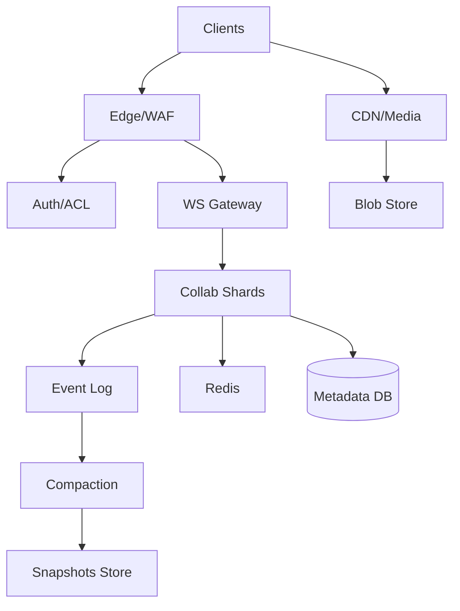
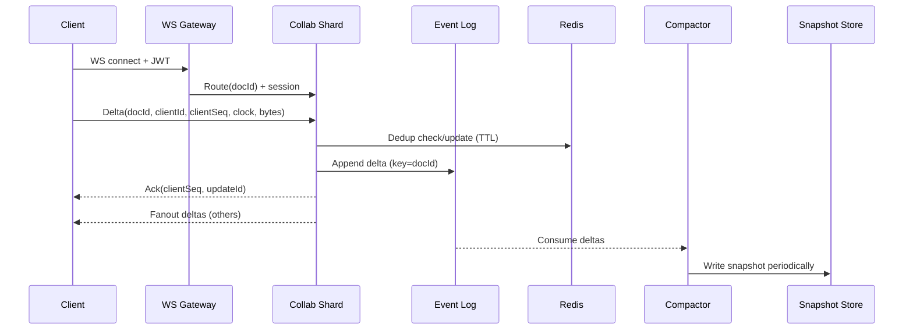

## Overview

Collaborative document editing (Google Docs–like) is hard because the system must feel instantaneous while multiple users concurrently edit the same content, often over unreliable networks with disconnects, retries, and offline work. The core challenge is convergence: every replica (each client and the server) must eventually arrive at the same document state despite out-of-order delivery, duplication, and partitions—without blocking users or corrupting intent.

A production-grade solution combines (1) a real-time collaboration plane for low-latency fanout, (2) a correctness model for merging concurrent edits (OT or CRDT), and (3) a durable storage plane that supports replay, compaction, and recovery. This design uses **delta/state-based CRDTs** for offline-first reconciliation and simpler multi-region convergence, while keeping strict consistency where it matters (auth, ACLs, billing, quotas) and eventual consistency for the document content itself.

## Requirements

### Functional Requirements
- Create, rename, delete documents; manage folders/projects.
- Real-time multi-user editing with cursor/selection and presence indicators.
- Conflict-free concurrent edits with convergence across all clients.
- Offline editing with background sync and automatic reconciliation on reconnect.
- Version history (restore a prior version; view change timeline).
- Fine-grained sharing and access control (owner/editor/commenter/viewer; link sharing).
- Comments/suggestions mode (optional but common in interviews); resolve/reopen.
- Export (PDF/DOCX/Markdown) and import with best-effort fidelity.

### Non-Functional Requirements
- **Scale**: 10M DAU, 1M peak concurrent sessions, 200K edits/sec peak fanout events; 1B docs; ~10TB/day CRDT deltas before compaction.
- **Latency**:
  - Local apply: immediate (client-side).
  - Remote propagation: P50 < 80ms, P99 < 250ms within a region; cross-region P99 < 600ms.
  - Join document (cold): P99 < 1.5s to interactive.
- **Availability**: 99.99% for reading/joining docs; 99.9% for write fanout (degraded mode allowed).
- **Consistency**:
  - **Strong**: auth, ACL checks, membership, billing/quota enforcement.
  - **Eventual**: document content convergence, presence/awareness.
- **Durability**: RPO ≤ 1 minute for content (durable log); RTO ≤ 30 minutes for regional outage; no silent data loss (detect and alert).

### Constraints & Assumptions
- Web + mobile clients; WebSocket supported; fallback to long-polling for restrictive networks.
- Documents are “rich text + embeds” (images, tables). Embeds are referenced by ID; binaries stored separately.
- Team can operate Kafka/Redis/Postgres (or managed equivalents). Compliance: GDPR, standard audit logging; optional enterprise features (KMS, DLP) are out of scope but considered.

## High-Level Architecture

Clients connect through an edge layer and establish a WebSocket to a gateway. The gateway routes each document session to a **collaboration shard** responsible for real-time ordering, validation, and fanout. Edits are applied optimistically on the client and transmitted as **CRDT deltas**; the shard persists deltas to a durable **event log** and broadcasts them to other connected clients.

Durability and fast loads come from **periodic snapshotting/compaction**: background workers fold deltas into compressed document snapshots stored in object storage. Metadata (doc records, ACLs, pointers to latest snapshot, compaction watermarks) lives in a strongly-consistent database. Redis is used for ephemeral routing, presence, and fast state-vector/dedup caches.

## Component Deep-Dive

### Client CRDT Engine

**Responsibility**: Represent the document as a CRDT replica, apply local edits instantly, generate deltas, merge remote deltas, and support offline queues.

**Key Design Decisions**:
- Use a **battle-tested CRDT** for rich text (e.g., Yjs-style RGA + attribute maps) to avoid subtle correctness bugs.
- Maintain a **state vector** (per-replica version summary) to efficiently compute missing updates after reconnect.

**Technology Choice**: Web: ProseMirror/TipTap + Yjs-like CRDT; Mobile: native editor binding + same CRDT core (or Automerge for JSON-like docs). Transport: WebSocket with protobuf/CBOR payloads.

**Scaling Strategy**: Clients scale horizontally by definition; key is bandwidth control—batch deltas (e.g., 20–50ms), compress payloads, and cap presence frequency.

### WebSocket Gateway

**Responsibility**: Terminate WebSockets, authenticate sessions, enforce quotas, and route to the correct collab shard.

**Key Design Decisions**:
- Route by `docId` using **consistent hashing** to keep a document “sticky” to a shard while allowing resharding.
- Support **resumable sessions** with token refresh and reconnect backoff.

**Technology Choice**: Envoy/Nginx + a stateless gateway service (Go/Java) or managed WS ingress; JWT validation with JWKS cache.

**Scaling Strategy**: Stateless horizontal autoscaling; keep connection state at L7; shard routing table in Redis or via consistent-hash ring config.

### Collaboration Shards (Realtime Fanout + Validation)

**Responsibility**: Accept deltas, validate authorization, deduplicate, append to durable log, and broadcast to all active sessions for a document.

**Key Design Decisions**:
- Treat the shard as **ephemeral**: correctness comes from CRDT + durable log; shard holds only in-memory session state and small caches.
- Provide **idempotent ingest** keyed by `(docId, clientId, clientSeq)` to handle retries and reconnects.

**Technology Choice**: Go/Java service with async I/O; Redis for short-lived dedup/presence; backpressure-aware fanout.

**Scaling Strategy**: Partition by `docId`; rebalance via consistent hashing; cap max concurrent sessions per shard; spill slow clients (drop to pull-based catch-up).

### Durable Event Log

**Responsibility**: Persist the authoritative stream of deltas for replay, auditing, and compaction; enable cross-region replication.

**Key Design Decisions**:
- Append-only log per document partition; retain long enough to cover compaction lag and restore windows.
- Use **exactly-once not required**; require at-least-once with idempotent consumers and producer keys.

**Technology Choice**: Kafka (or Pulsar/Kinesis). Topic partitioning by `hash(docId)`; message key `docId` to preserve per-doc ordering within a partition (ordering across partitions not needed).

**Scaling Strategy**: Increase partitions; compress (lz4/zstd); tiered storage for long retention; monitor consumer lag (compaction).

### Compaction + Snapshot Store

**Responsibility**: Merge deltas into periodic snapshots, prune old deltas, and serve fast “join doc” loads.

**Key Design Decisions**:
- Snapshot every N deltas or T minutes (e.g., 5k deltas or 2 minutes) with adaptive policy based on edit rate and doc size.
- Store snapshots as **content-addressed blobs** (hash-based) for dedup and integrity checks.

**Technology Choice**: Worker fleet (K8s jobs) + object storage (S3/GCS) + optional CDN for snapshot fetch.

**Scaling Strategy**: Parallelize by partition; rate-limit per partition to avoid saturating storage; incremental compaction using CRDT state-vector cut lines.

## Data Model

### Storage Schema

**Metadata DB (Postgres/CockroachDB)**

- `documents`
  - `doc_id (uuid, pk)`
  - `owner_id (uuid)`
  - `title (text)`
  - `created_at, updated_at (timestamptz)`
  - `latest_snapshot_id (text)`
  - `latest_snapshot_clock (jsonb)` — compact state vector summary
  - `compaction_watermark (bigint)` — log offset / sequence
  - `deleted_at (timestamptz, null)`

- `document_acl`
  - `doc_id (uuid, pk part)`
  - `principal_type (user|group|link)`
  - `principal_id (uuid/text)`
  - `role (owner|editor|commenter|viewer)`
  - `created_at`

- `audit_log`
  - `event_id (uuid, pk)`
  - `doc_id, actor_id`
  - `action (share|edit|comment|export|delete)`
  - `ts`
  - `metadata (jsonb)`

**Event Log (Kafka)**

- Topic: `doc_deltas`
  - Key: `doc_id`
  - Value: `{doc_id, update_id, client_id, client_seq, clock, delta_bytes, ts, schema_ver}`

**Snapshot Store (Object Storage)**

- `snapshots/{doc_id}/{snapshot_id}.bin` (compressed CRDT state)
- `snapshots/{doc_id}/{snapshot_id}.meta.json` (clock, size, hash, created_at)

**Redis (Ephemeral)**

- `presence:{doc_id}` → set of `{userId, cursor, lastSeen}`
- `dedup:{doc_id}:{client_id}` → last seen `client_seq` (TTL)
- `routing:{doc_id}` → shard assignment (TTL, refresh)

### Data Flow

Local edits apply immediately on the client. The server path is optimized for durability + fanout: accept, dedup, append, broadcast. Catch-up after reconnect uses the client’s `stateVector/clock` to request only missing updates, or falls back to “snapshot + tail deltas” if the delta history is too large.

## API Design

### Transport
- **WebSocket** for real-time deltas and presence.
- **REST** for document lifecycle, sharing, exports, and history.
- Optional **gRPC** between gateway/shards/internal services.

### REST APIs

- `POST /v1/docs`
  - Req: `{title, folderId?}`
  - Resp: `{docId, title, createdAt}`
  - Errors: `401`, `403`, `429`, `5xx`

- `GET /v1/docs/{docId}`
  - Resp: `{docId, title, role, latestSnapshotId, latestSnapshotClock}`
  - Strong ACL enforced.

- `POST /v1/docs/{docId}:share`
  - Req: `{principalType, principalId, role}`
  - Resp: `{ok: true}`
  - Idempotency: `Idempotency-Key` header (store result for 24h).

- `POST /v1/docs/{docId}:export`
  - Req: `{format: "pdf"|"docx"|"md"}`
  - Resp: `{jobId}`
  - Async export; poll `GET /v1/exports/{jobId}`.

### WebSocket Messages (JSON/protobuf)

- Client → Server: `join`
  - `{type:"join", docId, clientId, lastClock?, lastAckSeq?}`
- Server → Client: `joined`
  - `{type:"joined", snapshotUrl, snapshotClock, missingDeltas?}`

- Client → Server: `delta`
  - `{type:"delta", docId, clientId, clientSeq, clock, bytes}`
  - **Idempotency**: `(clientId, clientSeq)` must be unique per doc; retries allowed.

- Server → Client: `ack`
  - `{type:"ack", clientSeq, updateId}`

- Server → Client: `delta_broadcast`
  - `{type:"delta_broadcast", updateId, clock, bytes}`

- Presence (non-durable):
  - `{type:"presence", cursor, selection, userState}`
  - Rate-limited (e.g., 5–10 Hz), dropped under load.

**Error Handling**
- Use structured errors: `{type:"error", code, message, retryable, backoffMs?}`
- Common codes: `UNAUTHORIZED`, `FORBIDDEN`, `DOC_GONE`, `SCHEMA_MISMATCH`, `PAYLOAD_TOO_LARGE`, `RATE_LIMITED`, `SHARD_MOVED`.

**Idempotency Considerations**
- `delta` messages deduped at shard using Redis + in-memory LRU; persisted dedup optional by storing `(clientId, clientSeq)` watermark per doc in metadata for long-lived safety.
- REST mutations use `Idempotency-Key` and store request hash + response.

## Scaling & Performance

### Bottleneck Analysis
- **Fanout amplification** (one edit → N recipients): mitigate with batching, delta compression, and dropping presence under load.
- **Hot documents** (e.g., 5k users in one doc): shard “within a doc” is hard; mitigate with hierarchical fanout (shard → regional multicast via brokers) and client-side throttling.
- **Compaction lag** leading to slow joins: mitigate with adaptive snapshot cadence and priority compaction for hot docs.
- **Slow consumers** (mobile, bad networks): mitigate with per-connection buffers, disconnect + catch-up, and snapshot fallback.

### Horizontal Scaling
- **Gateway**: stateless autoscale by active connections; separate pools for long-lived WS vs REST.
- **Collab shards**: scale by increasing shard count; routing via consistent hashing on `docId`; rebalancing with “SHARD_MOVED” and seamless reconnect.
- **Event log**: scale partitions; keys ensure per-doc ordering within a partition.
- **Compactors**: scale consumer groups; partition-aligned workers.

**Partitioning Strategy**
- Primary partition key: `docId`.
- Metadata DB: partition/shard by `docId` if needed; otherwise a single logical cluster with read replicas (managed distributed SQL preferred at high scale).

### Caching Strategy
- **Edge/CDN**: cache snapshots and exported artifacts (TTL minutes-hours).
- **Redis**:
  - Presence (TTL seconds).
  - Routing hints (TTL minutes).
  - Dedup watermarks (TTL hours) + in-process LRU for microburst protection.
- **Client**:
  - Last snapshot + pending deltas for offline.
  - Media cached via platform cache.

**Invalidation**
- Snapshots are immutable (content-addressed) → no invalidation, just new snapshot IDs.
- Metadata uses ETags/version fields; clients refetch on `412 Precondition Failed` for conditional requests.

## Trade-offs & Alternatives

### Key Trade-offs Made
- **Chose CRDTs over OT**
  - Chosen: CRDT deltas + state vectors for offline-first and multi-region convergence.
  - Sacrificed: Larger metadata/overhead than OT in some cases; more complex snapshot compaction; careful memory management on large docs.
  - Why: Offline reconciliation and multi-region active-active are significantly simpler with CRDT convergence guarantees.

- **Durable log + compaction vs “store only latest state”**
  - Chosen: event log for replay/audit + periodic snapshots.
  - Sacrificed: operational complexity (Kafka, lag monitoring), storage costs.
  - Why: Enables reliable recovery, history, debugging, and fast joins via snapshots.

- **Sticky per-doc shard routing**
  - Chosen: single shard handles a doc’s realtime fanout.
  - Sacrificed: hotspot risk for extremely popular docs.
  - Why: Simplifies session management and backpressure; hotspots handled with specialized mitigations.

### Alternative Approaches
- **Operational Transformation (OT) with centralized ordering**
  - Pros: Smaller operations; well-known for text; Google Docs lineage.
  - Cons: Complex transform logic for rich text + embeds; offline and multi-region are harder (requires careful transform chains and canonical ordering).
  - Not chosen: higher correctness risk and complexity for offline-first.

- **State-based CRDT with full-state sync**
  - Pros: Very simple merge model.
  - Cons: Too bandwidth-heavy for large docs; slow on mobile.
  - Not chosen: delta-based sync is required at scale.

- **Peer-to-peer WebRTC collaboration**
  - Pros: Reduced server fanout cost.
  - Cons: NAT traversal, security, enterprise networks, unreliable membership; still needs server for persistence/history.
  - Not chosen: operational and product complexity outweigh benefits.

## Failure Modes & Mitigations

### Failure Scenarios
- **Scenario**: Collab shard crashes mid-session  
  **Impact**: WS disconnect; temporary edit fanout interruption; clients continue offline.  
  **Detection**: Connection drop spikes; shard health checks fail.  
  **Mitigation**: Clients reconnect via gateway; shard rehydrates minimal state from recent deltas/snapshot pointers; idempotent ingest prevents duplicates.

- **Scenario**: Event log partition unavailable / Kafka outage  
  **Impact**: Cannot durably append edits; risk of losing server-accepted updates.  
  **Detection**: Produce errors, rising retries, under-replicated partitions.  
  **Mitigation**: Degrade to “offline-only mode” (accept locally, queue on client), or “best-effort realtime” with explicit UI indicator; fail closed for server ACK if durability not guaranteed.

- **Scenario**: Redis outage  
  **Impact**: Presence missing, dedup less effective, routing cache cold.  
  **Detection**: Redis error rate/latency.  
  **Mitigation**: Presence disabled; dedup falls back to in-memory LRU; routing recomputed by consistent hashing without cache.

- **Scenario**: Compaction backlog / snapshot generation stalled  
  **Impact**: Slow joins (need replay many deltas), higher storage cost.  
  **Detection**: Consumer lag, snapshot age SLO violations.  
  **Mitigation**: Autoscale compactor; prioritize hot docs; force snapshot on join if delta tail too large.

- **Scenario**: Client clock/state corruption (bad local storage)  
  **Impact**: Cannot compute correct missing deltas; potential reapply duplicates.  
  **Detection**: Schema/clock validation failures.  
  **Mitigation**: Force “reset from snapshot” flow; server instructs client to drop local state and reload.

### Disaster Recovery
- **Targets**: RPO ≤ 1 minute (replicated log), RTO ≤ 30 minutes (regional failover).
- **Backup strategy**:
  - Metadata DB: PITR backups + daily full.
  - Snapshots: object versioning + cross-region replication.
  - Event log: multi-AZ replication + optional cross-region mirroring.
- **Failover procedures**:
  - If region down: route new WS connections to standby region; clients reconnect.
  - Resume from latest replicated snapshot + mirrored deltas; CRDT ensures convergence even with delayed cross-region propagation.

## Operational Considerations

### Monitoring & Alerting
- **Realtime**
  - Active WS connections, reconnect rate, join latency P99.
  - Fanout lag (time from ingest to broadcast) P99.
  - Per-doc session counts; hot-doc detection.
  - Backpressure drops, buffer utilization, slow-client disconnects.
- **Durability**
  - Kafka produce error rate, ISR health, consumer lag.
  - Snapshot age (minutes behind), compaction throughput.
- **Correctness signals**
  - CRDT apply errors, schema mismatch rate, dedup hit rate.
  - Divergence sampling: periodic checksum comparisons across replicas (server-side synthetic clients).

Alert thresholds example: join P99 > 2s for 10 minutes; fanout P99 > 500ms; snapshot age > 15 minutes; Kafka consumer lag > 5 minutes; WS reconnect storm > 3× baseline.

### Deployment Strategy
- Canary collab shards (1–5%) with protocol/schema versioning; clients advertise `schema_ver`.
- Backward-compatible message evolution; dual-write/dual-read during migrations.
- Rollback: keep previous shard build available; route canary ring back; clients reconnect automatically.
- Load tests focused on hot-doc fanout, reconnect storms, and compaction lag.

## References & Further Reading
- Martin Kleppmann, “A comprehensive study of Convergent and Commutative Replicated Data Types (CRDTs)”
- Yjs documentation and design notes (delta updates, awareness/presence)
- Automerge (CRDT for JSON-like documents) papers and docs
- “Designing Data-Intensive Applications” (logs, replication, consistency)
- Google Wave / Jupiter OT papers (for OT comparison)
- Kafka: Exactly-once semantics (to understand why idempotency is usually sufficient here)