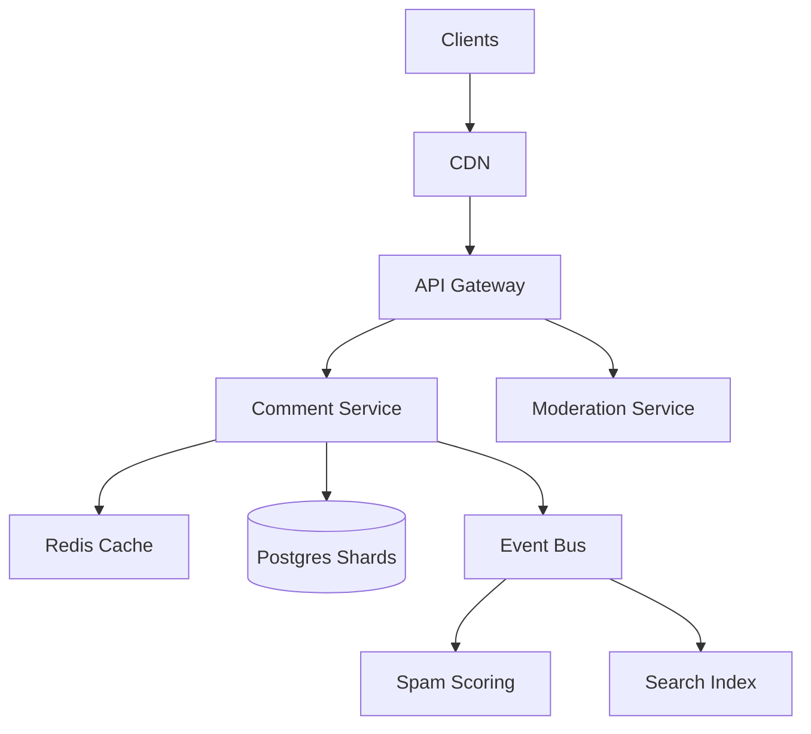
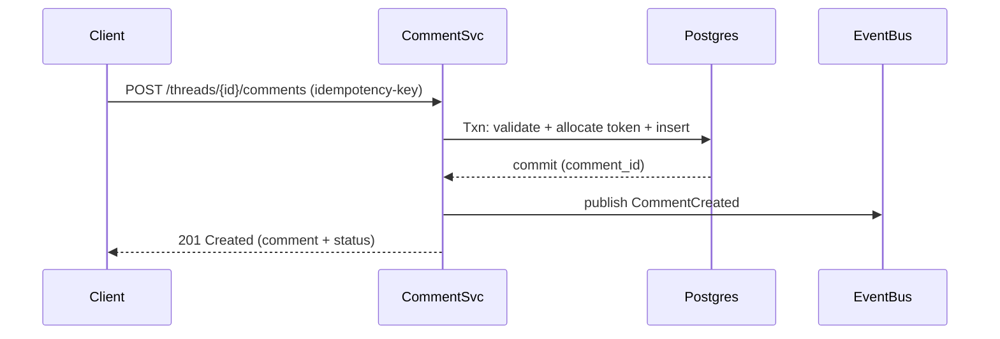
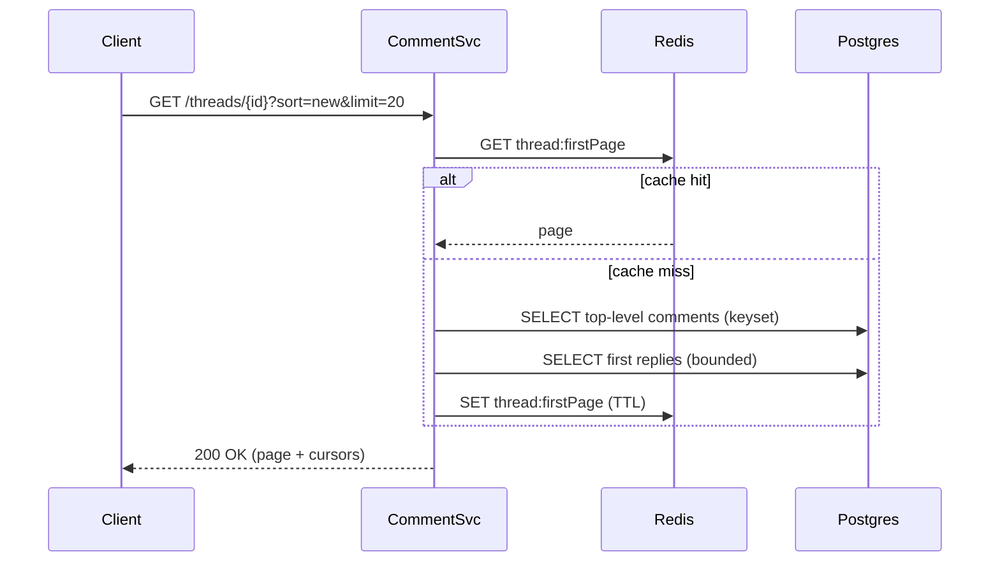

## Overview

A threaded comment system looks simple (“store text and show it”), but becomes challenging at scale when you combine deep nesting, fast pagination, real-time updates, and safety controls (moderation + anti-spam) without degrading latency. The core problem is efficiently representing and retrieving a mutable tree (replies-on-replies) while keeping read paths fast and predictable under heavy fanout.

This design treats comments as a strongly-consistent write path (to prevent duplicates, ensure correct parent/visibility semantics, and support moderation) and a highly-optimized read path (caching + precomputed thread metadata + keyset pagination). We separate synchronous user-facing operations from asynchronous enrichment (spam scoring, search indexing, notifications) using an event bus to keep P99 latency tight even during load spikes.

## Requirements

### Functional Requirements
- Create comments on a thread and replies to any comment (deep nesting).
- Read a thread with pagination for top-level comments and “load more replies” per subtree.
- Edit and delete comments with clear visibility semantics (soft-delete, mod-delete, user-delete).
- Moderation workflows: report/flag, review queues, remove/restore, lock threads, user bans/shadow-bans.
- Anti-spam protections: rate limits, heuristics, ML scoring, and quarantine for suspicious content.
- Sort modes: at minimum `new` and `top` (configurable), without breaking pagination.
- Auditability: immutable moderation log and comment revision history.
- Near-real-time updates: newly posted comments appear quickly (polling or streaming).

### Non-Functional Requirements
- **Scale**: 50M MAU; peak 50K read QPS (thread fetch + replies), 5K write QPS; 10B total comments; hottest threads with 1M+ comments.
- **Latency**:
  - Read thread first page: P50 40ms, P99 150ms (excluding client network).
  - Create comment: P50 80ms, P99 250ms (synchronous acceptance).
- **Availability**: 99.99% for reads; 99.9% for writes (graceful degradation allowed).
- **Consistency**:
  - Strong consistency for create/edit/delete/mod actions and per-thread counters used in UX.
  - Eventual consistency for spam scores, search index, notifications, and cache invalidation.
- **Durability**: RPO ≤ 1 minute; no acknowledged comment lost beyond RPO in regional disaster.

### Constraints & Assumptions
- Multi-region deployment with one primary write region per thread shard; global reads via caches/replicas.
- Team size ~6–10 engineers; prefer proven tech (Postgres + Redis + Kafka) over bespoke storage.
- Compliance: basic data retention and audit logs; PII minimized (separate user service).
- Budget supports managed DB, cache, and streaming (or equivalent self-hosted).

## High-Level Architecture



Clients hit a CDN for static assets and edge caching of popular thread pages. The API Gateway terminates TLS, enforces auth, and applies coarse rate limits before routing to services. The Comment Service owns the core comment lifecycle and strongly-consistent storage, while the Moderation Service owns review tools, policy enforcement, and immutable audit logs.

An event bus decouples synchronous writes from asynchronous work: spam scoring, indexing for moderator search, notifications, and cache invalidations. This keeps the create/edit paths fast and predictable while allowing enrichment pipelines to scale independently.

## Component Deep-Dive

### Comment Service

**Responsibility**: Core CRUD for comments and thread reads (paged), including visibility rules (deleted/quarantined/locked).

**Key Design Decisions**:
- Use **materialized path** (or `ltree`) + `thread_id` partitioning to fetch subtrees efficiently without recursive queries on hot paths.
- Use **keyset pagination** for top-level lists and reply lists to avoid deep offsets and maintain stable performance.

**Technology Choice**: Go/Java service + Postgres (Citus/sharding layer or application-level sharding), Redis for caching.

**Scaling Strategy**: Stateless horizontal scaling behind L7; DB sharded by `thread_id` (or `content_id`) to keep thread-local operations on one shard; add read replicas per shard for read-heavy workloads.

### Moderation Service

**Responsibility**: Reports, queues, mod actions (remove/restore/lock), user sanctions, audit logs, and policy checks.

**Key Design Decisions**:
- Keep **audit logs append-only** and queryable for compliance and internal investigations.
- Separate moderation state from comment body storage to avoid coupling UX-critical reads to mod tooling complexity.

**Technology Choice**: Service + Postgres (or the same shard set with separate schema); Elasticsearch/OpenSearch for mod search over text + metadata.

**Scaling Strategy**: Read-heavy for queues/search; scale horizontally; index updates via events.

### Spam Scoring Pipeline

**Responsibility**: Detect spam/abuse using layered defenses: rate limits, heuristics, ML model scoring, reputation signals.

**Key Design Decisions**:
- Treat spam scoring as **eventually consistent**, with a **quarantine** state for high-risk content until scored.
- Use **feature-store-like enrichment** (user reputation, device fingerprint, IP ASN, link density) from fast stores/caches.

**Technology Choice**: Stream consumers (Kafka consumers) + model service (Python) + Redis/Feature store; optional third-party CAPTCHA/risk API.

**Scaling Strategy**: Partition consumers by `thread_id` or event key; autoscale on lag; keep model service stateless.

### Caching Layer (Redis)

**Responsibility**: Reduce DB load for hot threads, top-level pages, and frequently accessed reply pages.

**Key Design Decisions**:
- Cache **page-shaped responses** (thread first page, per-comment reply page) rather than raw rows to minimize assembly costs.
- Use **event-driven invalidation** for correctness + TTL as a safety net.

**Technology Choice**: Redis cluster with replication and eviction policy tuned for read-heavy workloads.

**Scaling Strategy**: Cluster sharding; keep cache keys small; isolate hot-key patterns with per-thread bucketing.

## Data Model

### Storage Schema

Core tables (logical; exact types simplified):

**threads**
- `thread_id` (PK)
- `content_id` (unique) — the entity being discussed (post/article/video)
- `status` enum (`open`, `locked`, `archived`)
- `created_at`
- `comment_count_visible`
- `last_activity_at`

**comments**
- `comment_id` (PK, snowflake/UUIDv7)
- `thread_id` (indexed; shard key)
- `parent_id` (nullable; indexed)
- `author_id` (indexed)
- `path` (string or `ltree`; indexed) — materialized path including self
- `depth` (smallint)
- `sort_key` (bigint) — supports `new`/`top` lists (see below)
- `body` (text)
- `created_at`, `updated_at`
- `status` enum (`visible`, `deleted_user`, `deleted_mod`, `quarantined`)
- `spam_score` (float, nullable)
- `version` (int) — optimistic concurrency

**comment_revisions**
- `comment_id` (indexed)
- `revision_id` (PK)
- `editor_id`
- `body`
- `created_at`

**reports**
- `report_id` (PK)
- `comment_id` (indexed)
- `reporter_id`
- `reason`
- `created_at`
- `status` enum (`open`, `triaged`, `closed`)

**moderation_actions** (append-only)
- `action_id` (PK)
- `actor_id`
- `target_type` (`comment`, `thread`, `user`)
- `target_id`
- `action` (`remove`, `restore`, `lock`, `ban`, `shadow_ban`)
- `metadata` (json)
- `created_at`

**Notes on `path`**
- Represent as `root/parent/.../self` (e.g., `t123.0001.000A.0003`) where each segment is a fixed-width sortable token.
- Query subtree: `WHERE thread_id=? AND path LIKE 't123.0001.000A.%'` (or `ltree` operator), ordered by `path` for natural tree traversal.

### Data Flow

**Create comment (sync + async spam)**
- Validate thread status, parent existence, and permissions.
- Allocate next child token under parent (transactionally).
- Insert comment with `status=visible` for low-risk users, or `status=quarantined` for risky signals.
- Publish `CommentCreated` to the bus for spam scoring, indexing, notifications, and cache invalidation.



**Read thread (paged)**
- Try cache for `thread:firstPage:{sort}:{cursor}`.
- On miss, fetch top-level comments via `thread_id + parent_id IS NULL` with keyset pagination, then optionally fetch first reply page per comment (bounded fanout).
- Cache assembled response and return.



## API Design

### Create Comment
`POST /v1/threads/{thread_id}/comments`

**Headers**
- `Idempotency-Key: <uuid>` (required for clients that may retry)

**Request**
```json
{
  "parent_id": "c_01J0...",
  "body": "Text with markdown",
  "client_context": {
    "device_id": "d_...",
    "ip_hash": "h_..."
  }
}
```

**Response (201)**
```json
{
  "comment": {
    "comment_id": "c_01J0...",
    "thread_id": "t_123",
    "parent_id": "c_01J0...",
    "body": "Text with markdown",
    "status": "visible",
    "created_at": "2025-12-17T10:00:00Z"
  }
}
```

**Error Handling**
- `400` invalid body/parent/thread mismatch
- `401/403` auth/permission denied (banned, thread locked)
- `409` idempotency key reuse with different payload
- `429` rate limited
- `503` overloaded (retryable)

**Idempotency**
- Store `(user_id, idempotency_key) -> comment_id + request_hash` for 24h.
- On retry with same hash, return the original 201 response.

### Get Thread (Top-Level Pagination)
`GET /v1/threads/{thread_id}?sort={new|top}&limit=20&cursor=...`

**Response (200)**
```json
{
  "thread": { "thread_id": "t_123", "status": "open" },
  "comments": [ { "comment_id": "c1", "parent_id": null, "reply_count": 120, "preview_replies": [ ... ] } ],
  "next_cursor": "eyJzIjoibmV3IiwiayI6..."
}
```

**Pagination**
- Cursor encodes `(sort, last_sort_key, last_comment_id)` for stable keyset pagination.

### Get Replies (Per-Comment Pagination)
`GET /v1/comments/{comment_id}/replies?limit=50&cursor=...`

**Behavior**
- Returns replies in tree-traversal order for that subtree page.
- Cursor is based on `path` (and tie-breaker `comment_id`) to page deterministically.

### Moderate Comment
`POST /v1/mod/comments/{comment_id}/actions`

**Request**
```json
{ "action": "remove", "reason": "hate_speech", "note": "policy 3.2" }
```

**Response**
- `200` with updated visibility state; always writes an audit log entry.

## Scaling & Performance

### Bottleneck Analysis
- **Hot threads** (celebrity/news events): extreme read amplification and cache churn.
  - Mitigation: page caching at CDN + Redis, bounded reply previews, and aggressive TTL for hottest pages.
- **Deep nesting retrieval**: recursive queries become expensive and unpredictable.
  - Mitigation: materialized path + prefix scans; avoid recursive CTE in hot paths.
- **Write bursts**: comment storms create lock contention on parent token allocation.
  - Mitigation: allocate sibling tokens with low-contention strategy (e.g., per-parent “next_token” row with `SELECT ... FOR UPDATE`, or time-based + random suffix tokens with collision handling).
- **Moderation/spam backlogs**: async systems lag can cause stale status/search.
  - Mitigation: quarantine + eventual promotion; dashboards/alerts on consumer lag.

### Horizontal Scaling
- **API/Services**: stateless pods/VMs, autoscale on CPU + p99 latency + queue depth.
- **Database**:
  - Shard by `thread_id` (keeps subtree queries local).
  - Read replicas per shard for read-heavy endpoints.
  - Use connection pooling (PgBouncer) to control DB connections.
- **Event Bus**: partition by `thread_id` to preserve per-thread ordering for invalidations and counters.

### Caching Strategy
- **What to cache**
  - Thread first page per sort: `thread:{id}:page:{sort}:{cursor0}`
  - Reply pages per comment: `replies:{comment_id}:{cursor}`
  - Thread metadata: `thread:{id}:meta`
- **Where**
  - CDN for anonymous “first page” GETs with short TTL (e.g., 10–30s) and `stale-while-revalidate`.
  - Redis for assembled API responses with TTL 30–120s.
- **Invalidation**
  - Publish `ThreadChanged(thread_id)` and `CommentChanged(comment_id)` events.
  - Consumers delete/mark-stale relevant cache keys (best-effort) + TTL fallback.
  - For hottest threads, prefer short TTL over large invalidation fanout.

## Trade-offs & Alternatives

### Key Trade-offs Made
- **Chosen**: Materialized path for hierarchy.
  - **Sacrificed**: More complex write logic (path allocation, token management).
  - **Why**: Predictable subtree reads and pagination without expensive recursion.
- **Chosen**: Strong consistency on writes + eventual consistency on enrichment.
  - **Sacrificed**: Spam scores/search may be briefly stale.
  - **Why**: Keeps P99 low and isolates ML/search outages from core UX.
- **Chosen**: Cache page-shaped responses.
  - **Sacrificed**: Higher invalidation complexity and occasional staleness.
  - **Why**: Minimizes per-request DB + assembly cost under heavy read load.

### Alternative Approaches
- **Adjacency list + recursive CTE** (pure `parent_id`):
  - Simpler writes, but deep trees and pagination become expensive and unpredictable at scale.
- **Nested set model**:
  - Great for subtree reads, but inserts require shifting ranges—too costly for active discussions.
- **Graph DB for threads**:
  - Natural tree modeling, but operational complexity and latency predictability often worse than relational + path indexing.

## Failure Modes & Mitigations

### Failure Scenarios
- **Scenario**: Primary DB shard unavailable
  - **Impact**: Writes fail for threads on that shard; reads may degrade to replicas/cache
  - **Detection**: DB health checks, elevated error rate, replica lag alarms
  - **Mitigation**: Fail over to standby (if configured), serve cached reads, return `503` for writes with retry guidance

- **Scenario**: Redis cluster outage
  - **Impact**: DB load spikes; latency increases
  - **Detection**: Cache error metrics, DB QPS surge
  - **Mitigation**: Circuit-break cache calls, shed load with rate limiting, rely on DB replicas, gradually warm cache

- **Scenario**: Event bus backlog / consumer lag
  - **Impact**: Delayed invalidation, stale search, delayed spam scoring
  - **Detection**: Lag metrics per consumer group
  - **Mitigation**: Autoscale consumers, prioritize invalidation events, keep TTL short, quarantine risky comments until scored

- **Scenario**: Spam scoring service down
  - **Impact**: Increased spam risk or delayed visibility decisions
  - **Detection**: Health checks + lag
  - **Mitigation**: Degrade to stricter heuristics (rate limits, link caps), increase quarantine rate, manual mod review focus

- **Scenario**: Hot thread causes thundering herd
  - **Impact**: Cache stampede, DB overload
  - **Detection**: Sudden QPS spike + cache miss spike
  - **Mitigation**: Request coalescing (singleflight), CDN TTL, serve stale, aggressive rate limits for anonymous clients

### Disaster Recovery
- **Targets**: RTO 15 minutes; RPO 1 minute.
- **Backups**: Continuous WAL archiving + daily full backups per shard; periodic restore tests.
- **Failover**: Promote cross-region replica; reroute shard traffic via service discovery; rebuild caches and resume consumers from last committed offsets.

## Operational Considerations

### Monitoring & Alerting
- **Golden signals**: RPS, error rate, latency (P50/P95/P99), saturation.
- **DB metrics**: replication lag, lock time, slow queries, connection pool usage, storage growth.
- **Queue metrics**: consumer lag, retry/dead-letter rates.
- **Abuse metrics**: spam/quarantine rate, reports per minute, mod action throughput.
- **Alerts**
  - P99 read latency > 200ms for 5m
  - 5xx rate > 1% for 5m
  - DB replica lag > 10s for 5m
  - Consumer lag > 1M messages or age > 5m

### Deployment Strategy
- Blue/green or canary (5% → 25% → 50% → 100%) with automated rollback on SLO regression.
- Backward-compatible DB migrations (expand → migrate → contract).
- Feature flags for new ranking/pagination logic; shadow reads to validate correctness.
- Runbooks for shard failover, cache outage, and spam pipeline degradation.

## References & Further Reading
- PostgreSQL `ltree` extension: https://www.postgresql.org/docs/current/ltree.html
- Designing Data-Intensive Applications (Kleppmann) — storage, streams, consistency trade-offs
- Kafka consumer lag and scaling patterns: https://kafka.apache.org/documentation/
- Reddit/Hacker News discussion threading (high-level concepts and trade-offs in public talks/blogs)
