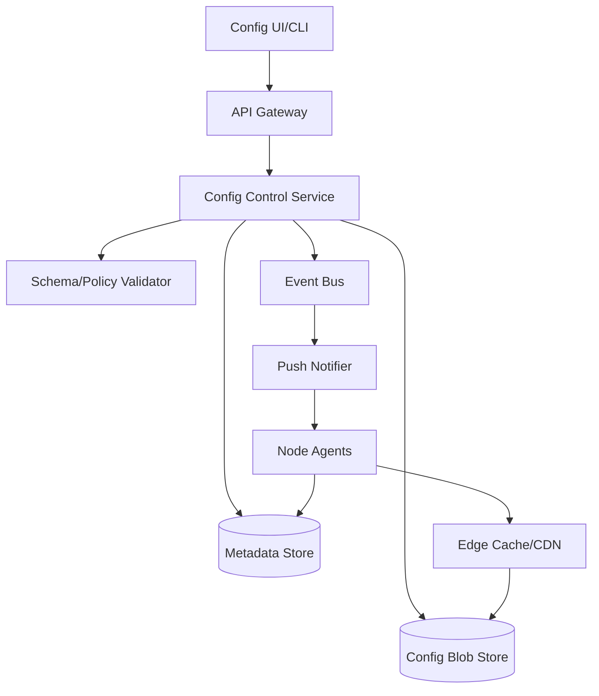
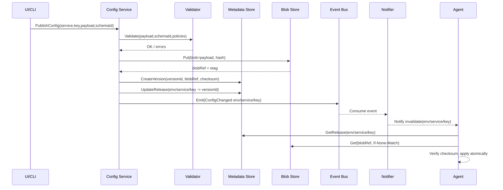

## Overview

A configuration distribution system is the control plane for a fleet: it must reliably deliver the *right* config to the *right* targets at the *right* time, while preventing bad pushes from taking down production. The challenge is that read traffic (agents pulling configs) is massive and latency-sensitive, while write traffic (publishing configs) must be strongly validated, auditable, versioned, and safely rolled out with fast rollback.

The key insight is to separate **strongly consistent metadata** (what version should each environment/service receive, rollout state, audit) from **highly cacheable config payload distribution** (the actual config blobs). Use a consensus-backed store (Raft) for metadata and an object store + CDN/edge caches for payloads, plus a push notification path to minimize time-to-converge without requiring every host to maintain a permanent stream.

## Requirements

### Functional Requirements
- Publish configuration changes with **versioning** (immutable versions) and **labels** (e.g., `latest`, `stable`, `prod-approved`).
- Support **pull** (agents fetch by target/environment) and **push notifications** (agents get notified to refresh).
- Enforce **schema validation** (JSON Schema/Protobuf/typed templates) and reject invalid or policy-violating configs.
- Provide **rollout controls**: canary %, progressive delivery, region/service scoping, freeze windows.
- Enable **safe rollback** to a previous version in seconds with audit trail.
- Support **targeting rules** (by service, env, region, cluster, instance attributes).
- Provide **access control** (RBAC), approvals, and full **audit logging** of changes and rollouts.
- Expose **watch** APIs for clients and internal systems (pipelines, UIs) to observe release state.

### Non-Functional Requirements
- **Scale**: 200k nodes; 2k services; 20 environments; steady-state 30k QPS reads (pull), burst 150k QPS during fleet restarts; 50–200 config publishes/day; peak 20 publishes/min during incidents.
- **Latency**:
  - Agent `GetEffectiveConfig` P50 < 20ms (cache hit), P99 < 150ms (cross-AZ miss).
  - Publish+validate P99 < 2s (excluding human approvals).
  - Push notification fanout: 99% of agents notified within 5s.
- **Availability**: 99.99% for reads; 99.9% for writes (publishing can be degraded without breaking serving).
- **Consistency**:
  - Writes and release state: **strong** consistency.
  - Agent reads: **eventual** globally; **monotonic per agent** (agents never apply older version unless explicit rollback).
- **Durability**: RPO ≤ 1 minute for metadata; config payloads durably stored (11 9s class). No silent corruption (checksums).

### Constraints & Assumptions
- Fleet runs across 3 AZs per region, multi-region active/active for reads.
- Agents may be intermittently offline; must cache last-known-good (LKG).
- Some configs are small (<64KB), but allow larger blobs (up to 5MB) for feature flags, routing tables, cert bundles (prefer references for very large artifacts).
- Compliance: audit retention 1 year; RBAC integrated with SSO; optional change approvals for prod.

## High-Level Architecture



The control plane (UI/CLI + Config Control Service) validates and publishes immutable config versions, writes release state to a strongly consistent metadata store, stores payloads in a blob store, and emits events to a bus. The data plane (agents) primarily reads via caches/CDN and consults metadata to determine the effective version, then fetches the referenced payload.

This structure isolates hot read paths from strongly consistent state, enabling very high read QPS with low latency while maintaining correctness for publishing, rollouts, and rollback. Push notifications accelerate convergence but the system remains correct under pure pull (notifications are an optimization, not a requirement).

## Component Deep-Dive

### Config Control Service

**Responsibility**: Authoring APIs, versioning, rollout orchestration, RBAC, audit emission.

**Key Design Decisions**:
- Immutable config versions + mutable “release pointers” (e.g., `prod/serviceA -> version 128`) to enable instant rollback.
- Two-phase publish: (1) store blob + validate, (2) commit metadata + emit event to ensure no “dangling” release to missing payload.

**Technology Choice**: Go/Java service with gRPC + REST gateway; PostgreSQL (for audit) optional; use OpenID Connect for auth.

**Scaling Strategy**: Stateless horizontal scaling behind L7 LB; idempotent write endpoints; leader election only for rollout scheduler jobs (or use a separate scheduler component).

### Metadata Store (Strongly Consistent)

**Responsibility**: Source of truth for versions, releases, rollout state, targeting rules, schemas’ active pointers.

**Key Design Decisions**:
- Raft-backed KV (e.g., etcd/Consul/ZooKeeper) for strong consistency of small metadata.
- Multi-region: per-region Raft cluster; global replication via async streams; agents prefer local region; failover to nearest.

**Technology Choice**: etcd (operationally common, watch support, strong consistency) or Consul.

**Scaling Strategy**: Keep objects small; avoid storing large blobs; hierarchical keys by `env/service/configKey`; use watchers sparingly and prefer coarse-grained watches per service/environment.

### Config Blob Store + Edge Cache

**Responsibility**: Durable storage and low-latency distribution of config payloads.

**Key Design Decisions**:
- Content-addressed blobs (hash-based keys) with immutability to enable aggressive caching and integrity checks.
- Edge caching/CDN in front of blob store; agents use ETag/If-None-Match and local disk cache.

**Technology Choice**: S3/GCS/Azure Blob + CDN (CloudFront/Fastly) or self-hosted object store (MinIO) + regional NGINX caches.

**Scaling Strategy**: Blob store scales independently; CDN absorbs burst reads; payloads compressible; prewarm caches during large rollouts.

### Push Notifier (Event Fanout)

**Responsibility**: Notify agents quickly that a relevant config pointer changed.

**Key Design Decisions**:
- Notification is “invalidate + hint” (e.g., “serviceA/prod changed”), not the full config, to keep fanout small and reliable.
- Backpressure-aware delivery: if agents can’t keep up, they fall back to pull with jittered polling.

**Technology Choice**: Kafka/Pulsar for event bus; notifier uses WebSockets/gRPC streams (per cluster) or MQTT; alternatively SSE for simplicity.

**Scaling Strategy**: Partition events by `env/service`; notifier horizontally scales; per-agent connections sharded by consistent hashing.

### Node Agent

**Responsibility**: Determine effective config for the node, fetch payload, validate locally, apply safely, and report status.

**Key Design Decisions**:
- Last-known-good (LKG) cache + atomic apply to prevent partial updates.
- Local “monotonic apply” guard using version sequence + rollback flag to avoid accidental downgrades.

**Technology Choice**: Lightweight daemon (Go/Rust) with disk cache, watchdog integration, and pluggable reload hooks.

**Scaling Strategy**: Pull with jitter + long-poll/watch; rate-limit self; batch requests per service; local caching minimizes repeated fetches.

## Data Model

### Storage Schema

**Metadata (etcd/Consul key space or relational equivalent)**

- `schemas/{schemaId}`:
  - `schemaId` (uuid)
  - `type` (`jsonschema|protobuf|cue`)
  - `definition` (compressed text, size-limited)
  - `createdBy`, `createdAt`

- `configs/{service}/{configKey}/versions/{versionId}`:
  - `versionId` (monotonic int or uuid)
  - `schemaId`
  - `blobRef` (content hash + location)
  - `createdBy`, `createdAt`
  - `checksum` (sha256)
  - `status` (`active|deprecated`)

- `releases/{env}/{service}/{configKey}`:
  - `targetVersionId`
  - `rolloutId` (nullable)
  - `updatedBy`, `updatedAt`
  - `rollbackOf` (previousVersionId, nullable)

- `rollouts/{rolloutId}`:
  - `env`, `service`, `configKey`
  - `fromVersionId`, `toVersionId`
  - `strategy` (`all_at_once|linear|canary|per_region`)
  - `steps` (e.g., 1%, 10%, 50%, 100%)
  - `healthSignals` (what to watch)
  - `state` (`pending|running|paused|aborted|completed`)
  - `createdBy`, `createdAt`

**Audit Log (append-only store; could be Kafka topic + warehouse or PostgreSQL)**
- `auditEvents`:
  - `eventId`, `actor`, `action`, `resource`, `before`, `after`, `timestamp`, `requestId`

### Data Flow



## API Design

**Auth**: OIDC bearer tokens; RBAC roles (`viewer`, `publisher`, `approver`, `admin`). All write APIs require `Idempotency-Key` and return `requestId`.

### Publish & Versioning

- `POST /v1/configs/{service}/{configKey}/versions`
  - Request:
    ```json
    {
      "schemaId": "uuid",
      "payload": "<base64 or inline JSON>",
      "contentType": "application/json",
      "description": "Add new flag",
      "labels": ["candidate"]
    }
    ```
  - Response:
    ```json
    { "versionId": "128", "checksum": "sha256:...", "blobRef": "hash:..." }
    ```
  - Errors: `400` schema violation, `409` idempotency conflict, `413` too large, `422` policy violation.

### Release / Rollout

- `PUT /v1/environments/{env}/releases/{service}/{configKey}`
  - Request:
    ```json
    { "targetVersionId": "128", "strategy": "canary", "steps": [1,10,50,100] }
    ```
  - Response:
    ```json
    { "rolloutId": "r-91c2", "state": "running" }
    ```
  - Idempotency: same `Idempotency-Key` must return same `rolloutId`.

- `POST /v1/environments/{env}/releases/{service}/{configKey}/rollback`
  - Request:
    ```json
    { "toVersionId": "127", "reason": "error-rate spike" }
    ```
  - Response: `{ "state": "completed", "activeVersionId": "127" }`

### Read Path (Agents)

- `GET /v1/effective-config`
  - Query: `env`, `service`, `nodeId`, optional `labels`, optional `attributes`
  - Response:
    ```json
    {
      "versionId": "128",
      "blobRef": "hash:...",
      "checksum": "sha256:...",
      "leaseTtlSeconds": 30
    }
    ```
  - Caching: `ETag` by `(env,service,configKey,versionId)`; supports `If-None-Match`.

- `GET /v1/watch?env=prod&service=svcA`
  - Server-sent events or gRPC stream emitting `{configKey, newVersionId}`.
  - Backoff on disconnect; clients must still poll as fallback.

## Scaling & Performance

### Bottleneck Analysis
- **Read storms** (deploys/restarts): mitigated by CDN/edge caching, local agent caching, jittered polling, and push invalidations (not full payload).
- **Metadata hot keys** (`releases/prod/...`): mitigate with per-service watches, caching release pointers in agents with short TTL, and avoiding per-node targeting in metadata store.
- **Notifier connection fanout**: shard connections by cluster/region; support “notify proxy” per cluster to reduce global connections.

### Horizontal Scaling
- **API/Control service**: stateless replicas behind L7; scale on CPU + p99 latency; isolate rollout scheduler in separate worker pool.
- **Metadata store**: keep small; scale by partitioning keyspaces per environment or service group if needed; prefer multiple clusters (by region) over one global consensus.
- **Blob store/CDN**: naturally horizontal; prewarm popular blobs; use immutable URLs for cacheability.
- **Notifier**: partition by `(env,service)`; consumer groups on Kafka; multiple notifier instances per region.

### Caching Strategy
- **Agent disk cache**: store last N versions per config key; LKG pinned; checksum verification on read.
- **Edge/CDN**: cache blobs by content hash with long TTL (days); release pointers not cached long (seconds).
- **Metadata caching**: agents cache `release -> versionId` for `leaseTtlSeconds` (e.g., 30s) with early refresh on notification.
- **Invalidation**: new versions are immutable; only release pointers change. Notifications trigger pointer refresh; blobs never need invalidation.

## Trade-offs & Alternatives

### Key Trade-offs Made
- **Chosen**: Strong consistency for metadata, cached distribution for payloads.  
  **Sacrificed**: Single global linearizable view across regions.  
  **Why**: Enables low-latency local reads and high availability; global linearizability is rarely required for config consumption.
- **Chosen**: Push notifications as hints + pull as source of truth.  
  **Sacrificed**: “Instant” guaranteed delivery semantics.  
  **Why**: Keeps system robust under partitions and simplifies client behavior; correctness doesn’t depend on notifier.
- **Chosen**: Immutable versions + mutable releases.  
  **Sacrificed**: Ability to “edit in place.”  
  **Why**: Makes rollbacks and auditing reliable; enables caching and integrity.

### Alternative Approaches
- **Fully streaming config (no pull)**: simpler convergence model but fragile under disconnects and hard to scale to 200k persistent streams without careful sharding.
- **Store everything in a single strong DB** (e.g., global Spanner): simpler model but higher cost/latency and risks read storms hitting the strong store directly.
- **GitOps-only distribution** (configs in Git + CI): great auditability but weaker for rapid rollouts/rollbacks and harder to target dynamic fleet attributes.

## Failure Modes & Mitigations

### Failure Scenarios
- **Scenario**: Bad config published (schema-valid but harmful).  
  **Impact**: Service degradation fleet-wide if released broadly.  
  **Detection**: SLO alerts (error rate, latency), rollout health checks, agent apply failures.  
  **Mitigation**: Progressive rollout with automatic pause; instant rollback by moving release pointer; “freeze” controls for prod.

- **Scenario**: Metadata store leader loss / quorum loss in a region.  
  **Impact**: Writes unavailable; reads may degrade if no local quorum.  
  **Detection**: Raft health, quorum alarms, elevated read latency/timeouts.  
  **Mitigation**: Multi-AZ quorum, fast leader election tuning, fail reads over to nearest region, agents use cached pointers/LKG.

- **Scenario**: Blob store/CDN outage or elevated 5xx.  
  **Impact**: New payload fetches fail; existing cached versions still run.  
  **Detection**: CDN origin error metrics, agent fetch error rate.  
  **Mitigation**: Multi-region replication, dual-CDN/origin failover, agents fall back to cached payloads and delay apply.

- **Scenario**: Notifier outage.  
  **Impact**: Slower convergence.  
  **Detection**: event lag, connection metrics.  
  **Mitigation**: Agents continue polling with jitter; system remains correct.

- **Scenario**: Split-brain targeting (attribute service stale).  
  **Impact**: Wrong cohort gets config.  
  **Detection**: drift checks comparing intended cohort vs observed.  
  **Mitigation**: Prefer stable attributes (env/region/cluster) for critical configs; cache attributes with versioning; require approvals for high-risk targeting.

### Disaster Recovery
- **RTO/RPO**: Metadata RTO 30 minutes / RPO 1 minute; blob store RTO 1 hour / RPO ~0 (durable).
- **Backup strategy**: periodic etcd snapshots + continuous WAL shipping; audit/event logs replicated to separate account/project; blob store versioning enabled.
- **Failover procedures**: promote standby metadata cluster, repoint API/agents via DNS, replay events to rebuild notifier state; verify releases and rollouts.

## Operational Considerations

### Monitoring & Alerting
- Key metrics:
  - Agent: apply success rate, checksum failures, time-to-update, LKG usage, fetch latency.
  - Control plane: publish latency, validation failures, rollback count, rollout state transitions.
  - Metadata: quorum health, leader changes, watch backlog, read/write latency.
  - Bus/notifier: consumer lag, connection count, notify latency.
- Alerts (examples):
  - `p99 GetEffectiveConfig > 300ms` for 5m
  - `agent_apply_failures > 1%` per service over 10m
  - `metadata_quorum_lost` immediate page
  - `rollback_triggered` notify + incident workflow

### Deployment Strategy
- Control plane: blue/green or canary (5%/25%/100%); DB migrations backward-compatible; feature flags for protocol changes.
- Agent: staged rollout by cluster; support dual protocol versions; ensure safe downgrade.
- Rollback: revert service deploy via traffic shift; revert config by moving release pointer; keep LKG on hosts.

## References & Further Reading

- etcd / Raft: https://etcd.io/ and Raft paper: https://raft.github.io/
- Consul architecture: https://developer.hashicorp.com/consul/docs/architecture
- ZooKeeper consistency model: https://zookeeper.apache.org/doc/current/zookeeperOver.html
- Netflix Archaius (config): https://github.com/Netflix/archaius
- AWS AppConfig concepts (rollouts/validators): https://docs.aws.amazon.com/appconfig/latest/userguide/what-is-appconfig.html
- LaunchDarkly (feature flag delivery patterns): https://launchdarkly.com/