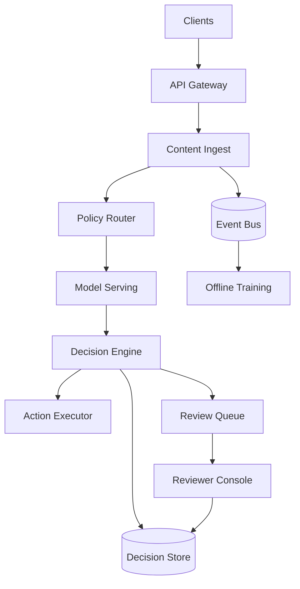
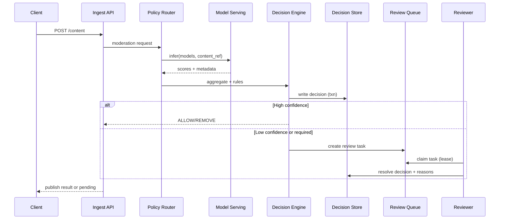

## Overview

Hybrid content moderation systems must make fast, defensible decisions under uncertainty: the majority of content should be auto-approved/auto-rejected with low latency and cost, while ambiguous or high-risk items are escalated to human reviewers with consistent policy enforcement. The challenge is balancing safety (catching harmful content), user experience (minimizing false positives and review delays), and operational scalability (burst traffic, adversarial behavior, evolving policies, and model drift).

This design uses a policy-driven routing layer that orchestrates model inference (often multiple specialized classifiers) and produces a calibrated risk score with an explanation bundle. Items below/above confidence thresholds are auto-actioned; low-confidence or high-impact cases generate durable human review tasks with prioritized queues and strong auditability. Decisions, evidence, and reviewer outcomes feed back into continuous evaluation and retraining to improve automation over time.

## Requirements

### Functional Requirements
- Ingest user-generated content (UGC) for text, images, and videos; support both **pre-publish** (gating) and **post-publish** (retroactive) moderation.
- Run content through one or more ML classifiers (toxicity, nudity, violence, spam, fraud, policy-specific detectors) and return a unified decision: `ALLOW`, `LIMIT`, `ESCALATE`, or `REMOVE`.
- Route items to **human review queues** when confidence is low, policy requires manual review, or content is high reach/high risk (e.g., viral, verified accounts).
- Provide a reviewer console for task claiming, evidence viewing (content + model explanations), and actioning with reason codes and policy references.
- Support appeals and secondary review (quality control), including sampling-based audits and “four-eyes” workflows for sensitive categories.
- Maintain an immutable audit trail of decisions (model inputs/versions, thresholds, policy version, reviewer identity/actions).
- Enable policy updates (thresholds, rule logic, queue priorities) with controlled rollout and immediate effect where required.

### Non-Functional Requirements
- **Scale**: 50K QPS ingestion peak; 5K QPS synchronous (pre-publish) decisions; 500M DAU; 10B items/year; media storage in object store (PB-scale).
- **Latency**:
  - Pre-publish decision: P50 80ms, P99 250ms (text); P99 800ms (image, with cached embeddings when possible).
  - Post-publish scanning: end-to-end P99 2 minutes (queueing + inference).
  - Human review: median 5 minutes for high-priority queues; 95th percentile < 60 minutes.
- **Availability**: 99.99% for ingestion + decision read path; 99.9% for reviewer tooling; graceful degradation when ML services are impaired.
- **Consistency**: Strong consistency for task state transitions and final decisions; eventual consistency acceptable for analytics, search, and offline training data.
- **Durability**: No loss of finalized decisions/audit logs (RPO ~ 0 for audits); content metadata RPO < 1 minute; media stored with multi-AZ durability.

### Constraints & Assumptions
- Team operates in a cloud environment with managed Kafka/PubSub, managed SQL, and Kubernetes for services.
- Compliance: GDPR/CCPA (data minimization, retention controls), and strict access controls for sensitive content.
- Budget favors high automation; human review is expensive and must be reserved for ambiguous/high-impact items.
- Adversarial environment: attackers probe thresholds, attempt replay, and generate bursts; system must resist abuse and model evasion.

## High-Level Architecture

The ingestion service accepts content metadata and media references, performs lightweight validation and deduplication, then hands off to a policy router. The policy router selects which models to run (based on content type, locale, user risk signals, and policy requirements) and calls model serving with strict timeouts and fallbacks.

A decision engine calibrates and aggregates model outputs, applies deterministic rules (e.g., legal removals, blocklists, account state), and emits a final action and explanation bundle to a strongly consistent decision store. Items requiring manual review are written as durable tasks into a queueing system that powers the reviewer console. All events are mirrored to an event bus for analytics, retraining, and evaluation.

## Component Deep-Dive

### Content Ingest Service

**Responsibility**: Accept content submissions/updates, validate schema, store metadata, and trigger moderation.

**Key Design Decisions**:
- Use an **idempotency key** (`client_request_id`) to prevent duplicate moderation and task creation on retries.
- Separate **media storage** (object store) from metadata to keep hot paths small and scalable.

**Technology Choice**: Stateless service on Kubernetes + object storage (S3/GCS) + managed SQL for metadata pointers.

**Scaling Strategy**: Horizontal scale behind L7 load balancer; partition moderation events by `content_id` onto the event bus.

### Policy Router

**Responsibility**: Determine moderation flow: which models to run, sync vs async, thresholds, and whether human review is required by policy.

**Key Design Decisions**:
- Policies versioned and served from a **config service** with fast propagation and rollback.
- Route by **content type + locale + user risk tier** to avoid one-size-fits-all thresholds.

**Technology Choice**: Stateless service with local in-memory cache of policies + periodic refresh; fallback to last-known-good policy.

**Scaling Strategy**: Stateless scale-out; cache policies and model metadata; isolate per-tenant or per-region policy variants if needed.

### Model Serving Platform

**Responsibility**: Run low-latency inference for multiple classifiers, return scores + optional explanations.

**Key Design Decisions**:
- Use a **multi-model gateway** to standardize inputs/outputs, enforce timeouts, and support canary/shadow traffic for new models.
- Maintain **calibration** (per-model, per-locale) to convert raw logits into comparable risk scores.

**Technology Choice**: KServe/Seldon or custom gRPC model servers on GPUs/CPUs; feature extraction via separate embedding service for images/video frames when needed.

**Scaling Strategy**: Autoscale on QPS and GPU utilization; batch inference for async scanning; precompute embeddings for popular content to reduce P99.

### Decision Engine

**Responsibility**: Aggregate model outputs, apply rules, produce final decision and explanation bundle, and emit side effects.

**Key Design Decisions**:
- Make decisions **deterministic and replayable** by storing: policy version, model versions, thresholds, and normalized features.
- Support **multi-stage decisions** (e.g., temporary limit + escalate) to reduce harm while waiting for human review.

**Technology Choice**: Stateless compute + strong-consistency store for decisions (Postgres/Aurora/Spanner); rules via DSL (e.g., CEL) with strict validation.

**Scaling Strategy**: Stateless scale-out; write decisions with transactional semantics; use outbox pattern to reliably emit events and tasks.

### Human Review System

**Responsibility**: Manage review tasks, prioritization, assignment, SLAs, reviewer UX, and audit/QC.

**Key Design Decisions**:
- Use a **work-queue with leasing** (claim with TTL) to avoid duplicate work and handle reviewer disconnects.
- Implement **tiered queues** (priority, language, policy domain) with sampling and escalation paths.

**Technology Choice**: Workflow engine (Temporal/Cadence) or queue + task table pattern; reviewer console as web app; RBAC/ABAC integrated with IAM.

**Scaling Strategy**: Partition tasks by queue key (e.g., `policy_domain:locale:priority`); scale UI/API separately; cache thumbnails and redacted previews.

## Data Model

### Storage Schema

**`content_items` (SQL)**
- `content_id` (PK, UUID)
- `owner_user_id`
- `content_type` (`TEXT|IMAGE|VIDEO`)
- `media_uri` (nullable)
- `text_body` (nullable, encrypted/hashed as needed)
- `locale`, `country`
- `created_at`, `updated_at`
- `visibility_state` (`PENDING|VISIBLE|LIMITED|REMOVED`)
- `risk_tier` (derived/user-based)

**`moderation_decisions` (SQL)**
- `decision_id` (PK)
- `content_id` (FK)
- `status` (`ALLOW|LIMIT|REMOVE|ESCALATE`)
- `reason_codes` (array)
- `policy_version`
- `model_bundle` (JSON: model names, versions, scores, calibration ids)
- `confidence` (0..1)
- `explanations` (JSON: top signals, saliency refs, matched rules)
- `created_at`
- `finalized_at` (nullable)
- `finalized_by` (`SYSTEM|HUMAN|APPEAL`)

**`review_tasks` (SQL or workflow store)**
- `task_id` (PK)
- `content_id`
- `queue_key` (e.g., `violence:en-US:P1`)
- `priority` (int)
- `state` (`OPEN|LEASED|RESOLVED|CANCELLED`)
- `lease_owner` (nullable)
- `lease_expires_at` (nullable)
- `sla_deadline_at`
- `created_at`, `resolved_at` (nullable)

**`review_actions` (append-only log)**
- `action_id` (PK)
- `task_id`, `reviewer_id`
- `action` (`ALLOW|LIMIT|REMOVE|ESCALATE|REQUEST_MORE_INFO`)
- `reason_codes`
- `notes_redacted` (nullable)
- `created_at`

**`audit_log` (append-only, WORM where required)**
- `event_id`, `event_type`, `principal`, `resource_id`, `payload_hash`, `created_at`

**Media/large artifacts (object store)**
- Original media, thumbnails, extracted frames, embeddings, and explanation artifacts (with retention policies).

### Data Flow

## API Design

### Public APIs (REST)

**Create/Update Content**
- `POST /v1/content`
- Request:
  - `client_request_id` (string, required)
  - `content_type` (`TEXT|IMAGE|VIDEO`)
  - `text_body` or `media_upload_token`
  - `locale`, `country`
  - `mode` (`PRE_PUBLISH|POST_PUBLISH`)
- Response:
  - `content_id`
  - `visibility_state`
  - `moderation_status` (`DECIDED|PENDING_REVIEW|PENDING_SCAN`)
  - `decision` (optional if decided)

**Fetch Moderation Status**
- `GET /v1/content/{content_id}/moderation`
- Response:
  - `latest_decision` (status, reasons, timestamps)
  - `appeal_eligible` (bool)
  - `review_state` (optional)

**Appeal**
- `POST /v1/content/{content_id}/appeal`
- Response: `appeal_id`, `status`

### Internal APIs (gRPC recommended)

**Model Inference**
- `Infer(ContentRef, PolicyContext) -> ModelOutputs`
- Enforce deadlines; return partial results with per-model status.

**Task Operations**
- `ClaimTask(queue_key) -> Task` (lease-based)
- `ResolveTask(task_id, action, reasons, notes) -> Decision`

### Error Handling
- Consistent error envelope: `{code, message, retryable, details}`
- Common codes: `INVALID_ARGUMENT`, `UNAUTHENTICATED`, `PERMISSION_DENIED`, `CONFLICT` (lease lost), `RESOURCE_EXHAUSTED` (backpressure), `DEADLINE_EXCEEDED`.

### Idempotency
- `POST /v1/content` uses `client_request_id` scoped to user to guarantee “exactly-once effect” for task creation and decision writes.
- Internal writes use a transactional outbox to prevent “decision stored but task not created” splits.

## Scaling & Performance

### Bottleneck Analysis
- **Model inference capacity (GPU/CPU)**: Mitigate with autoscaling, model batching for async scans, quantization/distillation, and tiered models (fast filter → heavy model).
- **Queue backlogs for human review**: Mitigate with prioritization, sampling, dynamic thresholds, “safe limiting” actions while waiting, and surge staffing playbooks.
- **Hot partitions (viral content)**: Mitigate with consistent hashing + salting on `content_id`, caching embeddings, and rate-limiting per actor.

### Horizontal Scaling
- **Edge/Ingest/Router/Decision**: Stateless services scale horizontally; partition event streams by `content_id`.
- **Decision Store**: Use read replicas for reads; partition/shard by `content_id` if using Postgres at very high scale, or choose Spanner/Cockroach for horizontal write scaling.
- **Event Bus**: Kafka topics partitioned by `content_id` and by domain (`text`, `image`, `video`) to isolate workloads.
- **Human Review**: Partition tasks by `queue_key`; reviewer console served via CDN; APIs scale statelessly.

### Caching Strategy
- Cache **policy configs** and **model metadata** in each router instance (TTL 30–60s, plus push invalidation).
- Cache **embeddings/thumbnails** in object store + CDN; short TTL for sensitive previews; strict authorization.
- Cache **idempotency keys** and request fingerprints in Redis (TTL hours) to avoid duplicate work under retries.
- Invalidation: policy/versioned configs avoid “in-place edits”; clients/services fetch by version and roll forward/back.

## Trade-offs & Alternatives

### Key Trade-offs Made
- **Chosen**: Policy router + multi-model + calibrated decision engine  
  **Sacrificed**: Simplicity of a single end-to-end model  
  **Why**: Real policies change faster than models; multi-model allows targeted improvements and clearer explanations.
- **Chosen**: Lease-based task claiming  
  **Sacrificed**: Strong “exactly-once human review” semantics without retries  
  **Why**: Leases handle disconnects and scale; correctness comes from idempotent resolve and immutable audit.
- **Chosen**: Dual-mode (sync gating + async scanning)  
  **Sacrificed**: Uniform UX  
  **Why**: Some surfaces require fast allow/deny; others tolerate delayed enforcement with retroactive actions.

### Alternative Approaches
- **Fully asynchronous moderation**: Lowest latency for posting, but higher harm window and complex retroactive handling.
- **Single monolithic moderation service**: Easier at first, but policy/model coupling slows iteration and increases blast radius.
- **Pure rules-based moderation**: Transparent but brittle against adversaries and high false negatives for nuanced content.

## Failure Modes & Mitigations

### Failure Scenarios
- **Scenario**: Model serving outage or high latency  
  **Impact**: Pre-publish decisions stall; backlog grows  
  **Detection**: P99 inference latency, error rate, timeout counters  
  **Mitigation**: Fast fallback model, cached embeddings, degrade to “LIMIT+ESCALATE” for high-risk, allow low-risk with tighter rate limits, circuit breakers.
- **Scenario**: Review queue backlog spike (attack or viral event)  
  **Impact**: SLA breaches; unsafe content remains visible  
  **Detection**: Queue depth, age-of-oldest-task, SLA miss rate  
  **Mitigation**: Dynamic thresholding (increase auto-actions), temporary surface throttles, sampling audits instead of full review for low-risk, on-call staffing escalation.
- **Scenario**: Policy misconfiguration (bad thresholds/rules)  
  **Impact**: массов false positives/negatives  
  **Detection**: Canary metrics, decision distribution shifts, complaint/appeal spikes  
  **Mitigation**: Versioned policies, canary rollout, instant rollback to last-known-good, “kill switch” to disable risky rule blocks.
- **Scenario**: Data store partition / write failures  
  **Impact**: Decisions not persisted; inconsistent user state  
  **Detection**: DB write errors, outbox lag  
  **Mitigation**: Strong retry with backoff, write-ahead to durable log, graceful degradation to PENDING + async reprocessing, regional failover.
- **Scenario**: Reviewer console compromise or insider abuse  
  **Impact**: Unauthorized access to sensitive content/actions  
  **Detection**: Anomalous access patterns, impossible travel, unusual bulk actions  
  **Mitigation**: RBAC/ABAC, just-in-time access, session recording, WORM audit logs, dual approval for sensitive queues, automated abuse detection.

### Disaster Recovery
- **RTO/RPO**: RTO 30 minutes for core ingestion/decision read; RPO ~ 0 for audit logs, < 5 minutes for decisions.
- **Backup strategy**: Continuous PITR for SQL; replicated object storage; immutable audit log replication across regions.
- **Failover procedures**: Active-active for stateless services; active-passive for some stateful components with automated promotion; rehearse failover with game days.

## Operational Considerations

### Monitoring & Alerting
- Key metrics:
  - Ingest QPS, error rate, request size distribution
  - Model inference latency (P50/P99), timeout rate, per-model accuracy proxies (drift indicators)
  - Decision distribution by policy/version, escalation rate, appeal rate
  - Queue depth, age of oldest task, SLA miss rate, reviewer throughput
  - DB latency, replication lag, outbox/event lag
- Alert thresholds (examples):
  - Pre-publish P99 > 250ms for 5 minutes
  - Model timeout rate > 1% for 5 minutes
  - Oldest P1 task age > 10 minutes
  - Decision `REMOVE` rate changes > 3σ vs baseline after policy/model rollout

### Deployment Strategy
- Services: canary + progressive delivery (5% → 25% → 100%) with automatic rollback on SLO violations.
- Models: shadow traffic first, then canary by region/locale; keep last N model versions warm for rapid rollback.
- Policies: versioned configs with validation suite (unit tests + sample fixtures), staged rollout, and emergency revert.

## References & Further Reading

- Kafka: https://kafka.apache.org/documentation/
- Temporal (workflow engine): https://docs.temporal.io/
- KServe (model serving on Kubernetes): https://kserve.github.io/website/
- Google TFX (training pipelines): https://www.tensorflow.org/tfx
- “Practical Lessons from Predicting Clicks on Ads at Facebook” (calibration/production ML themes): https://research.facebook.com/publications/practical-lessons-from-predicting-clicks-on-ads-at-facebook/
- Meta transparency reports and enforcement at scale (real-world moderation context): https://transparency.meta.com/
- OWASP API Security Top 10 (hardening reviewer/admin APIs): https://owasp.org/API-Security/