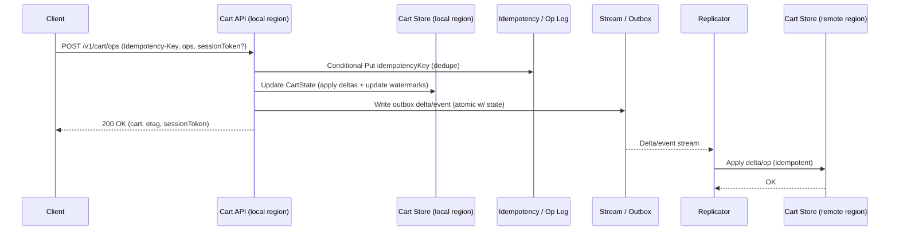
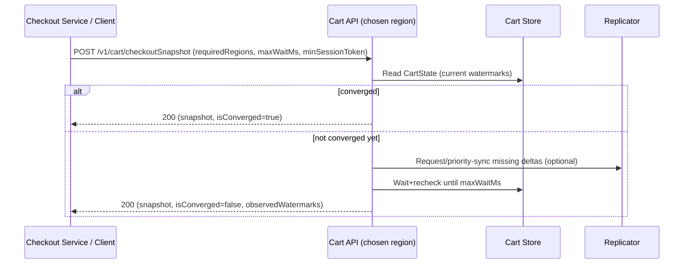

## Overview

A shopping cart looks simple until you run it **active-active across regions** and users move between them mid-session. The core challenge is **split brain**: the same cart can receive concurrent writes in two regions (geo-routing changes, mobile networks, retry storms, or an inter-region partition), producing divergent replicas that must be reconciled **without losing user intent**.

The key insight is to treat the cart as a **replicated data type** that converges under concurrent updates. Instead of making every click globally linearizable (expensive and fragile over WAN), we:
- Commit mutations locally in the nearest region (low latency, high availability).
- Replicate updates asynchronously across regions.
- Merge replicas deterministically using **CRDTs** (Conflict-free Replicated Data Types) and **idempotent operations**.

At the checkout boundary—where surprises are costly—we introduce a **convergence barrier**: a bounded wait that ensures the snapshot reflects all updates the system has already observed (and, optionally, all regions) before order creation.

## Requirements

### Functional Requirements
- Create and fetch a cart (anonymous and authenticated).
- Add items, decrement/remove items, clear cart; support quantity adjustments.
- Support user travel: reads/writes in any region should work and converge.
- Merge anonymous cart → user cart on login.
- Idempotent cart mutations (retries, duplicated requests, offline replays must not double-apply).
- Provide a checkout-ready snapshot with explicit convergence semantics.
- Emit events for downstream consumers (analytics, recommendations, abandoned-cart).
- Expire inactive carts (e.g., 30–90 days) without impacting active users.

### Non-Functional Requirements
- **Scale (target)**:
  - 20M DAU, ~5M peak concurrent sessions.
  - Peak global traffic: ~400k `GET` QPS, ~200k mutation QPS (bursty).
  - Average cart: 20 line items; typical serialized view 2–5KB.
- **Latency (SLOs, per region)**:
  - `GET /v1/cart`: P50 ≤ 30ms, P99 ≤ 150ms (served region-local).
  - `POST /v1/cart/ops`: P50 ≤ 50ms, P99 ≤ 250ms (local commit + async replication).
  - `POST /v1/cart/checkoutSnapshot`: P50 ≤ 200ms, P99 ≤ 1000ms (includes convergence barrier).
- **Availability**:
  - Region-local reads/writes: 99.95%+ per region.
  - Global (multi-region) user-perceived availability: 99.99%+ with regional failover and degraded modes.
- **Consistency**:
  - Cart browsing/mutations: eventual consistency across regions; strive for session guarantees (read-your-writes) via session tokens.
  - Checkout snapshot: explicit consistency via convergence barrier; “strict” policy may refuse checkout if not converged.
- **Durability**:
  - No acknowledged write loss within a region (regional RPO ≈ 0 for committed ops).
  - Cross-region: asynchronous replication implies some loss is possible if an entire region is destroyed before replication; acceptable for carts, not for orders.

### Constraints & Assumptions
- 3 active-active regions (e.g., `us-east`, `eu-west`, `ap-sg`).
- Catalog/pricing are separate systems; cart stores `skuId` and requested quantities, not authoritative price.
- Mobile clients can be offline and replay operations later.
- Data residency may require constrained replication (e.g., EU carts must not replicate outside EU).
- Prefer managed services; avoid bespoke cross-region consensus in the hot path.

### Glossary (short)
- **CRDT**: A data type that can be replicated and merged without coordination, guaranteeing convergence.
- **HLC** (Hybrid Logical Clock): A timestamp that preserves causality and provides a deterministic tie-break across replicas.
- **Session token**: A client-carried “I have seen up to here” watermark used to provide monotonic/session reads.

## Architecture

### Design Goals
- Fast local writes, tolerant of partitions.
- Convergence without global coordination.
- Clear boundary where strong(er) guarantees are required (checkout).
- Operational simplicity: standard components (KV store + streams) and explicit semantics.

### High-Level Architecture (active-active)

```mermaid
flowchart TB
  C[Client (web/mobile)] -->|HTTPS| GSLB[Geo DNS / Anycast]

  subgraph R1[Region: us-east]
    E1[Edge / L7 LB] --> API1[Cart API]
    API1 --> RC1[(Redis cache)]
    API1 --> DB1[(Cart Store)]
    API1 --> OP1[(Idempotency + Op Log)]
    DB1 --> STR1[[DB Stream / Outbox]]
    STR1 --> REPL1[Replicator]
  end

  subgraph R2[Region: eu-west]
    E2[Edge / L7 LB] --> API2[Cart API]
    API2 --> RC2[(Redis cache)]
    API2 --> DB2[(Cart Store)]
    API2 --> OP2[(Idempotency + Op Log)]
    DB2 --> STR2[[DB Stream / Outbox]]
    STR2 --> REPL2[Replicator]
  end

  subgraph R3[Region: ap-sg]
    E3[Edge / L7 LB] --> API3[Cart API]
    API3 --> RC3[(Redis cache)]
    API3 --> DB3[(Cart Store)]
    API3 --> OP3[(Idempotency + Op Log)]
    DB3 --> STR3[[DB Stream / Outbox]]
    STR3 --> REPL3[Replicator]
  end

  GSLB --> E1
  GSLB --> E2
  GSLB --> E3

  IRB[[Inter-Region Replication Stream]]
  REPL1 --> IRB
  REPL2 --> IRB
  REPL3 --> IRB
  IRB --> REPL1
  IRB --> REPL2
  IRB --> REPL3
```

**Hot path**: write locally → persist idempotency/op record + update materialized cart state → return.  
**Async**: replicate deltas/ops to other regions; apply idempotently; periodically run anti-entropy repair for missed updates.

### Consistency Model (what users actually get)
- **Within one region**: monotonic reads are usually achievable (read-after-write) if requests are served in-region and `CartState` updates are atomic.
- **Across regions**: eventual consistency; users traveling may see a slightly stale view until replication catches up.
- **Session guarantees**: the API returns a `sessionToken` (a causal watermark). Clients include it on subsequent reads/writes so a region can (best-effort) wait briefly or perform read-repair before responding.
- **Checkout boundary**: `checkoutSnapshot` can enforce either:
  - **Strict**: block (or fail) until converged across required regions; or
  - **Bounded**: wait up to `maxWaitMs`, return snapshot plus `isConverged=false` so the checkout flow decides policy.

## Components

### 1) Cart API
**Responsibility**: Authentication, validation, idempotency enforcement, applying cart operations, returning a cart view + causal metadata.

**Key decisions**
- Prefer an **operation-based API** (`ADJUST_QTY`, `REMOVE_ITEM`, `CLEAR`) over “replace entire cart” to preserve intent and reduce write amplification.
- Require **idempotency** on mutation requests; store the mutation result keyed by `(cartId, idempotencyKey)` so retries are safe.
- Include causal metadata (`sessionToken`) for session semantics and checkout barriers.

**Implementation notes**
- Separate “browse” (`GET /cart`) and “checkout barrier” (`POST /checkoutSnapshot`) into different request classes/pools to protect browse p99.
- Enforce cart limits (e.g., max 200 SKUs; max 999 units per SKU) to keep merges bounded.

### 2) CRDT Cart Engine (merge logic)
**Responsibility**: Deterministic application and merge of updates under concurrency.

**Data type choice (pragmatic)**
- Cart is a map `skuId -> quantity`, plus a small set of cart-level fields (currency, fulfillment selection, etc.).
- For quantities, use a **commutative delta model**:
  - Mutations are replicated as deltas (`+k` / `-k`) with unique operation IDs.
  - Removes are represented as negative deltas (bounded at 0) or as a per-SKU “remove all” implemented via a reset marker (see below).

**Handling “set quantity”**
- UI “set to N” is best expressed as `ADJUST_QTY(delta = N - observedQty)` to preserve commutativity.
- If you must support `SET_QTY`, treat it as a **resettable counter** operation (`RESET` then `ADD(N)`), which requires tracking a per-SKU reset watermark (version vector/HLC) so resets and increments converge without coordination.

**Cart-level non-commutative fields**
- For fields like `selectedShippingMethod`, use an **LWW register** with **HLC** timestamps (tie-break by region/node ID). Document that concurrent changes resolve deterministically, not “fairly”.

### 3) Cart Store (durable state)
**Responsibility**: Region-local durability for cart state and metadata.

**Typical technology choices**
- Managed KV/Document with change streams: DynamoDB (+ Streams), Cosmos DB, Spanner (regional), or a multi-DC Cassandra/Scylla cluster.

**What to store**
- **Materialized cart view** per cart (fast reads).
- **Causal metadata** per cart (vector/watermarks used for replication and checkout barriers).
- **Schema versioning** for evolution of CRDT encoding.

**Concurrency control (within a region)**
- Use conditional writes with an `etag`/`version` to avoid lost updates from multi-tab within the same region (optional, not required for convergence).

### 4) Idempotency + Operation Log
**Responsibility**: Prevent double-apply, enable repair, provide auditing/debuggability.

**Key decisions**
- Store a dedupe record keyed by `(cartId, idempotencyKey)` with the resulting `etag` and response payload hash (or full response) for a bounded TTL (e.g., 7–30 days).
- Keep an operation log (or compact deltas) long enough to rehydrate/repair (e.g., 7–30 days) and to support anti-entropy without full state transfers.

**Implementation notes**
- If using DynamoDB/Cosmos, use a **transactional write** (or an outbox pattern) to ensure “op recorded” and “state updated” are consistent.

### 5) Replicator (cross-region convergence)
**Responsibility**: Move deltas/ops between regions and apply them idempotently.

**Key decisions**
- Prefer **delta/operation replication** for low bandwidth and better tail behavior; fall back to full-state transfer for recovery.
- Delivery is **at-least-once**; correctness comes from idempotency by `(cartId, opId)` (or `(cartId, region, seq)`).
- Add **anti-entropy**: periodic scan of “recently active carts” comparing watermarks and requesting missing deltas.

**Data residency**
- Partition replication streams by residency domain (e.g., `eu-only` vs `global`). For EU carts, replication topology may be “within EU only” or “EU primary + anonymized aggregates outside EU”.

### 6) Eventing for downstream systems
**Responsibility**: Publish stable business events (cart updated, cart abandoned, merged) without creating inconsistencies.

**Key decisions**
- Use an **outbox**: write cart update + outbox event atomically in the Cart Store, then publish asynchronously to the event bus.
- Downstream consumers must tolerate duplicates (use event IDs).

## Data Model

### Logical Cart State
- `cartId`: stable opaque ID (prefer not to use raw `userId` as the sole key to reduce hot-key and privacy coupling).
- `owner`: `ANON` or `USER` plus references (e.g., `userId`).
- `items`: map `skuId -> qty` (qty is derived from replicated deltas; never negative).
- `cartFields`: small set of LWW fields (e.g., `currency`, `fulfillmentPreference`).
- `causal`: vector/watermark metadata for replication and session tokens.

### Storage Schema (example)

**CartState**
- `cartId` (PK)
- `ownerType` (`ANON|USER`)
- `ownerId` (nullable; user ID when authenticated)
- `itemsPayload` (blob/json/protobuf; materialized view)
- `fieldsPayload` (blob/json/protobuf; LWW fields)
- `etag` (string/int64; region-local version)
- `regionWatermark` (map `region -> hlc` or `region -> seq`)
- `updatedAt` (timestamp)
- `expiresAt` (timestamp, TTL)
- `schemaVersion` (int)

**IdempotencyRecord**
- `cartId` (PK)
- `idempotencyKey` (SK)
- `appliedAt` (timestamp)
- `responseCode` (int)
- `responsePayload` (optional; or store hash + pointer)
- `expiresAt` (timestamp, TTL)

**CartDelta / CartOp** (optional but recommended)
- `cartId` (PK)
- `opId` (SK; UUID; derived from idempotencyKey or per-op IDs)
- `type` (`ADJUST_QTY|REMOVE_ITEM|CLEAR|MERGE|SET_FIELD`)
- `skuId` (nullable)
- `delta` (int32, nullable)
- `field`/`value` (nullable)
- `hlc` (monotonic HLC)
- `region` (string)
- `expiresAt` (timestamp, TTL)

### Data Flows

#### Mutation + replication (happy path)


#### Checkout snapshot (convergence barrier)


## API

### Conventions
- **Authentication**: anonymous via cookie/device ID; authenticated via bearer token (JWT) or session.
- **Idempotency**: required for `POST` mutations (`Idempotency-Key` header).
- **Session semantics**: API returns `sessionToken`; clients echo it via `X-Cart-Session` header (or request field).
- **Error model**: use `4xx` for validation/limits, `409` for optimistic concurrency (optional), `503` for degraded region.

### Get cart
`GET /v1/cart`

**Headers**
- `X-Cart-Session: <opaque>` (optional)

**Response 200**
```json
{
  "cartId": "c_01HZX2Y2V0K8YQ2D5A1M5Z3J2T",
  "ownerType": "USER",
  "items": [{"skuId": "skuX", "qty": 2}],
  "etag": "84",
  "region": "eu-west",
  "sessionToken": "eu-west:hlc130|us-east:hlc129|ap-sg:hlc120"
}
```

**Errors**: `401`, `404` (no cart), `503` (region degraded)

### Apply operations (idempotent)
`POST /v1/cart/ops`

**Headers**
- `Idempotency-Key: <uuid>`
- `X-Cart-Session: <opaque>` (optional)

**Request**
```json
{
  "ops": [
    {"type": "ADJUST_QTY", "skuId": "skuX", "delta": 1},
    {"type": "REMOVE_ITEM", "skuId": "skuY"}
  ],
  "ifMatchEtag": "84"
}
```

**Response 200**
```json
{
  "cartId": "c_01HZX2Y2V0K8YQ2D5A1M5Z3J2T",
  "items": [{"skuId": "skuX", "qty": 2}],
  "etag": "85",
  "region": "eu-west",
  "sessionToken": "eu-west:hlc131|us-east:hlc129|ap-sg:hlc120"
}
```

**Errors**
- `400` invalid payload (unknown op type, bad SKU format, delta=0, etc.)
- `401` unauthenticated (if required)
- `409` `ifMatchEtag` failed (optional: same-region multi-tab protection)
- `422` policy violation (max items/qty, restricted SKU, etc.)
- `503` degraded region (writes may be throttled)

**Idempotency behavior**
- If the same `Idempotency-Key` is replayed for the same `cartId`, return the original result (status code + payload) without re-applying.
- If an idempotency key is reused with a different payload, return `409` (or `422`) to surface client bugs.

### Merge anonymous cart into user cart
`POST /v1/cart/merge`

**Request**
```json
{
  "fromCartId": "c_anon_01HZX2...",
  "toCartId": "c_user_01HZX3..."
}
```

**Semantics**
- Merge is a server-side operation that combines replicated deltas/state and updates ownership atomically.
- Must be idempotent: store a merge record keyed by `(fromCartId, toCartId)` to avoid repeated merges.

### Create checkout snapshot (convergence barrier)
`POST /v1/cart/checkoutSnapshot`

**Request**
```json
{
  "requiredRegions": ["us-east", "eu-west", "ap-sg"],
  "maxWaitMs": 1000,
  "minSessionToken": "eu-west:hlc131|us-east:hlc129|ap-sg:hlc120",
  "mode": "BOUNDED"
}
```

**Response 200**
```json
{
  "snapshotId": "cs_01J0A4C9X2Y3R1W7GQ2T1P9K3M",
  "cart": {"items": [{"skuId": "skuX", "qty": 2}]},
  "isConverged": true,
  "observedSessionToken": "eu-west:hlc132|us-east:hlc131|ap-sg:hlc125"
}
```

**Policy**
- `mode=STRICT`: return `409` if not converged within `maxWaitMs`.
- `mode=BOUNDED`: return `200` with `isConverged=false` if not converged; checkout flow decides whether to block, warn, or proceed.

## Scaling & Performance

### Back-of-the-envelope sizing (sanity check)
- Peak mutation QPS: 200k global → ~67k writes/sec per region on average if evenly distributed (often skewed).
- Delta size: ~150–400B per op (SKU + delta + metadata). Replication bandwidth per region on peak: ~10–30MB/s, plus overhead.
- Active carts: if 5M concurrent sessions and ~1 cart/session → a few million “hot” carts; with TTL 30 days, stored carts can be tens of millions.
- Storage: 50M carts × 5KB ≈ 250GB per region for materialized state (excluding indexes/overhead); op log adds cost but is TTL-bounded.

### Bottlenecks and mitigations
- **Hot cart IDs** (shared accounts, automated abuse)
  - Mitigate with per-cart rate limits, bot detection, and an internal per-cart sequencer/queue when needed.
- **Replication lag**
  - Delta replication, consumer autoscaling, prioritizing “recently active carts”, and anti-entropy repair.
  - Expose a replication-delay SLO; feed into checkout barrier behavior.
- **Large carts / high churn**
  - Enforce caps; compress payload; periodically compact op logs into state; avoid unbounded tombstones.

### Caching
- Cache materialized cart views in Redis for ~30–120s to reduce read load; treat cache as best-effort.
- Always invalidate/write-through on local mutations; never rely on cache for idempotency.

### Protecting p99
- Separate compute pools/queues for:
  - browse reads,
  - mutations,
  - checkout barriers (which may wait/retry).
- Apply timeouts and circuit breakers to downstreams; fail open (serve stale) for reads when appropriate.

## Trade-offs & Alternatives

### Key trade-offs
- **Eventual consistency for mutations**
  - Gains: low latency, high availability under WAN issues.
  - Costs: users can temporarily see different carts when traveling; requires explicit checkout semantics.
- **At-least-once replication + idempotency**
  - Gains: simpler and more robust than exactly-once across regions.
  - Costs: more storage for dedupe records; careful design needed to avoid replay bugs.
- **Materialized state + bounded op log**
  - Gains: fast reads and bounded compute; supports repair.
  - Costs: compaction complexity; schema/version migrations must be carefully managed.

### Alternatives (when you might choose them)
- **Home-region (active-passive) carts**
  - Simpler consistency model; lower replication complexity.
  - Worse latency for travelers; home-region outage impacts writes.
- **Globally strongly consistent datastore (WAN quorum per write)**
  - Strong semantics everywhere; simpler client view.
  - Higher p99, lower availability under WAN jitter/partitions; expensive at high QPS.
- **Full event sourcing with global total order**
  - Great auditability and replay; flexible downstream.
  - Global ordering reintroduces coordination; operationally heavier.

## Failure Modes & Resilience

### Failure scenarios (examples)
- **Inter-region partition (split brain writes)**
  - Impact: divergent replicas, temporary inconsistent reads across regions.
  - Mitigation: CRDT/ops converge after partition heals; checkout barrier blocks/refuses/flags non-convergence.
- **Duplicate requests / offline replays**
  - Impact: double-apply without safeguards.
  - Mitigation: idempotency records; enforce “same key, same payload”.
- **Replication backlog or stream outage**
  - Impact: increased staleness; more `isConverged=false` snapshots.
  - Mitigation: autoscale consumers, increase retention, anti-entropy repair, prioritize active carts.
- **Regional outage**
  - Impact: users in that region fail over; in-flight local-only writes may not replicate.
  - Mitigation: multi-region routing; accept cart-data loss as non-critical; surface clear UX if strict convergence is required.
- **CRDT/merge bug or schema migration error**
  - Impact: incorrect cart contents.
  - Mitigation: versioned encoding, shadow merges, canary + rollback, retained op log for re-derivation, run offline repair jobs.
- **Cache outage**
  - Impact: higher store load; higher read latency.
  - Mitigation: graceful fallback; protect store with throttles and backpressure.

### Disaster recovery
- **RTO/RPO**:
  - Per-region RTO: 15–30 minutes (restore capacity and routing).
  - Cart RPO: regional RPO ≈ 0; global RPO > 0 is acceptable for carts due to async replication.
- **Backups**: PITR/continuous backups for cart state tables; validate restores; op log TTL bounds backup volume.
- **Failover**: remove unhealthy region from geo routing; re-enable when stable; run anti-entropy scan for recently active carts.

## Operations

### SLOs and alerts (practical)
- `GET /v1/cart` p99 latency and error rate per region.
- Mutation success rate and idempotency hit rate (unexpected spikes indicate client retries/offline replay issues).
- Replication delay histogram and consumer lag (alert on p99 > 30s for 5–10 minutes).
- Checkout snapshot convergence rate and timeout rate (alert on timeouts > 1% sustained).

### Observability
- Structured logs with `cartId`, `idempotencyKey`, `opId`, region, and HLC.
- Metrics: per-op type rates, merge/apply times, cart size distribution, compaction stats.
- Tracing: propagate request IDs across API → store → outbox → replicator.

### Deployment & evolution
- Canary deployments per region with automatic rollback on SLO regression.
- Backward-compatible schema evolution via `schemaVersion`:
  - dual-read/dual-write during transitions,
  - shadow-merge comparisons before full cutover,
  - tooling to re-encode state in background.

### Security & abuse controls
- Authenticate cart ownership (prevent cartId guessing; use opaque IDs).
- Rate limit per account/device/IP; bot detection for high-churn carts.
- Validate SKUs (format, allowlist via catalog) and enforce caps to prevent resource abuse.
- Encrypt data at rest; minimize PII stored in cart state.

## References & Further Reading
- Amazon Dynamo: “Dynamo: Amazon’s Highly Available Key-value Store”
- CRDT survey: “A comprehensive study of Convergent and Commutative Replicated Data Types”
- Hybrid Logical Clocks: “Logical Physical Clocks and Consistent Snapshots in Globally Distributed Databases”
- Outbox pattern and stream processing for reliable event publication
- Cassandra multi-DC patterns and tuneable consistency
- Exactly-once vs idempotent consumers (practical trade-offs)
