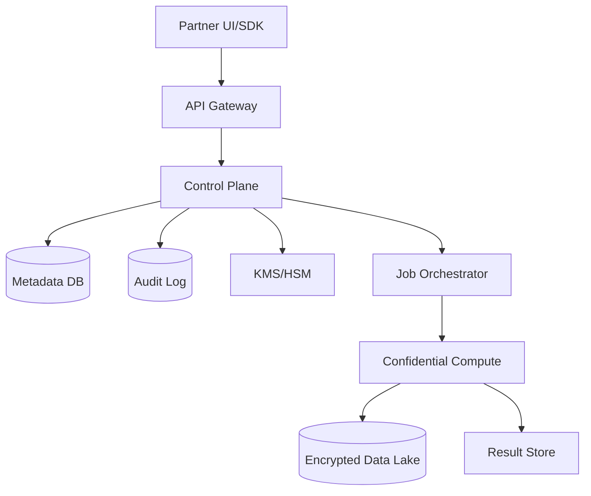
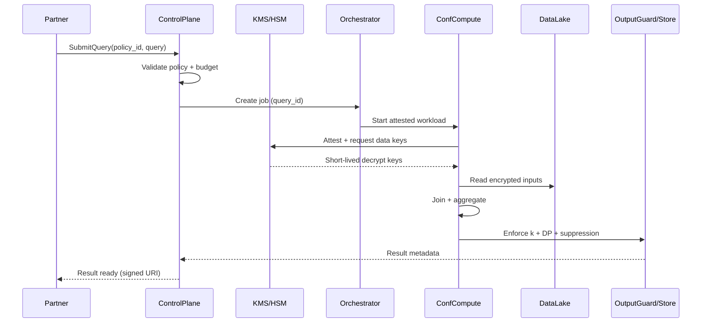

## Overview

A data clean room enables two (or more) parties to join and analyze datasets (e.g., ad impressions and sales) without revealing row-level records to any participant or the operator. The challenge is that “joining” inherently correlates identities across datasets, which is exactly where privacy leaks happen: small cohorts, differencing attacks across repeated queries, and accidental exposure through outputs, logs, or intermediate files.

A production-grade clean room is therefore less about the join algorithm and more about enforcing *governance and privacy guarantees end-to-end*: authenticated ingestion, schema and key normalization, a constrained query surface, privacy policy enforcement, output checking (k-anonymity thresholds, suppression), differential privacy (DP) budgeting, strong auditing, and secure execution (e.g., confidential computing) so even the operator can’t inspect plaintext.

The key insight: treat the system as two planes—(1) a highly available control plane for governance, metadata, and auditing, and (2) an isolated compute plane that executes only approved workloads, produces only approved aggregates, and is cryptographically attested.

## Requirements

### Functional Requirements
- Allow each party to ingest datasets (batch and incremental) into an isolated tenant namespace.
- Support privacy-safe joins on approved keys (e.g., email/phone/device ID) using standard normalization + cryptographic transforms.
- Provide a constrained query interface (templates or restricted SQL) that only returns aggregates (no row export).
- Enforce per-party policies: allowed joins, allowed dimensions, minimum cohort size, and allowed metrics.
- Enforce privacy budget accounting (DP epsilon/delta) across queries and tenants; block queries when depleted.
- Provide result delivery to a designated destination (object storage, warehouse) with signed URLs and expirations.
- Provide full auditability: who queried what, which policy was used, budget consumption, and output suppression decisions.
- Support secure collaboration workflows: dataset approvals, policy negotiation, and time-bounded access grants.

### Non-Functional Requirements
- **Scale**: 100–500 tenants; 10K datasets; 1–5 PB total; control plane 200 QPS; compute: 1K concurrent jobs, peak 50K vCPU.
- **Latency**:
  - Control-plane APIs P99 < 300ms (metadata, submissions).
  - Job start P99 < 60s (queue + provisioning).
  - Typical join job completion 5–30 min for 0.5–5 TB inputs (batch).
- **Availability**:
  - Control plane 99.95% (multi-AZ).
  - Compute plane 99.9% (degraded if capacity constrained).
- **Consistency**:
  - Strong consistency for metadata, policies, budgets, and audit logs.
  - Eventual consistency acceptable for dataset availability after ingestion (minutes).
- **Durability**:
  - Metadata: RPO ≤ 5 minutes, durable WAL.
  - Data artifacts: 11x9 object storage; no loss of ingested files once acknowledged.

### Constraints & Assumptions
- Parties do not fully trust each other or the operator; the system must minimize operator access to plaintext.
- Output is limited to aggregates; no “row export”, no raw join keys, no per-user segments.
- Compliance: SOC2 baseline; optional HIPAA/PCI boundaries require stricter tokenization and access controls.
- Team size: 6–10 engineers; prefer managed building blocks (KMS, object store, orchestration) over bespoke crypto.
- Threat model includes differencing attacks via repeated queries and insider risk; side-channel resistance is “best effort” (hardening + monitoring).

## High-Level Architecture

The control plane owns identity, dataset registration, policy negotiation, privacy budget accounting, and immutable auditing. It never needs to read partner data contents beyond schema/validation metadata. The compute plane runs the actual join and aggregation, but only inside an isolated environment (e.g., TEEs such as Intel SGX/TDX or AMD SEV) with remote attestation so partners can verify they’re running the expected code.

Data is stored encrypted in a shared data lake with per-tenant keys; compute nodes receive short-lived decrypt capability only after policy validation and attestation. Outputs are written to a result store after passing an output guard (k-anonymity thresholds, DP noise, suppression), ensuring no row-level leakage.

## Component Deep-Dive

### Control Plane (Governance + APIs)

**Responsibility**: Identity, dataset lifecycle, policy management, query submission, privacy budget accounting, and auditing.

**Key Design Decisions**:
- Use a strict “allowed query surface” (restricted SQL or templates) to prevent accidental leakage (e.g., selecting identifiers).
- Maintain privacy budgets as strongly consistent counters to prevent race-condition overspend across concurrent queries.

**Technology Choice**: Kubernetes microservices or a modular monolith; Postgres (or Spanner) for metadata; OPA/Rego for policy evaluation; Kafka/PubSub for async events.

**Scaling Strategy**: Stateless API services behind L7 LB; DB read replicas; partition audit stream; cache compiled policies.

### Data Ingestion & Normalization

**Responsibility**: Securely ingest partner datasets, validate schema, normalize join keys, create partitioned/bucketed layouts to speed joins.

**Key Design Decisions**:
- Canonicalize join keys (email lowercasing, E.164 phones), then apply keyed hashing/tokenization to avoid raw identifiers.
- Produce optimized lake layouts (Parquet, partitioning, optional bucketing by join key hash prefix) to reduce shuffle.

**Technology Choice**: Managed ETL (Spark) or Flink for incremental; object store (S3/GCS/Azure Blob); schema registry.

**Scaling Strategy**: Horizontal ETL workers; backpressure; per-tenant quotas; parallel partition writes.

### Confidential Compute Plane

**Responsibility**: Execute approved joins and aggregations without exposing plaintext to the operator; enforce egress restrictions.

**Key Design Decisions**:
- Require remote attestation before releasing decrypt capability (short-lived data keys).
- Disable arbitrary network egress; only allow writing to the result store through a controlled sink.

**Technology Choice**: Confidential VMs/containers (Intel TDX/SGX, AMD SEV) + Kubernetes; query engines like Spark/Trino/DuckDB-in-enclave (depending on scale).

**Scaling Strategy**: Autoscaled worker pools; job queues; pre-warmed enclaves; spot capacity with retries for non-urgent jobs.

### Output Guard (Privacy Enforcement)

**Responsibility**: Validate results against privacy rules: minimum cohort sizes, dimension allowlists, DP noise, suppression, and repeat-query controls.

**Key Design Decisions**:
- Enforce k-anonymity thresholds per group (e.g., `k >= 100`) and suppress small cells.
- Apply DP with per-tenant budgets and “sticky noise” keyed by canonical query to reduce averaging attacks.

**Technology Choice**: DP libraries (OpenDP / Google DP primitives); rules engine; deterministic noise seeding service (inside enclave).

**Scaling Strategy**: Runs as part of the job finalization stage; O(output rows) which is small relative to input data.

### Audit & Compliance

**Responsibility**: Tamper-evident logging of every data access, policy decision, attestation, query plan, and output release.

**Key Design Decisions**:
- Make audit immutable (append-only) with retention and WORM storage options.
- Log canonical query form + policy hash, never raw data or identifiers.

**Technology Choice**: Append-only log (Kafka + object store), SIEM integration; periodic hash chaining/anchoring.

**Scaling Strategy**: Partition by tenant; async ingestion; queryable index for investigations.

## Data Model

### Storage Schema

**Metadata DB (relational)**
- `tenants(tenant_id, name, created_at, status)`
- `principals(principal_id, tenant_id, type, external_id, created_at)`
- `datasets(dataset_id, tenant_id, name, description, state, created_at)`
- `dataset_versions(version_id, dataset_id, schema_json, location_uri, row_count, created_at)`
- `join_keys(dataset_id, key_type, normalization, tokenization_method, key_version)`
- `policies(policy_id, tenant_a, tenant_b, allowed_joins_json, allowed_dims_json, min_k, dp_enabled, created_at, status)`
- `privacy_budgets(budget_id, policy_id, epsilon_total, epsilon_spent, delta, reset_period, updated_at)`
- `queries(query_id, policy_id, submitted_by, canonical_query_hash, status, epsilon_cost, created_at, finished_at)`
- `results(result_id, query_id, output_uri, row_count, suppressed_cells, released_at)`
- `audit_events(event_id, tenant_id, type, subject_id, payload_json, created_at)`

**Data Lake (object storage, encrypted)**
- `s3://.../tenant={tenant_id}/dataset={dataset_id}/version={version_id}/part-*.parquet`
- Optional: bucketed by `join_key_hash_prefix` to reduce join shuffle.

### Data Flow

## API Design

### Control Plane APIs (REST)

**Create dataset**
- `POST /v1/datasets`
- Request:
  - `{ "name": "impressions", "description": "...", "schema": {...} }`
- Response:
  - `{ "dataset_id": "...", "state": "CREATED" }`
- Errors: `409` (name conflict), `400` (invalid schema)
- Idempotency: `Idempotency-Key` header

**Register dataset version (ingestion manifest)**
- `POST /v1/datasets/{dataset_id}/versions`
- Request:
  - `{ "location_uri": "s3://.../incoming/...", "format": "parquet", "join_keys": ["email"], "checksum": "..." }`
- Response:
  - `{ "version_id": "...", "state": "VALIDATING" }`

**Create/approve policy**
- `POST /v1/policies`
- Request includes: participants, allowed joins, dimensions, `min_k`, DP params, retention
- Response: `{ "policy_id": "...", "status": "PENDING_APPROVAL" }`
- Follow-up approvals: `POST /v1/policies/{policy_id}:approve`

**Submit query**
- `POST /v1/queries`
- Request:
  - `{ "policy_id": "...", "query": "TEMPLATE:conversion_rate_by_campaign", "params": {...} }`
- Response:
  - `{ "query_id": "...", "status": "QUEUED", "epsilon_cost": 0.2 }`
- Errors:
  - `403` policy violation
  - `409` insufficient privacy budget
  - `422` unsupported query shape
- Idempotency: required to prevent double-spend on retries

**Get query status**
- `GET /v1/queries/{query_id}`
- Response: status, timestamps, budget impact, result link (if ready)

**Fetch result**
- `GET /v1/queries/{query_id}/result`
- Response:
  - `{ "output_uri": "https://...signed...", "expires_at": "..." }`
- Notes: results are time-bounded; no direct inline row delivery via API.

**Error handling approach**
- Standard problem+json:
  - `{ "code": "BUDGET_EXHAUSTED", "message": "...", "details": {...} }`
- All policy/budget decisions include `policy_hash` and `decision_id` for audit correlation.

## Scaling & Performance

### Bottleneck Analysis
- **Join shuffle and skew**: large joins can hotspot on popular keys.
  - Mitigate via pre-bucketing, salting skewed keys, bloom filters, and limiting join keys to high-quality identifiers.
- **Cold-start enclaves**: attestation + provisioning adds latency.
  - Use pre-warmed pools and cached attestation artifacts; keep images minimal.
- **Budget contention**: high concurrency can race on budget counters.
  - Use transactional updates (SELECT FOR UPDATE / Spanner transactions) and idempotent query submission.

### Horizontal Scaling
- **API tier**: stateless autoscaling; rate-limit per tenant; cache policy evaluation artifacts.
- **Metadata DB**: scale reads with replicas; shard by tenant if needed; keep hot tables small (queries/results).
- **Compute**: autoscale workers by queued jobs and input size; separate queues for small/large jobs; enforce per-tenant compute quotas.
- **Partitioning**:
  - Data lake partition by date/event_time + optional join-hash prefix.
  - Metadata partition by tenant_id for large deployments.

### Caching Strategy
- **Metadata cache**: policies, dataset schemas, and compiled templates (TTL 1–5 minutes).
- **Plan cache**: canonical query → approved physical plan hash (invalidate on policy/schema change).
- **Result cache**: only for identical canonical queries *and* still consumes/records budget (prevents bypass); use sticky noise so cached results match recomputed outputs.

## Trade-offs & Alternatives

### Key Trade-offs Made
- **Chosen**: Confidential computing + policy/budget enforcement + aggregate-only outputs.
  - **Sacrificed**: Fully interactive SQL freedom and row-level debugging.
  - **Why**: Most real-world leakage comes from outputs and repeated queries; constraining the surface is the strongest practical control.
- **Chosen**: Differential privacy budgets for repeated queries.
  - **Sacrificed**: Exact aggregates and some analyst ergonomics.
  - **Why**: DP is the most defensible approach against differencing attacks at scale.
- **Chosen**: Data lake + batch compute.
  - **Sacrificed**: Sub-second interactive latency.
  - **Why**: Clean room joins are typically heavy and governance-bound; batch aligns with cost and security controls.

### Alternative Approaches
- **Private Set Intersection (PSI) + separate aggregation**: Great for pure overlap counts; harder for flexible multi-dimensional analytics and requires careful protocol choices.
- **Pure MPC (no TEEs)**: Strong cryptographic guarantees but significantly higher compute costs and engineering complexity for large joins.
- **Warehouse-native clean rooms (Snowflake/BigQuery-native)**: Excellent operational simplicity but can be harder to meet “operator cannot see plaintext” requirements depending on platform and controls.

## Failure Modes & Mitigations

### Failure Scenarios
- **Scenario**: Budget bypass via retries/races  
  **Impact**: Privacy guarantee violation  
  **Detection**: Audit anomaly (duplicate canonical query without spend), budget negative drift  
  **Mitigation**: Idempotency keys + transactional budget debit + exactly-once query creation

- **Scenario**: Small-cohort leakage (k too small)  
  **Impact**: Re-identification risk  
  **Detection**: Output guard suppression counters, policy violations  
  **Mitigation**: Enforce `min_k`, suppress small cells, limit dimensions, DP noise

- **Scenario**: Enclave attestation failure / compromised image  
  **Impact**: Potential plaintext exposure  
  **Detection**: Attestation verification failures, image hash mismatch  
  **Mitigation**: Block key release, require signed images/SBOM, rotate keys, incident response runbooks

- **Scenario**: Data exfiltration via logs/intermediate files  
  **Impact**: Sensitive leakage to operator tooling  
  **Detection**: DLP scans on logs, egress monitoring  
  **Mitigation**: No-PII logging policy, encrypted scratch, restricted egress, sealed storage inside enclave

- **Scenario**: Poisoned inputs (malformed identifiers, skew)  
  **Impact**: Wrong analytics or DoS via skew  
  **Detection**: Ingestion validation, distribution checks, skew alarms  
  **Mitigation**: Strict validation, quarantine bad partitions, skew handling and quotas

### Disaster Recovery
- **RTO/RPO**: Control plane RTO 1 hour, RPO 5 minutes; compute plane RTO 4 hours (capacity-dependent).
- **Backup strategy**: Continuous WAL archiving for metadata DB; daily snapshots; immutable audit log replication; object store cross-region replication for artifacts.
- **Failover procedures**: DNS/LB failover to secondary region; rehydrate control plane; replay job queue from durable store; re-attest compute images before resuming.

## Operational Considerations

### Monitoring & Alerting
- **Security**: attestation success rate, key release counts, unexpected egress attempts, policy-deny spikes.
- **Privacy**: budget spend rate, suppressed cell counts, repeated-query frequency, DP noise application errors.
- **Reliability**: job success rate, median/95th runtime, queue depth, worker utilization, data read throughput.
- **Data quality**: ingestion failures, schema drift, join-key null rates, skew metrics.
- **Alerts**: budget overspend (critical), attestation failures (critical), output guard errors (critical), queue backlog SLA breaches (high).

### Deployment Strategy
- Control plane: blue/green or rolling with backward-compatible schema migrations; feature flags for policy changes.
- Compute plane: canary new enclave images; require signed artifacts; block deployment if attestation verification fails.
- Rollback: immediate traffic shift back for control plane; for compute, pin job runners to last-known-good image hash.

## References & Further Reading
- Amazon Clean Rooms: https://docs.aws.amazon.com/clean-rooms/
- Google Ads Data Hub (conceptual reference): https://support.google.com/adsdatahub/
- Snowflake Clean Rooms: https://docs.snowflake.com/en/user-guide/cleanrooms
- Confidential Computing (TEE overview): https://confidentialcomputing.io/
- Intel TDX / SGX documentation: https://www.intel.com/content/www/us/en/developer/tools/software-guard-extensions/overview.html
- Differential Privacy (Foundations): https://privacytools.seas.harvard.edu/differential-privacy
- OpenDP (DP tooling): https://opendp.org/
- Private Set Intersection survey: https://eprint.iacr.org/2017/799