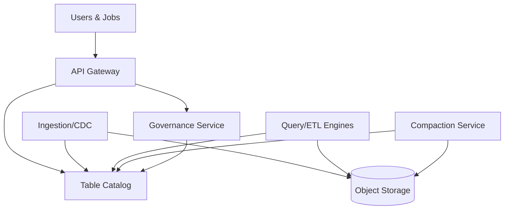

## Overview

A modern data lake must provide “warehouse-like” reliability (ACID tables, schema evolution, time travel, incremental reads) while keeping the cost and openness benefits of raw object storage (S3/GCS/ADLS). The core challenge is that object stores are immutable-key blobs with eventual-listing behaviors and no native transactions—so correctness, performance, and governance must be built above the storage layer.

This design implements a governed lakehouse on object storage using open table formats (Apache Iceberg and/or Apache Hudi), a transactional catalog, and a dedicated optimization plane for compaction/clustering. Governance is enforced centrally (authn/z, policy, lineage, classification) with consistent authorization across engines (Spark/Flink/Trino) and across both “raw” and “curated” zones.

## Requirements

### Functional Requirements
- Ingest batch and streaming data into object storage and publish curated tables in Iceberg/Hudi.
- Support ACID operations: insert/upsert/delete/merge, schema evolution, and time travel.
- Provide incremental consumption (change data feeds, snapshot-based reads) for downstream jobs.
- Perform automated compaction and clustering to mitigate small files and optimize query performance.
- Support multi-engine access (Spark/Flink for writes; Trino/Presto/SparkSQL for reads) with consistent semantics.
- Enforce governance: authentication, authorization, audit logs, data classification/PII tagging, and lineage.
- Provide dataset lifecycle management (retention, snapshots/commits cleanup, GDPR delete workflows).
- Expose catalog discovery and metadata APIs for datasets, schemas, and ownership.

### Non-Functional Requirements
- **Scale**: 5K sustained ingestion events/sec, peaks 50K/sec; 5–20 PB object storage over 3 years; 20K tables; 200K partitions/day across all tables; 2K concurrent query users.
- **Latency**:
  - Ingestion-to-table publish: P50 2 min, P99 10 min (curated zone).
  - Interactive queries: P50 2–5 s, P99 30 s (well-partitioned tables).
  - Catalog operations (get table metadata): P99 < 200 ms.
- **Availability**: 99.95% for catalog/governance control plane; 99.9% for ingestion/optimization plane (jobs can retry).
- **Consistency**:
  - Strong consistency for table commits and metadata reads via transactional catalog.
  - Eventual consistency acceptable for secondary metadata (lineage enrichment, search indexing).
- **Durability**: RPO ≤ 15 minutes for catalog state; object storage durability assumed (11+ 9s), plus versioning for critical buckets.

### Constraints & Assumptions
- Runs in a cloud environment with managed object storage and IAM integration.
- Team size: ~6–10 engineers; prefer managed services where possible, but keep core table formats open.
- Compliance: SOC2 + GDPR; require auditability, least privilege, and data retention controls.
- Network access patterns: engines run in private subnets/VPC; object storage accessed via private endpoints.

## High-Level Architecture



The architecture separates concerns into three planes: (1) **data plane** on object storage (raw and curated zones), (2) **control plane** for table metadata (catalog) and governance, and (3) **optimization plane** for continuous maintenance (compaction/clustering/cleanup). This matches real-world lakehouse patterns: object storage for durability and cost, an external transactional catalog for correctness and concurrency, and background maintenance to keep performance stable over time.

Iceberg/Hudi provide table-level transactional guarantees by committing immutable metadata (Iceberg snapshots/manifests; Hudi timelines) that point to immutable data files. Engines interact with object storage only through the table metadata, avoiding unsafe “list-and-guess” behavior.

## Component Deep-Dive

### Object Storage (Raw + Curated Zones)

**Responsibility**: Durable storage for raw files and table data files (Parquet/ORC), plus table metadata blobs (manifests, commit artifacts).

**Key Design Decisions**:
- Use separate buckets/prefixes for `raw/`, `staging/`, `curated/` to enforce different governance and lifecycle policies.
- Enable bucket versioning + object lock (where needed) for critical metadata prefixes to protect against accidental deletions and ransomware-like events.

**Technology Choice**: S3/GCS/ADLS Gen2 with private endpoints; Parquet + ZSTD; optional server-side encryption with KMS.

**Scaling Strategy**: Scale is managed by the provider; optimize access by minimizing small files, using partition pruning, and leveraging multi-part upload and adaptive concurrency.

---

### Table Format Layer (Iceberg / Hudi)

**Responsibility**: Provide ACID table semantics, schema evolution, time travel, and efficient reads/writes on object storage.

**Key Design Decisions**:
- Standardize on **Iceberg** for broad engine compatibility and predictable metadata scaling; use **Hudi** where upserts/CDC and near-real-time incremental pulls dominate.
- Enforce file sizing targets (e.g., 256–512 MB Parquet) and partition spec evolution policies to avoid unbounded partition counts.

**Technology Choice**:
- Iceberg (Spark/Flink/Trino native support) for most analytical tables.
- Hudi (Spark/Flink) for CDC-heavy tables requiring upsert and incremental consumption.

**Scaling Strategy**: Partitioning (time + high-cardinality bucketing where needed), metadata pruning, and background optimization (rewrite data files, rewrite manifests, clustering).

---

### Table Catalog (Transactional Metadata)

**Responsibility**: Source of truth for table definitions, snapshots/commits, schema/partition specs, and pointer metadata used by all engines.

**Key Design Decisions**:
- Use a catalog that supports atomic commit semantics and multi-engine concurrency (avoid “HMS-only” patterns if you need high write concurrency).
- Separate “authoritative catalog” from “search index” to keep catalog latency predictable.

**Technology Choice**:
- Managed: AWS Glue Catalog + Iceberg (with locking) or Lake Formation where governance is integrated.
- Self-managed: Iceberg REST Catalog backed by Postgres/MySQL; or Project Nessie (git-like branching) where data versioning workflows matter.

**Scaling Strategy**: Horizontally scale stateless catalog API; store state in HA relational DB (read replicas), cache hot metadata, and rate-limit high-churn operations (e.g., excessive snapshot listing).

---

### Compaction & Optimization Service

**Responsibility**: Resolve small files, optimize layout, manage snapshot/commit retention, and keep table metadata compact.

**Key Design Decisions**:
- Separate optimization from ingestion to keep ingestion latency predictable; run compaction asynchronously with per-table SLAs.
- Use table-format-native procedures (Iceberg rewriteDataFiles/rewriteManifests; Hudi compaction/clustering) with concurrency controls.

**Technology Choice**: Spark or Flink jobs orchestrated by Airflow/Argo/Managed Workflows; queue-backed scheduler (Kafka/SQS/PubSub) for triggers.

**Scaling Strategy**: Partition-aware parallelism (optimize hottest partitions first), workload isolation (separate compute pools), and backpressure from catalog/object-store throttling signals.

---

### Governance & Metadata Service

**Responsibility**: Unified authn/z, dataset ownership, classification/PII tags, lineage, audit, and policy enforcement across engines and zones.

**Key Design Decisions**:
- Central policy decisions with decentralized enforcement: engines must enforce the same policies (row/column masking where required).
- Treat raw zone as restricted-by-default; require explicit data product onboarding to publish curated tables.

**Technology Choice**:
- Authn: OIDC/SAML + IAM roles.
- Policy: Apache Ranger / Lake Formation / custom PDP with OPA.
- Lineage: OpenLineage + Marquez/DataHub/Amundsen; audit logs to SIEM.

**Scaling Strategy**: Stateless governance APIs; asynchronous lineage/audit ingestion; index metadata in OpenSearch/Elasticsearch for discovery.

## Data Model

### Storage Schema

**Catalog DB (relational)**
- `datasets`
  - `dataset_id` (UUID, PK)
  - `name` (string, unique)
  - `owner_team` (string)
  - `zone` (enum: raw|curated)
  - `table_format` (enum: iceberg|hudi)
  - `location` (string, e.g., `s3://bucket/curated/db/table/`)
  - `created_at`, `updated_at`
- `schemas`
  - `schema_id` (UUID, PK)
  - `dataset_id` (FK)
  - `version` (int)
  - `avro_json` (text)
  - `effective_at` (timestamp)
- `policies`
  - `policy_id` (UUID, PK)
  - `dataset_id` (FK)
  - `policy_type` (enum: read|write|mask|row_filter)
  - `definition` (json)
  - `updated_by`, `updated_at`
- `maintenance_state`
  - `dataset_id` (FK, PK)
  - `target_file_size_mb` (int)
  - `compaction_sla_minutes` (int)
  - `last_optimized_at` (timestamp)
  - `last_snapshot_expired_at` (timestamp)

**Table-format metadata (in object storage)**
- Iceberg: `metadata/metadata.json`, manifest lists, manifests, data files.
- Hudi: `.hoodie/` timeline, file groups, log files (MOR), data files (COW).

### Data Flow

```mermaid
sequenceDiagram
  participant Ingest as Ingestion Job
  participant Catalog as Catalog
  participant Obj as Object Storage
  participant Opt as Compaction
  participant Query as Query Engine

  Ingest->>Obj: Write staged data files
  Ingest->>Catalog: Commit snapshot/instant (atomic)
  Query->>Catalog: Fetch table metadata
  Query->>Obj: Read manifests + data files
  Opt->>Obj: Rewrite small files (optimize)
  Opt->>Catalog: Commit optimized snapshot/instant
```

## API Design

### Catalog APIs (REST)
- `POST /v1/tables`
  - Request: `{ "name": "db.table", "format": "iceberg", "location": "s3://.../table/" }`
  - Response: `{ "tableId": "...", "metadataLocation": "s3://.../metadata/..." }`
  - Errors: `409` name exists, `400` invalid location, `403` unauthorized
  - Idempotency: `Idempotency-Key` header; repeated calls return same `tableId` if identical payload.
- `GET /v1/tables/{name}`
  - Response: `{ "schema": ..., "partitionSpec": ..., "currentSnapshot": ... }`
  - Errors: `404` not found, `503` catalog unavailable
- `POST /v1/tables/{name}/commit`
  - Request: format-specific commit payload (Iceberg snapshot update / Hudi instant)
  - Errors: `409` concurrent commit; client retries with refreshed base metadata

### Governance APIs
- `POST /v1/policies`
  - Request: `{ "dataset": "db.table", "type": "mask", "definition": {...} }`
  - Response: `{ "policyId": "...", "version": 7 }`
  - Errors: `422` invalid policy, `403` not owner/admin
- `GET /v1/audit?dataset=db.table&from=...`
  - Response: paginated access events

### Maintenance APIs
- `POST /v1/maintenance/optimize`
  - Request: `{ "dataset": "db.table", "partitions": ["dt=2025-12-17"] }`
  - Response: `{ "jobId": "...", "status": "queued" }`
  - Idempotency: `Idempotency-Key` maps to a single active job per dataset+partition set

## Scaling & Performance

### Bottleneck Analysis
- **Small files** from streaming/batch micro-batches increase metadata and query planning time.
  - Mitigation: target file sizes, write distribution, async compaction, and partition-aware clustering.
- **Catalog hot spots** during heavy commit concurrency (many writers).
  - Mitigation: writer coordination (per-table limits), optimistic concurrency with fast retries, and scalable backing DB.
- **Object store throttling** during scans and compaction.
  - Mitigation: request shaping, engine-level read caching, limiting concurrent rewrite tasks, and avoiding excessive manifest growth.

### Horizontal Scaling
- **Ingestion**: scale by partitioning topics/streams and running multiple writers per table with strict commit concurrency rules (often “one writer per partition”).
- **Compute engines**: autoscale worker fleets; isolate ETL vs BI query pools.
- **Catalog/Governance**: stateless APIs behind L7 load balancer; HA relational DB with read replicas; cache hot metadata.

**Sharding/Partitioning Strategy**
- Partition by time (`dt`), then optional secondary bucketing on high-cardinality keys to balance file sizes.
- Avoid over-partitioning: cap partitions per day per table; use clustering/sorting for selective queries instead.

### Caching Strategy
- **Metadata cache** (catalog responses, manifests) in Redis/memory with short TTL (30–120s) and explicit bust on commit notifications.
- **Query result cache** (optional) for BI workloads; TTL minutes; invalidated by snapshot changes for affected tables.
- **Engine local cache** for Parquet footers and remote reads (where supported).

## Trade-offs & Alternatives

### Key Trade-offs Made
- **Open table formats over proprietary warehouse storage**
  - Chosen: Iceberg/Hudi on object storage.
  - Sacrificed: some turnkey performance and tightly integrated governance features.
  - Why: portability, cost control, and multi-engine flexibility.
- **Async compaction vs synchronous writes**
  - Chosen: background optimization plane.
  - Sacrificed: immediate “perfect” file layout after every write.
  - Why: predictable ingestion latency and better cluster utilization.
- **Central governance PDP with distributed enforcement**
  - Chosen: single policy source, enforced by engines/connectors.
  - Sacrificed: more integration work and enforcement testing.
  - Why: consistent access controls across heterogeneous tools.

### Alternative Approaches
- **Delta Lake-only lakehouse**
  - Not chosen due to portability constraints in some ecosystems (though viable if Spark-centric).
- **Warehouse-first (Snowflake/BigQuery) with external tables**
  - Not chosen because compaction/layout control and open storage access are limited; higher long-term cost for PB scale.
- **HDFS-based lake**
  - Not chosen due to operational overhead and weaker cloud-native durability and elasticity compared to object storage.

## Failure Modes & Mitigations

### Failure Scenarios
- **Scenario**: Object storage outage or elevated 5xx
  - **Impact**: reads/writes fail; compaction pauses
  - **Detection**: elevated engine IO errors; synthetic canaries on critical prefixes
  - **Mitigation**: retry with jitter, degrade non-critical jobs, multi-region replication for critical curated datasets
- **Scenario**: Catalog unavailable
  - **Impact**: no commits; readers may proceed using cached snapshot for a short window
  - **Detection**: catalog health checks, DB failover alarms
  - **Mitigation**: HA DB, stateless API autoscaling, cached read-only mode for discovery
- **Scenario**: Concurrent commit conflicts (many writers)
  - **Impact**: ingestion job failures/retries, publish latency spikes
  - **Detection**: increased `409` conflicts and commit retry metrics
  - **Mitigation**: writer coordination, per-table concurrency caps, backoff + retry budgets
- **Scenario**: Compaction rewrites too aggressively (cost blowup)
  - **Impact**: increased compute spend and object churn
  - **Detection**: bytes-rewritten/day, compaction ROI metrics
  - **Mitigation**: thresholds (min small files/partition), schedules, and per-table budgets
- **Scenario**: Policy misconfiguration blocks access or leaks data
  - **Impact**: outage or compliance incident
  - **Detection**: policy change audits, automated policy tests, anomaly detection on access logs
  - **Mitigation**: approvals/workflows, policy-as-code, break-glass roles, continuous verification

### Disaster Recovery
- **RTO/RPO**: RTO 2 hours for catalog; RPO 15 minutes for catalog; curated data RPO depends on ingestion source replayability.
- **Backup strategy**: point-in-time recovery for catalog DB; object versioning + lifecycle rules; periodic snapshot export of critical governance metadata.
- **Failover procedures**: promote standby DB, redeploy catalog API in secondary region, switch compute to secondary endpoints, validate table reads using canary queries.

## Operational Considerations

### Monitoring & Alerting
- Catalog: commit latency, conflict rate, DB CPU/locks, P99 read latency.
- Object storage: 4xx/5xx rate, request latency, bytes read/write, throttling events.
- Table health: small-file count, average file size, manifest count, snapshot count, partition skew.
- Governance: denied-requests rate, policy evaluation latency, audit pipeline lag.
- Alert thresholds: commit P99 > 2s (sustained), conflict rate > 5%, small files/partition > 500, audit lag > 10 min.

### Deployment Strategy
- Blue/green or canary for control-plane services (catalog/governance) with backward-compatible APIs.
- Versioned table format libraries pinned per engine; upgrade via staged environment and compatibility matrix testing.
- Rollback: revert service release; for policy changes, fast rollback via policy versioning; for table maintenance jobs, abort and rely on atomic commit semantics (no partial publishes).

## References & Further Reading
- Apache Iceberg docs: `https://iceberg.apache.org/`
- Apache Hudi docs: `https://hudi.apache.org/`
- Iceberg REST Catalog spec and implementations (Iceberg community)
- Project Nessie (branching catalog): `https://projectnessie.org/`
- OpenLineage: `https://openlineage.io/`
- “Lakehouse” concepts (Databricks papers/blogs) and Trino + Iceberg production guides