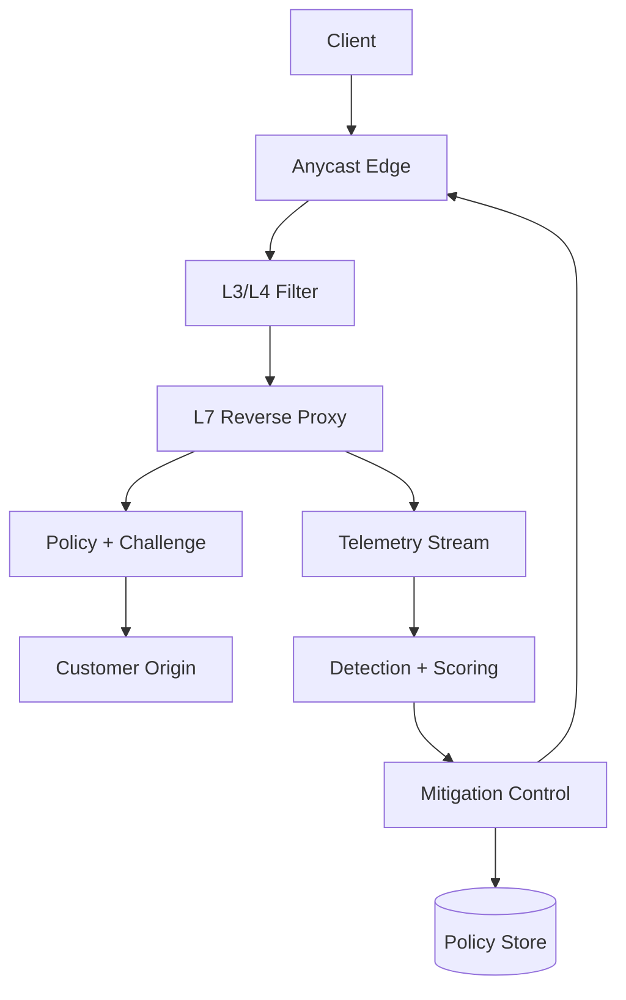
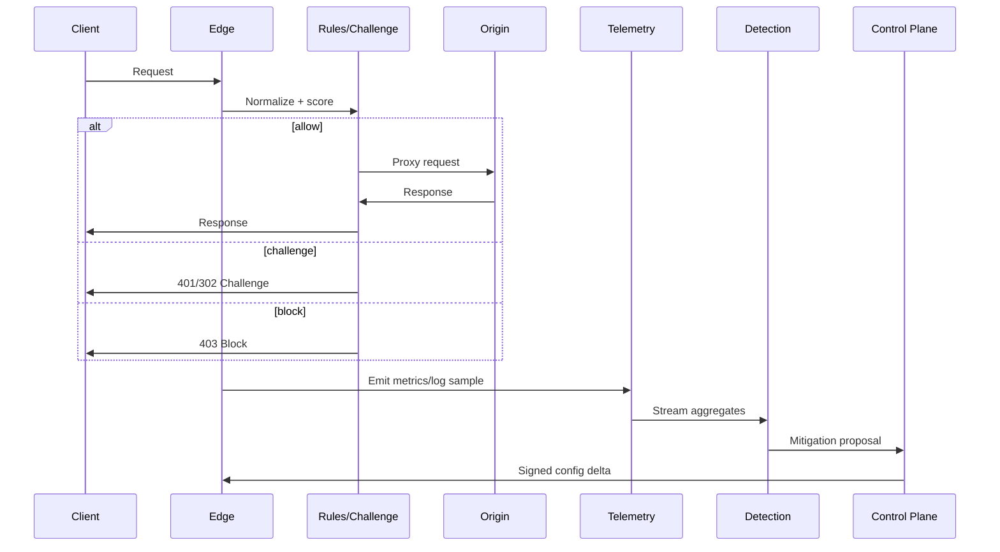

## Overview

A DDoS protection system must absorb and intelligently filter hostile traffic while preserving legitimate user experience and keeping origin services stable. The core challenge is that attack traffic is highly variable (L3/4 floods, L7 “low-and-slow”, botnets mimicking browsers), arrives at massive scale, and can shift patterns faster than human operators can react. Over-filtering is also costly: false positives directly translate to downtime for real users.

This design uses a global, Anycast-based scrubbing front door with a streaming telemetry pipeline that continuously builds traffic baselines, detects anomalies, and pushes mitigations back to the edge within seconds. Adaptive challenges (CAPTCHA and Proof-of-Work) are applied selectively based on risk signals and progressively escalated to minimize user friction while forcing attackers to pay a computational or interaction cost.

Key insight: treat DDoS defense as a closed-loop control system—observe (telemetry), decide (detection + policy), and act (edge enforcement + challenge)—with tight feedback cycles, safe rollouts, and explicit false-positive controls.

## Requirements

### Functional Requirements
- Onboard protected properties (domains/IPs), define origin routing, and configure protection policies per property.
- Detect and mitigate volumetric (L3/4) floods and application-layer (L7) attacks.
- Provide scrubbing pipeline: classify requests, apply rules, rate limits, bot signals, and challenge/allow/block decisions.
- Support adaptive challenges: CAPTCHA and Proof-of-Work (PoW), with progressive escalation and exemptions for low-risk traffic.
- Continuously analyze traffic patterns: baseline normal behavior, detect anomalies, and surface attack fingerprints (IP/ASN, JA3/JA4, UA, path, cookies, referrers).
- Push mitigations to edge globally within seconds, with rollback and blast-radius controls.
- Provide real-time dashboards and APIs for attack visibility, mitigation status, and audit logs.

### Non-Functional Requirements
- **Scale**:
  - Peak inbound: 10–50 Tbps aggregate, 50–200M packets/sec (PPS), 5–100M HTTP requests/sec (RPS) across PoPs.
  - Tenants: 10K–100K protected properties; top tenant can see 1M+ RPS during attacks.
  - Telemetry: 5–20M events/sec streamed into analytics during major incidents.
- **Latency**:
  - Edge decisioning overhead: +1–3 ms P50, +10 ms P99 (not including network RTT).
  - Challenge issuance: <50 ms P99 at edge (excluding user interaction).
  - Mitigation propagation: <10 s P99 from detection to global enforcement.
- **Availability**: 99.99% for edge proxy + enforcement plane; 99.9% for dashboards/analytics.
- **Consistency**:
  - Strong consistency for policy updates and audit logs.
  - Eventual consistency acceptable for analytics aggregates and ML feature updates.
- **Durability**:
  - Policy/audit: RPO ~0 (multi-AZ), RTO <15 min.
  - Telemetry: tolerate small sampling loss during extreme attacks (<1% events).

### Constraints & Assumptions
- Multi-region, multi-PoP footprint with Anycast routing; customers delegate DNS or route IP prefixes (BGP).
- Network access to third-party CAPTCHA providers is optional; system must support an internal “challenge fallback”.
- Team operates a high-performance edge stack (Envoy/Nginx custom) and a streaming platform (Kafka/Pulsar).
- Compliance: store minimal PII; IP addresses treated as sensitive; retention and hashing required.

## High-Level Architecture

Traffic enters through Anycast edge PoPs, where coarse L3/L4 filtering drops obvious floods and malformed traffic. Remaining traffic reaches an L7 reverse proxy that performs request normalization, WAF checks, rate limiting, and bot/challenge enforcement. The decision logic is primarily local for latency, but informed by near-real-time risk signals and policies.

In parallel, sampled and aggregated telemetry is streamed to the detection subsystem, which builds baselines, identifies anomalies, and generates mitigation actions (e.g., dynamic rate limits, fingerprint blocks, challenge escalations). A mitigation control plane safely distributes these actions to all edges with versioning, canaries, and rollback to reduce false-positive blast radius.

## Component Deep-Dive

### Anycast Edge PoP

**Responsibility**: Terminate TCP/TLS/QUIC, absorb traffic, apply fast-path filters, proxy clean traffic to origins, and execute mitigation decisions with low latency.

**Key Design Decisions**:
- Separate L3/4 filtering from L7 decisioning to handle volumetric floods without exhausting CPU.
- Use connection-level primitives (SYN cookies, conntrack limits, per-IP/ASN quotas) before expensive TLS/WAF work.

**Technology Choice**: eBPF/XDP for packet filtering + DPDK where needed; Envoy/Nginx (or custom Rust/Go proxy) for L7; QUIC support via Envoy/QUICHE.

**Scaling Strategy**: Horizontal scale by adding PoPs and capacity per PoP; Anycast spreads load; autoscale L7 proxies; shed load with per-stage budgets (PPS, CPS, RPS).

---

### Enforcement Engine (Policy + Challenge)

**Responsibility**: Make per-request decisions (allow/block/challenge/ratelimit) based on rules, risk score, and user state; mint and verify challenge tokens.

**Key Design Decisions**:
- “Local-first” enforcement: edges must keep working even if detection/control plane is degraded.
- Progressive challenges: start with low-friction (cookie/token), then PoW, then CAPTCHA for high confidence bot traffic.
- Stateless validation: signed tokens (e.g., PASETO/JWT-like) to avoid per-request DB lookups; optional short-lived revocation lists.

**Technology Choice**: Embedded rules VM (e.g., CEL/Rego-lite) + Redis/KeyDB for hot counters; HMAC-signed tokens; WebAssembly sandbox for PoW verification.

**Scaling Strategy**: Partition counters per PoP and periodically export aggregates; keep token verification CPU-bounded; protect challenge endpoints with dedicated quotas.

---

### Telemetry Pipeline

**Responsibility**: Collect request/flow signals, compute aggregates, and feed detection and dashboards.

**Key Design Decisions**:
- Adaptive sampling under load: maintain statistical fidelity while preventing telemetry from becoming a bottleneck.
- Dual-path metrics: (1) fast aggregates for detection, (2) richer sampled logs for forensics.

**Technology Choice**: Kafka/Pulsar for ingestion; ClickHouse/Druid for analytics; Prometheus for real-time metrics; object storage for raw sampled logs.

**Scaling Strategy**: Partition topics by tenant + region; compress (Zstd); backpressure by reducing sampling and dropping low-value fields.

---

### Detection + Scoring

**Responsibility**: Identify attacks, compute risk scores and fingerprints, and propose mitigations.

**Key Design Decisions**:
- Hybrid detection: rules (known bad patterns) + anomaly detection (baseline deviations) + supervised models (bot likelihood).
- Feature store with time windows (1m/5m/1h) to detect bursts and slow attacks.

**Technology Choice**: Flink/Spark Streaming; lightweight models (logistic regression/GBDT) served via gRPC; online feature store (Redis/Scylla) + offline in ClickHouse.

**Scaling Strategy**: Shard by tenant; pre-aggregate at edge; compute top-K heavy hitters (paths/IPs/JA3) per window to reduce cardinality.

---

### Mitigation Control Plane

**Responsibility**: Safely turn detections into edge-enforced configurations and distribute them globally.

**Key Design Decisions**:
- Versioned configs with staged rollout (canary PoPs, then region, then global).
- Guardrails: auto-expire mitigations, cap rule cardinality, require confidence thresholds, and continuously measure false positives.

**Technology Choice**: Central policy store (PostgreSQL + read replicas); config distribution via gRPC streaming or pub/sub; signed config bundles.

**Scaling Strategy**: Push deltas, not full configs; multi-region active-active control; edges cache last-known-good configs.

## Data Model

### Storage Schema

**Policy Store (PostgreSQL)**:
- `tenants(id, name, plan, created_at)`
- `properties(id, tenant_id, domain, origin_config, tls_mode, created_at)`
- `policies(id, property_id, name, mode, default_action, created_at)`
- `rules(id, policy_id, priority, match_expr, action, challenge_type, rate_limit, expires_at, created_at)`
- `mitigations(id, property_id, type, fingerprint, action, confidence, rollout_state, expires_at, created_at)`
- `audit_log(id, tenant_id, actor, action, object_ref, diff, created_at)`

**Telemetry (ClickHouse)** (sampled rows):
- `http_events(ts, property_id, pop, ip_hash, asn, country, method, host, path, status, bytes_in, bytes_out, ua_hash, ja4, tls_fp, risk_score, action, challenge, latency_ms)`

**Hot Counters (Redis/KeyDB)** (TTL-based):
- Keys like `rl:{property}:{window}:{dimension}:{value}` → integer count
- `token_revoked:{jti}` → boolean (short TTL)

### Data Flow

Key operations:
- **Normal traffic**: edge applies cached policies, uses local counters, and proxies to origin.
- **Attack detection**: detection computes top offending fingerprints and anomaly scores; control plane creates mitigations with expiry and rollout plan.
- **Adaptive challenge**: users receive short-lived tokens after solving PoW/CAPTCHA; subsequent requests bypass further challenges until token expiry.

## API Design

### Customer APIs (REST)

**Create/Update property**
- `POST /v1/properties`
  - Request: `{ "domain": "api.example.com", "origin": { "host": "origin.internal", "port": 443 }, "tlsMode": "full" }`
  - Response: `{ "id": "prop_123" }`
  - Errors: `409` domain already exists, `400` invalid origin
  - Idempotency: `Idempotency-Key` supported

**Update policy**
- `PUT /v1/properties/{propertyId}/policy`
  - Request: `{ "defaultAction": "allow", "rules": [ ... ] }`
  - Response: `{ "version": 42 }`
  - Errors: `422` rule invalid/too broad, `403` forbidden

**Get attack status**
- `GET /v1/properties/{propertyId}/attacks?window=5m`
  - Response: `{ "summary": {...}, "topFingerprints": [...], "mitigations": [...] }`

### Internal/Edge APIs (gRPC)

**Config stream**
- `rpc StreamConfig(EdgeIdentity) returns (stream ConfigDelta)`
  - Signed deltas; edge acks applied version.
  - Errors: backoff + last-known-good fallback.

**Telemetry ingest (optional direct)**
- `rpc EmitMetrics(stream MetricEvent) returns (Ack)`
  - Best-effort with sampling; no request-path dependency.

### Error Handling Approach
- Clear separation of user errors (4xx) vs system faults (5xx).
- For enforcement decisions, prefer fail-safe modes per policy:
  - **Fail-open** for benign features (dashboards, noncritical logging).
  - **Fail-closed** optional for high-security tenants, but with strict safeguards to avoid self-inflicted outage.

### Idempotency Considerations
- All policy writes accept `Idempotency-Key`.
- Mitigation creation includes deterministic fingerprint IDs (hash of normalized fingerprint) to avoid duplicate rule spam.

## Scaling & Performance

### Bottleneck Analysis
- **TLS handshakes / CPU**: mitigated by TLS session resumption, QUIC where appropriate, handshake rate limits, and L3/4 prefilters.
- **Stateful counters (rate limiting)**: mitigated by local PoP counters, approximate sketches (Count-Min), and periodic aggregation.
- **High-cardinality analytics**: mitigated by top-K heavy hitter extraction and dimensionality caps (path normalization, hash bucketing).
- **Control-plane fanout**: mitigated by delta distribution, hierarchical rollout, and edge-side caching.

### Horizontal Scaling
- **Edge**: add PoPs/instances; Anycast spreads traffic; per-PoP isolation prevents global collapse.
- **Detection**: shard by tenant/property; autoscale stream processors based on lag; prioritize “under attack” tenants.
- **Data layer**: ClickHouse clusters per region; Kafka partitions sized for worst-case attack bursts.

### Sharding/Partitioning Strategy
- Telemetry partitions: `{region}:{tenantBucket}` to keep locality and parallelism.
- Feature store: shard by `property_id % N` with replication.
- Mitigation rules: compiled per property; edges keep only active rules to bound memory.

### Caching Strategy
- **Edge policy cache**: local in-memory compiled rules, refreshed via config stream; TTL + version checks.
- **Token cache**: stateless signed tokens; optional small revocation cache for fraud events.
- **Origin shielding**: cache static responses at edge/CDN layer to reduce origin pressure during partial attacks.

Cache invalidation:
- Config versioning + monotonic updates.
- Token invalidation primarily by expiry; revocation only for high-risk cases.

## Trade-offs & Alternatives

### Key Trade-offs Made
- **Local-first enforcement**
  - Chosen: edge can decide without control plane round-trips.
  - Sacrificed: perfect global consistency of counters.
  - Why: latency and resilience under attack dominate.
- **Hybrid detection (rules + anomaly + ML)**
  - Chosen: best coverage across known and novel attacks.
  - Sacrificed: operational complexity (models, feature drift).
  - Why: pure rules miss adaptive bots; pure ML risks opaque false positives.
- **Progressive challenges**
  - Chosen: minimize friction for real users.
  - Sacrificed: some attackers may slip through low-friction steps briefly.
  - Why: user experience and conversion matter; escalation catches persistent threats.

### Alternative Approaches
- **Fully centralized scrubbing (single region)**
  - Rejected due to latency, regional outages, and insufficient capacity concentration risk.
- **Always-on CAPTCHA**
  - Rejected due to poor UX, accessibility issues, and easy attacker outsourcing/solver farms.
- **Pure rate limiting without fingerprints**
  - Rejected because distributed botnets evade simple per-IP limits; needs multi-signal fingerprints.

## Failure Modes & Mitigations

### Failure Scenarios
- **Scenario**: Control plane outage
  - **Impact**: No new mitigations; edges continue last-known-good.
  - **Detection**: config stream disconnect rate, control-plane SLO alerts.
  - **Mitigation**: edge cached configs; auto-expire mitigations conservatively; manual “emergency rules” channel.
- **Scenario**: False-positive mitigation blocks legitimate users
  - **Impact**: Partial outage for a tenant.
  - **Detection**: sudden 4xx spike, conversion drop, customer alerts, synthetic probes.
  - **Mitigation**: staged rollout/canary; automatic rollback on error-budget breach; allowlist escape hatch.
- **Scenario**: Telemetry pipeline overload
  - **Impact**: Reduced visibility; slower detection.
  - **Detection**: Kafka lag, drop counters, ingestion CPU.
  - **Mitigation**: adaptive sampling, shed nonessential fields, prioritize attacked tenants.
- **Scenario**: Volumetric attack saturates a PoP uplink
  - **Impact**: Localized packet loss.
  - **Detection**: link utilization, PPS, interface drops.
  - **Mitigation**: Anycast rebalancing, upstream blackholing/RTBH, redirect to other scrubbing centers.
- **Scenario**: Challenge system abused (amplification or state exhaustion)
  - **Impact**: self-DoS on challenge endpoints.
  - **Detection**: challenge issuance rate, CPU spikes, cache misses.
  - **Mitigation**: strict quotas, stateless tokens, separate challenge capacity pool.

### Disaster Recovery
- RTO: <30 minutes for control plane; edges continue independently.
- RPO: ~0 for policies/audit (multi-AZ synchronous replication); analytics RPO up to minutes acceptable.
- Backups: daily full + continuous WAL for PostgreSQL; ClickHouse snapshots; Kafka topic retention 24–72h for replay.
- Failover: active-active control plane with region fencing; edges pinned to nearest healthy control endpoint.

## Operational Considerations

### Monitoring & Alerting
Key metrics:
- Edge: PPS/RPS, handshake rate, CPU, memory, queue depth, L7 4xx/5xx, origin latency, dropped packets.
- Enforcement: rate-limit hits, blocks, challenge rate, token verify failures, false-positive indicators (customer 4xx complaints, synthetic failures).
- Telemetry: ingestion lag, sampling rate, drop rate, top-K cardinality, ClickHouse query latency.
Alert thresholds (examples):
- P99 edge decision time > 10 ms for 5 min
- 403/429 rate > baseline + 5σ for a tenant (possible misconfiguration)
- Config propagation P99 > 10 s
- Kafka lag > 60 s on “attacked tenant” partitions

### Deployment Strategy
- Edge: blue/green per PoP with connection draining; canary PoPs first; automatic rollback on elevated 5xx/latency.
- Detection/control: canary by tenant subset; feature flags for new detectors/models; shadow mode before enforcement.
- Rollback: revert config version; edges keep last-known-good and validate signatures; mitigations have max TTL and require renewal.

## References & Further Reading
- Cloudflare: DDoS mitigation and bot management architecture (blog + product docs)
- Google: BBR, QUIC, and large-scale traffic handling (research + QUIC docs)
- AWS Shield Advanced & WAF: managed DDoS/WAF patterns
- “Count-Min Sketch” and streaming heavy hitters algorithms for high-cardinality detection
- Envoy Proxy + xDS config distribution patterns