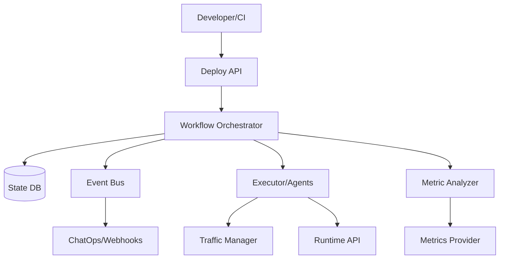
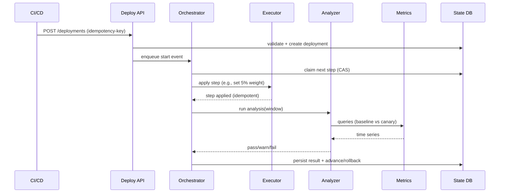

## Overview

Safe deployments are hard because the act of changing software is inseparable from risk: unknown regressions, noisy metrics, partial failures, and complex distributed dependencies. The system must shift traffic progressively, evaluate health with statistically meaningful signals, and roll back quickly—without creating a fragile “control plane” that becomes the single point of failure for shipping.

This design builds a deployment orchestration engine that treats deployments as durable workflows with explicit state transitions, policy-driven analysis, and pluggable executors. It separates *control plane correctness* (workflow, policy, audit, idempotency) from *data plane actions* (traffic shifting, scaling, rollback) via agents/integrations (Kubernetes, service mesh, ingress, CD tools). Automated metric analysis gates progression and triggers rollback based on configurable SLOs, error budgets, and guardrails to reduce false positives/negatives.

Key insight: model deployments as a **state machine + event log**, execute actions via **idempotent steps**, and decide health via **versioned analysis runs** that are reproducible (same queries, windows, thresholds), auditable, and resilient to telemetry failures.

## Requirements

### Functional Requirements
- Create deployment plans supporting **canary**, **blue/green**, and **rolling** strategies per service/environment.
- Perform **progressive traffic shifting** (e.g., 1% → 5% → 25% → 50% → 100%) with configurable step durations.
- Run **automated metric analysis** per step (latency, errors, saturation, business KPIs) with pass/warn/fail outcomes.
- Support **automatic rollback** and **abort/pause/resume** with manual approval gates (e.g., “promote to 100%”).
- Enforce **policy-as-config** (per org/team/service) for allowed strategies, blast radius, and rollback criteria.
- Provide **real-time status** (timeline, current step, analysis results, links to dashboards/logs/traces).
- Emit **auditable events** for every state transition and human action; integrate with ChatOps and ticketing.
- Support **multi-cluster / multi-region** deployments with concurrency limits and safe sequencing.

### Non-Functional Requirements
- **Scale**:
  - 5,000 deployments/day (peak 20 deployments/min).
  - 50,000 managed services across envs; 500 clusters.
  - 200 metric queries/sec peak during analysis bursts.
  - Audit/event volume: 5–20 events/sec steady, 200 events/sec burst.
- **Latency**:
  - Control-plane APIs: P50 50ms, P99 300ms.
  - Step orchestration tick-to-action: P99 < 2s (not counting bake windows).
  - Rollback trigger-to-traffic-reduction: P99 < 30s (depends on mesh/ingress).
- **Availability**: 99.95% monthly for orchestration API; deployments must continue safely through transient failures.
- **Consistency**:
  - **Strong** for deployment state transitions (no double-promotes, no split-brain step execution).
  - **Eventual** for telemetry ingestion and dashboarding.
- **Durability**:
  - RPO 0 for deployment state/audit log (no lost transitions).
  - RPO ≤ 5 min for derived analytics/reporting.
  - RTO 30 min for full control-plane restore (deployments should fail-safe while down).

### Constraints & Assumptions
- Targets Kubernetes + service mesh (Istio/Linkerd) and/or ingress (NGINX/ALB) as primary traffic managers.
- Metrics provider is Prometheus-compatible and/or SaaS (Datadog/New Relic); logs/traces optional but supported.
- Small platform team (5–8 engineers); prefer managed databases and battle-tested primitives.
- Compliance: auditability required (SOX-like change tracking); least-privilege for cluster credentials.

## High-Level Architecture



The control plane centers on a Workflow Orchestrator that persists deployment intent and step state in a transactional State DB and drives execution via an event loop (or workflow engine). Executors/Agents perform idempotent “apply” operations against deployment targets (Kubernetes APIs, Argo Rollouts, service mesh, ingress), while the Metric Analyzer evaluates health using versioned metric queries and decision logic.

This separation keeps the core orchestration logic deterministic and auditable, while allowing multiple delivery backends and traffic mechanisms. The Event Bus decouples notifications, auditing sinks, and optional derived analytics without blocking deployments.

## Component Deep-Dive

### Deploy API (Control Plane Edge)

**Responsibility**: Accept deployment requests, validate policies, expose status/control operations (pause/resume/abort), and provide audit-friendly APIs.

**Key Design Decisions**:
- Use **idempotency keys** for create/actuation endpoints to tolerate retries from CI and clients.
- Validate strategy/policy at admission time (and re-validate on critical transitions) to prevent policy drift.

**Technology Choice**: Go/Java service with REST/gRPC; OIDC auth (Okta/GitHub); rate limits via API gateway (Envoy/Kong).

**Scaling Strategy**: Stateless horizontal scaling behind L7 LB; cache read-heavy status responses (ETag + short TTL).

### Workflow Orchestrator (State Machine + Scheduler)

**Responsibility**: Execute deployments as durable workflows (steps, timers, gates), ensuring exactly-once *state transitions* and effectively-once *side effects*.

**Key Design Decisions**:
- Persist step state in a **transactional DB** with optimistic concurrency (CAS/version) to prevent double execution.
- Drive execution via **event loop + delayed jobs** (timers for bake windows) rather than tight polling.

**Technology Choice**:
- Option A: Temporal/Cadence (strong workflow semantics, timers, retries).
- Option B: Custom orchestrator using Postgres + job queue (simpler ops, less vendor lock-in).
- Recommended: Temporal if team can operate it; otherwise Postgres + Redis queue with strict invariants.

**Scaling Strategy**: Partition by `env/cluster` or `service_id` to distribute hot keys; multiple orchestrator workers consuming from queue.

### Executor/Agents (Data Plane Actions)

**Responsibility**: Apply rollout actions: create new version, scale replicas, shift traffic weights, flip blue/green routes, and perform rollback.

**Key Design Decisions**:
- Use **pluggable backends** (Kubernetes native, Argo Rollouts, Spinnaker, Flagger) to avoid reinventing stable primitives.
- Make every action **idempotent** using desired-state reconciliation (read current → compute diff → apply).

**Technology Choice**: Agentless (direct API calls) for simple environments; agent-per-cluster for constrained networks. Kubernetes: client-go; service mesh: Istio VirtualService/DestinationRule or Linkerd SMI.

**Scaling Strategy**: Shard executors by cluster; apply rate limiting and exponential backoff to respect API server quotas.

### Metric Analyzer (Automated Judgement)

**Responsibility**: Evaluate candidate vs baseline health during each step using metrics queries, statistical guards, and SLO policies; return pass/warn/fail and confidence.

**Key Design Decisions**:
- Use **relative comparisons** (canary vs stable) and **burn-rate SLO checks** to reduce false alarms from global incidents.
- Require a **minimum sample size** (requests, minutes) before judging; otherwise extend bake or mark “inconclusive”.

**Technology Choice**: Stateless service executing PromQL/Datadog queries; config-driven query templates; optional Bayesian or sequential testing for KPIs.

**Scaling Strategy**: Query fan-out controls (max concurrent queries/deployment), caching query results per window, and batching where provider supports it.

### Policy & Audit (Governance)

**Responsibility**: Store and enforce rollout policies; produce immutable audit trails; integrate approvals.

**Key Design Decisions**:
- Treat policy as **versioned artifacts** (e.g., GitOps) referenced by deployments for reproducibility.
- Store audit events in an **append-only log** with tamper-evident hashing (hash chain) for compliance.

**Technology Choice**: Policy in Git + signed commits; audit in Postgres + periodic export to object storage (S3/GCS) and SIEM.

**Scaling Strategy**: Append-only writes scale well; downstream consumers via event bus.

## Data Model

### Storage Schema

**Postgres (primary state)**

- `deployments`
  - `deployment_id` (UUID, PK)
  - `service_id` (text)
  - `environment` (text)
  - `strategy` (enum: canary|blue_green|rolling)
  - `desired_version` (text, image/tag)
  - `status` (enum: pending|running|paused|succeeded|failed|aborted)
  - `current_step` (int)
  - `policy_ref` (text, e.g., git sha)
  - `created_by` (text)
  - `created_at`, `updated_at` (timestamptz)
  - `lock_version` (bigint) for optimistic concurrency

- `deployment_steps`
  - `deployment_id` (FK)
  - `step_index` (int)
  - `type` (enum: set_weight|flip_route|bake|analysis|manual_gate|rollback)
  - `desired_state` (jsonb) (e.g., weight=25)
  - `status` (enum: pending|running|succeeded|failed|skipped)
  - `started_at`, `ended_at`

- `analysis_runs`
  - `analysis_id` (UUID, PK)
  - `deployment_id` (FK)
  - `step_index` (int)
  - `window_start`, `window_end`
  - `result` (enum: pass|warn|fail|inconclusive)
  - `details` (jsonb) (per-metric scores, p-values/confidence, links)

- `audit_events`
  - `event_id` (UUID, PK)
  - `deployment_id` (FK, nullable)
  - `actor` (text: user/service)
  - `action` (text)
  - `payload` (jsonb)
  - `prev_hash` (bytea), `hash` (bytea)
  - `created_at`

### Data Flow



## API Design

### Create Deployment
- `POST /v1/deployments`
- Headers: `Idempotency-Key: <uuid>`
- Request:
  ```json
  {
    "serviceId": "checkout",
    "environment": "prod",
    "strategy": "canary",
    "version": "checkout:1.42.0",
    "policyRef": "git:policies@a1b2c3d",
    "parameters": { "maxDurationMinutes": 60 }
  }
  ```
- Response `201`:
  ```json
  { "deploymentId": "uuid", "status": "pending" }
  ```
- Errors: `409` (policy violation), `429` (rate limit), `422` (invalid), `503` (scheduler unavailable but request persisted).

### Get Status
- `GET /v1/deployments/{deploymentId}`
- Response includes step timeline, current traffic weights, last analysis, links.
- Consistency: strongly consistent with State DB; may show “telemetry pending” for recent steps.

### Control Operations
- `POST /v1/deployments/{id}:pause` (idempotent)
- `POST /v1/deployments/{id}:resume` (idempotent)
- `POST /v1/deployments/{id}:abort` (idempotent; triggers rollback policy)
- `POST /v1/deployments/{id}:approve`
  - Request: `{ "gate": "promote_to_100", "comment": "ok" }`
- Error handling: `409` for invalid state transitions; `403` for approval permissions.

### Webhooks/Events
- `POST /v1/webhooks/subscriptions`
- Events: `deployment.started`, `step.changed`, `analysis.completed`, `deployment.rolled_back`, `deployment.succeeded`.
- Delivery: at-least-once; signed payloads; consumer must de-duplicate by `event_id`.

### Idempotency Considerations
- Create/control endpoints accept `Idempotency-Key` and store a `(key, request_hash, response)` record for 24h.
- Executor actions are idempotent by desired-state reconciliation (safe retries).
- Orchestrator uses optimistic locking to ensure a step is only *owned* by one worker at a time.

## Scaling & Performance

### Bottleneck Analysis
- **Metrics query load**: analysis bursts can overload Prometheus/SaaS APIs.
  - Mitigate with concurrency limits, caching per window, query consolidation, and pre-aggregated SLIs (recording rules).
- **Cluster API rate limits**: many parallel deployments can throttle Kubernetes API servers.
  - Mitigate with per-cluster token buckets, backoff, and batching; prefer GitOps controllers where possible.
- **Hot state rows**: frequent status updates can contend on a single deployment row.
  - Mitigate by appending step events and computing views, or splitting “current state” from “event log”.

### Horizontal Scaling
- API/orchestrator/analyzer: stateless workers scale out behind LB.
- State DB: primary + read replicas; partition large tables by time for audit/events; careful indexing on `(environment, service_id, status)`.
- Executors: shard by cluster/region; optionally run as per-cluster agents for locality and network constraints.

### Caching Strategy
- Cache read-heavy status endpoints (e.g., `GET /deployments/{id}`) for 1–2s with ETag to reduce DB read pressure.
- Cache metric query results per `(query, window)` for the analysis duration (e.g., 30–60s) to avoid duplicate calls across metrics.
- Invalidation: time-based TTL + explicit bust on step transition.

## Trade-offs & Alternatives

### Key Trade-offs Made
- **Workflow engine (Temporal) vs custom DB scheduler**
  - Chosen: workflow semantics (timers, retries) when available.
  - Sacrificed: operational simplicity; adds a new infra dependency.
  - Why: deployments are long-running, failure-prone workflows where correctness is worth infra cost.
- **Automated rollback vs human-only gates**
  - Chosen: automated rollback on clear SLO breaches; manual gates for high-risk promotions.
  - Sacrificed: occasional false positives; requires careful tuning and “inconclusive” handling.
  - Why: rollback speed is the biggest lever on incident severity.
- **Relative canary analysis vs absolute thresholds**
  - Chosen: compare canary to baseline plus global guards (e.g., regional incident detection).
  - Sacrificed: more complex logic and query requirements.
  - Why: absolute thresholds break during traffic shifts, seasonality, and partial outages.

### Alternative Approaches
- **GitOps-only (Argo CD + Argo Rollouts/Flagger)**
  - Not chosen as the whole solution because it may not cover cross-system orchestration, approvals, and unified policy/audit across heterogeneous environments.
- **Spinnaker-style monolith**
  - Not chosen due to operational weight and customization complexity for smaller teams, though it’s viable for large orgs.
- **Service-mesh-only progressive delivery**
  - Not chosen because some stacks rely on ingress/LB or non-mesh traffic; still supported as an executor backend.

## Failure Modes & Mitigations

### Failure Scenarios
- **Scenario**: Metrics provider outage or rate-limited
  - **Impact**: analysis cannot judge; risk of stuck deployments.
  - **Detection**: analyzer error rates, timeouts, provider 429/5xx.
  - **Mitigation**: mark analysis `inconclusive`, extend bake up to policy cap, require manual approval or auto-abort depending on environment criticality.
- **Scenario**: Orchestrator worker crash mid-step
  - **Impact**: step may be partially applied.
  - **Detection**: lease timeout on step ownership.
  - **Mitigation**: step leases + retries; executors reconcile desired state; state transitions only via CAS.
- **Scenario**: Traffic shift applied but rollback cannot flip back (control-plane outage)
  - **Impact**: canary remains exposed.
  - **Detection**: data-plane health alarms independent of orchestrator.
  - **Mitigation**: “break glass” runbooks (direct mesh/ingress rollback), pre-created stable routes, and on-call tooling that does not depend on orchestrator.
- **Scenario**: False rollback due to noisy metrics
  - **Impact**: deployment churn, slowed delivery.
  - **Detection**: high rollback rate without correlated incidents.
  - **Mitigation**: minimum sample size, multi-window confirmation, guardrails (global incident check), and “warn” state requiring confirmation.
- **Scenario**: Executor has overly broad cluster permissions
  - **Impact**: security/compliance breach.
  - **Detection**: IAM audits, anomaly detection on API calls.
  - **Mitigation**: per-namespace RBAC, short-lived credentials (STS), scoped service accounts, and approval for privileged actions.

### Disaster Recovery
- **RTO/RPO**: RTO 30 min, RPO 0 for deployment state/audit.
- **Backup strategy**: continuous WAL archiving + daily snapshots for Postgres; periodic export of audit hash chain to object storage.
- **Failover procedures**: multi-AZ Postgres with automatic failover; orchestrator workers reconnect and resume from persisted state; deployments default to “hold” on prolonged control-plane unavailability.

## Operational Considerations

### Monitoring & Alerting
- Key metrics:
  - API: request rate, P99 latency, 4xx/5xx, auth failures.
  - Orchestrator: queue lag, step lease timeouts, stuck deployments (> policy max), state transition conflicts.
  - Analyzer: query latency, error rate, provider 429s, inconclusive rate.
  - Executor: apply success rate, K8s API throttling, rollback success latency.
- Alerts (examples):
  - Orchestrator queue lag P99 > 10s for 5 min.
  - Rollback trigger-to-traffic-reduction P99 > 60s.
  - Inconclusive analyses > 10% of prod steps in 1h.
  - Stuck deployments > 5 in prod.

### Deployment Strategy
- Ship the orchestration system using its own canary/blue-green where possible (dogfooding), but maintain a break-glass path.
- Use schema migrations with backward-compatible reads/writes; feature flags for new analysis logic.
- Rollback: keep previous orchestrator binaries and DB migrations reversible when feasible; otherwise gate with pre-prod soak.

## References & Further Reading

- Argo Rollouts (progressive delivery for Kubernetes): https://argo-rollouts.readthedocs.io/
- Flagger (canary releases + metrics analysis): https://flagger.app/
- Temporal (durable workflows): https://temporal.io/
- Google SRE Workbook: Canarying Releases: https://sre.google/workbook/canarying-releases/
- SRE: Alerting on SLOs (burn rates): https://sre.google/workbook/alerting-on-slos/
- Spinnaker (continuous delivery platform): https://spinnaker.io/