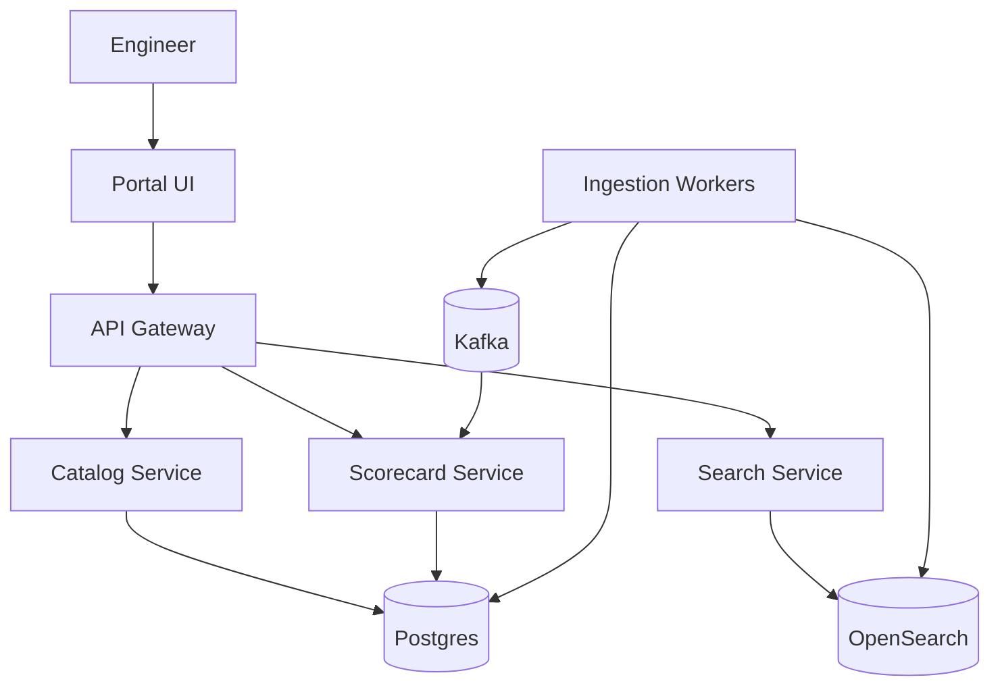
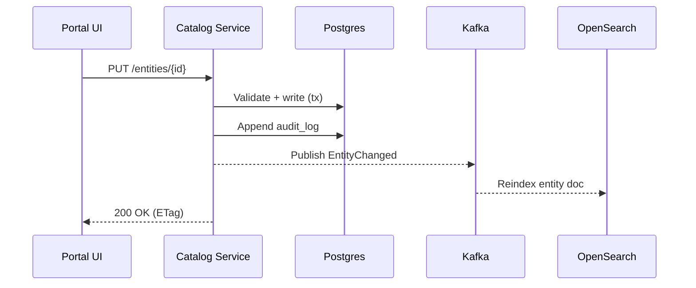
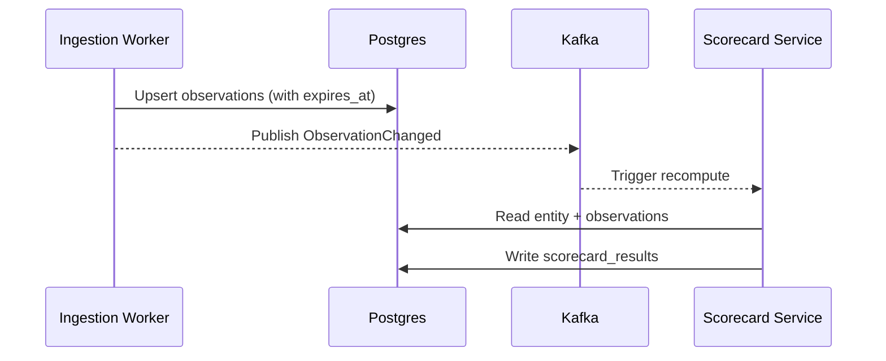

## Overview

A developer portal is the “source of truth” for internal services and edge workloads: who owns them, where their docs live, what environments they run in, and whether they meet operational expectations (on-call, SLOs, runbooks, security posture, etc.). The challenge is less about CRUD and more about **keeping data current and trustworthy** across many systems (Git, CI/CD, Kubernetes, IoT registries, observability, incident management) while maintaining **usable discovery** (search, dependency graphs) and **actionable governance** (scorecards with evidence).

A production-grade solution treats the portal as a **metadata platform**: an entity catalog with strongly-owned, manually curated “golden fields” (ownership, tier, criticality) plus continuously ingested “observed fields” (deployments, alerts, SLO burn, vulnerabilities). Scorecards are computed from a mix of static configuration and live signals, producing an auditable, time-series history that teams can improve against.

Key insight: optimize for **freshness + provenance**. Every field should have a clear source (human, repo, cluster, vendor API), a refresh policy, and a way to detect staleness. This enables reliable discovery, accurate scorecards, and safe automation (e.g., preventing production promotion if a service is missing an owner or runbook).

## Requirements

### Functional Requirements
- Service/workload registration for backend services and edge workloads (manual + “register from repo”).
- Ownership management (teams, on-call rotation, escalation policy) with RBAC-controlled edits.
- Documentation hub: link and render tech specs, runbooks, ADRs, APIs; support versioned docs from Git.
- Operational scorecards: configurable checks (SLOs, alerting, security scans, backup, dependency hygiene) with per-environment results.
- Discovery: fast search by name, tags, owners, domain, runtime, fleet/edge region; browse by taxonomy.
- Dependency mapping: service-to-service and service-to-edge-fleet relationships; visualize and query blast radius.
- Integrations: ingest metadata from Git providers, CI/CD, Kubernetes/edge orchestrators, observability, incident management.
- Auditability: change history for critical fields; scorecard evidence and timestamps.

### Non-Functional Requirements
- **Scale**: ~10k entities (services + edge workloads), ~2k teams, ~50k engineers; reads 500–2k QPS peak, writes 5–50 QPS, ingestion events 1k–10k/min.
- **Latency**: entity read P50 < 50ms, P99 < 200ms; search P50 < 150ms, P99 < 500ms; scorecard page render P99 < 800ms (includes parallel queries).
- **Availability**: 99.9% (internal) with graceful degradation when integrations fail.
- **Consistency**: strong consistency for manual edits (ownership, tier, ACL); eventual consistency for ingested signals and derived graphs/scorecards.
- **Durability**: RPO ≤ 15 min, RTO ≤ 1 hr for catalog DB; no silent data loss of manual edits.

### Constraints & Assumptions
- Enterprise SSO via OIDC/SAML; groups/teams managed in IdP.
- “Portal-as-platform” team of ~6–10 engineers; integrations must be incremental and resilient.
- Compliance: basic audit logging; some entities may be restricted (security-sensitive services).
- Network access to vendor APIs may be rate-limited; ingestion must backoff and cache.
- Multi-environment: dev/stage/prod + edge regions/fleets; portal must show environment-scoped posture.

## High-Level Architecture

The portal is split into three user-facing services: a **Catalog Service** for entity CRUD and authoritative metadata, a **Search Service** optimized for discovery and filtering, and a **Scorecard Service** that evaluates checks and stores results with provenance. Ingestion Workers integrate with external systems and publish normalized events to a bus for downstream processing (indexing, score recomputation).

This structure keeps the “system of record” small and strongly consistent (Postgres), while allowing high-throughput and flexible queries in OpenSearch. Scorecards are computed asynchronously from events and periodically refreshed, enabling stable UI performance even when upstream systems are slow or unavailable.

## Component Deep-Dive

### Portal UI
**Responsibility**: Provide entity pages, search/browse, docs rendering, scorecard views, and admin/config screens.

**Key Design Decisions**:
- Treat docs as “linked content” with optional rendering pipeline to avoid storing large blobs in the catalog.
- Parallelize page data fetches (entity + scorecards + deps) with fallbacks when non-critical data is unavailable.

**Technology Choice**: React/Next.js (or similar) with server-side rendering for fast first paint and linkability.

**Scaling Strategy**: Served via CDN; stateless; cache entity pages with short TTL and ETag validation.

### Catalog Service
**Responsibility**: Entity lifecycle (create/update/archive), ownership, taxonomy, ACLs, audit log, source-of-truth fields.

**Key Design Decisions**:
- Separate “spec” (declared) vs “status” (observed) fields to reduce conflicts and clarify provenance.
- Enforce schema and validation at write time; store all mutations as events for audit and reindex.

**Technology Choice**: Go/Java/Kotlin service + Postgres; outbound webhook triggers for reindex/score refresh.

**Scaling Strategy**: Stateless horizontal scaling behind L7 LB; read replicas for heavy read paths; cache hot entities in Redis.

### Ingestion Workers
**Responsibility**: Pull/push integrations (Git, CI/CD, Kubernetes, edge orchestrators, Prometheus, PagerDuty, vulnerability scanners) and normalize into events and “observations”.

**Key Design Decisions**:
- Use connector pattern: each integration is an isolated module with rate limiting, retries, and checkpointing.
- Record freshness and last-success per source to support staleness UI and alerting.

**Technology Choice**: Worker pool (Go/Java/Python) + Kafka; secrets via Vault/KMS; schedulers via Kubernetes CronJobs for periodic pulls.

**Scaling Strategy**: Partition work by integration+account+resource; scale consumers by Kafka partitions; apply per-source rate limits.

### Scorecard Service
**Responsibility**: Define checks, evaluate evidence, compute scores, persist results and history, expose explanations.

**Key Design Decisions**:
- Checks are declarative (YAML/JSON) and compiled into evaluators; results include evidence pointers (links/metrics/queries).
- Store time-series results per entity+environment to show trends and prevent gaming.

**Technology Choice**: Stateless service + Postgres for results; optional rule engine (CEL/OPA) for complex policies.

**Scaling Strategy**: Event-driven recompute on relevant changes; batch periodic recomputation for drift; precompute aggregates for org-level dashboards.

### Search Service
**Responsibility**: Full-text + faceted search across entities, tags, owners, runtimes, environments, fleets/regions.

**Key Design Decisions**:
- Index only denormalized “search documents” derived from catalog + latest observations.
- Keep OpenSearch mappings stable; use versioned index + reindex pipeline for schema evolution.

**Technology Choice**: OpenSearch/Elasticsearch.

**Scaling Strategy**: Scale by shards/replicas; cache frequent queries; degrade to Catalog “browse” when search is unavailable.

## Data Model

### Storage Schema

**Postgres (system of record)**

- `entities`
  - `entity_id` (UUID, PK)
  - `kind` (ENUM: service, edge_workload, library, data_pipeline)
  - `name` (TEXT, unique within `namespace`)
  - `namespace` (TEXT) — org/domain
  - `lifecycle` (ENUM: prod, beta, deprecated)
  - `tier` (ENUM: 0-3) — criticality
  - `owner_team_id` (UUID, FK)
  - `repo_url` (TEXT)
  - `docs_ref` (TEXT) — URL or `repo:path@ref`
  - `spec` (JSONB) — declared metadata (APIs, runbook links, SLO target)
  - `acl` (JSONB) — view/edit groups
  - `created_at`, `updated_at`

- `teams`
  - `team_id` (UUID, PK)
  - `name` (TEXT, unique)
  - `idp_group` (TEXT)
  - `oncall_ref` (TEXT) — PagerDuty/Opsgenie link

- `observations`
  - `obs_id` (UUID, PK)
  - `entity_id` (UUID, FK)
  - `source` (TEXT) — e.g., `k8s`, `prometheus`, `edge_orchestrator`
  - `environment` (TEXT) — `prod`, `edge-eu-west-fleetA`
  - `observed_at` (TIMESTAMPTZ)
  - `expires_at` (TIMESTAMPTZ)
  - `data` (JSONB) — normalized payload (deployments, alerts, vuln counts)

- `dependencies`
  - `from_entity_id` (UUID, FK)
  - `to_entity_id` (UUID, FK)
  - `type` (ENUM: calls, publishes, consumes, depends_on)
  - `source` (TEXT) — `tracing`, `mesh`, `manual`
  - `confidence` (INT 0-100)
  - `updated_at` (TIMESTAMPTZ)

- `scorecard_definitions`
  - `scorecard_id` (UUID, PK)
  - `name` (TEXT)
  - `scope_kind` (TEXT) — applies to kinds
  - `definition` (JSONB) — checks, weights, thresholds
  - `enabled` (BOOL)

- `scorecard_results`
  - `result_id` (UUID, PK)
  - `entity_id` (UUID, FK)
  - `environment` (TEXT)
  - `scorecard_id` (UUID, FK)
  - `score` (INT 0-100)
  - `status` (ENUM: pass, warn, fail)
  - `computed_at` (TIMESTAMPTZ)
  - `details` (JSONB) — per-check results + evidence

- `audit_log`
  - `audit_id` (UUID, PK)
  - `actor` (TEXT)
  - `action` (TEXT)
  - `entity_id` (UUID, nullable)
  - `before` (JSONB), `after` (JSONB)
  - `created_at` (TIMESTAMPTZ)

**OpenSearch (derived index)**
- `entity_search_vN` documents:
  - `entity_id`, `kind`, `name`, `namespace`, `owner_team`, `tags[]`, `lifecycle`, `tier`
  - `envs[]` (latest), `runtimes[]`, `regions[]/fleets[]`
  - `text` (combined fields for full-text)
  - `last_observed_at`, `staleness_flags[]`

### Data Flow

**Register / update entity (manual)**

**Ingestion → scorecards**

## API Design

**Auth**: OIDC (SSO) at gateway; JWT propagated to services.  
**Authorization**: RBAC/ABAC using `acl` + team membership; admin actions gated by `portal-admin` group.

### Entities
- `GET /v1/entities?kind=&ownerTeam=&tag=&q=&limit=&cursor=`
  - **200**: `{ "items": [EntitySummary], "nextCursor": "..." }`
  - Errors: `400` invalid filters, `401/403`, `429` rate limited
- `GET /v1/entities/{entityId}`
  - **200**: `{ "entity": Entity, "etag": "..." }`
  - **404** not found, **403** restricted
- `PUT /v1/entities/{entityId}` (idempotent)
  - Headers: `If-Match: <etag>` for optimistic concurrency
  - Body: `{ "spec": {...}, "ownerTeamId": "...", "tier": 2, "docsRef": "..." }`
  - **200** updated, **409** etag mismatch, **422** validation
  - Idempotency: `Idempotency-Key` supported for retries

### Docs
- `GET /v1/entities/{entityId}/docs`
  - **200**: `{ "renderedHtml": "...", "source": { "type": "repo", "ref": "..." } }`
  - Degrade to links if renderer unavailable

### Dependencies
- `GET /v1/entities/{entityId}/dependencies?direction=up|down&depth=1`
  - **200**: `{ "nodes": [...], "edges": [...] }`

### Scorecards
- `GET /v1/entities/{entityId}/scorecards?environment=prod`
  - **200**: `{ "results": [ScorecardResult] }`
- `POST /v1/scorecards/recompute` (admin/automation)
  - Body: `{ "entityId": "...", "environment": "prod", "scorecardId": "..." }`
  - **202** accepted

**Error format**: RFC7807 `application/problem+json` with `traceId`.  
**Rate limits**: per-user and per-IP at gateway; higher limits for CI/workers via mTLS client credentials.

## Scaling & Performance

### Bottleneck Analysis
- **Search load & expensive facets**: mitigate with denormalized documents, query templates, and caching popular queries.
- **Integration rate limits**: mitigate with checkpointing, adaptive backoff, and incremental sync (webhooks where possible).
- **Scorecard recompute storms**: mitigate with debounce/coalescing (entity-level queue), batching, and prioritization by tier.
- **Hot entity pages**: mitigate via CDN/edge caching + Redis + ETag revalidation.

### Horizontal Scaling
- **UI**: CDN + stateless SSR nodes.
- **API services**: stateless pods; autoscale on RPS/latency; Postgres read replicas for read-heavy endpoints.
- **Workers**: scale by Kafka partitions and per-connector concurrency; isolate “noisy” connectors in separate deployments.
- **Data**:
  - Postgres: partition `observations` by time and/or environment; index `(entity_id, source, environment, observed_at desc)`.
  - OpenSearch: shard by `namespace` or doc count; keep index versioning for migrations.

### Caching Strategy
- **Entity reads**: Redis cache `GET /entities/{id}` for 30–120s; invalidate on `EntityChanged`.
- **Search**: cache top queries for 10–30s; include auth scope in cache key if ACL filtering is applied at query time.
- **Docs rendering**: cache rendered output keyed by `docsRef` hash for 5–30 min; purge on repo webhook.
- **Scorecards**: store latest per entity+env in Postgres and cache for 30–60s; recompute async.

Cache invalidation: event-driven (Kafka) for entity/spec changes; TTL-based for ingested signals to reflect freshness.

## Trade-offs & Alternatives

### Key Trade-offs Made
- **Postgres as source of truth**
  - Chosen: strong consistency, simpler operations, rich JSONB for evolving metadata.
  - Sacrificed: some write scalability vs distributed DB.
  - Why: 10k entities is modest; correctness/auditability matters more than raw scale.
- **OpenSearch for discovery**
  - Chosen: fast full-text + facets at read scale.
  - Sacrificed: dual-write/derived-index complexity.
  - Why: portal usability depends on great search; keeping OpenSearch derived reduces correctness risk.
- **Event-driven scorecards**
  - Chosen: responsive updates and decoupling from UI latency.
  - Sacrificed: eventual consistency; needs recompute control.
  - Why: upstream signals are naturally asynchronous and sometimes unavailable.

### Alternative Approaches
- **Backstage-based portal**
  - Pros: mature ecosystem, plugins, quick start.
  - Cons: plugin maintenance, opinionated model, customization complexity at scale.
  - Not chosen: if requirements include heavy custom scorecards + strict provenance, a bespoke core may be simpler (or use Backstage UI + custom backend).
- **Graph database for dependencies (Neo4j)**
  - Pros: richer graph queries and traversals.
  - Cons: operational overhead; data duplication with catalog DB.
  - Not chosen: start with relational edges + precomputed traversals; evolve if deep graph analytics becomes critical.
- **Single “monolith portal service”**
  - Pros: simpler deployment initially.
  - Cons: search and ingestion concerns dominate and complicate the monolith.
  - Not chosen: splitting search/ingestion reduces blast radius and enables independent scaling.

## Failure Modes & Mitigations

### Failure Scenarios
- **Scenario**: OpenSearch unavailable  
  **Impact**: Search/browse degraded; entity pages still work.  
  **Detection**: Search error rate, OS cluster health, latency SLO.  
  **Mitigation**: Fallback to Catalog “recent/entities by team”; circuit breaker; queue reindex events for replay.

- **Scenario**: Integration API rate-limited or down (Git/CI/IoT platform)  
  **Impact**: Observed fields stale; scorecards may warn/fail due to missing evidence.  
  **Detection**: Connector last-success timestamps; per-source error budgets.  
  **Mitigation**: Backoff + retries; show staleness banners; do not delete observations—expire them with `expires_at`.

- **Scenario**: Bad scorecard rule rollout  
  **Impact**: Organization-wide false failures; trust loss.  
  **Detection**: Canary evaluation, spike in fail rate, admin review queue.  
  **Mitigation**: Versioned scorecards, staged rollout by namespace/tier, quick rollback to previous definition.

- **Scenario**: Unauthorized metadata exposure (ACL bug)  
  **Impact**: Sensitive service info leaked internally.  
  **Detection**: Security audits, access logs anomaly detection.  
  **Mitigation**: Default-deny ACL for restricted namespaces; centralized authz library; automated tests for permission matrix; break-glass review.

- **Scenario**: Postgres primary failure  
  **Impact**: Writes unavailable; reads may continue on replicas depending on topology.  
  **Detection**: DB health checks, replication lag alerts.  
  **Mitigation**: Managed Postgres with automatic failover; short TTL caches; queue writes for retry where safe (idempotency keys).

### Disaster Recovery
- **Targets**: RPO ≤ 15 min, RTO ≤ 1 hr.
- **Backup strategy**: continuous WAL archiving + daily snapshots; restore drills monthly.
- **Failover**: multi-AZ primary/standby; DNS/service discovery switchover; replay Kafka offsets for reindexing and score recompute after restore.

## Operational Considerations

### Monitoring & Alerting
- Golden signals per service: RPS, error rate, P95/P99 latency, saturation.
- Catalog correctness: entity write failures, audit log append failures, ETag conflict rate.
- Ingestion: per-connector success rate, lag, last-success age, retry counts, dropped events.
- Search: query latency, error rate, indexing backlog, cluster health.
- Scorecards: recompute queue depth, compute latency, rule evaluation errors.
- Alert thresholds (examples): P99 entity read > 200ms for 10m; ingestion last-success > 2h for critical sources; DB replication lag > 30s.

### Deployment Strategy
- Blue/green or canary for API services; feature flags for UI and scorecard rules.
- Backward-compatible schema migrations (expand/contract); versioned OpenSearch indices with reindex + swap alias.
- Rollback: keep N-1 container images; DB migrations reversible when possible; scorecard definitions versioned and revertible instantly.

## References & Further Reading
- Spotify Backstage (service catalogs): https://backstage.io/
- Google SRE Book (SLIs/SLOs, error budgets): https://sre.google/sre-book/table-of-contents/
- OpenSearch docs (indexing/search ops): https://opensearch.org/docs/
- “Designing Data-Intensive Applications” (data modeling, streams): https://dataintensive.net/
- CNCF TAG App Delivery – Platform Engineering resources: https://tag-app-delivery.cncf.io/